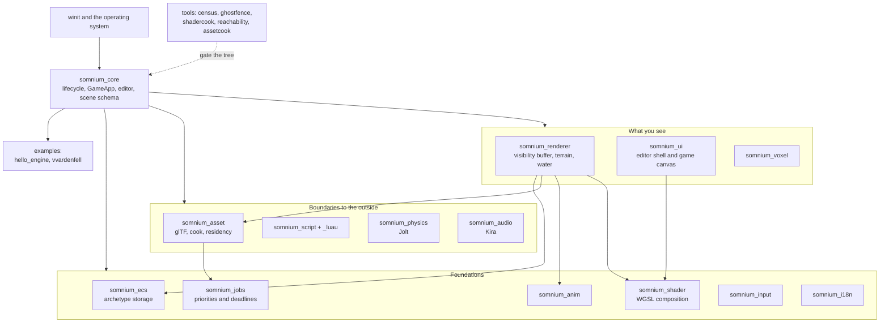
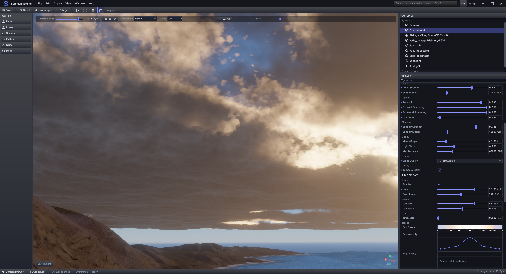
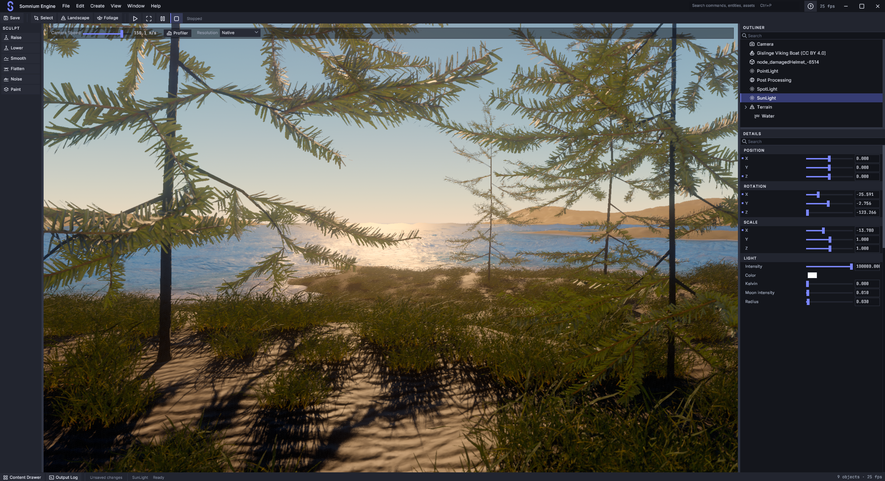
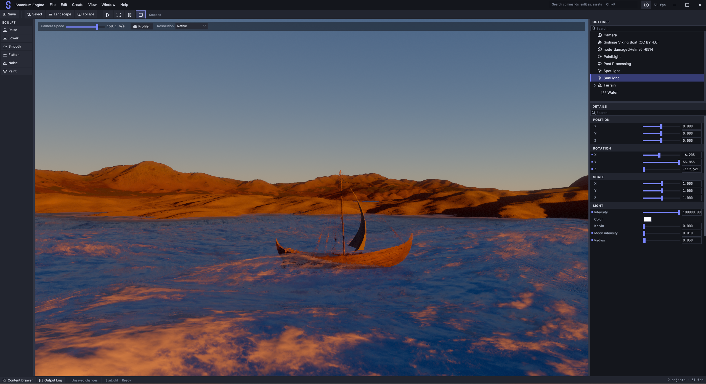
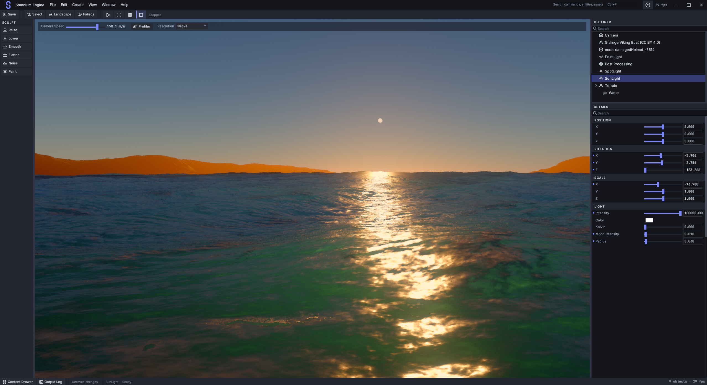
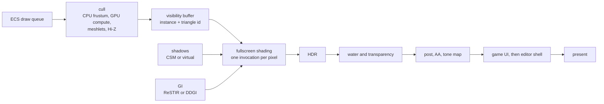

<p align="center">
  <picture>
    <source media="(prefers-color-scheme: dark)"
            srcset="crates/somnium_ui/assets/brand/somnium-lockup-horizontal.svg">
    <source media="(prefers-color-scheme: light)"
            srcset="crates/somnium_ui/assets/brand/somnium-lockup-horizontal-light.svg">
    
  </picture>
</p>

<p align="center">
  <em>A precise instrument for constructing impossible worlds.</em>
</p>

---

A from-scratch 3D game engine written in Rust and built directly on `wgpu`.
Somnium implements its renderer, editor, runtime UI, asset pipeline, and game
framework as one native workspace. Production engines are studied for
architecture and comparison; Somnium's implementation is its own.

### [`context.md`](context.md) is the map

One living document, kept current, describing the engine as it is rather than as
it was planned. Read it before the source.

| | |
|---|---|
| [Core ideas](context.md#core-ideas-illustrated) | How the renderer works, in five diagrams |
| [Frame cost](context.md#where-the-frame-actually-goes) | Where the milliseconds go, measured |
| [Why things are this way](context.md#why-things-are-the-way-they-are) | The decisions, and what they cost to learn |
| [Phase ledger](context.md#phase-ledger) | Shipped, open, deferred, refused |

The engine is organized around three deliberate commitments:

| Commitment | Why it matters |
|---|---|
| **Visibility-buffer rendering** | Geometry writes compact instance and triangle identity. A later fullscreen pass reconstructs and shades each visible surface. |
| **Archetype ECS** | Entities sharing a component signature occupy dense columns, keeping common queries contiguous. |
| **Native wgpu UI** | Editor and game UI use the same retained widget and paint system, with Nocturne Atelier tokens, bundled type, and one icon family. |

> **Status:** actively developed, single-author hobby/research project. Expect
> rough edges and churn.
>
> **Current phase:** [MORROWIND](dev%20records/phase_MORROWIND.md) (NetImmerse),
> covering runtime UI, animation, asset cooking, world partition, input, audio,
> localisation, and remaining rendering gaps. Seven of its nine tracks contain
> shipped work; the phase is not complete.
>
> **Architecture reference:** [`context.md`](context.md) — living, continuously
> updated, and the file to read before the source.

## What is in here

Sixteen engine crates, two example games, and the tools that keep the
documentation honest. `somnium_core` is deliberately the widest: it coordinates
subsystems without absorbing their internals.



## Screenshots







Every capture in this repository comes from a running build.
`SOMNIUM_CAPTURE_UI_PNG` reads back the swapchain after the UI pass. More
captures live in [`media/`](media/).

## How this project works

Somnium is developed in codenamed phases. Each phase has a plan, a record of
what shipped, and evidence proportionate to its claims.

### Measurements

`.somtime` files record mean, standard deviation, minimum, maximum, and sample
count for GPU and CPU zones after a fixed warm-up at a pinned camera. Frame
changes use matched before and after runs. A delta inside the noise band is
reported as noise.

This has changed decisions. DOOM's tile-specialisation path and aerial terrain
split measured slower and stayed off. PORTAL-0 reverted a WGSL optimization
after repeated runs showed a regression.

### Generated checks

`tools/census/generate.py` derives structural counts from the current tree.
`tools/ghostfence/run.py` checks census freshness, the frozen toolchain, shader
variant budget, job-system ownership, duplicate singleton systems, golden
images, and workspace tests. A row that cannot run reports `SKIP` with a reason.

### Negative results

Rejected and inconclusive work stays in the record. A phase document separates
what was planned, what shipped, what was deferred, and what evidence refused.

## Phase history

Roughly chronological. Detailed records live in [`dev records/`](dev%20records/).

| Phase | Codename | What it built | Status |
|---|---|---|---|
| 1–15 | — | Lifecycle, ECS, visibility buffer, shadows, PBR, clustered lights, glTF, voxels, heightmap terrain, GPU-driven rendering | In tree |
| 16 | — | **Scripting** — Luau via `mlua`, sandboxed, with a deferred command boundary and measured budgets | Complete |
| IV | — | Great Lakes landscape and finite water; three-cascade FFT ocean | Complete |
| XV | — | 32-layer terrain material, splat/biome authoring, BC7 packs | XV-A–J complete |
| VV | Halcyon | Ray-traced water reflections and refraction | VV-A–H + VV+1 |
| CR | Crysis | CPU/GPU frustum culling | In engine |
| DF | Daggerfall | Terrain material clipmaps (macro + detail stacks) | In engine |
| 26 / 26-Zeta | Metaphor / Nocturne Atelier | Editor information architecture, then its token and paint layer | In tree |
| 27 | Hades | Editor paint layer, motion, elevation | 27-A–G |
| DOOM | id Tech | **The clock** — GPU/CPU profiler, `.somtime`, pixel census, dynamic resolution | A, B, C, E, F |
| CONTROL | Northlight | **Editor reach** — property seam, asset database, drag-and-drop, viewport control, preferences, scene lifecycle, curves, time of day, clouds, weather, decals | **A–O complete** |
| MORROWIND | NetImmerse | The engine's non-renderer half — see below | **In progress** |
| PORTAL-0 | Source | Performance audit and engineering health | **Complete** |
| TSUSHIMA | Ghost of Tsushima | **Terrain photorealism** — long-range sun shadow, baked sky visibility, sky-lit aerial perspective, a relief normal that survives distance, the BRDF's energy terms, splat boundaries the brush cannot paint, macro colour variance, parallax on cliffs, a 25-entry foliage palette, and four kinds of water | **A–J in tree**, H's contrast-with-distance open |

### Phase MORROWIND, by track

| Track | Codename | Shipped | Open |
|---|---|---|---|
| 0 | BALMORA | Census, **job system** (priorities, deadlines, cancellation), **shader system** (`//!include` composition, variant cache, hot reload), wgpu 30 | — |
| 1 | VIVEC | **Runtime UI framework** — canvases, anchors, paths and gradients, directional navigation, rich text and IME, motion/springs, accessibility tree (AccessKit) | Text shaping (`cosmic-text`, decided, behind a flag) |
| 2 | CONSTRUCTION SET | **Node graph editor** (material + animation catalogues), **timeline** with embedded curve editor | Docking, virtualisation, play-in-editor, GUI layout editor |
| 3 | HLAALU | — | Prefabs, splines, rule-driven scattering |
| 4 | SILT STRIDER | **Deterministic asset cook** with content-hashed incremental cache, **budgeted residency** + hot reload, **world partition** with cell-owned entity streaming, **HLOD/impostors** and a floating origin | — |
| 5 | DWEMER | **Skeletal animation** — GPU skinning into the shared geometry pool, clips, blend trees, state machines, sync tracks | Root motion, IK, compression |
| 6 | SIXTH HOUSE | — | Navmesh, behaviour trees |
| 7 | RED MOUNTAIN | **Virtual shadow maps**, **portable DDGI** (SDF-traced, no ray query), **virtual texturing** for terrain, **OIT + SMAA** | GPU particles |
| 8 | ALMSIVI | **Input actions** (control paths, processors, rebinding), **audio** (buses, attenuation, occlusion, Doppler), **localisation** (CLDR plurals, fallback chains) | Save games, video, the playable slice |

### Planned phases

| Phase | Purpose | State |
|---|---|---|
| PORTAL | Rebase and close engineering-health work not covered by PORTAL-0 | Plan only |
| KENSHI | Measure combined load and publish engine limits before optimizing | Plan only |
| STALKER | Build the player, packaging, mods, product UI, living-world systems, and release proof | Plan only |

See [`context.md`](context.md) for prerequisites, open work, and the distinction
between current capability and planned design.

## How a frame becomes a pixel

Geometry is rasterized once into identity, not colour. One fullscreen pass then
shades each visible pixel exactly once, which is why the shading cost tracks the
framebuffer rather than the scene.



Measured on the default Coastal view at 1920x1032, the shading pass reports
exactly 1,981,440 fragment invocations for 1,981,440 pixels. No overdraw, by
construction. Where the rest of the frame goes is in
[context.md](context.md#where-the-frame-actually-goes).

## Highlights

**Rendering**
- Visibility-buffer pipeline with programmable vertex pulling and bindless resources (single global bind group)
- GPU-driven rendering: `multi_draw_indirect`, compute frustum culling, meshlet clusters, Hi-Z two-phase occlusion culling
- Physically based shading (Cook-Torrance GGX) with an alternative cel-shading mode, plus **multiple-scattering energy compensation** on both the direct lobe and the IBL, **Hammon's rough diffuse**, **micro-shadowing**, and geometric **specular antialiasing** with a roughness-scaled bound on every lobe
- **Shadows** — cascaded shadow maps with PCSS and contact shadows, plus **sparse virtual shadow maps** (clipmap page table, persistent physical atlas, per-page raster). Cascades stop at 100 m, so terrain also carries a baked heightfield **horizon map** that shadows it at any distance, cross-faded in where the last cascade fades out
- **Global illumination** — ReSTIR DI/GI on wgpu acceleration structures, with a **portable DDGI tier** (SDF-traced 4×4×4 volume, budgeted temporal SH updates) for hardware without ray query
- **Atmosphere and sky** — Hillaire scattering LUTs driving both sky and IBL, analytic NOAA sun position, a five-track day cycle, and volumetric clouds (Perlin–Worley, quarter-res adaptive march, cloud shadows folded into one `shadow_factor` every surface reads)
- **Weather** — coverage → precipitation → wetness on Lagarde's two time constants, porosity as a material channel, rain ripples on water
- HDR pipeline: `Rgba16Float`, AgX/ACES tone mapping, GTAO, bloom, DoF, motion blur, deferred decals
- **Anti-aliasing as one authored choice** — Off / FXAA / SMAA 1x / SMAA T2x / TAA / FSR 3, plus SMAA quality presets. (It was three independent booleans until MORROWIND-AC, where the default configuration was measured to run *no* AA pass while showing a checked box.)
- **Order-independent transparency** — weighted-blended, authored per scene, with the sorted path retained
- Water: three-cascade 1024² inverse-FFT ocean spectrum with Jacobian whitecaps, temporal foam, Beer's-law transport, a shoreline SDF and a depth-faded shore. Reflections blend screen-space tracing, half-res hardware ray tracing, and the environment cube
- **Terrain** — 32-layer material with strongest-four blending, triplanar cliffs, hex tiling and parallax occlusion; nested material **clipmaps**; **virtual texturing** streaming BC7 source pages into a fixed 64 MiB atlas
- **Terrain lighting** — three heightfield bakes: horizon angles in eight azimuths for long-range sun shadow, cosine-weighted **sky visibility** with a bent direction so valleys are darker than the ridges above them, and a mip-chained **relief normal** that carries its own discarded variance into roughness

**World & content**
- glTF 2.0 loading (meshes, PBR materials, textures, skins), importable at runtime
- **Deterministic asset cook** — versioned, integrity-checked payloads with a SHA-256 recipe key; changing a texture recooks its material's reverse closure while unrelated meshes stay cached
- **Residency** — typed placeholders returned immediately, resolver I/O through the job system, per-frame upload budget, deterministic LRU, atomic publish
- **World partition** — double-precision cell hashing, camera/player/volume want-state, transactional unload that persists real ECS components through the schema serializer
- **Voxel world** — 32³ padded chunks, `block_mesh` face culling, 3 LOD levels, sparse edit overlay
- **Heightmap terrain** — chunked CDLOD-style LOD with crack-free stitching, real-time sculpting and texture painting
- **Foliage painting** — brush over terrain with density, size and single-instance placement. A 25-entry CC0 palette; entries that require a terrain layer underneath them say so in the log when they refuse, and the requirement is a brush setting rather than a fixed property of the entry

**Scripting & simulation**
- **Luau** (`mlua`, interpreter only) — sandboxed, with a deferred command buffer as the only route into the world, generated type declarations, and acceptance budgets asserted as tests
- **Animation** — skeletons, four-weight skinning, clips, `Blend1D`/`Blend2D`, masked layers, typed parameters and triggers, sync tracks, state machines with a bounded pose cache
- **Jobs** — declared priorities and deadlines, cancellation, a budgeted main-thread completion drain, and profiler telemetry. A job whose deadline passed while queued is dropped rather than run
- Jolt physics integration; Kira audio with buses, attenuation curves, cones, occlusion and Doppler
- CPU particle system with GPU billboard instancing

**Editor**
- **Schema-generated Details** — all **267** editable fields across **25** registered component schemas are generated from the schema, with scoped undo, drag coalescing, multi-select intersection and mixed-value rows. The hand-wiring census is **0 identifiers**: there is no hand-written inspector left, and a generated table proves it rather than a claim
- **One command registry** — 52+ commands generate the menus, Create surfaces, toolbar, tooltips, shortcuts, palette and F1 index
- **Node graph editor** and **timeline**, both archetype-driven and feature-neutral, with material and animation catalogues as the first consumers
- Curve and gradient editing as reflected *values* (`FieldType::Curve`), so a curve gets its Details row, undo and round-trip for free
- Scene lifecycle: format-routed load, retained unknown components and fields (no silent data loss), header thumbnails, autosave and crash recovery, clickable undo history
- Preferences with a `default → project.toml → editor.toml → SOMNIUM_*` order. All **115** `SOMNIUM_*` variables have a declared, checked route — schema field, setting, command or a stated harness reason — and **0** are unexplained, enforced by `tools/reachability/`
- Transform gizmos, light gizmos, selection outline, infinite grid, camera bookmarks, statistics overlay, output log with severity chips and jump-to-source
- Accessibility: roles, names, values, focus announcements, reduced motion, high contrast reusing the theme's certified contrast pairs

**Editor design system — Nocturne Atelier**
- **Correct colour pipeline.** Authored sRGB decodes to linear exactly once before the sRGB swapchain, straight alpha through the widget API. `#1C1E26` reaches the framebuffer as `#1C1E26`
- **Layered tokens** — palette → semantic roles → component recipes → interaction state, so a widget asks for `style::button(state)` rather than picking a grey
- **Typography with actual hierarchy** — Inter Regular/Medium/SemiBold and JetBrains Mono Regular/Medium behind named roles; numeric fields use the mono face so a scrub cannot shift a row
- **One icon family** — 67 Tabler outline icons plus 16 original Somnium glyphs on the same 24×24 / 2 px grid, rasterized from SVG by `resvg`
- The full contract is [`dev records/phase_26_Zeta.md`](dev%20records/phase_26_Zeta.md)

## Building

Requires:
- **Rust 1.88** (edition 2024; pinned in `rust-toolchain.toml` and gated by GHOSTFENCE)
- A **C++ toolchain** — MSVC Build Tools on Windows, clang/gcc elsewhere. Both
  the Jolt physics bridge and Luau are built from source

```sh
cargo build --workspace
cargo run -p hello_engine        # runnable editor demo
```

Running the gates:

```sh
cargo test --workspace -j 1      # -j 1 avoids transient LNK1104 on Windows
python tools/ghostfence/run.py   # every gate; --fast skips the test row
python tools/census/generate.py  # regenerate the engine census
```

A timing run, which is how any frame-time claim is made:

```sh
SOMNIUM_TIME=after.somtime SOMNIUM_TIME_VIEW=coastal-ground \
SOMNIUM_MAXIMIZE=1 SOMNIUM_TIME_QUIT=1 \
cargo run --release -p hello_engine
```

### Editor controls (demo)

- **Right mouse + WASD/QE** — fly camera (Shift = faster); **RMB + scroll** adjusts speed
- **T / R / S** — translate / rotate / scale gizmo · **Ctrl+Z/Y** — undo/redo
- **L** — light gizmos · **F1** — in-editor Help (`docs/editor/`) · **Esc** — close the top overlay
- **Ctrl+Space** — Content Drawer · **Ctrl+P** — command palette
- **Play / Pause / Stop** — simulation transport
- **F6** — terrain edit mode; then `1`–`6` pick Raise / Lower / Smooth / Flatten / Noise / Paint
- **F9 / F10** — A/B the GPU-driven indirect path and GPU frustum culling
- **File > Import Model…** — import any glTF/GLB
- **Create menu** — primitives, lights, particle emitters, terrain, or a runtime UI Canvas root
- **Tab / Shift+Tab** — move between shell regions; **Window menu** — switch workspace
- Click the indigo dot in a Details row's gutter to revert that property in one undo step

## Repository layout

```
crates/
  somnium_core/         App lifecycle, events, editor logic, scene schema, scripting host
  somnium_ecs/          Archetype ECS + reflection (no external deps)
  somnium_renderer/     wgpu backend, visibility buffer, render passes, terrain, water
  somnium_shader/       WGSL module registry, //!include composition, variant cache
  somnium_jobs/         Priorities, deadlines, cancellation, budgeted drain (no deps)
  somnium_anim/         Skeletons, clips, blend graphs, state machines
  somnium_asset/        Vertex type, glTF loader, deterministic cook, residency
  somnium_script/       Language-neutral scripting seam (command buffer, budgets)
  somnium_script_luau/  Luau backend via mlua
  somnium_input/        Action maps, control paths, processors, rebinding
  somnium_i18n/         CLDR plural/gender rules, fallback chains, key extraction
  somnium_audio/        Kira wrapper — buses, attenuation, occlusion, Doppler
  somnium_physics/      Jolt high-level wrapper
  somnium_physics_sys/  Raw Jolt FFI (compiles Jolt C++ at build time)
  somnium_ui/           Native wgpu widget tree, editor shell, graph, timeline, theme
  somnium_voxel/        Voxel world (chunks, meshing, async streaming)
examples/
  hello_engine/         Runnable editor demo
  vvardenfell/          Public-API-only sample — exercises the engine boundary
tools/
  census/               Generates the engine census (GHOSTFENCE row)
  ghostfence/           The gate: seven rows, and a standard-library PNG codec
  shadercook/           Shader variant budget report
  reachability/         Environment/component/hand-wiring reachability tables
  assetcook/            Standalone deterministic cook CLI
context.md              Living architecture document (phase history, GPU layouts)
dev records/            Phase plans, sub-phase records, and committed evidence
ATTRIBUTION.md          Provenance: which reference patterns informed which files
THIRD_PARTY_NOTICES.md  Bundled fonts and icons, their licences and modifications
example_repo/           Local reference codebases — NOT committed (see below)
```

## Development with AI assistance

Somnium is built with substantial **AI pair-programming assistance (Anthropic's
Claude, via Claude Code)**. The AI is used as an implementation and research
partner — reading reference engines, drafting subsystems, running the
measurement harnesses, and maintaining the architecture docs — while design
direction, review, and verification are human-driven. This is noted for
transparency; it has no bearing on how the code is licensed or how you may use
it.

The assistant's own working files (session memory, planning notes, local
configuration) live alongside the source during development but are intentionally
kept out of version control — see the AI-assisted section of
[`.gitignore`](.gitignore).

## A note on `example_repo/` and ATTRIBUTION.md

[`ATTRIBUTION.md`](ATTRIBUTION.md) and many source-file comments cite paths
inside an `example_repo/` directory (Unreal Engine, The Forge, Fyrox, Bevy
plugins, Jolt, O3DE, Godot, Stride, Wicked, and others). That directory is a
local, multi-gigabyte collection of third-party reference repositories studied
**for architectural patterns only — no source is copied**. It is intentionally
excluded from version control for two reasons:

1. **Size** — several gigabytes, far beyond GitHub's limits.
2. **Licensing** — some references (notably Unreal Engine and Flax) are under
   licenses that forbid redistribution. Where a reference is proprietary or
   copyleft, `ATTRIBUTION.md` records that it informed *architecture only* and
   supplied no code, identifiers, constants, layouts or comments.

After cloning, those cited paths will not be present. The citations remain
meaningful as *provenance*, and the engine does **not** depend on the reference
code: `example_repo/` is excluded from the Cargo workspace and nothing is
`include!`d from it.

**One exception:** `somnium_physics_sys/build.rs` compiles
[Jolt Physics](https://github.com/jrouwe/JoltPhysics) (MIT-licensed) directly
from `example_repo/JoltPhysics-master/`, so that single subtree **is** kept under
version control — without it a fresh clone cannot build the physics crate.

## License

Licensed under either of, at your option:

- **MIT License** ([LICENSE-MIT](LICENSE-MIT))
- **Apache License, Version 2.0** ([LICENSE-APACHE](LICENSE-APACHE))

This is the conventional Rust-ecosystem dual license. Unless you explicitly state
otherwise, any contribution you intentionally submit for inclusion in the work,
as defined in the Apache-2.0 license, shall be dual-licensed as above, without
any additional terms or conditions.

Bundled third-party code and assets retain their own licenses:

- **Jolt Physics** (in `example_repo/JoltPhysics-master/`) — MIT; see its `LICENSE`
- **Luau** (built from source by `mlua-sys`) — MIT
- **Inter** and **JetBrains Mono** — SIL Open Font License 1.1
- **Tabler Icons** — MIT
- **Great Lakes height map** (Motion Forge Pictures) — CC0 1.0; provenance and
  audited source hashes in `assets/terrain/great_lakes/README.md`

Every bundled asset, its upstream, its version and any modification is recorded
in [`THIRD_PARTY_NOTICES.md`](THIRD_PARTY_NOTICES.md). The Somnium name, the
Eclipse `S` monogram and the engine-specific icons are original project assets and
are **not** covered by the dual license above; they are excluded from the
trademark-style grant the way project branding usually is, and have not been
through trademark clearance.
