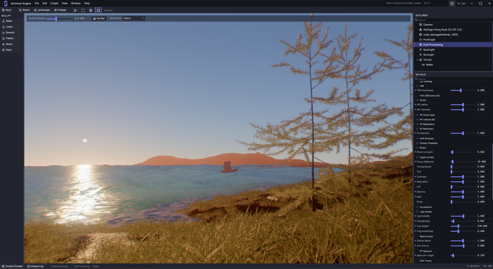

# Somnium Engine

A from-scratch 3D game engine written in Rust, built directly on `wgpu`. Somnium
is a learning-driven, ground-up engine: rather than wrapping an existing engine,
it reimplements the core systems of a modern renderer and editor from first
principles, studying production engines for *architecture* while writing all of
its own code.

The engine is organized around three deliberate commitments:

| Commitment | Why it matters |
|---|---|
| **Visibility Buffer rendering** | Geometry is rasterized once into a compact `(instance, triangle)` ID buffer; a single fullscreen pass then shades each visible pixel exactly once. No overdraw, bandwidth scales with the framebuffer rather than scene complexity. |
| **Archetype ECS** | Entities are grouped by component signature and stored as struct-of-arrays, so iterating a query walks contiguous memory — cache-coherent, no per-component hash lookups. |
| **Native wgpu UI** | The editor (outliner, inspector, gizmos, log) is a native widget tree drawn by the engine's own GPU pass. No browser, WebView, or external UI toolkit. |

> **Status:** actively developed, single-author hobby/research project. Expect
> rough edges and churn — see [`context.md`](context.md) for the current phase
> and the full phase history.

## Screenshots

> 📸 _Screenshots coming soon._ Captures live in [`media/`](media/) — see that
> folder's README for the suggested shots. Once images are added, uncomment the
> block below (or drop files matching these names and they'll appear).

<!--
| Editor | Heightmap terrain |
|---|---|
|  |  |

| Voxel world | Shadows & PBR |
|---|---|
|  |  |


-->

## Highlights

**Rendering**
- Visibility-buffer pipeline with programmable vertex pulling and bindless resources (single global bind group)
- Cascaded Shadow Maps (4 cascades, PSS splits, PCF filtering)
- Physically based shading (Cook-Torrance GGX) with an alternative cel-shading mode
- **Image-based lighting** — the procedural sky is captured to a prefiltered environment cubemap, so metals reflect their surroundings (Karis split-sum)
- Clustered forward lighting for point/spot lights (froxel binning)
- HDR pipeline: `Rgba16Float` target, ACES filmic tone mapping, FXAA, and a scene Post Processing volume (vignette, chromatic aberration)
- Water: three-cascade 1024² inverse-FFT ocean spectrum with Jacobian whitecaps,
  temporal foam, Beer's-law transport, and a shoreline SDF
- GPU-driven rendering: `multi_draw_indirect`, compute frustum culling, meshlet clusters,
  and a Hi-Z depth pyramid driving two-phase occlusion culling
- Cutout foliage support: sidecar alpha masks, alpha-weighted mip generation, and
  coverage-preserving alpha so vegetation neither darkens nor erodes with distance

**World & content**
- glTF 2.0 asset loading (meshes, PBR materials, textures), importable at runtime from **File > Import Model**
- **Voxel world** — 32³ padded chunks, `block_mesh` face culling, async generation
  (rayon + mpsc), 3 LOD levels, sparse edit overlay ([`context.md` §19](context.md))
- **Heightmap terrain** — chunked CDLOD-style LOD with crack-free stitching,
  splatmap PBR with triplanar cliffs, real-time sculpting + texture painting,
  editor terrain mode ([`context.md` §20](context.md))
- **Foliage painting** — UE5-style brush over terrain with density, size and
  single-instance placement, plus a CC0 high-poly grass/tree palette

**Editor & runtime**
- Archetype ECS with parent/child hierarchy and world-transform propagation
- Transform gizmos, light gizmos (range/cone visualization), selection outline, infinite editor grid
- Undo/redo (command stack), scene save/load (`.somnium` JSON)
- Native UI widget library (Grid, StackPanel, ScrollViewer, WrapPanel, TextBox, NumericField, …)
- Custom title bar (undecorated window), docked Content Drawer, F1 Help
- Jolt physics integration; Kira audio scaffolding
- CPU particle system with GPU billboard instancing

### In progress — Phase 24: Advanced Lighting

The materials are physically based; the *lighting* is not yet. The sun is an arbitrary
multiplier, the sky is a hardcoded gradient that does not respond to it (so turning the
sun down cannot produce night), and indirect light is a constant ambient term. Phase 24
addresses that end to end across 22 sub-phases: photometric light units and
auto-exposure, AgX tonemapping, a Hillaire atmosphere driving both sky and IBL, TAA plus
specular anti-aliasing, PCSS and contact shadows, GTAO, then ray-traced direct and
indirect lighting (ReSTIR DI/GI with a world radiance cache) on wgpu's acceleration
structures — with a reference path tracer to check the real-time result against, mesh
distance fields and baked probes as fallback tiers for hardware without ray query, and
area lights, transmission/SSS and volumetric fog to finish.

Full plan and ordering: [`context.md` §22](context.md).

For the complete, continuously updated architecture reference, read
[`context.md`](context.md).

## Building

Requires:
- **Rust 1.88+** (edition 2024; the dependency tree sets the effective minimum)
- A **C++ toolchain** for the Jolt physics bridge — MSVC Build Tools on Windows,
  clang/gcc elsewhere

```sh
cargo build --workspace
cargo run -p hello_engine        # runnable editor demo
```

Optional environment flag:

```sh
SOMNIUM_TERRAIN=1 cargo run -p hello_engine   # spawn a pre-sculpted heightmap terrain
```

### Editor controls (demo)

- **Right mouse + WASD/QE** — fly camera (Shift = faster)
- **RMB + scroll wheel** — adjust fly speed (0.5–500 m/s), or drag the **Camera Speed** slider above the viewport
- **T / R / S** — translate / rotate / scale gizmo · **Ctrl+Z/Y** — undo/redo
- **L** — toggle light gizmos (point range spheres, spot cones, sun direction)
- **F1** — in-editor Help (`docs/editor/`) · **Esc** — close the top overlay
- **Ctrl+Space** — show or hide the docked Content Drawer · **Ctrl+P** — command palette
- **F9** — A/B the GPU-driven indirect draw path against the CPU path
- **F10** — A/B GPU frustum culling (a correct cull is invisible)
- **File > Import Model…** — import any glTF/GLB into the scene at the origin
- **Create menu** — spawn primitives, lights, particle emitter, heightmap terrain, or voxel terrain
- Select a light to edit its intensity / range / cone angles / colour in the inspector
  (Iris swatches shipped as Metaphor 26-F; see `dev records/phase_26.md`)
- **F6** — toggle terrain edit mode (with a terrain selected); then `1`–`6`
  pick Raise / Lower / Smooth / Flatten / Noise / Paint, `[` / `]` size, `-` / `=` strength

Metaphor editor chrome (26-A–I) is in the tree, but **the UI phase is not
over**. Later engine features will keep needing new inspector fields, panels,
and Help pages.

## Repository layout

```
crates/
  somnium_core/         App lifecycle, events, ECS re-exports, editor logic
  somnium_ecs/          Archetype ECS (no external deps)
  somnium_renderer/     wgpu backend, visibility buffer, render passes, terrain
  somnium_physics/      Jolt high-level wrapper
  somnium_physics_sys/  Raw Jolt FFI (compiles Jolt C++ at build time)
  somnium_audio/        Kira audio wrapper
  somnium_ui/           Native wgpu widget tree + UiPass
  somnium_asset/        Vertex type, glTF loader
  somnium_voxel/        Voxel world (chunks, meshing, async streaming)
examples/
  hello_engine/         Runnable editor demo
context.md              Living architecture document (phase history, GPU layouts)
ATTRIBUTION.md          Provenance: which reference patterns informed which files
example_repo/           Local reference codebases — NOT committed (see below)
```

## Development with AI assistance

Somnium is built with substantial **AI pair-programming assistance (Anthropic's
Claude, via Claude Code)**. The AI is used as an implementation and research
partner — reading reference engines, drafting subsystems, and maintaining the
architecture docs — while design direction, review, and verification are
human-driven. This is noted for transparency; it has no bearing on how the code
is licensed or how you may use it.

The assistant's own working files (session memory, planning notes, local
configuration) live alongside the source during development but are intentionally
kept out of version control — see the AI-assisted section of
[`.gitignore`](.gitignore).

## A note on `example_repo/` and ATTRIBUTION.md

[`ATTRIBUTION.md`](ATTRIBUTION.md) and many source-file comments cite paths
inside an `example_repo/` directory (Unreal Engine, The Forge, Fyrox, Bevy
plugins, Jolt, and others). That directory is a local, multi-gigabyte collection
of third-party reference repositories studied **for architectural patterns only —
no source is copied**. It is intentionally excluded from version control for two
reasons:

1. **Size** — several gigabytes, far beyond GitHub's limits.
2. **Licensing** — some references (notably Unreal Engine) are under licenses
   that forbid redistribution.

After cloning, those cited paths will not be present. The citations remain
meaningful as *provenance* — they record where each pattern was studied — and the
engine does **not** depend on the reference code: `example_repo/` is excluded
from the Cargo workspace and nothing is `include!`d from it.

**One exception:** `somnium_physics_sys/build.rs` compiles
[Jolt Physics](https://github.com/jrouwe/JoltPhysics) (MIT-licensed) directly
from `example_repo/JoltPhysics-master/`, so that single subtree **is** kept under
version control — without it a fresh clone cannot build the physics crate. If you
relocate or remove it, update the include paths in that build script.

## License

Licensed under either of, at your option:

- **MIT License** ([LICENSE-MIT](LICENSE-MIT))
- **Apache License, Version 2.0** ([LICENSE-APACHE](LICENSE-APACHE))

This is the conventional Rust-ecosystem dual license. Unless you explicitly state
otherwise, any contribution you intentionally submit for inclusion in the work,
as defined in the Apache-2.0 license, shall be dual-licensed as above, without
any additional terms or conditions.

Bundled third-party code retains its own license: **Jolt Physics** (in
`example_repo/JoltPhysics-master/`) is MIT-licensed; see its `LICENSE` file.
