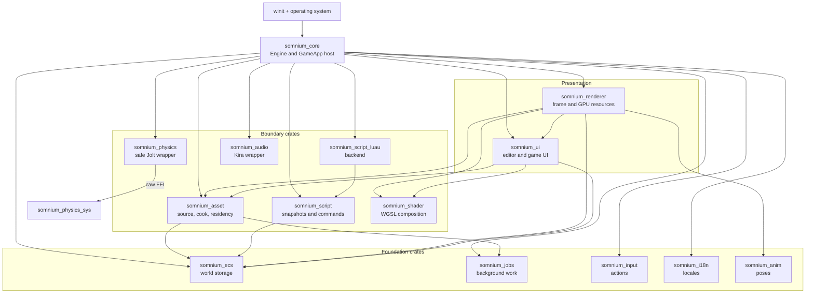
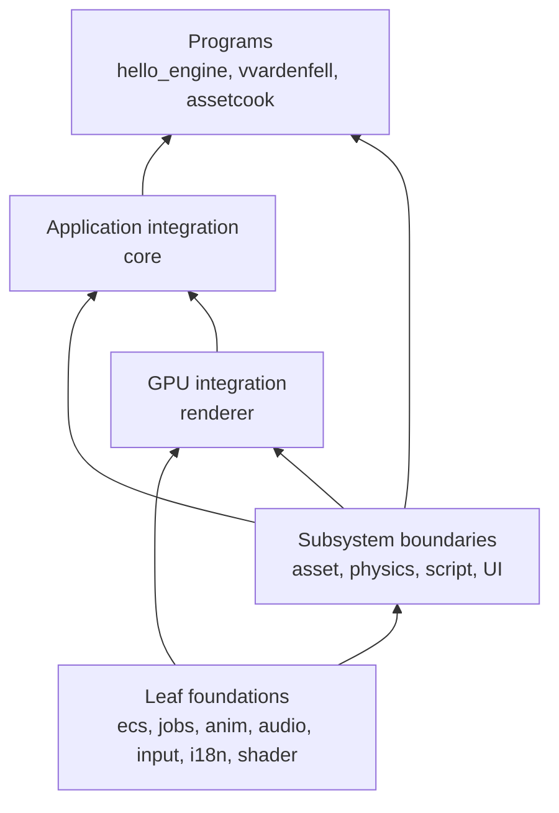
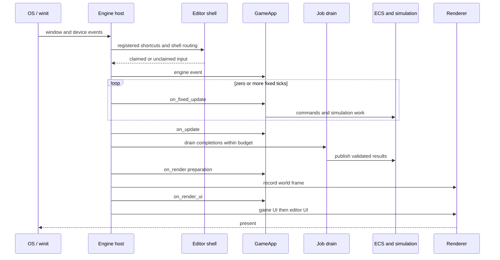
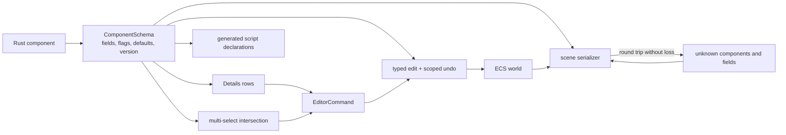
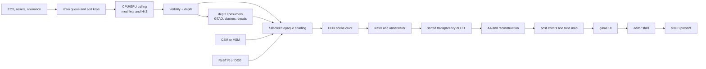
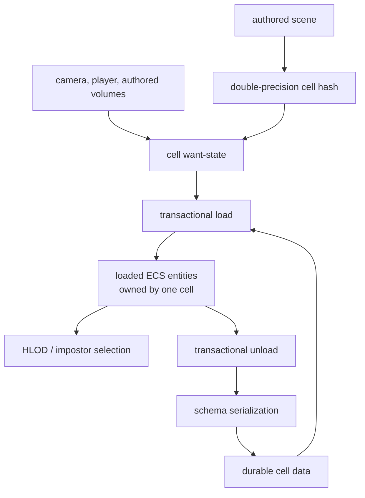
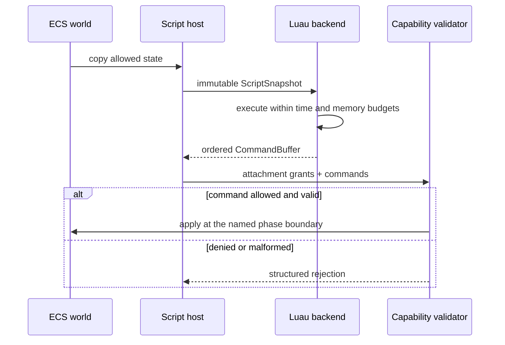
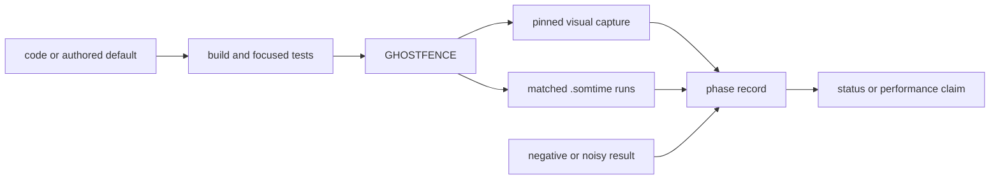

# Somnium Engine context

Last verified: 2026-08-29 at `d9d0009`.

Somnium is a from-scratch Rust game engine with a native editor. Its renderer
uses `wgpu` and a visibility buffer. The engine also owns its ECS, UI, asset
pipeline, scripting boundary, world streaming, animation, input, audio, and
localisation.

This file describes the engine as it exists now. It is not a changelog, phase
handoff, implementation diary, or list of every experiment. Detailed history
belongs in [`dev records/`](<dev records/>). Provenance belongs in
[`ATTRIBUTION.md`](ATTRIBUTION.md).

## Start here

| Item | Current state |
|---|---|
| Active phase | MORROWIND, partially complete |
| Latest completed phase | PORTAL-0, a focused measurement and cleanup pass |
| Latest MORROWIND work | AC: weighted OIT, one anti-aliasing setting, and SMAA |
| Next planned phases | PORTAL, KENSHI, then STALKER; none has started |
| Toolchain | Rust 1.88, edition 2024, wgpu 30, winit 0.30 |
| Workspace | 16 engine crates, 2 examples, 1 workspace tool |
| Generated census | 188,732 Rust/WGSL lines and 1,864 discovered tests |
| Fast gate, 2026-08-29 | 5 passed, 1 failed, tests skipped |
| Current gate failure | `sculpt-panel` golden image: 5.3333% changed, budget 0.2% |

The top-level phase status is:

| Phase | Status | Read next |
|---|---|---|
| CONTROL | Complete, A through O | [`phase_CONTROL.md`](<dev records/phase_CONTROL.md>) |
| MORROWIND | In progress | [`phase_MORROWIND.md`](<dev records/phase_MORROWIND.md>) and the ledger below |
| PORTAL-0 | Complete, A through G | [`phase_PORTAL-0.md`](<dev records/phase_PORTAL-0.md>) |
| PORTAL | Plan only, not started | [`phase_PORTAL.md`](<dev records/phase_PORTAL.md>) |
| KENSHI | Plan only, not started | [`phase_KENSHI.md`](<dev records/phase_KENSHI.md>) |
| STALKER | Plan only, not started | [`phase_STALKER.md`](<dev records/phase_STALKER.md>) |

Dated phase audits still describe systems that were absent when their plans
were written. Those statements are historical. The table above, current
source, generated evidence, and completed sub-phase records take precedence.

## How to use this file

Read in this order:

1. Start here and the language section.
2. Read the architectural rules before changing a subsystem boundary.
3. Read the relevant subsystem summary.
4. Read the phase ledger to learn whether work is shipped, open, deferred, or
   untouched.
5. Open the specific phase record only when implementation detail or evidence
   is needed.

Source of truth, from strongest to weakest:

1. Current code, tests, generated reports, and captured evidence.
2. The shipped ledger in this file and the current README.
3. Completed sub-phase records.
4. Phase plans. Plans describe intent and may contain stale audits.
5. Old handoffs and narrative status blocks.

## Language

Use these terms consistently.

### Product and runtime

**Engine**:
The `Engine<G>` host that owns the platform loop and runs a `GameApp`.
_Avoid_: runtime manager, main system

**GameApp**:
The public game-facing lifecycle interface. Both examples consume it without
owning editor internals.
_Avoid_: game manager, app singleton

**EngineContext**:
The borrowed per-callback view of engine services and state. It is not durable
storage.
_Avoid_: global context, service locator

**Editor shell**:
The native Somnium UI that surrounds the scene view. It owns menus, panels,
selection tools, and authoring workflows.
_Avoid_: game UI, debug overlay

**Game UI**:
A game-owned `UiCanvas` rendered through the same UI renderer after game logic
has prepared the frame.
_Avoid_: editor UI, HUD manager

**Scene**:
Authored entities and component data stored through the versioned scene schema.
Unknown components and fields must survive a load and save cycle.
_Avoid_: level when referring to the file format

### Editing

**Schema**:
The registered description of editable component fields, types, versions, and
flags. It drives Details, serialization, and compatibility checks.
_Avoid_: inspector metadata, ad hoc reflection

**Command**:
A registered editor or game action with stable identity and one dispatch path.
Menus, shortcuts, the palette, tooltips, and help index project the same editor
command registry.
_Avoid_: menu callback, shortcut action list

**Gesture**:
A cancellable sequence of pointer or keyboard input that becomes one undo step.
_Avoid_: repeated edit events

**Selection**:
An ordered entity set with one primary entity. Details edits the schema
intersection and represents differing values as mixed.
_Avoid_: selected entity list with no primary

### Assets and worlds

**AssetId**:
Stable identity derived from a normalized source path. It is independent of a
renderer slot, package offset, or current residency state.
_Avoid_: texture index, material slot, file handle

**CookedAsset**:
A versioned and integrity-checked runtime artifact with content and dependency
hashes.
_Avoid_: cached source file, release package

**Residency**:
The state machine that resolves, loads, uploads, publishes, evicts, and reloads
cooked assets within budgets.
_Avoid_: asset cache when the state machine matters

**Cell**:
The ownership unit for world partition. An unloaded cell serializes its owned
entities; it does not leave a second live copy in the ECS.
_Avoid_: chunk when discussing world ownership

**Content layer**:
A planned STALKER concept for ordered base, patch, and mod content sources. It
does not exist in the current runtime.
_Avoid_: implying that current loose cooked files are packages

### Execution and evidence

**Job**:
Background work submitted to `somnium_jobs` with declared priority, deadline,
cancellation, and main-thread completion policy.
_Avoid_: bare thread, rayon spawn outside the allowed worker

**Script snapshot**:
A copy-out view given to a script for one phase. Scripts return commands and do
not retain ECS borrows.
_Avoid_: script world reference

**Evidence**:
A generated report, test result, image, or timing capture tied to a command and
revision.
_Avoid_: a hand-written claim with no reproducer

**In tree**:
Implemented in source. It does not imply that every visual or performance gate
has passed.
_Avoid_: complete

**Complete**:
The phase's stated acceptance gates passed, or its record explicitly closed the
remaining items.
_Avoid_: done because the main code path compiles

**Planned**:
Described in a phase document but not implemented.
_Avoid_: future feature described in the present tense

**Deferred**:
Deliberately left for later, usually with a named prerequisite or evidence
condition.
_Avoid_: silently treating it as complete

**Refused**:
Investigated and rejected. A refused approach only reopens when new evidence
invalidates the recorded reason.
_Avoid_: TODO

## Architectural rules

These rules are more stable than phase names.

1. `GameApp` is the game boundary. Editor and future player hosts are adapters
   around it, not separate application models.
2. The renderer consumes data. Animation supplies matrices, scripts supply
   commands, assets supply uploaded resources, and UI supplies draw data.
3. There is one job system: `somnium_jobs`. Bare worker creation outside its
   stated exemptions fails GHOSTFENCE.
4. There is one editor command registry. Menus, shortcuts, command palette,
   tooltips, and help index do not keep parallel action lists.
5. The component schema is the source for editable fields. A new editable field
   must not require a hand-written Details branch.
6. Asset identity is separate from renderer residency. Scenes store `AssetId`,
   not a current GPU slot.
7. Scripts receive snapshots and return ordered commands. Luau cannot hold an
   ECS borrow or mutate engine storage directly.
8. Unknown scene data survives. Loading with an older or reduced build must not
   destroy components or fields it cannot interpret.
9. Editor UI and game UI share the renderer and widget vocabulary. Somnium does
   not add a WebView or a second immediate-mode UI stack.
10. A frame-time or visual claim needs matched evidence. Defaults do not change
    from an isolated screenshot or a single noisy timing run.
11. Reference engines provide architecture and comparison points. Source is not
    copied. Licence restrictions in `ATTRIBUTION.md` are binding.
12. Large central types are not extension registries. New authoring modes
    should attach through schemas, commands, tools, or data interfaces instead
    of adding another branch to `UiManager`, `Widget`, `SomniumRenderer`, or
    `Engine<G>`.

The Graphify report currently identifies the largest hubs as `UiManager`,
`Widget`, `SomniumRenderer`, `UserInterface`, `UiMessage`, `DrawingContext`,
`Engine<G>`, and `WidgetBuilder`. Treat growth in those types as an architecture
review trigger.

## Architecture at a glance

Somnium is a workspace of narrow engine crates assembled by a comparatively
wide host. The diagram shows ownership and data flow, not every Cargo edge.
`somnium_core` is intentionally an integration layer; it should coordinate
subsystems without absorbing their internal policies.



The important seams are directional:

| Producer | Boundary value | Consumer | Rule |
|---|---|---|---|
| Game or editor | `EngineEvent`, `EngineContext` | `GameApp` | Game code does not depend on raw platform events |
| Scene schema | field metadata and serialized values | Details, undo, scene I/O | Editable fields are declared once |
| Script host | `ScriptSnapshot` | script backend | Scripts see copied state, not ECS borrows |
| Script backend | ordered `CommandBuffer` | engine validator | Mutation crosses a capability check |
| Asset system | stable handle and residency state | renderer, UI, game | Identity survives eviction and upload changes |
| Animation | pose and skinning palette | renderer | The renderer does not evaluate animation graphs |
| Jobs | typed completion | main-thread drain | Worker results publish within a frame budget |
| UI | paint primitives and semantic tree | renderer, AccessKit | Visuals and accessibility come from one retained tree |

### Why these boundaries exist

| Decision | Benefit | Cost accepted |
|---|---|---|
| Visibility buffer instead of a conventional G-buffer | Geometry is identified once and material shading is centralized | Material reconstruction and transparent paths are more specialized |
| Retained native UI instead of a WebView or debug immediate mode | Editor and game UI share rendering, styling, input, and accessibility | Somnium owns layout, text, focus, and widget complexity |
| Schema-generated editing instead of per-component inspectors | Serialization, Details, undo, and multi-edit agree by construction | Schema quality becomes a hard engine dependency |
| Stable asset identity separate from residency | Scenes remain valid while data streams, evicts, or hot reloads | Callers must handle placeholder and pending states |
| Snapshots and commands instead of script ECS access | Deterministic ordering, capability checks, and no retained borrows | Each new script operation needs an explicit command |
| One job system instead of subsystem pools | Priorities, deadlines, telemetry, and frame drains share one policy | Specialized work must fit the common job contract |
| Cell ownership instead of proximity-only streaming | Unload can persist real authored entities transactionally | Cross-cell relationships need explicit treatment |
| CSM as the measured default, VSM as authored | Small scenes keep the proven path while VSM remains available | Two shadow paths remain supported |

## Repository map

### Engine crates

| Crate | Owns |
|---|---|
| `somnium_core` | Application lifecycle, `GameApp`, engine context, scene schema, editor orchestration, simulation host |
| `somnium_ecs` | Archetype ECS, entity generations, component storage, queries |
| `somnium_renderer` | wgpu device-facing renderer, visibility buffer, lighting, terrain, water, post effects |
| `somnium_ui` | Retained widget tree, editor shell, runtime canvas, graph, timeline, theme, accessibility |
| `somnium_asset` | glTF loading, material assets, scene files, deterministic cook, residency, previews, world bake |
| `somnium_shader` | WGSL composition, variant keys, cache, validation, development hot reload |
| `somnium_jobs` | Priorities, deadlines, cancellation, worker queue, budgeted completion drain |
| `somnium_anim` | Skeletons, poses, clips, blend trees, state machines, sync tracks |
| `somnium_script` | Language-neutral snapshots, capabilities, commands, ids, lifecycle |
| `somnium_script_luau` | Sandboxed Luau backend and the only Luau-specific engine code |
| `somnium_input` | Action maps, control paths, processors, interactions, rebinding |
| `somnium_i18n` | String tables, plural and gender rules, locale fallback, extraction |
| `somnium_audio` | Kira-backed sounds, buses, listeners, attenuation, occlusion, Doppler |
| `somnium_physics` | Safe Jolt-facing bodies, shapes, contacts, layers, world |
| `somnium_physics_sys` | Raw Jolt FFI and C++ build boundary |
| `somnium_voxel` | Voxel chunks, generation, edits, meshing, LOD |

### Dependency layers

The workspace is not a strict onion, but its production dependencies form
useful layers. `somnium_core` is at the top because it assembles the engine.
Example programs and tools sit above that integration surface. Development-only
test edges are omitted.



This is a design aid, not permission to move code upward. A feature that can
live in a lower crate should not be placed in `somnium_core` merely because the
host already depends on everything.

### Programs and tools

| Path | Role |
|---|---|
| `examples/hello_engine` | Main editor and renderer demonstration |
| `examples/vvardenfell` | Second public-API consumer and packaged acceptance fixture |
| `tools/assetcook` | Standalone deterministic cook CLI |
| `tools/census` | Regenerates structural counts used by GHOSTFENCE |
| `tools/ghostfence` | Repository acceptance gate |
| `tools/reachability` | Checks environment, schema, and editor reachability |
| `tools/shadercook` | Reports shader variant budgets |

## Runtime shape

The host owns the platform loop. Game code sees engine events and an
`EngineContext`, not raw `winit` types.

```text
operating system
    -> Engine<GameApp>
        -> fixed update and update
        -> game render preparation
        -> renderer
        -> game UI
        -> editor shell
        -> present
```

The frame-level interaction is easier to read as a sequence. The exact number
of fixed steps varies with accumulated simulation time.



Important ordering rules:

- Registered editor shortcuts run before ordinary UI routing.
- During play or viewport flight, unmodified game controls are not stolen by
  editor tool shortcuts.
- The editor shell sees input before game UI. Game UI sees unclaimed input
  before viewport tools and terrain/foliage brushes.
- Fixed updates use the simulation clock. Variable updates use frame time.
- Jobs produce data off-thread and apply completions on the main thread within a
  time budget.
- `GameApp::on_render` prepares game draw state. `on_render_ui` records game UI
  later, while the GPU frame is open.

## ECS, scenes, and editing

The ECS groups entities by component signature and stores component columns
dense within each archetype. Entity handles carry an index and generation.

The scene layer adds durable authoring rules:

- Component schemas provide field names, types, flags, defaults, and versions.
- Scene serialization retains unknown component and field data.
- Details is schema-generated. The current editor exposes 267 editable fields
  across 25 editor-registered schemas with no legacy hand-wired field routes.
- Multi-selection edits the schema intersection. Mixed values stay explicit.
- Property drags coalesce into one scoped undo operation.
- Scenes have thumbnails, autosave, crash recovery, and clickable undo history.
- Assets stored in component fields use `AssetId`; renderer slots remain
  derived runtime state.

`somnium_core` still contains substantial editor orchestration. New work should
prefer crate-level seams over adding more switch arms to the central app host.

### Schema and edit flow

The schema is a small piece of metadata with many consumers. That fan-out is
deliberate. The same field definition drives the editor and persistence so a
new property cannot be visible in one system and silently absent from another.



Scene files are authored truth. GPU slots, loaded pointers, preview textures,
and other process-local values are derived state and do not belong in them.

## Renderer

### Core pipeline

Somnium rasterizes visible geometry into a compact visibility buffer containing
instance and primitive identity. A later fullscreen pass reconstructs surface
data and shades each live pixel once.

The frame includes, as needed:

1. Streaming, culling, indirect draw preparation, and shadow preparation.
2. Visibility and depth generation, including the second disocclusion phase
   used by the GPU-driven path.
3. Depth consumers such as GTAO, clustered volumes, decals, and lighting data.
4. Opaque shading into an HDR target.
5. Water prepass, reflections, refraction, surface shading, and underwater
   composition.
6. Sorted transparency or weighted OIT.
7. Temporal reconstruction, anti-aliasing, post effects, tone mapping, and
   optional upscaling.
8. Game UI and editor UI.



Pass order is a compatibility contract because later systems consume earlier
depth, motion, visibility, or lighting products. A proposed render graph may
describe this order, but it does not justify changing it without measurements
and equivalent captures.

### Geometry and visibility

In tree:

- Bindless textures and a global resource pool.
- Programmable vertex pulling through shared geometry buffers.
- Stateless draw commands and sort keys.
- Compute frustum culling, meshlet clusters, Hi-Z occlusion, and indirect draws.
- CPU frustum early-out for terrain and shadow casters.
- GPU skinning into the same geometry path used by static meshes.
- Voxel chunks and terrain submit through the visibility-buffer contract.

### Lighting and atmosphere

In tree:

- Cook-Torrance GGX PBR and an alternate cel-shading mode.
- Cascaded shadow maps with PCSS and contact shadows.
- Sparse virtual shadow maps as an authored alternative. CSM remains the
  measured default on the current small scenes.
- ReSTIR direct and global illumination on ray-query hardware.
- Portable SDF-traced DDGI with a budgeted 4 by 4 by 4 SH volume.
- Global IBL, Hillaire atmosphere LUTs, analytic sun position, and a five-track
  day cycle.
- Volumetric clouds, cloud shadows, precipitation, wetness, wind, and water
  ripples.
- Clustered local lights and decals using the same volume-binning seam.

There is no authored local reflection/irradiance environment asset. STALKER
plans that capability; describing it as current would be incorrect.

### Materials, terrain, and water

In tree:

- glTF PBR materials, native `.sommat` assets, material previews, and derived
  renderer slots.
- A 32-layer terrain material with strongest-four local blending.
- Triplanar cliffs, hex tiling, parallax occlusion, height blending, macro
  variation, and photographed material packs.
- Nested terrain material clipmaps.
- Terrain virtual texturing that streams paired BC7 source pages into a fixed
  64 MiB atlas.
- Heightmap terrain with chunk LOD, stitching, sculpting, texture painting, and
  foliage painting.
- Finite water bodies backed by mask, depth, shoreline SDF, and a shared CPU/GPU
  surface query.
- The authored water datum follows the shoreline bake, and depth/contact fading
  suppresses the visible seam where water meets terrain.
- Three-cascade inverse-FFT ocean displacement, Jacobian whitecaps, temporal
  foam, Beer transport, ray-traced reflection, refraction, and underwater
  composition.

Current conservative defaults matter:

- Terrain hex tiling and parallax are off on the shipped maps.
- The older DF material clipmap path remains off pending its audit and a formal
  default decision, even though PORTAL-0 measured a large gain.
- Dynamic resolution, tile-binned shading, and the aerial terrain split are
  opt-in. The last two measured slower in their original tests.
- Weighted OIT is off unless authored.

### Post processing and anti-aliasing

The HDR chain includes AgX/ACES tone mapping, bloom, depth of field, motion
blur, GTAO, volumetrics, shafts, decals, sharpening, and reconstruction paths.

`AntiAliasing` is one authored enum:

- Off
- FXAA
- SMAA 1x
- SMAA T2x
- TAA
- FSR 3

This replaced three booleans that could display an enabled mode while no pass
ran. SMAA S2x and 4x remain refused because the visibility buffer has no MSAA
subsamples to resolve. The current analytic SMAA path does not vendor the
reference area/search textures, so it does not claim the reference diagonal and
corner behavior.

## UI and editor

Somnium has one retained native UI drawn by `wgpu`. The editor shell and game
canvases use the same paint system while keeping separate ownership and input
routing.

### Paint and layout

In tree:

- Rectangles, paths, strokes, masks, affine transforms, gradients, images, and
  nine-slice drawing.
- Canvas roots, anchors, safe areas, render-to-texture world UI, and shaped hit
  testing.
- Rich text runs, IME composition, directional navigation, gamepad focus, and
  motion/spring primitives.
- AccessKit-backed semantic trees, focus announcements, reduced motion, and
  high-contrast settings.
- Nocturne Atelier tokens, component recipes, bundled typography roles, and one
  icon family.

Text shaping with `cosmic-text`, bidi, and broad fallback is still open. The
current text path should not be described as full international shaping.

### Authoring surfaces

In tree:

- Outliner, schema-generated Details, Content Drawer, Output Log, job panel,
  preferences, statistics, and help.
- One command registry feeding menus, toolbar, shortcuts, palette, context
  actions, tooltips, and the F1 index.
- Asset database, cancellable previews, material authoring, and semantic drag
  and drop.
- Multi-selection, clipboard, hide/lock, filters, snapping, multi-entity
  transforms, camera presets, bookmarks, and view modes.
- Curve and gradient values with native editors and undo.
- Node graph and timeline substrates with material and animation catalogues.
- Play, pause, and stop transport at the shell level.
- Scene open/save routing, unknown-data retention, autosave, and recovery.

Still open:

- Arbitrary docking, floating windows, and multiple viewports.
- Virtualized large data tables and the localisation editor.
- GUI layout authoring.
- Full play-in-editor isolation and restore.
- The remaining project picker and selected Phase 27 first-impression work.
- A final human keyboard, colour-vision, and interaction sign-off for the older
  26-Zeta/27 plans.

## Assets and world streaming

### Source and cook

The asset crate isolates third-party formats from the renderer. `LoadedScene`
contains Somnium-native meshes, materials, textures, nodes, and animation data.

The deterministic cook provides:

- Versioned cooked artifacts with bounded decoding.
- Content, recipe, payload, and dependency hashes.
- Reverse dependency invalidation.
- Atomic cooked manifests.
- A standalone `assetcook` CLI.
- HLOD merge data and deterministic impostor atlas baking.

The cook does not yet produce a standalone game release, package archive,
patch, installer, or mod layer. Those belong to the planned STALKER phase.

### Asset lifecycle

Source assets and cooked assets are different namespaces connected by a
deterministic recipe. Runtime callers retain identity while residency changes.

```mermaid
flowchart LR
    SOURCE["source file"] --> IMPORT["format importer"]
    IMPORT --> NATIVE["Somnium-native asset"]
    NATIVE --> RECIPE["content + recipe + dependency hashes"]
    RECIPE --> CACHE{"cook cache hit?"}
    CACHE -->|"no"| COOK["bounded cooked payload"]
    CACHE -->|"yes"| MANIFEST["atomic manifest"]
    COOK --> MANIFEST

    ID["AssetId in scene or UI"] --> RESOLVE["resolver"]
    MANIFEST --> RESOLVE
    RESOLVE --> JOB["somnium_jobs I/O and decode"]
    JOB --> UPLOAD["budgeted main-thread upload"]
    UPLOAD --> HANDLE["stable handle publishes resident data"]
    HANDLE --> EVICT["deterministic LRU eviction"]
    EVICT --> RESOLVE
    SOURCE -->|"hot reload invalidates reverse closure"| RECIPE
```



The placeholder is part of the API, not an error path. A renderer or editor
consumer must remain valid while an asset is pending, missing, failed, or
evicted.

### Residency and partition

Residency returns stable handles and typed placeholders immediately. Resolver
I/O runs through the job system. Upload and completion work is budgeted, publish
is atomic, and eviction uses deterministic LRU policy.

World partition provides:

- Double-precision cell hashing and authored streaming interest sources.
- Cell-owned entity persistence on unload.
- Transactional load and unload.
- HLOD and impostors.
- A floating origin represented as exact integer cells plus local floats.



The floating origin changes the local coordinate frame, not world identity.
Cell coordinates remain exact while render and physics work near a local
floating-point origin.

The asset database and cook reserve a prefab kind, but prefab authoring and
instancing are not implemented. General splines, rule-driven scattering, and
abstract living-world simulation are also absent.

## Scripting, animation, and simulation

### Scripting

`somnium_script` is language-neutral. `somnium_script_luau` is the only crate
that knows about Luau.

The frame contract is:

```text
engine state -> ScriptSnapshot -> ScriptBackend -> ordered CommandBuffer
                                                -> validate and apply
```



The Luau backend:

- Opens an explicit safe library set.
- Gives each attachment its own environment.
- Freezes shared globals after API registration.
- Enforces time and memory budgets.
- Loads only bytecode compiled by the embedded compiler.
- Uses capabilities to deny engine commands outside an attachment's grant.

Native gameplay plugins and direct script access to ECS storage are not part of
the engine.

### Animation

In tree:

- Skeleton import with parent-before-child ordering.
- Local, model, and skinning pose conversion.
- Four-weight GPU skinning.
- Clips, typed parameters, triggers, 1D and 2D blends, masked layers, sync
  tracks, transitions, state machines, and a bounded pose cache.

Open:

- Root motion.
- IK and animation events.
- Clip compression.
- Pose task graph work.

### Physics and characters

Jolt is wrapped by safe body, shape, contact, layer, and world modules. The raw
C++ boundary stays in `somnium_physics_sys`.

The examples include a scripted first-person character. Its grounded state is
a documented heuristic, not a general character-controller guarantee.

Navigation meshes, pathfinding, behavior trees, and perception are not in the
tree.

## Input, audio, and localisation

### Input

The input stack separates hardware controls from game actions:

```text
device event -> ControlPath -> Processor -> Interaction -> ActionValue
```

It supports keyboard and gamepad controls, radial dead zones, inversion,
scaling, tap/hold/multi-tap interactions, action maps, conflict reporting, and
runtime rebinding.

### Audio

The Kira-backed audio crate supports sounds, listeners, buses, authored
attenuation curves, cones, occlusion, Doppler, and editor/game integration.
Audio is no longer the 93-line placeholder described by the original MORROWIND
audit.

### Localisation

The localisation crate supports string tables, CLDR plural and gender rules,
number data, key extraction, runtime locale switching, and fallback chains such
as `pt-BR -> pt -> default -> key`.

Video playback remains open.

## Tooling and evidence

### GHOSTFENCE

`python tools/ghostfence/run.py` is the repository gate. Its rows cover:

- Census freshness.
- Frozen toolchain.
- Shader variant budget.
- One job system.
- No duplicate singleton systems.
- Golden images.
- Workspace tests.

The fast run on 2026-08-29 reported:

| Row | Result |
|---|---|
| Census | Pass |
| Toolchain | Pass |
| Shader budget | Pass |
| One job system | Pass |
| No second system | Pass |
| Golden images | Fail: `sculpt-panel` |
| Tests | Skipped by `--fast` |

Do not report the gate as green until the golden mismatch is understood and a
full test run passes.

### Timing and captures

`.somtime` is the timing evidence format. A useful comparison has:

- The same scene and pinned camera.
- The same warm-up and sample count.
- The same display and resolution conditions.
- Mean, spread, minimum, maximum, and sample count.
- The feature state recorded in the capture.
- A control run when image differences are close to ordinary run variance.

Images used as evidence are captured after tone mapping. HDR buffers are not
valid display PNG evidence.

PORTAL-0 corrected an important naming error: `Frame wall` is a vsync-inclusive
frame interval, not CPU work. CPU work is reported separately.

### Evidence chain



The record is allowed to say that a change had no measurable effect, regressed,
or could not be judged. It is not allowed to convert those outcomes into a pass.

### Current structural measurements

The generated MORROWIND census reports:

| Area | Lines | Share | Tests |
|---|---:|---:|---:|
| `somnium_renderer` | 61,599 | 32.6% | 416 |
| `somnium_ui` | 57,411 | 30.4% | 583 |
| `somnium_core` | 32,089 | 17.0% | 361 |
| Remaining 13 crates | 37,633 | 20.0% | 504 |
| Total | 188,732 | 100% | 1,864 |

The top three crates hold 80.1% of the Rust/WGSL lines. Changes that put more
policy into those crates need an explicit locality argument.

The renderer has 55 WGSL modules and 55 possible variants under the current
budget. The workspace census reports no unreferenced third-party dependency.

## Phase ledger

This ledger records outcomes, not every task. Use the linked phase file for the
full plan and evidence.

### Foundation and world phases

| Phase | Outcome | Status |
|---|---|---|
| 1 through 15 | Lifecycle, visibility buffer, ECS, PBR, shadows, clustered lights, glTF, voxels, terrain, GPU-driven rendering | In tree |
| 16 | Language-neutral scripting plus sandboxed Luau | Complete |
| 24 / 25 | Advanced lighting, atmosphere, post processing, terrain materials, night, analytic gradients, foliage | Large parts in tree; old numbering and plan status are historical |
| IV | Great Lakes landscape, finite water, FFT ocean, shoreline and underwater work | Complete |
| XV | 32-layer terrain identity, biome/splat authoring, BC7 packs | A through J complete |
| VV | Ray-traced water reflection and refraction work | A through H plus VV+1 in tree; live miss-rate evidence remains open |
| CR | CPU/GPU frustum culling | In engine |
| DF | Terrain material clipmaps | In engine, default off; audit/default decision open |

### Editor and measurement phases

| Phase | Outcome | Status |
|---|---|---|
| 26 / 26-Zeta | Editor information architecture and Nocturne Atelier design system | Most work in tree; shaping, final interaction sign-off, and selected follow-ups open |
| 27 | Paint layer, motion, elevation, theme and first-impression work | A, B, C, E, most of D, F, and most of G in tree; H through J not started |
| DOOM | Profiler, `.somtime`, pixel census, dynamic resolution | A, B, C, E, F in tree; D and G through M deferred |
| CONTROL | Schema/editor reach, asset workflows, settings, scene lifecycle, curves, time, clouds, weather, decals | Complete, A through O |
| PORTAL-0 | Honest frame accounting, dead dependency cleanup, job gate, two measured CPU fixes | Complete, A through G |

### MORROWIND

MORROWIND is the active phase. Its original preamble says "nothing in tree";
that sentence is obsolete.

| Track | Shipped | Open |
|---|---|---|
| BALMORA | Census, GHOSTFENCE, wgpu 30, jobs, shader system | None |
| VIVEC | Runtime canvas, paint extensions, input/focus, rich text/IME, motion, accessibility | Full shaping/bidi/fallback remains open |
| CONSTRUCTION SET | Graph surface and timeline | Docking, virtualisation/data tables, GUI editor, play-in-editor |
| HLAALU | None | Prefabs, splines/blockout, rule-driven scattering |
| SILT STRIDER | Cook, residency, world partition, HLOD/impostors/floating origin | None |
| DWEMER | GPU skinning, clips, blend trees, state machines | Root motion, IK/events, compression, pose task graph |
| SIXTH HOUSE | None | Navmesh/pathfinding, behavior trees, perception |
| RED MOUNTAIN | VSM, DDGI, terrain VT, weighted OIT, SMAA and unified AA setting | GPU particles and VFX graph |
| ALMSIVI | Input actions, audio, localisation | Save games, video, playable slice |

Completed MORROWIND records currently in the tree are A, A2, B, C, D, E, E2,
E2b, F, G, H, I, K, L, Q, R, S, T, U, V, Z, AB, AC, AD, AE, AG, and AH.

MORROWIND-AC still owes a deterministic visual fixture. Its initial AA and OIT
image comparisons moved no more than their control runs, so the code is in tree
without a valid visual-effect claim.

## Planned work that has not started

### PORTAL

Status: plan only. No PORTAL sub-phase has started. PORTAL-0 is a separate,
completed focused phase and does not make the full PORTAL plan complete.

The plan covers engineering health: dependency direction, public API pressure,
unsafe review, configuration registration, complex-function reduction, test
harnesses, open-defect archaeology, and documentation retention.

The document predates completed CONTROL and most MORROWIND work. Rebase its
audit and sequencing against the current tree before implementing PORTAL-A.
Do not repeat cleanup already completed by PORTAL-0.

### KENSHI

Status: plan only. No KENSHI sub-phase has started.

KENSHI is the scale phase. It starts after MORROWIND is complete and measures
combined load instead of isolated features. Its planned outputs are:

- Deterministic fixed-step replay and seeded RNG policy.
- `.somtime` v2 with scale axes and curve-shape classification.
- CPU depth, memory, job-queue, and per-system profiler attribution.
- A scale rig and automated sweeps.
- A published `limits.md` naming the first failing subsystem per axis.
- Only the fixes indicted by those measurements.

The plan does not authorize speculative optimization. Its predicted audit rows
must be replaced with measurements when KENSHI-A begins.

### STALKER

Status: plan only. No STALKER sub-phase has started.

STALKER follows KENSHI and also depends on the relevant PORTAL and MORROWIND
gates. It now has 29 planned sub-phases, A through AC, across nine tracks:

| Track | Planned scope |
|---|---|
| CORDON | Standalone player, editor/player dependency firewall, headless host |
| ROSTOK | Build targets, rooted asset closure, deterministic packages, build UI/CLI |
| DEAD CITY | Layered content, patches, atomic update/rollback, save migration, crash envelope |
| WILD TERRITORY | Mod manifests, deterministic resolution, sandboxed data/Luau mods, safe mode |
| YANTAR | Cooked local irradiance/reflection environments and probe authoring |
| 100 RADS BAR | Sprite assets/editor, scene tools, typed authored actions, product UI |
| THE ZONE | Abstract/detailed simulation LOD, schedules, jobs, patrols |
| RED FOREST | Factions, inventory/trade, facts, dialogue, quests, anomalies/artifacts |
| PRIPYAT | Clean-machine Windows release, Linux headless proof, integrated release candidate |

Nu and X-Ray sources are pattern-only for this phase. Prowl is permissive, but
its reflection callbacks are not the chosen design. Somnium's plan uses typed
commands and the existing capability boundary.

STALKER is not current functionality. In particular, the tree has no standalone
player crate, package mount, updater, mod resolver, local environment probes,
sprite sub-assets, offline actor simulation, faction ledger, gameplay
inventory, trade, quest system, or anomaly framework.

### Roadmap order

```text
finish MORROWIND
    -> KENSHI scale and limits
    -> STALKER product and release

finish MORROWIND
    -> rebase and run the PORTAL plan
    -> satisfy the PORTAL gates required by STALKER
```

PORTAL and KENSHI may be scheduled independently after MORROWIND if their work
does not overlap. STALKER waits for both relevant outputs.

## Current open issues and debt

### Verified now

- GHOSTFENCE fails the `sculpt-panel` golden image. The candidate differs in
  1,792 of 33,600 pixels, or 5.3333%, against a 0.2% budget. The peak channel
  delta is 37 against a ceiling of 24.
- MORROWIND-AC's visual comparisons are inconclusive because control runs move
  as much as the feature runs. A deterministic AA/OIT fixture is still owed.
- The DF clipmap is in engine and measured well by PORTAL-0, but the documented
  default remains off until its audit and default-change process close.
- `context.md` and several old phase preambles had drifted. This rewrite makes
  the current ledger explicit, but those historical files still need care when
  used as plans.

### Missing systems

- Prefab authoring/instancing, general splines, and rule-driven scattering.
- Docking, large-list virtualisation, GUI authoring, and isolated play-in-editor.
- Root motion, IK/events, and animation compression/task graph.
- Navmesh, pathfinding, behavior trees, and perception.
- GPU particles and the VFX graph.
- Save games, video playback, and a playable acceptance slice.
- Standalone player, release packages, updater, rollback, and mod layers.
- STALKER's local lighting environments, sprite workflow, living-world
  simulation, and game-domain modules.

### Architecture pressure

- `somnium_renderer`, `somnium_ui`, and `somnium_core` contain 80.1% of the
  measured Rust/WGSL lines.
- The graph's largest hubs are renderer, UI, and engine host types. Add new
  registries and adapters at module boundaries instead of making those hubs
  know every feature.
- `somnium_core` still carries editor orchestration that may need deeper module
  boundaries before the planned player split.

## Decisions not to reopen casually

- Visibility-buffer rendering remains the frame's central geometry contract.
- The native retained UI remains the editor and game UI substrate.
- `somnium_jobs` remains the only job system.
- The schema remains the editable-property source.
- Luau remains behind the language-neutral snapshot/command boundary.
- Unknown scene data must round-trip.
- Terrain does not regain per-pixel sample-count LOD.
- Tile-binned shading and the aerial terrain split stay opt-in until new
  measurements overturn their negative results.
- SMAA multisample modes remain refused without a real multisampled visibility
  path.
- A render-graph rewrite requires measured pass-scheduling evidence. A shiny
  reference implementation is not enough.
- Native mod DLLs are not part of the current STALKER design.
- Proprietary, copyleft, noncommercial, or unclear reference code remains
  pattern-only unless provenance proves an independently safe path.

## Working in this repository

### Build and test

```sh
cargo build --workspace
cargo test --workspace -j 1
cargo run -p hello_engine
python tools/ghostfence/run.py
python tools/census/generate.py --check
```

Use `-j 1` for the full Windows test run to avoid transient linker file-lock
failures.

### Documentation map

| File | Purpose |
|---|---|
| [`README.md`](README.md) | Public overview, screenshots, build instructions, concise feature list |
| [`context.md`](context.md) | Current vocabulary, architecture, status, open work, roadmap |
| [`dev records/README.md`](<dev records/README.md>) | Record and evidence index; parts are historical and should be read with this ledger |
| [`ATTRIBUTION.md`](ATTRIBUTION.md) | Reference provenance and licence posture |
| [`THIRD_PARTY_NOTICES.md`](THIRD_PARTY_NOTICES.md) | Bundled third-party assets and notices |
| `graphify-out/GRAPH_REPORT.md` | Generated code graph, hubs, and architecture navigation |

### Context maintenance

Keep this file readable:

1. Update the short status tables when a phase changes state.
2. Describe shipped capabilities in the present tense and plans as plans.
3. Link sub-phase evidence instead of pasting implementation narratives here.
4. Keep function names, byte layouts, shader bindings, and postmortems in source
   documentation or phase records.
5. Do not add a rolling status block above "Start here."
6. Prefer tables and short lists over multi-paragraph bullets.
7. Remove stale claims when updating them. Do not preserve both versions in the
   live context; Git already does that.
8. Keep the file under roughly 1,500 lines. Architecture diagrams, boundary
   tables, and current subsystem contracts belong here; implementation diaries,
   raw audits, and sub-phase postmortems belong in focused records.
