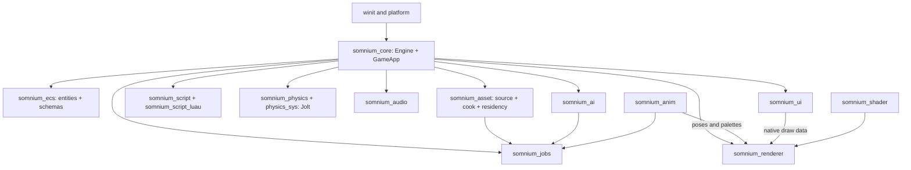
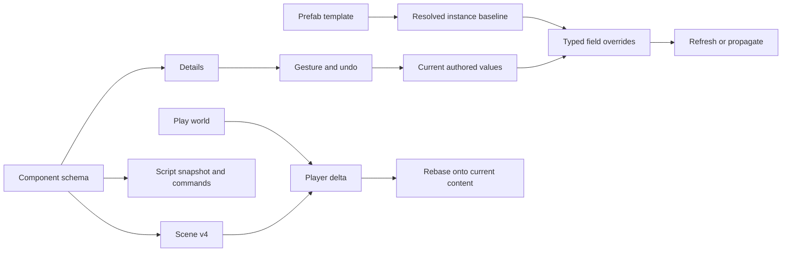

# Somnium Engine context

Updated 2026-09-09. Read this before editing the engine; implementation and test
results take precedence over historical phase plans.

Somnium is a Rust game engine with a native editor, an archetype ECS, a `wgpu`
visibility-buffer renderer, Jolt physics and Luau scripting. Game and editor
hosts share the same runtime systems.

## Current work

| Item | State |
|---|---|
| Session focus | MORROWIND O, P, P2, W, W2, X, Y and AF: composition, animation, AI and saves |
| Editor access | Create menu and command palette; generated Details; shared graph/timeline; viewport targets and navigation overlays |
| Full workspace tests | 2,352 passed, zero failed, two ignored documentation tests |
| Target cleanup | Recovered 44.76 GiB of disk space after validation; runnable binaries and evidence retained |
| Session evidence | [Eight-sub-phase acceptance](<dev records/phase MORROWIND/MORROWIND-2026-09-09.md>) |
| Toolchain | Rust 1.88, edition 2024, wgpu 30, winit 0.30 |
| Workspace | 17 engine crates, 2 examples, 1 workspace tool |
| Census | Generated by `python tools/census/generate.py`; see [report](<dev records/phase MORROWIND/MORROWIND-A_census.md>) |
| Visual baseline | PERSONA changed the old shell goldens; reference images remain preserved. Current gate results belong in the session evidence. |
| Other active work | PERSONA surface/QoL acceptance and TALOS scoped rendering/scalability work remain open. |

Read [development records](<dev records/README.md>) for phase history,
[ATTRIBUTION](ATTRIBUTION.md) for provenance and [editor help](docs/editor/welcome.md)
for designer workflows. The longer pre-session context is available in git at
`34a6b4c:context.md`; it contains historical measurements and decisions, not
current acceptance results.

## Architectural rules

1. `GameApp` is the game boundary; `EngineContext` is a borrowed callback view.
2. The renderer consumes geometry, materials, poses and UI draw data. It does
   not evaluate gameplay or animation graphs.
3. `somnium_jobs` is the only worker pool. Jobs carry priority, cancellation and
   deadlines; the main thread installs typed completions.
4. One command registry supplies menus, shortcuts, palette, tooltips and Help.
5. Component schemas supply Details, serialization, script fields and undo.
6. Scenes store durable entity/asset identities, never renderer pool slots.
7. Scripts read snapshots and return validated, ordered commands. They cannot
   retain an ECS borrow.
8. Unknown scene components and fields survive load/save.
9. Native editor and game UI share widgets, paint and accessibility. There is
   one graph surface and one timeline, with different document catalogues.
10. Visual and performance claims require matched, reproducible evidence.
11. Reference engines supply design patterns; licence rules prohibit copying
    restricted implementations. Record the actual files read in ATTRIBUTION.
12. New features use modules and adapters. Do not grow the central renderer,
    UI manager or Engine into another feature registry.

Graphify's checked-in report identifies `UiManager`, `Widget`, `UserInterface`,
`DrawingContext`, `SomniumRenderer` and `Engine<G>` as large hubs. It is an
orientation aid, not proof that current code is unchanged. Read the actual
module and `git log` before editing it.



## Vocabulary and boundaries

| Term | Meaning |
|---|---|
| Schema | Stable component/field identities, metadata and conversion functions |
| Command | One discoverable editor action with one dispatch route |
| Gesture | A cancellable edit that produces one undo record |
| Selection | Ordered entities with a primary; multi-edit uses schema intersection |
| Scene | Authored entity/component document; map recipes are a separate format |
| Prefab | Template fragment, nested template references and per-instance overrides |
| Save game | Player delta against authored content, metadata and game-owned state |
| AssetId | Durable content identity, independent of a loaded GPU/audio slot |
| Residency | Whether an asset is absent, requested, partial, resident or evicting |
| Cell | World-partition ownership coordinate, shared with navigation tiles |
| Pose | Skeleton-local transforms; the renderer receives the derived palette |
| Game UI | A game-owned canvas rendered through the native UI renderer |

## Repository map

| Area | Entry points |
|---|---|
| Host and frame | `crates/somnium_core/src/app.rs`, `context.rs`, `config.rs` |
| Designer adapters | `app_designer.rs`, `animation_authoring.rs`, `ai_editor.rs` |
| ECS and reflection | `crates/somnium_ecs/src/world.rs`, `reflect.rs`; core `reflect_registry.rs` |
| Scene and composition | core `scene_schema.rs`, `prefab.rs`, `scene_delta.rs`, `spline.rs`, `blockout.rs`, `scatter_scene.rs` |
| Saves | core `save_game.rs`, `save_game/editor.rs` |
| Renderer | `crates/somnium_renderer/src/renderer.rs`, pass and terrain modules |
| Native editor | `crates/somnium_ui/src/lib.rs`, `commands.rs`, `editor/`, `graph/`, `timeline/` |
| Assets and cook | `crates/somnium_asset/src/cook.rs`, `residency.rs`, `scatter.rs` |
| Streaming | core `world_partition/`; asset cook/residency APIs |
| Animation | `crates/somnium_anim/src/runtime.rs`, `motion.rs`, `procedural.rs`, `compression.rs` |
| AI | `crates/somnium_ai/src/`; core `ai.rs`, `ai_editor.rs` |
| Scripting | `crates/somnium_script/`, `somnium_script_luau/`; core `script_host.rs`, `script_bridge.rs` |
| Examples | `examples/hello_engine` (editor demo), `examples/vvardenfell` (independent public-API consumer) |
| Verification | `tools/census`, `tools/ghostfence`, crate unit/integration tests |

## Scene and authoring model

Scene schema **v4** adds prefab links and retains v3 compatibility. The v2 map
recipe remains separate. Entity references load in two passes through
`PersistentId`; unknown fields/components remain preserved. Derived GPU,
physics and navigation state is rebuilt from authored intent.

The editor's generic snapshot records serialized schema fields alongside the
existing resource snapshots. Transform, Name and Parent remain explicit so
paste placement and hierarchy remapping cannot be overwritten by stale values.
New authoring components therefore survive creation, deletion, undo and copy.
Copied entities get fresh identity; prefab linkage is intentionally broken.

`ChangeScope` determines field/component/entity/scene invalidation. Prefab
scalar overrides explicitly reject fields wider than Field scope; the error
names the field and asks the designer to break the link before rebuilding it.
This avoids replaying a terrain or resource reconstruction as a scalar write.



Prefab commands cover create, instantiate, enter/exit, nest, propagate, revert
and break-link. Details shows source, alias path and changed fields; the Outliner
marks instances and the selected override count. Source-changing operations
must restore source bytes as well as world values on undo.

Splines retain Catmull-Rom defaults, explicit tangent overrides, closed loops
and world-distance sampling. Blockouts provide boxes, ramps, stairs and
cylinders with GLB export. Scatter compiles from the shared graph, samples
surfaces and creates ordinary entities in one undo group. Its settings profile
controls the bake bounds; Preview reports accepted placement count.

## Animation, AI and saves

Animation assets contain validated skeletons, clips, graphs, parameter schemas
and state machines. Root motion handles looping and reverse playback; procedural
posing includes two-bone IK, ground-adapted feet, look-at and Jolt ragdoll blends.
Compression fits tracks against error budgets. Pose jobs use the shared worker
DAG and are tested against serial evaluation.

The native preview rig has visible joints and draggable IK/look targets.
Details exposes playback, root capsule, solver weights, ragdoll limits,
compression budgets and diagnostics. Events use the existing timeline markers;
Edit/Save Animation Events manages a `.somtimeline` asset.

Navigation voxelizes level geometry, filters walkable spans, builds regions and
contours, triangulates tiles and supports nearest-point, raycast, A*/funnel,
agent steering, off-mesh links and partial obstacle rebakes. Native cook payloads
and `NavigationCells` preserve cell ownership. This is the bounded in-tree grid
implementation, not a claim of Detour/Polyanya equivalence.

Navigation profiles, agents, obstacles, links and perception sensors are
reflected scene entities. Bake uses actual scene geometry; overlays show volume,
contours, paths and links. Behavior documents use the shared graph and compile
into immutable trees with blackboards. Script tasks resolve modules attached through Scripts Details by filename/stem
or full path, using the existing VM and command validation. Unresolved or
ambiguous bindings produce visible errors; repair retries automatically.

Save format v2 stores player changes, per-cell deltas, content version, metadata,
optional PNG and game-owned state. Slots use bounded reads and atomic writes.
Format/content migrations are separate and transactional. `GameStateStack`
provides menu/loading/playing/paused lifecycle transitions. Designer slots save
and reload the active Play world; Stop restores the authored checkpoint.

## Renderer and simulation contracts

The visibility buffer identifies geometry before material resolve. Existing
pass ordering and the 32-layer terrain material ABI are preserved. Terrain,
water, foliage, virtual textures, shadows and transparency have separate data
owners; do not silently change their measured defaults.

CSM remains the measured default, with VSM available per light. Portable DDGI,
terrain VT, weighted OIT, SMAA and unified AA settings are authored through
schemas. GPU particles/VFX graph and several rendering acceptance fixtures
remain open. No frame-time improvement is claimed by this session.

The DF clipmap/default-change process, TSUSHIMA detail fade, distant fog,
parallax captures and transmitted moonlight remain documented follow-ups.
Use the relevant phase evidence before tuning them. Preserve Great Lakes water
values, foliage LOD/cull policy and the accepted DOOM opt-in defaults.

Jolt owns rigid bodies, constraints, sweeps and contacts. Game physics steps
follow the simulation clock. Audio uses Kira buses/cache/streaming and authored
emitters; listener, zones and occlusion are engine adapters. Input uses named
action maps. Localisation uses string IDs and fallback-aware text infrastructure.

## UI and scripting contracts

PERSONA's flat Nocturne surfaces, immediate Content hover, popup lifecycle and
compact pickers are current design constraints. The retained UI tree supplies
paint, input routing, focus and accessibility. Native floating panels share the
same model; do not add a separate UI framework for new tools.

Authoring graphs keep separate cached documents and histories per catalogue.
Their toolbar provides searchable node creation, Open/Save/Preview/Apply,
filename/dirty state and inline errors. Switching tools preserves drafts.
Animation restores the timeline pane when opening a track document.

Script attachments carry durable instance IDs and saved properties. The host
runs lifecycle, reload/migration, deterministic command ordering and capability
validation. Quarantined scripts surface diagnostics rather than mutating the
world. Schema fields provide script-relevant access to new controls.

## Phase ledger and remaining work

| Phase/track | State |
|---|---|
| CONTROL | A–O complete; preserve its schema/command/gesture contracts |
| MORROWIND foundations/UI | Jobs, shader system, native runtime UI, graph/timeline and asset UI in tree |
| MORROWIND composition | O, P and P2 implemented this session; see individual records and session evidence |
| MORROWIND streaming | Cook, residency, cell ownership, HLOD/impostors and CPU floating origin in tree |
| MORROWIND animation | U/V plus W/W2 runtime and designer controls in tree |
| MORROWIND AI | X/Y runtime, cook, graph and scene authoring in tree |
| MORROWIND game framework | Input/audio/localisation plus AF saves in tree; video and final playable acceptance remain open |
| MORROWIND rendering | VSM/DDGI/VT/OIT/AA in tree; GPU particles/VFX and AC matched visual evidence remain open |
| PERSONA | Surface/QoL work in tree; unfinished journey/visual acceptance and later expansion remain open |
| TSUSHIMA | A–K in tree; documented visual and detail-fade follow-ups remain open |
| DREAMS | A/B complete; C active |
| PORTAL-0 | Complete |
| TALOS | Accepted scoped scalability/rendering work; larger stages deferred |
| PORTAL, KENSHI, STALKER | Plans, not implemented phases |

MORROWIND as a whole remains open. Do not equate eight implemented sub-phases
with phase closure. The acceptance record distinguishes runtime tests, designer
captures, inherited golden failures and unmeasured performance.

Other known editor debt includes fixed terrain/foliage palettes, brush-mask asset
authoring, cross-slot docking and the reported Content-to-Details drag issue.
The existing Assign to Selection/Use Selected routes remain useful. Full text
shaping/bidi/fallback and standalone player/release packaging are separate work.

## Verification workflow

Use `rg` to find the relevant code, then read it and its tests. Check git status
before editing; never overwrite unrelated work. Mandatory local skills used in
this session: rust-pro, codebase-design and engineering code-review.

```powershell
cargo fmt --all
cargo test --workspace --offline -j 1
cargo clippy --workspace --all-targets --offline -j 1
python tools/census/generate.py
python tools/ghostfence/run.py --fast
```

Capture editor evidence with `SOMNIUM_CAPTURE_UI_PNG` after tonemapping, using
`SOMNIUM_CAPTURE_FRAME` and `SOMNIUM_CAPTURE_QUIT`. The existing audit state
supports `morrowind-scatter` and `morrowind-behavior`. Never replace golden
references merely to make an intentional UI change pass. Record exact commands,
results and remaining limitations in the dated development record.
