# Somnium Engine context

Last verified: 2026-08-30 against the current working tree.

Somnium is a from-scratch Rust game engine with a native editor. Its renderer
uses `wgpu` and a visibility buffer. The engine also owns its ECS, UI, asset
pipeline, scripting boundary, world streaming, animation, input, audio, and
localisation.

This file describes the engine as it exists now. It is not a changelog, phase
handoff, implementation diary, or list of every experiment. Detailed history
belongs in [`dev records/`](<dev records/>). Provenance belongs in
[`ATTRIBUTION.md`](ATTRIBUTION.md).

## Start here

| Item | Current state |
|---|---|
| Active phase | MORROWIND, partially complete |
| Latest completed phase | PORTAL-0, a focused measurement and cleanup pass |
| Latest MORROWIND work | ALMSIVI acceptance slice: authored Audio Emitters, named script input, and CC0 map audio |
| Next planned phases | PORTAL, KENSHI, then STALKER; none has started |
| Toolchain | Rust 1.88, edition 2024, wgpu 30, winit 0.30 |
| Workspace | 16 engine crates, 2 examples, 1 workspace tool |
| Generated census | 188,732 Rust/WGSL lines and 1,864 discovered tests |
| Fast gate, 2026-08-29 | 5 passed, 1 failed, tests skipped |
| Current gate failure | `sculpt-panel` golden image: 5.3333% changed, budget 0.2% |
| Full workspace tests, 2026-08-30 | Passed with zero failures using `cargo test --workspace -j 1` |

The top-level phase status is:

| Phase | Status | Read next |
|---|---|---|
| CONTROL | Complete, A through O | [`phase_CONTROL.md`](<dev records/phase_CONTROL.md>) |
| MORROWIND | In progress | [`phase_MORROWIND.md`](<dev records/phase_MORROWIND.md>) and the ledger below |
| PORTAL-0 | Complete, A through G | [`phase_PORTAL-0.md`](<dev records/phase_PORTAL-0.md>) |
| PORTAL | Plan only, not started | [`phase_PORTAL.md`](<dev records/phase_PORTAL.md>) |
| KENSHI | Plan only, not started | [`phase_KENSHI.md`](<dev records/phase_KENSHI.md>) |
| STALKER | Plan only, not started | [`phase_STALKER.md`](<dev records/phase_STALKER.md>) |

Dated phase audits still describe systems that were absent when their plans
were written. Those statements are historical. The table above, current
source, generated evidence, and completed sub-phase records take precedence.

## How to use this file

Read in this order:

1. Start here and the language section.
2. Read the architectural rules before changing a subsystem boundary.
3. Read the relevant subsystem summary.
4. Read the phase ledger to learn whether work is shipped, open, deferred, or
   untouched.
5. Open the specific phase record only when implementation detail or evidence
   is needed.

Source of truth, from strongest to weakest:

1. Current code, tests, generated reports, and captured evidence.
2. The shipped ledger in this file and the current README.
3. Completed sub-phase records.
4. Phase plans. Plans describe intent and may contain stale audits.
5. Old handoffs and narrative status blocks.

## Language

Use these terms consistently.

### Product and runtime

**Engine**:
The `Engine<G>` host that owns the platform loop and runs a `GameApp`.
_Avoid_: runtime manager, main system

**GameApp**:
The public game-facing lifecycle interface. Both examples consume it without
owning editor internals.
_Avoid_: game manager, app singleton

**EngineContext**:
The borrowed per-callback view of engine services and state. It is not durable
storage.
_Avoid_: global context, service locator

**Editor shell**:
The native Somnium UI that surrounds the scene view. It owns menus, panels,
selection tools, and authoring workflows.
_Avoid_: game UI, debug overlay

**Game UI**:
A game-owned `UiCanvas` rendered through the same UI renderer after game logic
has prepared the frame.
_Avoid_: editor UI, HUD manager

**Scene**:
Authored entities and component data stored through the versioned scene schema.
Unknown components and fields must survive a load and save cycle.
_Avoid_: level when referring to the file format

**Audio Emitter**:
Serialized ECS intent for a sound source, including its asset, playback, bus,
and spatial authoring. It is not a live audio-backend resource.
_Avoid_: audio object, Kira handle

### Editing

**Schema**:
The registered description of editable component fields, types, versions, and
flags. It drives Details, serialization, and compatibility checks.
_Avoid_: inspector metadata, ad hoc reflection

**Command**:
A registered editor or game action with stable identity and one dispatch path.
Menus, shortcuts, the palette, tooltips, and help index project the same editor
command registry.
_Avoid_: menu callback, shortcut action list

**Gesture**:
A cancellable sequence of pointer or keyboard input that becomes one undo step.
_Avoid_: repeated edit events

**Selection**:
An ordered entity set with one primary entity. Details edits the schema
intersection and represents differing values as mixed.
_Avoid_: selected entity list with no primary

### Assets and worlds

**AssetId**:
Stable identity derived from a normalized source path. It is independent of a
renderer slot, package offset, or current residency state.
_Avoid_: texture index, material slot, file handle

**CookedAsset**:
A versioned and integrity-checked runtime artifact with content and dependency
hashes.
_Avoid_: cached source file, release package

**Residency**:
The state machine that resolves, loads, uploads, publishes, evicts, and reloads
cooked assets within budgets.
_Avoid_: asset cache when the state machine matters

**Cell**:
The ownership unit for world partition. An unloaded cell serializes its owned
entities; it does not leave a second live copy in the ECS.
_Avoid_: chunk when discussing world ownership

**Content layer**:
A planned STALKER concept for ordered base, patch, and mod content sources. It
does not exist in the current runtime.
_Avoid_: implying that current loose cooked files are packages

### Execution and evidence

**Job**:
Background work submitted to `somnium_jobs` with declared priority, deadline,
cancellation, and main-thread completion policy.
_Avoid_: bare thread, rayon spawn outside the allowed worker

**Script snapshot**:
A copy-out view given to a script for one phase. Scripts return commands and do
not retain ECS borrows.
_Avoid_: script world reference

**Input action**:
A named semantic value such as `Move`, `Look`, or `Jump`, resolved from physical
controls by an action map.
_Avoid_: key when the binding may also be a mouse or gamepad control

**Live voice**:
A transient audio-backend playback resource reconciled from authored intent
during Play. It is never serialized.
_Avoid_: Audio Emitter, saved sound handle

**Evidence**:
A generated report, test result, image, or timing capture tied to a command and
revision.
_Avoid_: a hand-written claim with no reproducer

**In tree**:
Implemented in source. It does not imply that every visual or performance gate
has passed.
_Avoid_: complete

**Complete**:
The phase's stated acceptance gates passed, or its record explicitly closed the
remaining items.
_Avoid_: done because the main code path compiles

**Planned**:
Described in a phase document but not implemented.
_Avoid_: future feature described in the present tense

**Deferred**:
Deliberately left for later, usually with a named prerequisite or evidence
condition.
_Avoid_: silently treating it as complete

**Refused**:
Investigated and rejected. A refused approach only reopens when new evidence
invalidates the recorded reason.
_Avoid_: TODO

## Architectural rules

These rules are more stable than phase names.

1. `GameApp` is the game boundary. Editor and future player hosts are adapters
   around it, not separate application models.
2. The renderer consumes data. Animation supplies matrices, scripts supply
   commands, assets supply uploaded resources, and UI supplies draw data.
3. There is one job system: `somnium_jobs`. Bare worker creation outside its
   stated exemptions fails GHOSTFENCE.
4. There is one editor command registry. Menus, shortcuts, command palette,
   tooltips, and help index do not keep parallel action lists.
5. The component schema is the source for editable fields. A new editable field
   must not require a hand-written Details branch.
6. Asset identity is separate from renderer residency. Scenes store `AssetId`,
   not a current GPU slot.
7. Scripts receive snapshots and return ordered commands. Luau cannot hold an
   ECS borrow or mutate engine storage directly.
8. Unknown scene data survives. Loading with an older or reduced build must not
   destroy components or fields it cannot interpret.
9. Editor UI and game UI share the renderer and widget vocabulary. Somnium does
   not add a WebView or a second immediate-mode UI stack.
10. A frame-time or visual claim needs matched evidence. Defaults do not change
    from an isolated screenshot or a single noisy timing run.
11. Reference engines provide architecture and comparison points. Source is not
    copied. Licence restrictions in `ATTRIBUTION.md` are binding.
12. Large central types are not extension registries. New authoring modes
    should attach through schemas, commands, tools, or data interfaces instead
    of adding another branch to `UiManager`, `Widget`, `SomniumRenderer`, or
    `Engine<G>`.

The Graphify report currently identifies the largest hubs as `UiManager`,
`Widget`, `SomniumRenderer`, `UserInterface`, `UiMessage`, `DrawingContext`,
`Engine<G>`, and `WidgetBuilder`. Treat growth in those types as an architecture
review trigger.

## Architecture at a glance

Somnium is a workspace of narrow engine crates assembled by a comparatively
wide host. The diagram shows ownership and data flow, not every Cargo edge.
`somnium_core` is intentionally an integration layer; it should coordinate
subsystems without absorbing their internal policies.

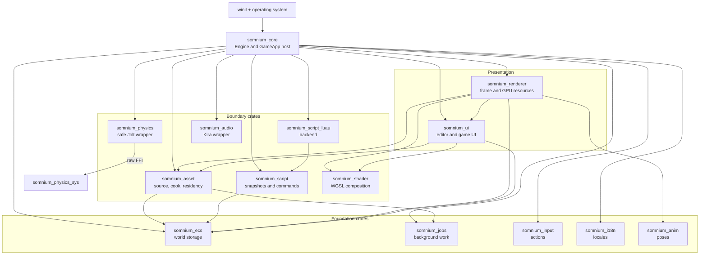
```mermaid
flowchart TB
    OS["winit + operating system"] --> HOST["somnium_core<br/>Engine and GameApp host"]

    subgraph Foundation["Foundation crates"]
        ECS["somnium_ecs<br/>world storage"]
        JOBS["somnium_jobs<br/>background work"]
        INPUT["somnium_input<br/>actions"]
        I18N["somnium_i18n<br/>locales"]
        ANIM["somnium_anim<br/>poses"]
    end

    subgraph Boundaries["Boundary crates"]
        ASSET["somnium_asset<br/>source, cook, residency"]
        SCRIPT["somnium_script<br/>snapshots and commands"]
        LUAU["somnium_script_luau<br/>backend"]
        PHYS["somnium_physics<br/>safe Jolt wrapper"]
        AUDIO["somnium_audio<br/>Kira wrapper"]
        SHADER["somnium_shader<br/>WGSL composition"]
    end

    subgraph Presentation["Presentation"]
        RENDER["somnium_renderer<br/>frame and GPU resources"]
        UI["somnium_ui<br/>editor and game UI"]
    end

    HOST --> ECS
    HOST --> JOBS
    HOST --> INPUT
    HOST --> I18N
    HOST --> ASSET
    HOST --> SCRIPT
    HOST --> LUAU
    HOST --> PHYS
    HOST --> AUDIO
    HOST --> RENDER
    HOST --> UI

    ASSET --> ECS
    ASSET --> JOBS
    SCRIPT --> ECS
    LUAU --> SCRIPT
    PHYS -->|"raw FFI"| PHYS_SYS["somnium_physics_sys"]
    RENDER --> ASSET
    RENDER --> ANIM
    RENDER --> ECS
    RENDER --> SHADER
    RENDER --> UI
    UI --> ASSET
    UI --> ECS
    UI --> SHADER
```

The important seams are directional:

| Producer | Boundary value | Consumer | Rule |
|---|---|---|---|
| Game or editor | `EngineEvent`, `EngineContext` | `GameApp` | Game code does not depend on raw platform events |
| Scene schema | field metadata and serialized values | Details, undo, scene I/O | Editable fields are declared once |
| Script host | `ScriptSnapshot` | script backend | Scripts see copied state, not ECS borrows |
| Script backend | ordered `CommandBuffer` | engine validator | Mutation crosses a capability check |
| Asset system | stable handle and residency state | renderer, UI, game | Identity survives eviction and upload changes |
| Animation | pose and skinning palette | renderer | The renderer does not evaluate animation graphs |
| Jobs | typed completion | main-thread drain | Worker results publish within a frame budget |
| UI | paint primitives and semantic tree | renderer, AccessKit | Visuals and accessibility come from one retained tree |

### Why these boundaries exist

| Decision | Benefit | Cost accepted |
|---|---|---|
| Visibility buffer instead of a conventional G-buffer | Geometry is identified once and material shading is centralized | Material reconstruction and transparent paths are more specialized |
| Retained native UI instead of a WebView or debug immediate mode | Editor and game UI share rendering, styling, input, and accessibility | Somnium owns layout, text, focus, and widget complexity |
| Schema-generated editing instead of per-component inspectors | Serialization, Details, undo, and multi-edit agree by construction | Schema quality becomes a hard engine dependency |
| Stable asset identity separate from residency | Scenes remain valid while data streams, evicts, or hot reloads | Callers must handle placeholder and pending states |
| Snapshots and commands instead of script ECS access | Deterministic ordering, capability checks, and no retained borrows | Each new script operation needs an explicit command |
| One job system instead of subsystem pools | Priorities, deadlines, telemetry, and frame drains share one policy | Specialized work must fit the common job contract |
| Cell ownership instead of proximity-only streaming | Unload can persist real authored entities transactionally | Cross-cell relationships need explicit treatment |
| CSM as the measured default, VSM as authored | Small scenes keep the proven path while VSM remains available | Two shadow paths remain supported |

## Core ideas, illustrated

Five ideas explain most of what the code looks like. Every one of them is a
trade, and every one is cheap to check against the tree.

### 1. Shade every pixel exactly once

A conventional forward or deferred renderer pays for **overdraw**: a pixel
behind an opaque surface is shaded, then thrown away when something nearer
draws over it. The visibility buffer removes that by separating *which surface
is here* from *what does it look like*.

```
Pass 1 — rasterize all geometry, write (instance, primitive) identity per pixel
Pass 2 — one fullscreen shader, look up that exact triangle, shade it once
```

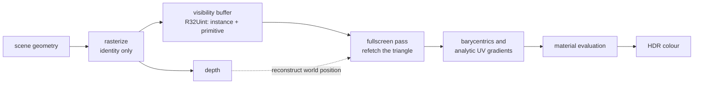
```mermaid
flowchart LR
    GEO["scene geometry"] --> RASTER["rasterize<br/>identity only"]
    RASTER --> VB["visibility buffer<br/>R32Uint: instance + primitive"]
    RASTER --> DEPTH["depth"]
    VB --> RESOLVE["fullscreen pass<br/>refetch the triangle"]
    RESOLVE --> BARY["barycentrics and<br/>analytic UV gradients"]
    BARY --> MAT["material evaluation"]
    MAT --> HDR["HDR colour"]
    DEPTH -.->|"reconstruct world position"| RESOLVE
```

Nothing is shaded twice, and bandwidth scales with the **framebuffer** rather
than with scene complexity.

That is a claim, so it is measured rather than asserted. Every `.somtime` run
records pipeline statistics for the shading pass:

| Render size | Pixels | `Shading.frag` (fragment invocations) |
|---|---:|---:|
| 1920 x 1032 | 1,981,440 | **1,981,440** |
| 2560 x 1392 | 3,563,520 | **3,563,520** |

Exactly one invocation per pixel, at both sizes. The cost of that pass is
therefore entirely *per-pixel work*. Not geometry, not overdraw. That is why
the only two levers that have ever moved it are pixel count and deleting
material work.

What it costs: material evaluation becomes centralized and specialized, and a
blended surface cannot go through a buffer that stores one triangle per pixel.
That is why `pass/transparent.rs` and `pass/oit.rs` exist at all.

### 2. One bind group for the whole scene

Geometry, materials and textures are uploaded once and addressed by index.
Every pass binds the *same* `@group(0)`, so a shader can reach any mesh or any
texture in the scene without rebinding anything.

```
@group(0) — the global pool, bound once, shared by every pass
├── 0  vertices          every mesh vertex, one storage buffer
├── 1  indices           every mesh index
├── 2  instances         rebuilt each frame
├── 3  view              camera and matrices
├── 4  textures[]        bindless array
├── 5  materials         every material
├── 6  light             the directional light
├── 7  local_lights      point and spot
├── 8  light_index_list  per-froxel light lists
├── 9  cluster_offsets   per-froxel spans
└── 10 cluster_params    grid dimensions
```

Meshes are drawn by **programmable vertex pulling**: no vertex buffer is bound,
and the vertex shader reads `vertices[instance.vertex_offset + index]` itself.
That is what lets one indirect draw cover unrelated meshes.

### 3. Queries walk contiguous memory

Entities sharing a component signature live in one archetype, stored as
parallel columns. Struct-of-arrays, not array-of-structs:

```
Archetype { Transform, MeshComponent, MaterialComponent }

  entity slot:    [  0  |  1  |  2  |  3  ]
  Transform:      [  T0 |  T1 |  T2 |  T3 ]   contiguous
  MeshComponent:  [  M0 |  M1 |  M2 |  M3 ]   contiguous
  MaterialComp:   [  C0 |  C1 |  C2 |  C3 ]   contiguous
```

Iterating `(Transform, Mesh, Material)` walks three dense slabs. A query selects
archetypes whose component set is a superset of what was asked for, so the
per-entity cost is a column index rather than a hash lookup.

What it costs: adding or removing a component moves an entity between
archetypes. That is a structural change, not a field write.

### 4. An asset has one identity and many states

A handle is stable for the lifetime of the scene. Whether its bytes are
resident is a separate question, and the answer can change every frame while
the handle does not.

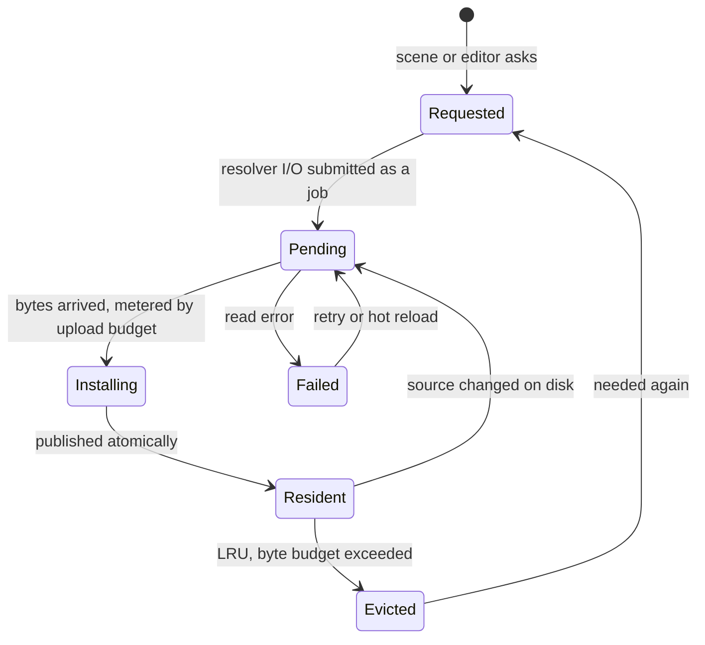
```mermaid
stateDiagram-v2
    [*] --> Requested: scene or editor asks
    Requested --> Pending: resolver I/O submitted as a job
    Pending --> Installing: bytes arrived, metered by upload budget
    Installing --> Resident: published atomically
    Pending --> Failed: read error
    Failed --> Pending: retry or hot reload
    Resident --> Evicted: LRU, byte budget exceeded
    Evicted --> Requested: needed again
    Resident --> Pending: source changed on disk
```

A typed placeholder is returned immediately, so nothing blocks on I/O, and
nothing ever observes a half-installed asset: a value is published complete or
not at all. Mesh LODs are independent residency keys, so coarse geometry can
stay resident while LOD 0 is absent.

What it costs: every caller has to handle placeholder and pending states
rather than assuming the data is there.

### 5. The frame has a deadline, and meeting it takes two phases

Sleeping to a deadline is inaccurate. OS timer granularity on Windows is around
15 ms, far coarser than a frame. Spinning is accurate and burns a core. So the
limiter does both:

```
frame work done ──► wait_for_frame_budget()
                        │
                        ├─ remaining > 1 ms → thread::sleep(remaining − 1 ms)
                        │                     coarse, cheap, covers most of it
                        │
                        └─ spin to the exact deadline
                                              sub-microsecond, ~1 ms of core
```

Cheap where precision does not matter, exact only in the last stretch where it
does. The same shape turns up in the upload budget and the job drain.

## Where the frame actually goes

Measured, not estimated. From `dev records/phase PORTAL-0/`, on an RTX 5080
Laptop at 1920 x 1032, release, 180 warm-up and 300 measured frames, at the
default Coastal viewpoint with shipped settings.

| GPU zone | ms | Share |
|---|---:|---:|
| **Shading** | **11.534** | **54%** |
| ReSTIR GI | 2.906 | 14% |
| Water prepass | 2.311 | 11% |
| Shadows | 0.937 | 4% |
| FSR 3 | 0.919 | 4% |
| GTAO | 0.844 | 4% |
| everything else | ~2.0 | 9% |
| **Frame** | **21.439** | |

Two things the table is good for.

It says where to look. Shading is over half the frame, and a pixel-class
ablation (`SOMNIUM_SHADE_ABLATE`) says what is inside it. Measured back to back
in one batch, where the unablated pass was 11.463 ms:

| Pixel class only | ms |
|---|---:|
| terrain | **11.461** |
| sky | 0.169 |
| meshes | 0.111 |
| foliage | 0.113 |

Terrain is effectively the whole pass. Serious work on this frame is terrain
material work, and the measurement said so before anyone had to guess.

It also says what the CPU is doing, which is mostly waiting. The same run
records `Frame CPU` at 21.185 ms, of which `Surface acquire` is **16.797 ms**
spent blocked on the GPU. Real CPU work is about 4.4 ms. The frame is GPU-bound,
so no amount of CPU optimization would move it.

The same viewpoint with the terrain clipmap enabled measures **Frame 9.096 ms,
Shading 1.655 ms**, and the CPU blocks for 0.04 ms instead of 16.8. It stops
waiting because there is nothing left to wait for.

## Codenames

Phases are named after an engine or game whose problem the phase resembles. The
name is a mnemonic, not a claim of similarity.

| Codename | After | The problem it names |
|---|---|---|
| Halcyon (VV) | — | Water reflections |
| Crysis (CR) | Crytek | Culling: draw less |
| Daggerfall (DF) | Bethesda | Terrain stretching further than the detail budget |
| Metaphor (26) | Atlus | Editor information architecture |
| Nocturne Atelier (26-Zeta) | — | The editor's visual identity |
| Hades (27) | Supergiant | Paint, motion, and feel |
| id Tech (DOOM) | id Software | Frame time, and being able to measure it |
| Northlight (CONTROL) | Remedy | Editor reach: making authored state authorable |
| NetImmerse (MORROWIND) | Gamebryo | Everything that is not the renderer |
| Source (PORTAL-0) | Valve | Engineering health, and distrusting your own memory |

## Repository map

### Engine crates

| Crate | Owns |
|---|---|
| `somnium_core` | Application lifecycle, `GameApp`, engine context, scene schema, editor orchestration, simulation host |
| `somnium_ecs` | Archetype ECS, entity generations, component storage, queries |
| `somnium_renderer` | wgpu device-facing renderer, visibility buffer, lighting, terrain, water, post effects |
| `somnium_ui` | Retained widget tree, editor shell, runtime canvas, graph, timeline, theme, accessibility |
| `somnium_asset` | glTF loading, material assets, scene files, deterministic cook, residency, previews, world bake |
| `somnium_shader` | WGSL composition, variant keys, cache, validation, development hot reload |
| `somnium_jobs` | Priorities, deadlines, cancellation, worker queue, budgeted completion drain |
| `somnium_anim` | Skeletons, poses, clips, blend trees, state machines, sync tracks |
| `somnium_script` | Language-neutral snapshots, capabilities, commands, ids, lifecycle |
| `somnium_script_luau` | Sandboxed Luau backend and the only Luau-specific engine code |
| `somnium_input` | Action maps, control paths, processors, interactions, rebinding |
| `somnium_i18n` | String tables, plural and gender rules, locale fallback, extraction |
| `somnium_audio` | Kira-backed sounds, buses, listeners, attenuation, occlusion, Doppler |
| `somnium_physics` | Safe Jolt-facing bodies, shapes, contacts, layers, world |
| `somnium_physics_sys` | Raw Jolt FFI and C++ build boundary |
| `somnium_voxel` | Voxel chunks, generation, edits, meshing, LOD |

### Dependency layers

The workspace is not a strict onion, but its production dependencies form
useful layers. `somnium_core` is at the top because it assembles the engine.
Example programs and tools sit above that integration surface. Development-only
test edges are omitted.

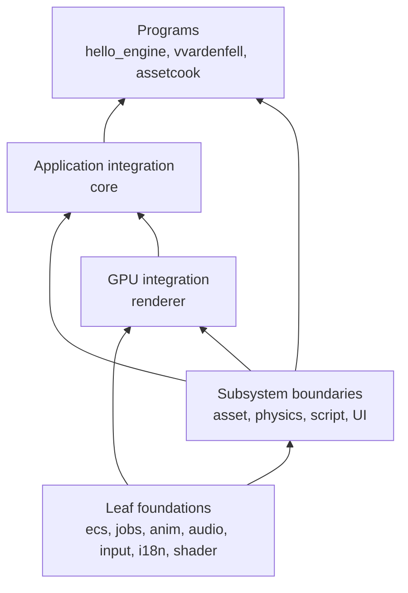
```mermaid
flowchart BT
    BASE["Leaf foundations<br/>ecs, jobs, anim, audio, input, i18n, shader"]
    SYS["Subsystem boundaries<br/>asset, physics, script, UI"]
    GPU["GPU integration<br/>renderer"]
    HOST["Application integration<br/>core"]
    APPS["Programs<br/>hello_engine, vvardenfell, assetcook"]

    BASE --> SYS
    BASE --> GPU
    SYS --> GPU
    SYS --> HOST
    GPU --> HOST
    HOST --> APPS
    SYS --> APPS
```

This is a design aid, not permission to move code upward. A feature that can
live in a lower crate should not be placed in `somnium_core` merely because the
host already depends on everything.

### Programs and tools

| Path | Role |
|---|---|
| `examples/hello_engine` | Main editor and renderer demonstration |
| `examples/vvardenfell` | Second public-API consumer and packaged acceptance fixture |
| `tools/assetcook` | Standalone deterministic cook CLI |
| `tools/census` | Regenerates structural counts used by GHOSTFENCE |
| `tools/ghostfence` | Repository acceptance gate |
| `tools/reachability` | Checks environment, schema, and editor reachability |
| `tools/shadercook` | Reports shader variant budgets |

## Runtime shape

The host owns the platform loop. Game code sees engine events and an
`EngineContext`, not raw `winit` types.

```text
operating system
    -> Engine<GameApp>
        -> fixed update and update
        -> game render preparation
        -> renderer
        -> game UI
        -> editor shell
        -> present
```

The frame-level interaction is easier to read as a sequence. The exact number
of fixed steps varies with accumulated simulation time.

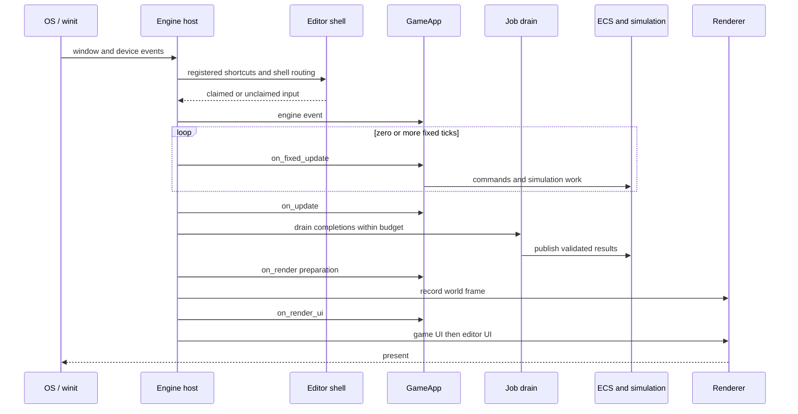
```mermaid
sequenceDiagram
    participant OS as OS / winit
    participant Host as Engine host
    participant UI as Editor shell
    participant Game as GameApp
    participant Jobs as Job drain
    participant World as ECS and simulation
    participant GPU as Renderer

    OS->>Host: window and device events
    Host->>UI: registered shortcuts and shell routing
    UI-->>Host: claimed or unclaimed input
    Host->>Game: engine event
    loop zero or more fixed ticks
        Host->>Game: on_fixed_update
        Game->>World: commands and simulation work
    end
    Host->>Game: on_update
    Host->>Jobs: drain completions within budget
    Jobs->>World: publish validated results
    Host->>Game: on_render preparation
    Host->>GPU: record world frame
    Host->>Game: on_render_ui
    Host->>GPU: game UI then editor UI
    GPU-->>OS: present
```

Important ordering rules:

- Registered editor shortcuts run before ordinary UI routing.
- During play or viewport flight, unmodified game controls are not stolen by
  editor tool shortcuts.
- The editor shell sees input before game UI. Game UI sees unclaimed input
  before viewport tools and terrain/foliage brushes.
- Fixed updates use the simulation clock. Variable updates use frame time.
- Jobs produce data off-thread and apply completions on the main thread within a
  time budget.
- `GameApp::on_render` prepares game draw state. `on_render_ui` records game UI
  later, while the GPU frame is open.

### Background work

Everything off the main thread goes through `somnium_jobs`. A job declares what
it is worth and when it stops being worth anything, which is what lets the
scheduler drop work instead of running it late.

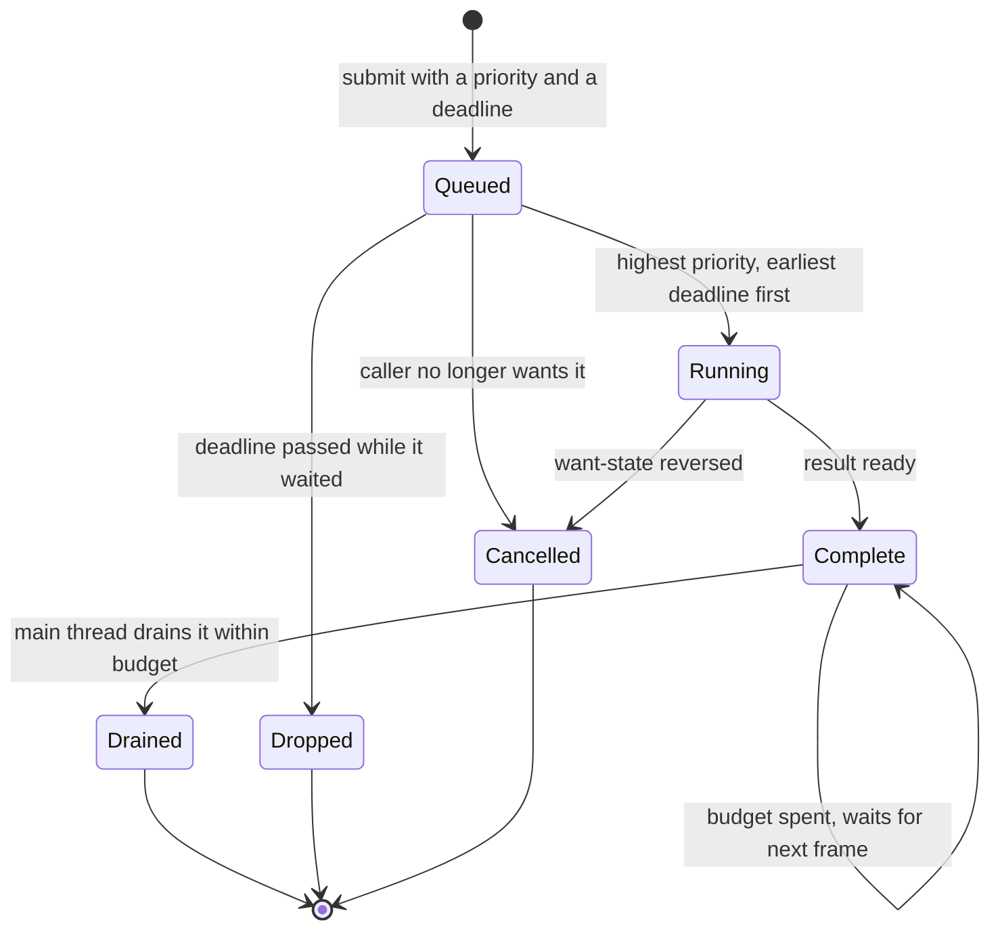
```mermaid
stateDiagram-v2
    [*] --> Queued: submit with a priority and a deadline
    Queued --> Running: highest priority, earliest deadline first
    Queued --> Dropped: deadline passed while it waited
    Queued --> Cancelled: caller no longer wants it
    Running --> Complete: result ready
    Running --> Cancelled: want-state reversed
    Complete --> Drained: main thread drains it within budget
    Complete --> Complete: budget spent, waits for next frame
    Drained --> [*]
    Dropped --> [*]
    Cancelled --> [*]
```

A job whose deadline expired in the queue is dropped rather than run. That is
the point of declaring one: a thumbnail nobody is looking at any more, or a cell
the camera has already left, costs nothing to abandon. The completion drain is
budgeted for the same reason the frame limiter exists, since a burst of finished
work arriving at once would move the hitch rather than remove it.

**One scheduler, and it is now literally one.** Voxel chunk meshing was the last
system detaching work onto rayon's global pool, and it had been carried as a
stated GHOSTFENCE exemption since PORTAL-0-C because paying it off meant
changing `VoxelWorld::update`'s signature. DOOM-H paid it: `EngineContext`
carries `jobs`, chunk meshing submits like anything else, a chunk that leaves
the keep radius has its job cancelled, and a submission the bounded queue
refuses is retried next frame rather than lost. The exemption is gone. Only two
uses of another thread survive, both deliberate: `for_each_mut`'s fork-join over
a slice inside one frame, and two single-shot tests whose whole assertion is
that something works off the main thread.

A job also declares whether it is **housekeeping** — engine work that runs on
its own — separately from its priority. The status bar had been using
`priority != Background` as a stand-in for *"a person started this"*, which held
only while every continuous system happened to sit at that class. Chunk meshing
does not: a missing chunk is a hole in the view, so `Visible` is the honest
scheduling class, and using priority to keep it out of the status bar would have
meant lying to the scheduler to fix a label. Two questions, two answers.
([DOOM-H](<dev records/phase DOOM/DOOM-H.md>))

## ECS, scenes, and editing

The ECS groups entities by component signature and stores component columns
dense within each archetype. Entity handles carry an index and generation.

The scene layer adds durable authoring rules:

- Component schemas provide field names, types, flags, defaults, and versions.
- Scene serialization retains unknown component and field data.
- Details is schema-generated. The current editor exposes 267 editable fields
  across 25 editor-registered schemas with no legacy hand-wired field routes.
- Multi-selection edits the schema intersection. Mixed values stay explicit.
- Property drags coalesce into one scoped undo operation.
- Scenes have thumbnails, autosave, crash recovery, and clickable undo history.
- Assets stored in component fields use `AssetId`; renderer slots remain
  derived runtime state.

`somnium_core` still contains substantial editor orchestration. New work should
prefer crate-level seams over adding more switch arms to the central app host.

### Schema and edit flow

The schema is a small piece of metadata with many consumers. That fan-out is
deliberate. The same field definition drives the editor and persistence so a
new property cannot be visible in one system and silently absent from another.

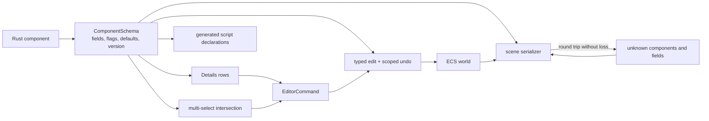
```mermaid
flowchart LR
    COMP["Rust component"] --> SCHEMA["ComponentSchema<br/>fields, flags, defaults, version"]
    SCHEMA --> DETAILS["Details rows"]
    SCHEMA --> MULTI["multi-select intersection"]
    SCHEMA --> UNDO["typed edit + scoped undo"]
    SCHEMA --> SAVE["scene serializer"]
    SCHEMA --> SCRIPT["generated script declarations"]

    DETAILS --> EDIT["EditorCommand"]
    MULTI --> EDIT
    EDIT --> UNDO
    UNDO --> WORLD["ECS world"]
    WORLD --> SAVE

    UNKNOWN["unknown components and fields"] --> SAVE
    SAVE -->|"round trip without loss"| UNKNOWN
```

Scene files are authored truth. GPU slots, loaded pointers, preview textures,
and other process-local values are derived state and do not belong in them.

The round trip is where that promise is kept or broken. A build missing a
component must hand back what it could not understand, or opening and saving a
scene deletes work:

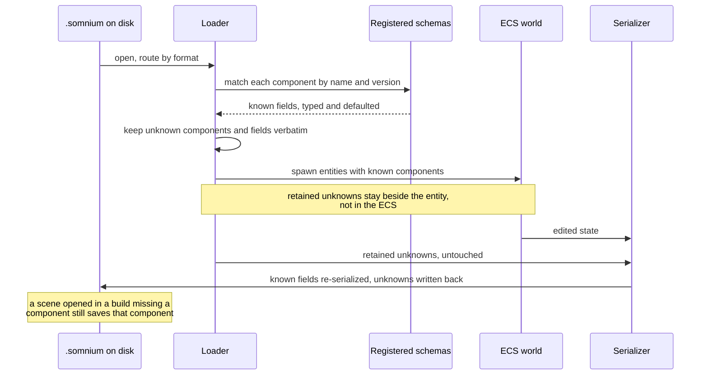
```mermaid
sequenceDiagram
    participant Disk as .somnium on disk
    participant Load as Loader
    participant Schema as Registered schemas
    participant World as ECS world
    participant Save as Serializer

    Disk->>Load: open, route by format
    Load->>Schema: match each component by name and version
    Schema-->>Load: known fields, typed and defaulted
    Load->>Load: keep unknown components and fields verbatim
    Load->>World: spawn entities with known components
    Note over Load,World: retained unknowns stay beside the entity,<br/>not in the ECS
    World->>Save: edited state
    Load->>Save: retained unknowns, untouched
    Save->>Disk: known fields re-serialized, unknowns written back
    Note over Disk: a scene opened in a build missing a<br/>component still saves that component
```

Before CONTROL-J the loader dropped what it did not recognise with a warning, so
that path was silent data loss rather than a version mismatch. The header
thumbnail is written into the container so the asset drawer can show a scene
without parsing its body.

## Renderer

### Core pipeline

Somnium rasterizes visible geometry into a compact visibility buffer containing
instance and primitive identity. A later fullscreen pass reconstructs surface
data and shades each live pixel once.

The frame includes, as needed:

1. Streaming, culling, indirect draw preparation, and shadow preparation.
2. Visibility and depth generation, including the second disocclusion phase
   used by the GPU-driven path.
3. Depth consumers such as GTAO, clustered volumes, decals, and lighting data.
4. Opaque shading into an HDR target.
5. Water prepass, reflections, refraction, surface shading, and underwater
   composition.
6. Sorted transparency or weighted OIT.
7. Temporal reconstruction, anti-aliasing, post effects, tone mapping, and
   optional upscaling.
8. Game UI and editor UI.

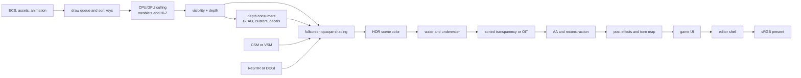
```mermaid
flowchart LR
    WORLD["ECS, assets, animation"] --> QUEUE["draw queue and sort keys"]
    QUEUE --> CULL["CPU/GPU culling<br/>meshlets and Hi-Z"]
    CULL --> VIS["visibility + depth"]
    VIS --> DEPTH["depth consumers<br/>GTAO, clusters, decals"]
    VIS --> SHADE["fullscreen opaque shading"]
    DEPTH --> SHADE
    SHADOW["CSM or VSM"] --> SHADE
    GI["ReSTIR or DDGI"] --> SHADE
    SHADE --> HDR["HDR scene color"]
    HDR --> WATER["water and underwater"]
    WATER --> TRANS["sorted transparency or OIT"]
    TRANS --> AA["AA and reconstruction"]
    AA --> POST["post effects and tone map"]
    POST --> GAMEUI["game UI"]
    GAMEUI --> EDITORUI["editor shell"]
    EDITORUI --> PRESENT["sRGB present"]
```

Pass order is a compatibility contract because later systems consume earlier
depth, motion, visibility, or lighting products. A proposed render graph may
describe this order, but it does not justify changing it without measurements
and equivalent captures.

### Geometry and visibility

In tree:

- Bindless textures and a global resource pool.
- Programmable vertex pulling through shared geometry buffers.
- Stateless draw commands and sort keys.
- Compute frustum culling, meshlet clusters, Hi-Z occlusion, and indirect draws.
- CPU frustum early-out for terrain and shadow casters.
- GPU skinning into the same geometry path used by static meshes.
- Voxel chunks and terrain submit through the visibility-buffer contract.

The default indirect stream stays dense: argument `i` carries an explicit
`first_instance` and GPU culling rejects work by writing `instance_count = 0`.
DOOM-G added an opt-in counted consumer without weakening that invariant. With
`SOMNIUM_DRAW_COMPACTION=1`, each cull phase appends survivors into fixed
single-/double-sided partitions and visibility uses
`multi_draw_indirect_count`; dense args still own phase-two revival, IDs, and
diagnostics. The 66-object gate changed combined cull + visibility by only
0.0072 ms, inside noise, and atomic append is not order-stable. Dense submission
therefore remains the default. See [DOOM-G](<dev records/phase DOOM/DOOM-G.md>).

### Lighting and atmosphere

In tree:

- Cook-Torrance GGX PBR and an alternate cel-shading mode.
- Cascaded shadow maps with PCSS and contact shadows.
- Sparse virtual shadow maps as an authored alternative. CSM remains the
  measured default on the current small scenes.
- ReSTIR direct and global illumination on ray-query hardware.
- Portable SDF-traced DDGI with a budgeted 4 by 4 by 4 SH volume.
- Global IBL, Hillaire atmosphere LUTs, analytic sun position, and a five-track
  day cycle.
- Volumetric clouds, cloud shadows, precipitation, wetness, wind, and water
  ripples.
- Clustered local lights and decals using the same volume-binning seam.

There is no authored local reflection/irradiance environment asset. STALKER
plans that capability; describing it as current would be incorrect.

Four shadow paths coexist and the selection is not a free choice at every
level. The technique is authored per directional light; whether PCSS and the
contact march actually run is decided per frame by whether traced visibility
already answered the question.

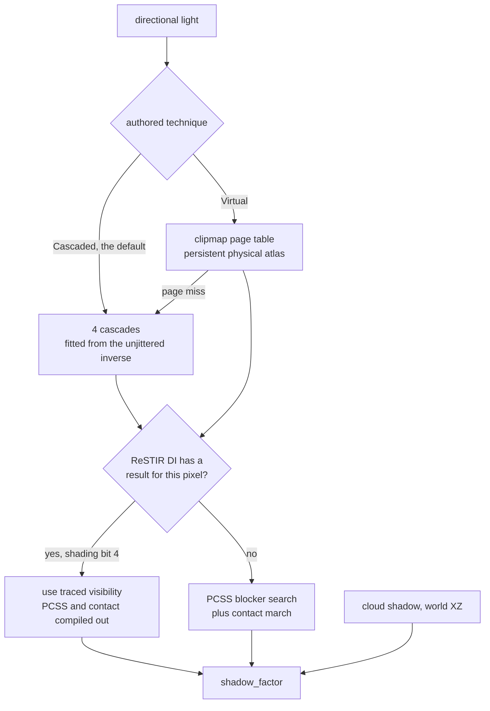
```mermaid
flowchart TB
    LIGHT["directional light"] --> TECH{"authored technique"}
    TECH -->|"Cascaded, the default"| CSM["4 cascades<br/>fitted from the unjittered inverse"]
    TECH -->|"Virtual"| VSM["clipmap page table<br/>persistent physical atlas"]
    VSM -->|"page miss"| CSM
    CSM --> FILTER{"ReSTIR DI has a<br/>result for this pixel?"}
    VSM --> FILTER
    FILTER -->|"yes, shading bit 4"| TRACED["use traced visibility<br/>PCSS and contact compiled out"]
    FILTER -->|"no"| PCSS["PCSS blocker search<br/>plus contact march"]
    TRACED --> OUT["shadow_factor"]
    PCSS --> OUT
    CLOUD["cloud shadow, world XZ"] --> OUT
```

Cloud shadows fold into the same `shadow_factor`, so terrain, water and meshes
read one value rather than three sources that can disagree.

The conventional CSM atlas is persistent and cached per quadrant (DOOM-D).
`CascadeShadowCache` is a pure policy module: it resolves the matrices first,
the caster cull hashes the filtered contents touching each resolved cascade,
and `ShadowPass` receives one dirty mask. Camera motion is quantised in shadow
texels, sun motion has distance-scaled angular tolerances, and caster command
changes invalidate affected volumes. In-place geometry/material edits cannot be
identified from an unchanged command, so they conservatively invalidate all
four. Simultaneous distant view updates are interleaved. A clean quadrant is
never cleared or drawn. This
ordering is a correctness rule: culling, depth raster, and shading must all use
the same resolved matrix, including while a distant update is deferred.
`SOMNIUM_SHADOW_CACHE=0` restores four redraws per frame, and the profiler plus
`.somtime` publish `shadow_cascades_rendered`. The matched static gate measured
0/4 cascades at 0.0028 ms versus 4/4 at 0.9633 ms; the detailed contract and
evidence are in [DOOM-D](<dev records/phase DOOM/DOOM-D.md>).


### Materials, terrain, and water

In tree:

- glTF PBR materials, native `.sommat` assets, material previews, and derived
  renderer slots.
- A 32-layer terrain material with strongest-four local blending.
- Triplanar cliffs, hex tiling, parallax occlusion, height blending, macro
  variation, and photographed material packs.
- Nested terrain material clipmaps.
- Terrain virtual texturing that streams paired BC7 source pages into a fixed
  64 MiB atlas.
- Heightmap terrain with chunk LOD, stitching, sculpting, texture painting, and
  foliage painting.
- Finite water bodies backed by mask, depth, shoreline SDF, and a shared CPU/GPU
  surface query.
- The authored water datum follows the shoreline bake, and depth/contact fading
  suppresses the visible seam where water meets terrain.
- Three-cascade inverse-FFT ocean displacement, Jacobian whitecaps, temporal
  foam, Beer transport, ray-traced reflection, refraction, and underwater
  composition.

Water is four passes and a query, not one shader. The prepass writes the
surface G-buffer the later passes read; reflection blends three sources by
confidence; the shade pass composites; underwater runs only when the camera is
below the surface.

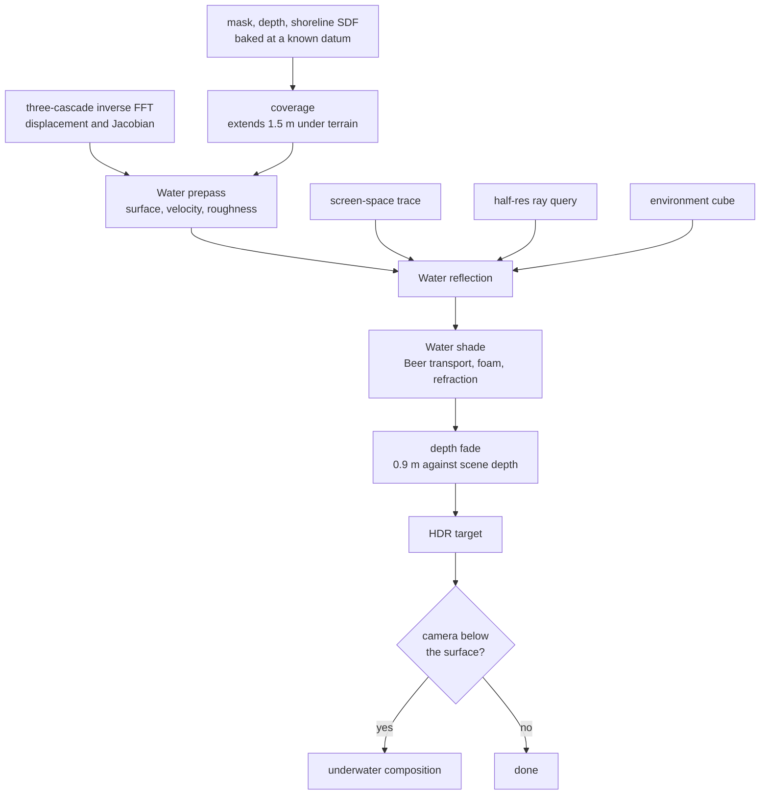
```mermaid
flowchart TB
    MASK["mask, depth, shoreline SDF<br/>baked at a known datum"] --> COV["coverage<br/>extends 1.5 m under terrain"]
    SPEC["three-cascade inverse FFT<br/>displacement and Jacobian"] --> PRE
    COV --> PRE["Water prepass<br/>surface, velocity, roughness"]
    PRE --> REFL["Water reflection"]
    SSR["screen-space trace"] --> REFL
    RT["half-res ray query"] --> REFL
    ENV["environment cube"] --> REFL
    REFL --> SHADE["Water shade<br/>Beer transport, foam, refraction"]
    SHADE --> SOFT["depth fade<br/>0.9 m against scene depth"]
    SOFT --> HDR["HDR target"]
    HDR --> UW{"camera below<br/>the surface?"}
    UW -->|"yes"| UNDER["underwater composition"]
    UW -->|"no"| DONE["done"]
```

SSR owns the near field where it is confident, the traced ray fills the rest,
and the cube is the miss. That ordering is why turning ray tracing off degrades
rather than breaks.

Terrain is worth its own picture, because it is effectively the whole shading
pass. One pixel of ground walks all of this:

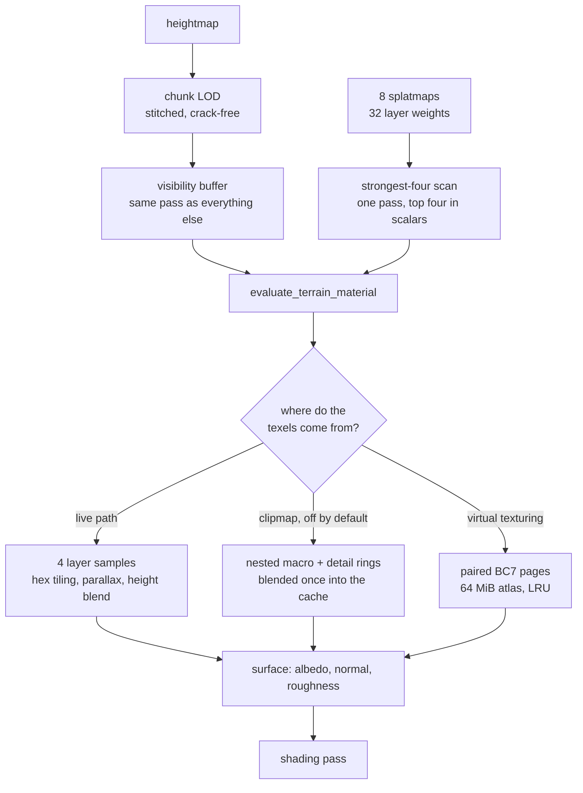
```mermaid
flowchart TB
    HM["heightmap"] --> CHUNK["chunk LOD<br/>stitched, crack-free"]
    CHUNK --> VIS["visibility buffer<br/>same pass as everything else"]
    VIS --> EVAL["evaluate_terrain_material"]
    SPLAT["8 splatmaps<br/>32 layer weights"] --> SCAN["strongest-four scan<br/>one pass, top four in scalars"]
    SCAN --> EVAL
    EVAL --> SRC{"where do the<br/>texels come from?"}
    SRC -->|"live path"| LAYERS["4 layer samples<br/>hex tiling, parallax, height blend"]
    SRC -->|"clipmap, off by default"| CLIP["nested macro + detail rings<br/>blended once into the cache"]
    SRC -->|"virtual texturing"| VT["paired BC7 pages<br/>64 MiB atlas, LRU"]
    LAYERS --> OUT["surface: albedo, normal, roughness"]
    CLIP --> OUT
    VT --> OUT
    OUT --> SHADE["shading pass"]
```

Phase 25A is why the visibility buffer is in that chain at all. Terrain used to
shade in its own pass afterwards, which meant it missed GTAO, contact shadows and
traced visibility, and every lighting change had to be written twice.

Foliage is a rejection funnel. Almost every candidate is thrown away, and the
useful trick is throwing them away as early and as cheaply as possible.

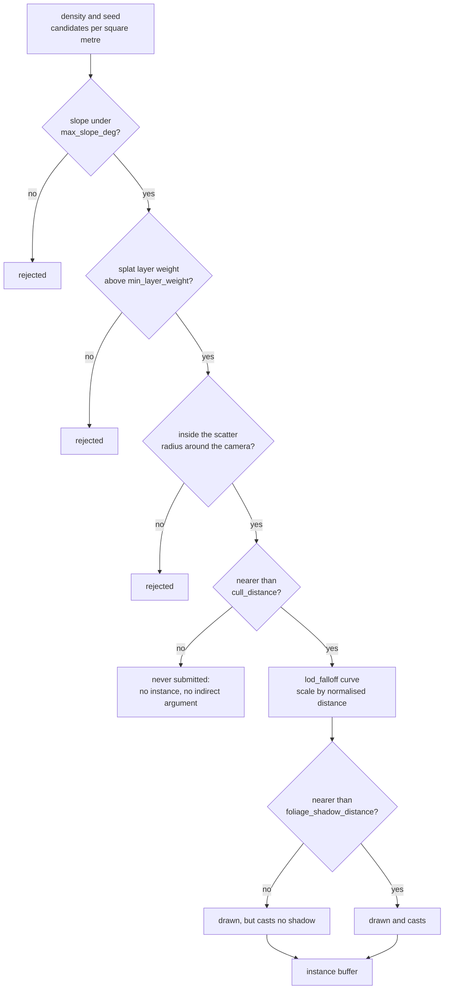
```mermaid
flowchart TB
    SEED["density and seed<br/>candidates per square metre"] --> SLOPE{"slope under<br/>max_slope_deg?"}
    SLOPE -->|no| DROP1["rejected"]
    SLOPE -->|yes| LAYER{"splat layer weight<br/>above min_layer_weight?"}
    LAYER -->|no| DROP2["rejected"]
    LAYER -->|yes| DISC{"inside the scatter<br/>radius around the camera?"}
    DISC -->|no| DROP3["rejected"]
    DISC -->|yes| CULL{"nearer than<br/>cull_distance?"}
    CULL -->|no| DROP4["never submitted:<br/>no instance, no indirect argument"]
    CULL -->|yes| FALLOFF["lod_falloff curve<br/>scale by normalised distance"]
    FALLOFF --> SHADOW{"nearer than<br/>foliage_shadow_distance?"}
    SHADOW -->|no| NOCAST["drawn, but casts no shadow"]
    SHADOW -->|yes| CAST["drawn and casts"]
    NOCAST --> INST["instance buffer"]
    CAST --> INST
```

Three of those cuts exist because the profiler asked for them. The distance cull
is on the CPU because the GPU cull cannot reject a draw that has to exist before
it can be rejected, and a tuft a few centimetres across is sub-pixel at a hundred
metres. The shadow cut is deliberately *nearer* than the draw cut: a grass field
fills the frame long before it reaches draw distance, and every tuft was costing
four cascades of depth for a shadow that reads as noise a few metres out. The
`lod_falloff` curve exists to shrink cover out rather than pop it, which is what
makes a hard distance edge tolerable.

Current conservative defaults matter:

- Terrain hex tiling and parallax are off on the shipped maps.
- The older DF material clipmap path remains off pending its audit and a formal
  default decision, even though PORTAL-0 measured a large gain.
- Dynamic resolution, tile-binned shading, and the aerial terrain split are
  opt-in. The last two measured slower in their original tests.
- Weighted OIT is off unless authored.

The night sky's stars are procedural, and sized in pixels rather than in
radians. That took two goes to get right. The original used a fixed angular
radius of about a seventh of a pixel at a normal field of view, so every star
was smaller than the pixel it landed in, the smoothstep meant to soften it had
no sub-pixel room to work in, and what reached the screen was a grid of
hard-edged fully-lit pixels: blocky squares. The first fix over-corrected. A
core wider than a pixel plus a ten-percent *exponential* skirt has a fat tail,
and the skirt stayed visible six or seven pixels out, so the sky filled with
soft glowing blobs instead. Both terms are Gaussian now, so the halo falls off
as fast as the core does. The core is a multiple of `fwidth(dir)` and
sub-pixel at the faint end, brighter stars are drawn slightly larger, and the
density is roughly a sixth of where this started.

Wicked, Flax and Godot all render a night sky from a star-map texture rather
than from a hash. A 4K panorama is the higher-fidelity answer and is still
available. The procedural field is what works with no asset in the project, and
both of its failures were profile bugs rather than anything inherent to the
approach.

### Post processing and anti-aliasing

The HDR chain includes AgX/ACES tone mapping, bloom, depth of field, motion
blur, GTAO, volumetrics, shafts, decals, sharpening, and reconstruction paths.

`AntiAliasing` is one authored enum:

- Off
- FXAA
- SMAA 1x
- SMAA T2x
- TAA
- FSR 3

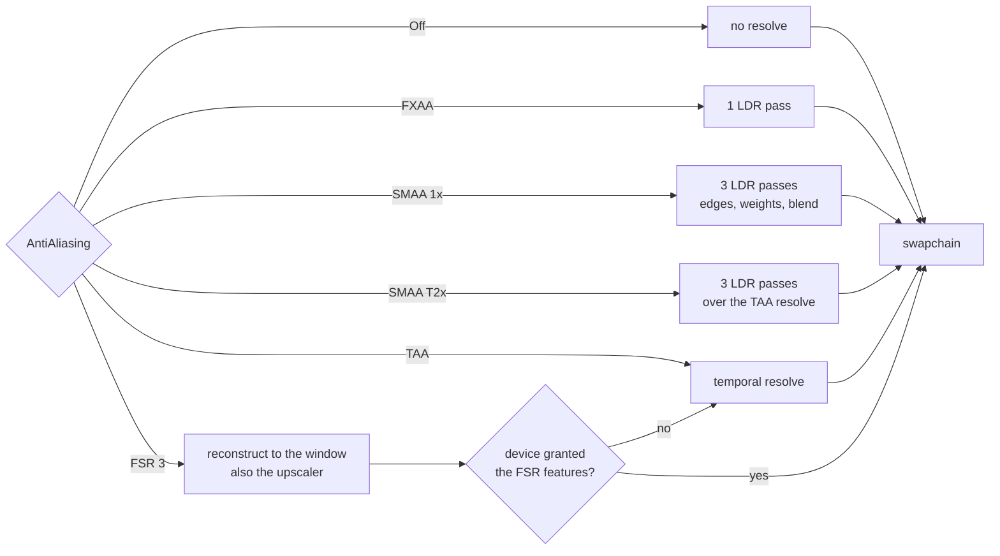
```mermaid
flowchart LR
    AA{"AntiAliasing"} -->|Off| NONE["no resolve"]
    AA -->|FXAA| FX["1 LDR pass"]
    AA -->|"SMAA 1x"| S1["3 LDR passes<br/>edges, weights, blend"]
    AA -->|"SMAA T2x"| S2["3 LDR passes<br/>over the TAA resolve"]
    AA -->|TAA| TA["temporal resolve"]
    AA -->|"FSR 3"| FSR["reconstruct to the window<br/>also the upscaler"]

    FSR --> CHECK{"device granted<br/>the FSR features?"}
    CHECK -->|no| TA
    CHECK -->|yes| OUT["swapchain"]
    NONE --> OUT
    FX --> OUT
    S1 --> OUT
    S2 --> OUT
    TA --> OUT
```

The one piece of precedence that survives is the decline: FSR is the authored
default, and a device without the features falls back to TAA rather than
silently producing nothing. Everything else follows from there being a single
value.

This replaced three booleans that could display an enabled mode while no pass
ran. SMAA S2x and 4x remain refused because the visibility buffer has no MSAA
subsamples to resolve. The current analytic SMAA path does not vendor the
reference area/search textures, so it does not claim the reference diagonal and
corner behavior.

## UI and editor

Somnium has one retained native UI drawn by `wgpu`. The editor shell and game
canvases use the same paint system while keeping separate ownership and input
routing.

### Paint and layout

In tree:

- Rectangles, paths, strokes, masks, affine transforms, gradients, images, and
  nine-slice drawing.
- Canvas roots, anchors, safe areas, render-to-texture world UI, and shaped hit
  testing.
- Rich text runs, IME composition, directional navigation, gamepad focus, and
  motion/spring primitives.
- AccessKit-backed semantic trees, focus announcements, reduced motion, and
  high-contrast settings.
- Nocturne Atelier tokens, component recipes, bundled typography roles, and one
  icon family.

Text shaping with `cosmic-text`, bidi, and broad fallback is still open. The
current text path should not be described as full international shaping.

The same widget system serves two trees with different owners. Layout is two
passes and paint is a third, and all three walk the tree every frame.

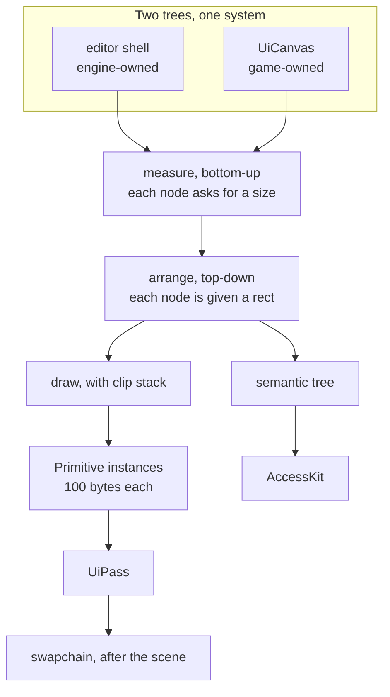
```mermaid
flowchart TB
    subgraph Trees["Two trees, one system"]
        SHELL["editor shell<br/>engine-owned"]
        CANVAS["UiCanvas<br/>game-owned"]
    end
    SHELL --> MEASURE
    CANVAS --> MEASURE
    MEASURE["measure, bottom-up<br/>each node asks for a size"] --> ARRANGE["arrange, top-down<br/>each node is given a rect"]
    ARRANGE --> DRAW["draw, with clip stack"]
    DRAW --> PRIM["Primitive instances<br/>100 bytes each"]
    PRIM --> UIPASS["UiPass"]
    ARRANGE --> A11Y["semantic tree"]
    A11Y --> ACC["AccessKit"]
    UIPASS --> SURFACE["swapchain, after the scene"]
```

Measure results are cached and only invalidated upward, which is why
`invalidate_ancestors` has to walk to the root rather than to the parent. The
accessibility tree comes off the same arrange, so a control cannot be visible and
unreachable, or reachable and mispositioned.

### Authoring surfaces

In tree:

- Outliner, schema-generated Details, Content Drawer, Output Log, job panel,
  preferences, statistics, and help.
- One command registry feeding menus, toolbar, shortcuts, palette, context
  actions, tooltips, and the F1 index.
- Asset database, cancellable previews, material authoring, and semantic drag
  and drop.
- Multi-selection, clipboard, hide/lock, filters, snapping, multi-entity
  transforms, camera presets, bookmarks, and view modes.
- Curve and gradient values with native editors and undo.
- Node graph and timeline substrates with material and animation catalogues.
- Play, pause, and stop transport at the shell level.
- Scene open/save routing, unknown-data retention, autosave, and recovery.

Still open:

- Arbitrary docking, floating windows, and multiple viewports.
- Virtualized large data tables and the localisation editor.
- GUI layout authoring.
- Full play-in-editor isolation and restore.
- The remaining project picker and selected Phase 27 first-impression work.
- A final human keyboard, colour-vision, and interaction sign-off for the older
  26-Zeta/27 plans.

## Assets and world streaming

### Source and cook

The asset crate isolates third-party formats from the renderer. `LoadedScene`
contains Somnium-native meshes, materials, textures, nodes, and animation data.

The deterministic cook provides:

- Versioned cooked artifacts with bounded decoding.
- Content, recipe, payload, and dependency hashes.
- Reverse dependency invalidation.
- Atomic cooked manifests.
- A standalone `assetcook` CLI.
- HLOD merge data and deterministic impostor atlas baking.

The cook does not yet produce a standalone game release, package archive,
patch, installer, or mod layer. Those belong to the planned STALKER phase.

### Asset lifecycle

Source assets and cooked assets are different namespaces connected by a
deterministic recipe. Runtime callers retain identity while residency changes.


```mermaid
flowchart LR
    SOURCE["source file"] --> IMPORT["format importer"]
    IMPORT --> NATIVE["Somnium-native asset"]
    NATIVE --> RECIPE["content + recipe + dependency hashes"]
    RECIPE --> CACHE{"cook cache hit?"}
    CACHE -->|"no"| COOK["bounded cooked payload"]
    CACHE -->|"yes"| MANIFEST["atomic manifest"]
    COOK --> MANIFEST

    ID["AssetId in scene or UI"] --> RESOLVE["resolver"]
    MANIFEST --> RESOLVE
    RESOLVE --> JOB["somnium_jobs I/O and decode"]
    JOB --> UPLOAD["budgeted main-thread upload"]
    UPLOAD --> HANDLE["stable handle publishes resident data"]
    HANDLE --> EVICT["deterministic LRU eviction"]
    EVICT --> RESOLVE
    SOURCE -->|"hot reload invalidates reverse closure"| RECIPE
```

The placeholder is part of the API, not an error path. A renderer or editor
consumer must remain valid while an asset is pending, missing, failed, or
evicted.

### Residency and partition

Residency returns stable handles and typed placeholders immediately. Resolver
I/O runs through the job system. Upload and completion work is budgeted, publish
is atomic, and eviction uses deterministic LRU policy.

World partition provides:

- Double-precision cell hashing and authored streaming interest sources.
- Cell-owned entity persistence on unload.
- Transactional load and unload.
- HLOD and impostors.
- A floating origin represented as exact integer cells plus local floats.

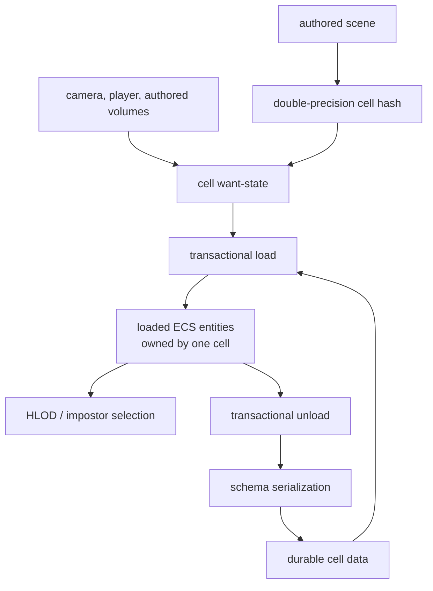
```mermaid
flowchart TB
    SCENE["authored scene"] --> HASH["double-precision cell hash"]
    INTEREST["camera, player, authored volumes"] --> WANT["cell want-state"]
    HASH --> WANT
    WANT --> LOAD["transactional load"]
    LOAD --> OWNED["loaded ECS entities<br/>owned by one cell"]
    OWNED --> HLOD["HLOD / impostor selection"]
    OWNED --> UNLOAD["transactional unload"]
    UNLOAD --> SERIAL["schema serialization"]
    SERIAL --> CELL["durable cell data"]
    CELL --> LOAD
```

The floating origin changes the local coordinate frame, not world identity.
Cell coordinates remain exact while render and physics work near a local
floating-point origin.

The asset database and cook reserve a prefab kind, but prefab authoring and
instancing are not implemented. General splines, rule-driven scattering, and
abstract living-world simulation are also absent.

## Scripting, animation, and simulation

### Scripting

`somnium_script` is language-neutral. `somnium_script_luau` is the only crate
that knows about Luau.

The frame contract is:

```text
engine state -> ScriptSnapshot -> ScriptBackend -> ordered CommandBuffer
                                                -> validate and apply
```

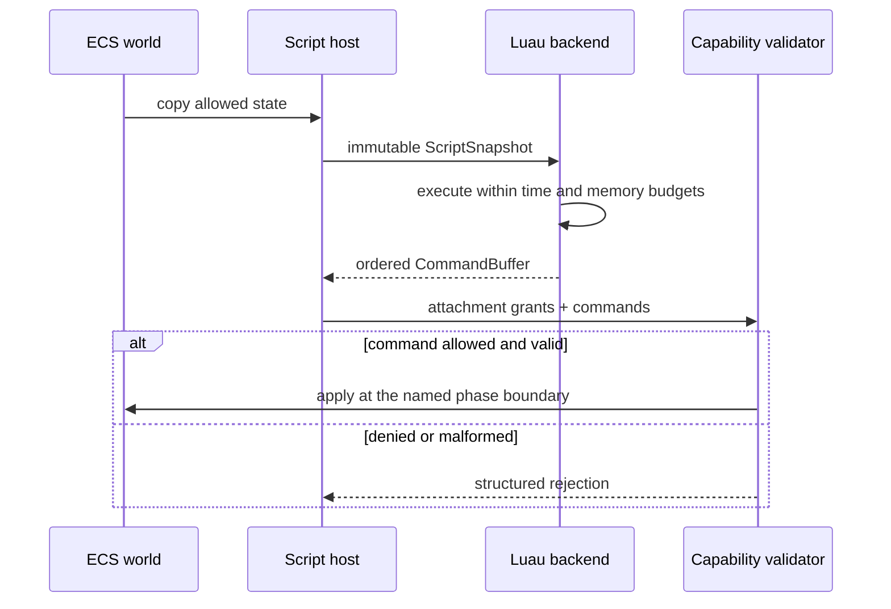
```mermaid
sequenceDiagram
    participant World as ECS world
    participant Host as Script host
    participant VM as Luau backend
    participant Gate as Capability validator

    World->>Host: copy allowed state
    Host->>VM: immutable ScriptSnapshot
    VM->>VM: execute within time and memory budgets
    VM-->>Host: ordered CommandBuffer
    Host->>Gate: attachment grants + commands
    alt command allowed and valid
        Gate->>World: apply at the named phase boundary
    else denied or malformed
        Gate-->>Host: structured rejection
    end
```

The Luau backend:

- Opens an explicit safe library set.
- Gives each attachment its own environment.
- Freezes shared globals after API registration.
- Enforces time and memory budgets.
- Loads only bytecode compiled by the embedded compiler.
- Uses capabilities to deny engine commands outside an attachment's grant.

Native gameplay plugins and direct script access to ECS storage are not part of
the engine.

### Animation

In tree:

- Skeleton import with parent-before-child ordering.
- Local, model, and skinning pose conversion.
- Four-weight GPU skinning.
- Clips, typed parameters, triggers, 1D and 2D blends, masked layers, sync
  tracks, transitions, state machines, and a bounded pose cache.

Open:

- Root motion.
- IK and animation events.
- Clip compression.
- Pose task graph work.

The renderer never evaluates an animation graph. It receives matrices.

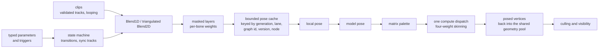
```mermaid
flowchart LR
    CLIP["clips<br/>validated tracks, looping"] --> BLEND
    PARAM["typed parameters<br/>and triggers"] --> MACHINE
    BLEND["Blend1D / triangulated Blend2D"] --> LAYERS["masked layers<br/>per-bone weights"]
    MACHINE["state machine<br/>transitions, sync tracks"] --> BLEND
    LAYERS --> CACHE["bounded pose cache<br/>keyed by generation, lane,<br/>graph id, version, node"]
    CACHE --> POSE["local pose"]
    POSE --> MODEL["model pose"]
    MODEL --> PALETTE["matrix palette"]
    PALETTE --> SKIN["one compute dispatch<br/>four-weight skinning"]
    SKIN --> POOL["posed vertices<br/>back into the shared geometry pool"]
    POOL --> CULL["culling and visibility"]
```

Skinning writes into the same geometry pool everything else lives in, before
culling, which is what keeps the renderer's seam unchanged: it draws posed
vertices the same way it draws static ones. Graph and machine versions reject
stale live instances rather than indexing a replacement definition.

### Physics and characters

Jolt is wrapped by safe body, shape, contact, layer, and world modules. The raw
C++ boundary stays in `somnium_physics_sys`.

The order inside one fixed step is the whole design, and it is ordered so a
script always reads what happened and writes the last word before integration.

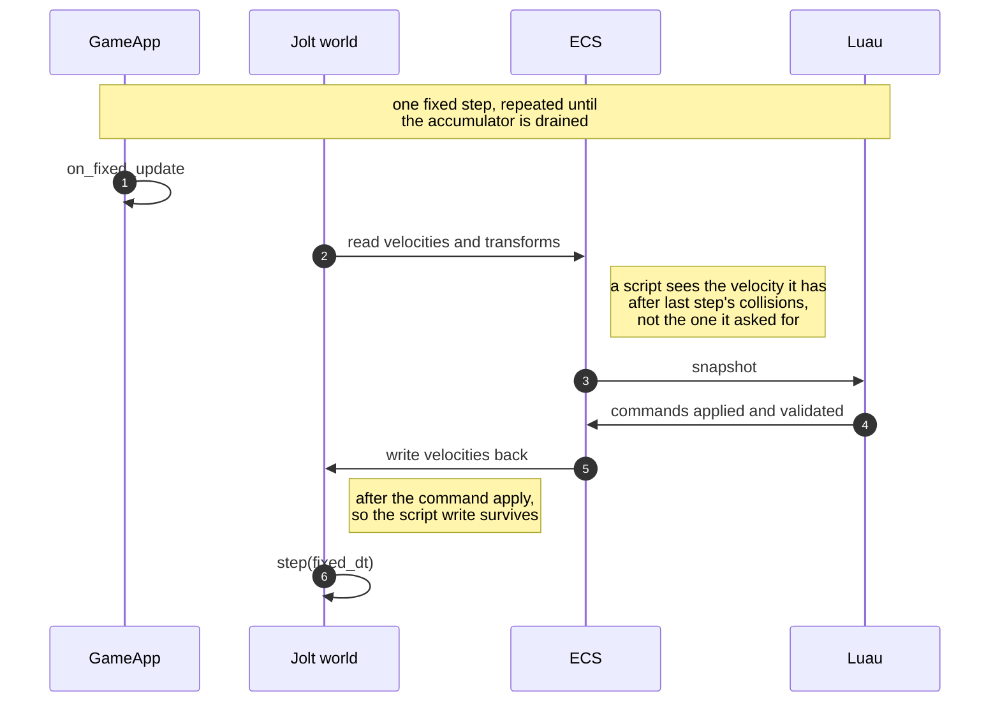
```mermaid
sequenceDiagram
    autonumber
    participant Game as GameApp
    participant Jolt as Jolt world
    participant World as ECS
    participant Script as Luau

    Note over Game,Script: one fixed step, repeated until<br/>the accumulator is drained
    Game->>Game: on_fixed_update
    Jolt->>World: read velocities and transforms
    Note right of World: a script sees the velocity it has<br/>after last step's collisions,<br/>not the one it asked for
    World->>Script: snapshot
    Script->>World: commands applied and validated
    World->>Jolt: write velocities back
    Note right of Jolt: after the command apply,<br/>so the script write survives
    Jolt->>Jolt: step(fixed_dt)
```

`RigidBodyComponent::velocity` is readable and writable because a walking
character sets velocity outright, which is what makes it stop dead on key
release. The Jolt body index is readable and **not** writable: a script that
could set it would be able to point one entity's controls at another's body, and
an index saved from the last run names a different body in this one.

The examples include a scripted first-person character. Its grounded state is
a documented heuristic, not a general character-controller guarantee — but it
is a heuristic about the right quantity. `grounded` asks whether a step's
gravity was **cancelled**, not whether vertical speed is near zero: a contact
cancels gravity whatever the body's speed along the surface, while a falling
body loses `g * dt` every step. The comparison is against the velocity handed
to Jolt rather than the one read back, so a scripted jump is not mistaken for
free fall, and support may lapse for four steps before the flag drops, which
bridges the gaps a capsule crosses walking over heightfield triangle edges.

The earlier test was `velocity.y.abs() < 0.35`, which is only true of a body
standing on *flat* ground. A character walking a five-degree rise at 4.5 m/s
has a vertical speed of 0.39, so every character on every hill read as
airborne: no jump, and no footsteps. Nothing on flat ground could see it, which
is why `crates/somnium_core/tests/first_person.rs` now runs its walk on a
tilted floor as well as a level one. A real shape cast is still the honest
answer and still a `somnium_physics` job; the field's meaning does not change
when that lands.

Navigation meshes, pathfinding, behavior trees, and perception are not in the
tree.

## Input, audio, and localisation

### Input

The input stack separates hardware controls from game actions:

```mermaid
flowchart LR
    DEV["keyboard, mouse, gamepad<br/>hot-plug aware"] --> PATH["ControlPath<br/>names a physical control"]
    PATH --> PROC["Processor<br/>dead zone, invert, scale"]
    PROC --> INT["Interaction<br/>tap, hold, multi-tap"]
    INT --> VAL["ActionValue"]
    COMP["composite binding<br/>WASD as one 2D axis"] --> VAL
    PATH --> COMP
    MAP["action map<br/>per context"] --> VAL
    VAL --> GAME["game or editor"]
    REBIND["runtime rebinding"] -.->|"conflict reported,<br/>not silently accepted"| MAP
```

It supports keyboard and gamepad controls, radial dead zones, inversion,
scaling, tap/hold/multi-tap interactions, action maps, conflict reporting, and
runtime rebinding.

Scripts consume the same named actions as games and editor systems. Their input
snapshot exposes `actionDown`, `actionPressed`, `axis`, and `vector2`; physical
keys, mouse buttons, and device-specific names do not cross the language-neutral
script boundary. Press edges are retained until a fixed step consumes them, so a
short input is not lost when the render loop runs faster than simulation. The
shipped first-person controller and camera use `Move`, `Look`, `Jump`, and
`Sprint`, and therefore follow rebinding and action-map changes without script
edits.

### Audio

The Kira-backed audio crate supports sounds, listeners, buses, authored
attenuation curves, cones, occlusion, Doppler, and editor/game integration.
Audio is no longer the 93-line placeholder described by the original MORROWIND
audit.

An **Audio Emitter** is serialized ECS authoring: asset identity, playback
settings, bus, spatial policy, attenuation, cone, occlusion factor, and Doppler
scale. A **live voice** is the transient Kira resource created from that intent
during Play. The runtime reconciles the two instead of saving backend handles;
Pause suspends live voices, Stop releases them, and duplication, deletion,
hierarchy transforms, and property edits remain ordinary ECS operations. The
schema-generated Details panel, `Create Audio Emitter` command, audio-only asset
picker, and cyan range/cone gizmos all consume the same authored component. The
picker is a searchable dropdown over the asset database filtered by the field's
`asset_kind_mask`, and that same mask makes the row a drop target: dragging a
clip out of the Content Drawer onto it assigns the field in one undo step, and
dragging a texture onto it is refused with a reason.

```mermaid
flowchart TB
    AUTHOR["Audio Emitter<br/>serialized ECS intent"] --> RECON["runtime reconciliation<br/>Play, Pause, Stop"]
    SCRIPT["ctx:playAudio<br/>ordered one-shot command"] --> REQ["play, play_on, play_spatial"]
    RECON --> REQ
    REQ --> CACHE["sound cache<br/>decoded once, hits and misses counted"]
    CACHE --> BUS["mixer bus<br/>volume, mute, solo"]
    BUS --> SPATIAL{"spatial?"}
    SPATIAL -->|no| SET
    SPATIAL -->|yes| EVAL["evaluate against the listener"]

    DIST["distance attenuation<br/>linear or inverse-square"] --> EVAL
    CONE["cone<br/>inner, outer, off-axis gain"] --> EVAL
    OCC["occlusion<br/>supplied by the caller"] --> EVAL
    VEL["relative velocity"] --> EVAL

    EVAL --> AUD{"audible?"}
    AUD -->|"past max range"| NONE["Ok(None), nothing scheduled"]
    AUD -->|yes| SET["gain, pan, playback rate"]
    SET --> VOICE["live voice<br/>gain, pan, rate updated in place"]
    VOICE --> KIRA["Kira"]
```

**Occlusion is an input, not something this crate computes.** It would need a
raycast, and the audio crate deliberately does not depend on the physics one:
a sound system that cannot be tested without a physics world is a sound system
nobody tests. The caller does the trace and passes a number.

The Coastal and Island acceptance maps ship overlapping spatial surf and splash
emitters, while the first-person controller drives four distance-based footstep
one-shots through `ctx:playAudio`. Their cadence is a property of the character,
not of the audio crate: the first shipped version accumulated distance only
while `grounded`, and reset it otherwise, so the old vertical-speed heuristic
starved it on any hill — footsteps arrived seconds late or not at all. It now
also fires the first footfall on the step you start walking rather than a full
stride later, because audio that trails the key by a fifth of a second reads as
broken rather than as latency. `playAudio` with no audio backend now says so
instead of returning silence. All seven CC0 fixtures are decoded by the
workspace tests; their sources, licences, and hashes are recorded in
[`ATTRIBUTION.md`](ATTRIBUTION.md). On 2026-08-30 the complete serial workspace
test run passed with zero failures. This proves decoding, reconciliation, input,
script, scene-schema, editor, and example integration; whether a particular
output device is audible remains an interactive acceptance check.

### Splines

`SplineComponent` is an authored path: control points in entity-local space and
a `closed` flag. The curve through them is uniform Catmull-Rom, which
*interpolates* its control points. The curve passes exactly through what the
author placed, and it needs no tangent handles, which is why it is the usual
choice for level-editor paths.

Queries run against a sampled polyline rather than the analytic curve. Solving
for the nearest point on the real curve means a numerical pass per segment per
query; sampling is a few hundred dot products against the same polyline the
viewport draws. What an author sees is therefore what the engine uses, and the
error is bounded by a sampling rate they can read.

The spline knows nothing about audio. It is its own component because a road, a
river, a fence line and a camera rail are the same primitive, and each would
otherwise have arrived carrying its own point list, its own serialization and
its own editor handles.

Control points are edited in Details like any other field, through the
collection editor described under *Why things are the way they are*: a numeric
strip per point, duplicate and remove beside each, an append at the foot.

An audio emitter on a spline is an ordinary Audio Emitter whose entity also
carries one. There is no second component and no second code path. The audio
runtime asks where a sound is; a spline answers "at your nearest point" and
everything else answers "at my origin". That one difference is what lets a
single emitter cover a whole shoreline. Walk the beach and the surf stays
beside you; walk inland and it fades with distance from the water rather than
from a marker somewhere out at sea. `Create → Shoreline Audio` makes both at
once.

### Localisation

The localisation crate supports string tables, CLDR plural and gender rules,
number data, key extraction, runtime locale switching, and fallback chains such
as `pt-BR -> pt -> default -> key`.

Video playback remains open.

## Tooling and evidence

### GHOSTFENCE

`python tools/ghostfence/run.py` is the repository gate. Its rows cover:

- Census freshness.
- Frozen toolchain.
- Shader variant budget.
- One job system.
- No duplicate singleton systems.
- Golden images.
- Workspace tests.

The fast run on 2026-08-29 reported:

| Row | Result |
|---|---|
| Census | Pass |
| Toolchain | Pass |
| Shader budget | Pass |
| One job system | Pass |
| No second system | Pass |
| Golden images | Fail: `sculpt-panel` |
| Tests | Skipped by `--fast` |

Do not report the gate as green until the golden mismatch is understood and a
full test run passes.

### Timing and captures

`.somtime` is the timing evidence format. A useful comparison has:

- The same scene and pinned camera.
- The same warm-up and sample count.
- The same display and resolution conditions.
- Mean, spread, minimum, maximum, and sample count.
- The feature state recorded in the capture.
- A control run when image differences are close to ordinary run variance.

Images used as evidence are captured after tone mapping. HDR buffers are not
valid display PNG evidence.

PORTAL-0 corrected an important naming error: `Frame wall` is a vsync-inclusive
frame interval, not CPU work. CPU work is reported separately.

### Evidence chain

```mermaid
flowchart LR
    CHANGE["code or authored default"] --> BUILD["build and focused tests"]
    BUILD --> GATE["GHOSTFENCE"]
    GATE --> CAPTURE["pinned visual capture"]
    GATE --> TIMING["matched .somtime runs"]
    CAPTURE --> RECORD["phase record"]
    TIMING --> RECORD
    RECORD --> CLAIM["status or performance claim"]
    NEG["negative or noisy result"] --> RECORD
```

The record is allowed to say that a change had no measurable effect, regressed,
or could not be judged. It is not allowed to convert those outcomes into a pass.

### Current structural measurements

The generated MORROWIND census reports:

| Area | Lines | Share | Tests |
|---|---:|---:|---:|
| `somnium_renderer` | 61,599 | 32.6% | 416 |
| `somnium_ui` | 57,411 | 30.4% | 583 |
| `somnium_core` | 32,089 | 17.0% | 361 |
| Remaining 13 crates | 37,633 | 20.0% | 504 |
| Total | 188,732 | 100% | 1,864 |

The top three crates hold 80.1% of the Rust/WGSL lines. Changes that put more
policy into those crates need an explicit locality argument.

The renderer has 55 WGSL modules and 55 possible variants under the current
budget. The workspace census reports no unreferenced third-party dependency.

## Phase ledger

This ledger records outcomes, not every task. Use the linked phase file for the
full plan and evidence.

Phases are not a straight line. Several exist because an earlier one could not
finish without them, and reading the graph explains more than reading the dates.

```mermaid
flowchart TB
    subgraph Capability["Capability phases"]
        IV["IV<br/>landscape and water"]
        XV["XV<br/>32-layer terrain"]
        VV["VV Halcyon<br/>traced water"]
        P16["16<br/>scripting"]
    end

    subgraph Enabling["Phases that exist to unblock others"]
        DOOM["DOOM<br/>the clock"]
        CONTROL["CONTROL<br/>the editor seams"]
        PORTAL0["PORTAL-0<br/>health and honesty"]
    end

    subgraph Reach["MORROWIND tracks"]
        T0["BALMORA<br/>jobs, shaders"]
        T1["VIVEC<br/>runtime UI"]
        T4["SILT STRIDER<br/>cook, streaming"]
        T5["DWEMER<br/>animation"]
        T7["RED MOUNTAIN<br/>rendering gaps"]
    end

    XV --> DF["DF<br/>terrain clipmaps"]
    IV --> VV
    DF --> DOOM
    VV --> DOOM
    DOOM -->|"you cannot optimise<br/>what you cannot measure"| PORTAL0
    DOOM --> T7
    P26["26 / 26-Zeta / 27<br/>editor IA and paint"] --> CONTROL
    CONTROL -->|"curves, schema,<br/>command registry"| T1
    CONTROL --> T4
    CONTROL --> T5
    CONTROL --> T7
    T0 --> T1
    T0 --> T7
    P16 --> T5
    PORTAL0 --> T7
```

Two edges are worth stating outright. **DOOM had to come before any performance
work**, because every prior attempt to tune the frame turned into a session of
flipping switches and reading fps off the window. And **CONTROL had to come
before most of MORROWIND**, because six of its eight tracks consume the property
schema, the command registry or the curve editor that CONTROL shipped.

### Foundation and world phases

| Phase | Outcome | Status |
|---|---|---|
| 1 through 15 | Lifecycle, visibility buffer, ECS, PBR, shadows, clustered lights, glTF, voxels, terrain, GPU-driven rendering | In tree |
| 16 | Language-neutral scripting plus sandboxed Luau | Complete |
| 24 / 25 | Advanced lighting, atmosphere, post processing, terrain materials, night, analytic gradients, foliage | Large parts in tree; old numbering and plan status are historical |
| IV | Great Lakes landscape, finite water, FFT ocean, shoreline and underwater work | Complete |
| XV | 32-layer terrain identity, biome/splat authoring, BC7 packs | A through J complete |
| VV | Ray-traced water reflection and refraction work | A through H plus VV+1 in tree; live miss-rate evidence remains open |
| CR | CPU/GPU frustum culling | In engine |
| DF | Terrain material clipmaps | In engine, default off; audit/default decision open |

### Editor and measurement phases

| Phase | Outcome | Status |
|---|---|---|
| 26 / 26-Zeta | Editor information architecture and Nocturne Atelier design system | Most work in tree; shaping, final interaction sign-off, and selected follow-ups open |
| 27 | Paint layer, motion, elevation, theme and first-impression work | A, B, C, E, most of D, F, and most of G in tree; H through J not started |
| DOOM | Profiler, `.somtime`, pixel census, dynamic resolution, shadow cache, draw submission, scheduler migration, hitch metric, allocation inventory | **Closed.** Five stages produced instruments, three produced changes that hold, three produced nulls kept as records; C/E/G remain default-off experiments, K and L were measured and deleted. §9's budgets are not closed against — see [DOOM-M](<dev records/phase DOOM/DOOM-M.md>) |
| CONTROL | Schema/editor reach, asset workflows, settings, scene lifecycle, curves, time, clouds, weather, decals | Complete, A through O |
| PORTAL-0 | Honest frame accounting, dead dependency cleanup, job gate, two measured CPU fixes | Complete, A through G |

### MORROWIND

MORROWIND is the active phase. Its original preamble says "nothing in tree";
that sentence is obsolete.

| Track | Shipped | Open |
|---|---|---|
| BALMORA | Census, GHOSTFENCE, wgpu 30, jobs, shader system | None |
| VIVEC | Runtime canvas, paint extensions, input/focus, rich text/IME, motion, accessibility | Full shaping/bidi/fallback remains open |
| CONSTRUCTION SET | Graph surface and timeline | Docking, virtualisation/data tables, GUI editor, play-in-editor |
| HLAALU | None | Prefabs, splines/blockout, rule-driven scattering |
| SILT STRIDER | Cook, residency, world partition, HLOD/impostors/floating origin | None |
| DWEMER | GPU skinning, clips, blend trees, state machines | Root motion, IK/events, compression, pose task graph |
| SIXTH HOUSE | None | Navmesh/pathfinding, behavior trees, perception |
| RED MOUNTAIN | VSM, DDGI, terrain VT, weighted OIT, SMAA and unified AA setting | GPU particles and VFX graph |
| ALMSIVI | Input actions, audio, localisation | Save games, video, playable slice |

Completed MORROWIND records currently in the tree are A, A2, B, C, D, E, E2,
E2b, F, G, H, I, K, L, Q, R, S, T, U, V, Z, AB, AC, AD, AE, AG, and AH.

MORROWIND-AC still owes a deterministic visual fixture. Its initial AA and OIT
image comparisons moved no more than their control runs, so the code is in tree
without a valid visual-effect claim.

## Planned work that has not started

### PORTAL

Status: plan only. No PORTAL sub-phase has started. PORTAL-0 is a separate,
completed focused phase and does not make the full PORTAL plan complete.

The plan covers engineering health: dependency direction, public API pressure,
unsafe review, configuration registration, complex-function reduction, test
harnesses, open-defect archaeology, and documentation retention.

The document predates completed CONTROL and most MORROWIND work. Rebase its
audit and sequencing against the current tree before implementing PORTAL-A.
Do not repeat cleanup already completed by PORTAL-0.

### KENSHI

Status: plan only. No KENSHI sub-phase has started.

KENSHI is the scale phase. It starts after MORROWIND is complete and measures
combined load instead of isolated features. Its planned outputs are:

- Deterministic fixed-step replay and seeded RNG policy.
- `.somtime` v2 with scale axes and curve-shape classification.
- CPU depth, memory, job-queue, and per-system profiler attribution.
- A scale rig and automated sweeps.
- A published `limits.md` naming the first failing subsystem per axis.
- Only the fixes indicted by those measurements.

The plan does not authorize speculative optimization. Its predicted audit rows
must be replaced with measurements when KENSHI-A begins.

### STALKER

Status: plan only. No STALKER sub-phase has started.

STALKER follows KENSHI and also depends on the relevant PORTAL and MORROWIND
gates. It now has 29 planned sub-phases, A through AC, across nine tracks:

| Track | Planned scope |
|---|---|
| CORDON | Standalone player, editor/player dependency firewall, headless host |
| ROSTOK | Build targets, rooted asset closure, deterministic packages, build UI/CLI |
| DEAD CITY | Layered content, patches, atomic update/rollback, save migration, crash envelope |
| WILD TERRITORY | Mod manifests, deterministic resolution, sandboxed data/Luau mods, safe mode |
| YANTAR | Cooked local irradiance/reflection environments and probe authoring |
| 100 RADS BAR | Sprite assets/editor, scene tools, typed authored actions, product UI |
| THE ZONE | Abstract/detailed simulation LOD, schedules, jobs, patrols |
| RED FOREST | Factions, inventory/trade, facts, dialogue, quests, anomalies/artifacts |
| PRIPYAT | Clean-machine Windows release, Linux headless proof, integrated release candidate |

Nu and X-Ray sources are pattern-only for this phase. Prowl is permissive, but
its reflection callbacks are not the chosen design. Somnium's plan uses typed
commands and the existing capability boundary.

STALKER is not current functionality. In particular, the tree has no standalone
player crate, package mount, updater, mod resolver, local environment probes,
sprite sub-assets, offline actor simulation, faction ledger, gameplay
inventory, trade, quest system, or anomaly framework.

### Roadmap order

```text
finish MORROWIND
    -> KENSHI scale and limits
    -> STALKER product and release

finish MORROWIND
    -> rebase and run the PORTAL plan
    -> satisfy the PORTAL gates required by STALKER
```

PORTAL and KENSHI may be scheduled independently after MORROWIND if their work
does not overlap. STALKER waits for both relevant outputs.

## Current open issues and debt

### Verified now

- GHOSTFENCE fails the `sculpt-panel` golden image. The candidate differs in
  1,792 of 33,600 pixels, or 5.3333%, against a 0.2% budget. The peak channel
  delta is 37 against a ceiling of 24.
- MORROWIND-AC's visual comparisons are inconclusive because control runs move
  as much as the feature runs. A deterministic AA/OIT fixture is still owed.
- The DF clipmap is in engine and measured well by PORTAL-0, but the documented
  default remains off until its audit and default-change process close.
- `context.md` and several old phase preambles had drifted. This rewrite makes
  the current ledger explicit, but those historical files still need care when
  used as plans.
- Dragging an asset out of the Content Drawer onto a Details asset field has a
  complete and tested semantic route, and has now been reported as doing
  nothing in the running editor three separate times. Every stage of the drag
  leaves a breadcrumb in the Output Log, so the next run names the link that
  breaks instead of costing another round of reading. Two routes that do not
  depend on a drag at all ship beside it: `Assign to Selection` in the drawer's
  context menu, and `Use Selected` on every asset row in Details. Unreal ships
  that second button for the same reason a drag has a dozen ways to not quite
  happen, and every one of them looks like a broken feature.
- A gizmo drag on a **child** entity now solves translation in world space and
  crosses one explicit inverse-parent seam before writing the local
  `Transform`. Group followers carry their own inverse because they need not
  share a parent. Singular parents refuse the gesture rather than writing
  `NaN`, and follower capture is atomic so a multi-selection never moves only
  its invertible members. `editor_gizmo` owns that transaction rather than the
  `Engine` host. Local axes are rotated consistently for drawing, picking and
  drag solving. This closes the rotated/non-uniformly-scaled-parent failure.
- **Three of the open editor gaps are one gap.** The terrain layer palette, the
  foliage kind picker and the brush alpha mask are all editor-private state —
  `TerrainToolField` and `FoliageBrushField` are enums in `editor_event.rs`,
  under a comment that says *"brush/runtime controls which deliberately remain
  outside component schemas"*. Because they are not reflected fields they have
  no `asset_kind_mask`, so Details cannot generate an asset picker for them and
  the Content Drawer has nothing to drop onto. Everything that *is* reflected
  gets both for free — `UiCanvasComponent::document` needed one line of schema
  to become a picker and a drop target at once (MORROWIND-M2).

  So the fix for all three is the same and it is a scene-format change rather
  than a UI one: move brush and tool settings into a reflected component. That
  also unblocks the left tool bar redesign below, which the plan is explicit
  should wait until the tools have options worth showing.
- Viewport ray picking no longer requires `MeshComponent`. One shared
  `entity_ray_hit_distance` path serves ordinary selection, the piercing menu,
  and placement: render meshes use their geometry AABB, decals use their
  projection box, and lights/audio/particle emitters expose a deliberately
  small authoring proxy rather than claiming their full effect radius. Their
  visible authoring shapes and pick proxies both use propagated world matrices,
  including when parented.
- The left tool bar is still a narrow mode strip rather than a coherent
  authoring workspace. Its terrain and foliage buttons expose no owned options,
  weakly communicate the active tool, and compete with the Content Drawer for
  horizontal hierarchy. Redesign it only after those tool options are backed by
  assets; otherwise a new shell would merely decorate the same missing model.

### Missing systems

- Prefab authoring/instancing and rule-driven scattering. Splines are now in
  tree (see below); roads, rivers and fences built on them are not.
- Terrain layers and foliage kinds are fixed built-in lists rather than assets,
  so the left toolbar's tools have nothing to offer beyond a mode. The tools
  now say when they cannot run; they still do not open their own options.
- Brush dab masks are procedural ([`BrushAlpha`]) rather than authored alpha
  textures. `BrushAlpha::mask` is a pure function of the pattern enum, so the
  runtime half is a new variant carrying sampled texels; the authoring half is
  blocked on the same reflected-component change as the terrain and foliage
  pickers above.
- Prefabs, and the GUI layout editor's item 5 that waits on them (MORROWIND-O,
  M2 item 5). MORROWIND-J is otherwise closed: the dock tree, real `winit` child
  windows and several views per frame all landed on 2026-08-31, and on the same
  day every major panel learned to float — Outliner, Details, viewport and
  Output Log, each from a button on its own header. A floated viewport is the
  primary view redirected into that window, not a second recording, so it costs
  no extra scene work and keeps TAA, FSR and ReSTIR. What J still lacks is a
  drag-to-dock affordance and a shell that resolves tiles directly.
- Root motion, IK/events, and animation compression/task graph.
- Navmesh, pathfinding, behavior trees, and perception.
- GPU particles and the VFX graph.
- Save games, video playback, and a playable acceptance slice.
- Standalone player, release packages, updater, rollback, and mod layers.
- STALKER's local lighting environments, sprite workflow, living-world
  simulation, and game-domain modules.

### Architecture pressure

- `somnium_renderer`, `somnium_ui`, and `somnium_core` contain 80.1% of the
  measured Rust/WGSL lines.
- The graph's largest hubs are renderer, UI, and engine host types. Add new
  registries and adapters at module boundaries instead of making those hubs
  know every feature.
- `somnium_core` still carries editor orchestration that may need deeper module
  boundaries before the planned player split.

## Why things are the way they are

Most of the surprising decisions in this engine were forced by something that
went wrong. The reasons are worth keeping, because a constraint whose reason has
been forgotten looks like an arbitrary rule, and arbitrary rules get removed by
the next person who finds them inconvenient.

Each entry is deliberately short. The full argument lives in the phase record
named at the end of it.

### The renderer

**Terrain used to shade in its own pass, and it cost more than it looked.**
`TerrainPass` ran after the visibility pass, after the acceleration-structure
build, after GTAO. Terrain was therefore invisible to all of them, and
`terrain.wgsl` kept private copies of the shadow cascade selection and the
cluster lookup. The visible symptom was that terrain got no GTAO and no contact
shadows. The expensive symptom was structural: every lighting improvement in
Phase 24 had to be written twice or quietly skip terrain. Phase 25A moved
terrain into the shared visibility buffer and deleted the duplicates. One source,
one shading path. (Phase 25)

**The instance cap was 1,022 because of how `vis_data` was packed.** A 10/22
split gave 1,022 draws and four million triangles per draw, which was exactly
backwards for a scene with many objects. Repacking to 16/16 raised it to 65,535
draws at 65,536 triangles per draw. `GeometryPool` warns at upload when a mesh
exceeds that rather than silently wrapping the primitive index, which is the
failure that would otherwise show up as one triangle in the wrong place. (15C)

**Meshlets are a Morton sort, not a graph partition.** Nanite uses METIS. Somnium
cuts a space-filling curve of triangle centroids into fixed runs of 128, because
the curve keeps spatial neighbours adjacent in the sequence and that is all a
bounding volume needs. It stays O(n log n), allocates little, and is
deterministic. Clusters store an offset and count into the index range rather
than a triangle list, which only works if a cluster's triangles are contiguous,
so `build_meshlets` returns a permuted index buffer and the uploader uses that.
Triangle order within a draw does not change the image, so the reorder is free.
(15D)

**Voxel chunks are deliberately not clustered.** They are remeshed continuously,
so the sort would cost more than the culling saves, and a chunk is already small
enough to cull as one unit. (15D)

**The TLAS is rebuilt from the same draw queue the raster path uses.** Not from a
parallel list. Two lists drift, and a traced scene that disagrees with the drawn
one produces shadows from geometry that is not there. Positions are the first 12
bytes of the 32-byte vertex, so the acceleration-structure build reads the
existing pools in place with no second copy. (24J)

**Ray tracing needed four things beyond the feature bit, and none are obvious.**
An `unsafe` experimental-features token, the `max_blas_*` and
`max_tlas_instance_count` limits, the
`max_acceleration_structures_per_shader_stage` binding limit, and `enable
wgpu_ray_query` in the shader. All three limits default to zero, so a TLAS of any
size is rejected until they are asked for explicitly. (24J)

**A correctly built acceleration structure and a silently broken one look
identical** until something traces against them, which is why 24J ships an
acceptance test rather than a screenshot. The helmet self-shadowing is what
confirmed the build. (24J)

**Cascades are fitted from the unjittered inverse view-projection.** Using the
jittered one is right for reconstructing world position from a jittered depth
buffer and wrong here: it shifts the cascade frusta by the sub-pixel jitter every
frame, so every shadow-map texel lands somewhere slightly different in world
space and every shadow edge crawls. TAA cannot average that away, because it is a
real change in the scene rather than a sampling difference. The tell was that the
shimmer vanished when TAA was switched off, since `jitter_ndc` returns zero then
and the cascades stopped moving. (24F)

**Night was impossible before the sky became a function of the sun.** The
environment cubemap was built from three hardcoded constants, so the dome's
brightness was independent of the sun entirely. Turning the sun down removed
direct light and left everything sitting in bright blue ambient, which reads as
overcast and never as night. No multiplier fixes that. The same fault had the sky
constants living in three files at once. (24C, 22.1)

**Water extends 1.5 m under the terrain on purpose.** Coverage does not stop at
the shoreline; the depth test owns the visible intersection. That closes sub-cell
mismatches between the coverage mask and the terrain without letting water draw
over dry ground. It also means the visible waterline is the terrain's silhouette,
not the shore SDF, which is worth knowing before debugging a shoreline artefact
by editing the SDF. ([MORROWIND-AC follow-up](<dev records/phase MORROWIND/MORROWIND-AC.md>))

### Terrain material

**Hex-tiling shipped switched off, then switched on, and the reason changed in
between.** Against the original procedural layers there was no repetition to
remove, so all it contributed was its own faint lattice. Once photographed layers
arrived it removed the banding outright. Same code, opposite verdict, because the
input changed. (25F, 25K)

**Pulling a texture out of a binding array and passing it across a function
boundary segfaults naga's SPIR-V backend.** It is legal WGSL. The process dies
during pipeline creation with no diagnostic at all. Every sampling site in the
engine passes a bindless *index* instead. (25F)

**The hex-tile port needed per-tap derivatives.** Each tap reads a different part
of the texture, so implicit derivatives get taken across a discontinuity and
collapse mip selection into noise. World-position derivatives are taken in
`shading.wgsl`, where control flow is uniform, and scaled per layer. The
reference does not cover one thing Somnium needed: counter-rotating each tap's
tangent-space normal, because a normal map stores its vector in the texture's UV
frame and each tap reads that frame rotated. (25F)

**Hex and parallax flags must stay uniform across the draw.** ANDing them with a
per-pixel fade or a cliff test makes the whole branch varying, the compiler
flattens the march, and the Details checkbox appears to work while the samples
still run. The aerial cut and the toggle both zero those uniforms on the CPU
instead. Do not reintroduce a close/far sample-path mix: warps pay the union of
both paths, and walking measured slower. ([XV-Zeta](<dev records/phase XV/XV-Zeta_plan.md>), [DOOM](<dev records/phase_DOOM.md>))

**The terrain material's 32-entry weight array is scratch memory, and shrinking
the work around it is the win.** An earlier version ran four passes of 32
iterations over a companion `array<bool, 32>`, copied 128 bytes by value at the
call, and renormalised all 32 slots when only four survivors are ever read. The
current form holds the running top four in scalars. Every terrain pixel used to
pay scratch traffic for a selection sort of at most four winners. ([XV-Zeta](<dev records/phase XV/XV-Zeta_plan.md>))

### Shaders and WGSL

**Naga will not dynamically index an array reached through a member access.**
Returning `struct { index: array<u32,4>, weight: array<f32,4> }` from the
strongest-four scan looks tidier than an out-pointer and makes `selected[s]`
unindexable, with the error `Invalid access into expression`. Binding it to `var`
instead of `let` does not help. This cost a full build-and-validate cycle to
find. ([MORROWIND-AC](<dev records/phase MORROWIND/MORROWIND-AC.md>))

**Shader validation runs against the same naga the compiler uses.** MORROWIND-A2
bumped wgpu to 30 and left the `naga` dev-dependency on 29, so the shader tests
were validating with a different front end from the one that compiles them. That
hid a real wgpu 30 incompatibility (`binding_array` now needs an explicit
`enable`) which would have failed on the first frame. Version-skewed validation
is worse than none, because it reports green. ([MORROWIND-C](<dev records/phase MORROWIND/MORROWIND-C.md>))

**A debug branch behind a pipeline-overridable constant costs nothing; a debug
branch behind a uniform costs everything.** The 34 shader debug codes compile out
entirely because `enable_debug` is a specialisation constant. The same code read
from a buffer would leave every branch resident and every register live. ([DOOM](<dev records/phase_DOOM.md>),
[CONTROL-G](<dev records/phase CONTROL/CONTROL-G_viewport.md>))

### ECS and scenes

**Scripts get a copy, not a borrow.** A script that held an ECS reference would
either block the world for the duration of the phase or invite iterator
invalidation halfway through. `ScriptSnapshot` copies out, the script returns an
ordered `CommandBuffer`, and the engine validates and applies it. Every new script
operation therefore needs an explicit command, which is the cost. What it buys is
deterministic ordering and a capability check at a single choke point. ([Phase 16](<dev records/phase_16.md>))

**`applyForce` was the wrong shape for a character.** Queuing a force is right for
a push and wrong for walking: a character sets its velocity outright, which is
what makes it stop dead on key release instead of skating. Expressing that
through forces means fighting the integrator with a PD controller that never
feels right. So `velocity` is script-readable and script-writable, and the engine
brackets the script phase with a sync in both directions. The Jolt body index is
readable but not writable and not saved, because a script that could set it could
point one entity's controls at another's body, and an index from the last run
names a different body in this one. (17.19)

**Unknown components and fields survive a load and save cycle.** Before
CONTROL-J, `scene_from_json` dropped what it did not recognise with a warning, so
opening a scene in a build that was missing a component and saving it destroyed
that data permanently. Stride's `IUnloadable` is what exposed this. Retention is
not a nicety; it is the difference between a version mismatch being an
inconvenience and being data loss. ([CONTROL-J](<dev records/phase CONTROL/CONTROL-J_scene_lifecycle.md>))

**An entity's component set is its archetype, so adding a component is a move,
not a write.** That is the trade the storage layout makes. Queries walk dense
columns and cost a column index per archetype rather than a hash lookup per
entity, and structural change pays for it.

### The editor

**A property is declared once and everything else is derived.** Before CONTROL-B
the property surface was maintained by hand at a cost of 675 identifiers: 106
`InspectorField` variants, a 245-line struct of bare handles, 106 binding rows and
201 dispatch arms. Against that there were 12 registered schemas driving zero
generated rows. Details, undo scope, multi-select intersection, the scene
serializer and the script type declarations now all read the same schema. The
hand-wiring census is 0. ([CONTROL-B](<dev records/phase CONTROL/CONTROL-B_property_seam.md>))

**A widget that measures itself must also be aligned, or arrange throws the
measure away.** `Tooltip::measure_override` returned the size of its text plus
padding, correctly, for as long as the widget existed. But `WidgetBuilder`
defaults to `Stretch`, nothing overrode it, and the tooltip hangs off the root.
So every tooltip in the editor painted as a slab reaching from the cursor to
the bottom-right corner of the window. The measure was right; arrange threw it
away. Floating widgets set `Left`/`Top` at the builder now. Placement flips
near an edge instead of clamping flush against it, since clamping would park
the tooltip on top of the control the pointer is resting on.

**An array field is a row of editors, not a printed debug value.** Details had
no collection editor. `FieldType::Array` fell into the same branch as
`Unsupported` and printed `Array([Vec3([...])])` as a caption: perfectly
accurate and completely unusable. That cost nothing while no component had an
array. The moment splines arrived it was the one field authors needed to edit.
Each element is now a strip of numeric lanes with duplicate and remove beside
it, over a footer that appends a copy of the last element rather than a zero at
the world origin. All of those writes rebuild the whole array and send it down
the ordinary field path, so undo and serialization never learn that collections
exist.

**A mode that refuses a gesture says so, at the moment it refuses.** Every
transform gizmo in the editor was inert. Translate, rotate, scale, on every
object, and nothing anywhere said why. The cause was `select_only`, a
deliberate Godot-style mode that stops a click on a gizmo axis from moving the
thing you were only trying to select. It lives in `editor.toml`, so once it is
on it stays on across every session, and the press it swallowed left no toast
and no log line. There was nothing to distinguish it from a dead feature. Two
sessions went into the ray maths and the gizmo anchor before anyone thought to
read the settings file. The code that refuses now says so, because it is the
only code that knows the reason.

**Every viewport ray reads the live surface size, never a cached one.** The
editor kept a `viewport_size` filled from winit's `Resized`, and
`window_event` drops every event that arrives before the lifecycle reaches
`Running`, and on Windows the window's first `Resized` is one of them. So the
cache held the *requested* size for the whole session unless someone happened
to drag a window edge. That requested size is also logical, while the cursor
and the surface are both physical, so on any display with a scale factor the
two disagreed by the scale even after a resize did land. Everything that turns
a cursor position into a world ray went through it: the transform gizmo, the
terrain and foliage brushes, the rubber band, the drop probe. The gizmo drew in
the right place, the click landed on the arrow, and the drag never started. No
error, no log line, nothing to look at. The size now comes from
`RenderContext::config`, which is the surface's own record of itself and cannot
go stale. Picking also uses `picking_view_proj`, the unjittered matrix the
overlays are drawn with, rather than the TAA-jittered one.

**The transform gizmo is anchored from the world every frame, not pushed on
selection change.** The anchor used to be written to the renderer only from
selection events, so the gizmo tracked *events* rather than the selected
entity. `Create` sets the selection through the undo stack without raising one.
A newly created Audio Emitter therefore arrived fully editable in Details with
no working handle in the viewport, and the same went for lights and particle
emitters. Undo, Redo and a typed Details translation all moved an entity and
left the gizmo behind. A value recomputed from the world every frame cannot
drift out of step with it. That same read is where locked and hidden finally
withhold the handle, which a comment had claimed for some time without doing.

**Curves are a reflected value, not a widget.** `FieldType::Curve` means a curve
gets its Details row, its scoped undo entry, its drag coalescing and its scene
round-trip for free, the same way a float does. Making it a bespoke editor
instead would have meant reimplementing all four. ([CONTROL-K](<dev records/phase CONTROL/CONTROL-K_curves.md>))

**Menus, shortcuts, the palette, tooltips and the help index are projections of
one registry.** They were four unconnected hand-written lists, and the palette
dispatched by array index, which meant inserting an entry silently rebound
everything after it. ([CONTROL-A2](<dev records/phase CONTROL/CONTROL-A_reachability.md>))

**`WidgetMessage` carries a modifier snapshot because without one, Ctrl-click and
Shift-range are inexpressible.** Not hard, not awkward. Inexpressible. That single
gap blocked three later sub-phases. ([CONTROL-A1](<dev records/phase CONTROL/CONTROL-A_reachability.md>))

**Opening the terrain folder froze the editor for over a second.** `thumbnail.rs`
claimed a 4096² source downscaled in single-digit milliseconds and decoded two per
frame on the UI thread. The folder is 60 PNGs and 1.17 GB, and zlib inflate alone
on the largest measured 232 to 260 ms. The fix is a thread split, visible-tile
prioritisation and a two-stage cache. The lesson is that the comment was written
from an assumption and nobody measured it for months. ([CONTROL-A](<dev records/phase CONTROL/CONTROL-A_reachability.md>), [CONTROL-C](<dev records/phase CONTROL/CONTROL-C_asset_seam.md>))

**The window is created invisible and shown once initialised**, because
`accesskit_winit` panics on an already-shown window. It turned out to be a better
startup regardless, and the golden capture still matching is what proved the
change was inert. ([MORROWIND-I](<dev records/phase MORROWIND/MORROWIND-I.md>))

**High contrast walks existing colours toward the pole their background is not,
until the ratio clears 7:1.** It does not invent a palette. Reusing the theme's
certified pairs means the contrast mode cannot drift away from the design system
as the design system changes. ([MORROWIND-I](<dev records/phase MORROWIND/MORROWIND-I.md>))

**Layout invalidation has to walk to the root, not to the parent.** For a while
`add_node` and `remove_node` only invalidated the immediate parent, so ancestors
kept a stale `measure_valid` cache and Outliner buttons came out zero-sized from
frame two onward. Everything looked right on the first frame, which is the worst
way for a layout bug to present. `invalidate_ancestors` clears both flags all the
way up. (Phase 12)

**A `Border` hands every child the same inner rect.** The log header and its
scroll view were drawn on top of each other for that reason, and the fix was a
Grid with an explicit 22 px header row rather than anything to do with the log.
Worth remembering when two siblings occupy the same pixels. (Phase 12)

**Authored sRGB decodes to linear exactly once, and alpha stays straight.** The
UI shader decodes before the sRGB target re-encodes. Get that wrong in either
direction and `#1C1E26` does not arrive as `#1C1E26`, which is a hard thing to
debug by eye because everything is only slightly off. Premultiplied alpha crept
into one shader under a comment claiming it matched the straight-alpha pipeline,
and MORROWIND-D's first shader validation test is what caught it. ([26-Zeta](<dev records/phase_26_Zeta.md>),
[MORROWIND-D](<dev records/phase MORROWIND/MORROWIND-D.md>))

**The editor draws before the game UI in the frame, and after it in z-order.**
Game UI runs at renderer pass 9 in its own profiler zone, then the editor shell
composites over it. A game that draws a HUD and an editor that draws panels are
the same widget tree and the same paint system, so the ordering is the only thing
that distinguishes them. ([MORROWIND-E2](<dev records/phase MORROWIND/MORROWIND-E2.md>))

### Assets and streaming

**`AssetId` is derived from a normalised source path and survives everything
else.** A renderer slot, a package offset and a residency state all change while
the scene is open. Identity does not. That is what lets a scene stay valid while
data streams, evicts and hot reloads underneath it. ([MORROWIND-Q](<dev records/phase MORROWIND/MORROWIND-Q.md>), R)

**Cooked artifacts exclude absolute paths and timestamps.** Two clean output roots
produce identical bytes, which is the only way an incremental cache can be
trusted. Changing a texture recooks its material's reverse closure and leaves an
unrelated mesh alone, and the SHA-256 recipe key is what decides that. ([MORROWIND-Q](<dev records/phase MORROWIND/MORROWIND-Q.md>))

**An unloading cell serializes real ECS components through the schema, not a
streaming DTO.** A second representation would have to be kept in step with the
first forever, and the first thing to break would be a component the streaming
path had never heard of. Despawn happens only after persistence succeeds.
([MORROWIND-S](<dev records/phase MORROWIND/MORROWIND-S.md>))

**Mesh LODs are independent residency keys.** Coarse geometry can stay resident
while LOD 0 is absent, which is what makes a budget-exceeded eviction degrade
into lower detail instead of into a missing object. ([MORROWIND-R](<dev records/phase MORROWIND/MORROWIND-R.md>))

**A counter and the thing it authorises are not the same fact.** The
play-in-editor step flag was first derived from "are steps owed", which is false
during the very step it describes — the counter is spent before the step it pays
for runs. It is now set once per frame as its own value.
([MORROWIND-N](<dev records/phase MORROWIND/MORROWIND-N.md>))

**"Am I in the editor" is a constant a script can learn nothing from.** Scripts
only ever run inside a play session, so the distinction one can act on is *live
or held* — `ctx.stepping` — because a stepped frame is one fixed step separated
from the last by however long somebody took to press the button, and anything
paced against the wall clock behaves differently on one.
([MORROWIND-N](<dev records/phase MORROWIND/MORROWIND-N.md>))

**A widget inside a scroll viewer is as tall as its content, so its own bounds
say nothing about what can be seen.** The outliner's draw loop ran over every
item — laying out, shaping a label and painting — whether or not the row was on
screen, which is O(total rows) to show the thirty that fit, with a linear scan of
the selection on top of each. Virtualising against the **clip rectangle** rather
than the scroll offset means the windowing never learns what scrolling is and
cannot disagree with the scroll viewer about it. A hundred rows and a hundred
thousand rows now emit the identical number of primitives.
([MORROWIND-M](<dev records/phase MORROWIND/MORROWIND-M.md>))

**Windowing a draw and windowing a widget tree are different problems.** A
`TreeView` is one widget that paints rows, so the outliner only has to window
its draw loop. A drawer tile is a real button, and it is a drop target, a drag
source and a double-click target by being one, so the window has to decide which
widgets *exist*:

```text
  outliner   1 widget  ──> draw loop paints rows 40..70 of 100,000
  drawer     N widgets ──> build tiles 40..70; the other 99,970 do not exist
```

The container is a `Canvas` as tall as every row in the folder, and each of the
~40 built tiles sits at the rectangle its index in the whole folder earns. A
flow layout cannot do that, since it works out where the fourth tile goes from
having been given the first three.

Two traps came with it. A canvas that clipped to its own bounds cropped the
empty state of an empty folder out of existence, and an inline rename is a text
box parented to a tile, so a rename holds the window still until it lands.
([MORROWIND-M](<dev records/phase MORROWIND/MORROWIND-M.md>))

**A second window does not need a second widget tree.** The first cut of
floating windows built the panel again, in a second `UserInterface`, from the
same data. That only works for a panel whose content is a store, and Details is
not one: its rows come from reflected schemas and each is wired to an editing
path through a map keyed on the row's own handle. Rebuilding it elsewhere means
rebuilding that wiring, then keeping two copies of it honest.

Detaching moves the panel instead. It leaves its parent's child list, gets a
root of its own, and is laid out against the floating window's size:

```text
                    one UserInterface, one pool of handles
   window root ── outer grid ── … ── OUTLINER          ← main surface
   detached root ─────────────────── DETAILS           ← second surface
                                     ↑
                        same handles, so the same bindings
```

The handles never change, so every binding, message route and open gesture
survives the move. Two consequences: a floating panel is not a lesser copy of
the docked one, it *is* the docked one; and the dock closes the gap by itself,
because a splitter left with one child stretches it.
([MORROWIND-J](<dev records/phase MORROWIND/MORROWIND-J.md>))

**A second window must not get a second `UiPass`.** Each pass owns the GPU copy
of the font atlas, the icon atlas, the thumbnail atlas and every registered
texture, and each upload is guarded by a dirty flag that the *first* pass to
prepare clears. The second pass then draws against blank atlases. It looks
exactly like a font that failed to load: panels, sliders and check boxes appear,
and not one glyph or icon does. One pass serves every window, drawn after the
editor's frame has been submitted.
([MORROWIND-J](<dev records/phase MORROWIND/MORROWIND-J.md>))

**A hidden widget kept every pixel it used to occupy.** The measure cache is
read before the visibility check, and the hidden branch returned zero without
writing it into the record a container arranges from:

```text
  measure(node):
    if cached and same constraint  -> return stored desired_size   ← stale
    if not visible                 -> return ZERO                  ← not stored
```

So the viewport's context bar had a 478 px hole where the snapping cluster had
been, and the two controls after it were laid out past the bar's edge, where
they clipped to nothing. The bar read as having lost them. Zero is written
through now.
([MORROWIND-J](<dev records/phase MORROWIND/MORROWIND-J.md>))

**An index recorded on the way out is stale by the time a sibling follows.**
Float the Outliner and then Details and both record slot 0, because Details was
removed from a list the Outliner had already left. Docking them again put
Details above the Outliner. What survives is the place a panel held before
*anything* left, restored minus the siblings still out.
([MORROWIND-J](<dev records/phase MORROWIND/MORROWIND-J.md>))

**A horizontal bar that runs out of room drops its newest control.** A stack
does not shrink; it places the overflow past the edge. The control added most
recently is the one that goes, and in a bar of viewport options the newest one
was the button that puts the viewport back in the window. The actions get a
reserved `auto` column and the content column truncates instead.
([MORROWIND-J](<dev records/phase MORROWIND/MORROWIND-J.md>))

**The overlays painted over a window are not widgets, so they do not travel.**
The axis gizmo, the statistics panel and the rubber band are drawn after the
tree from stored rectangles; the drag ghost is drawn after everything. With the
viewport in a second window they kept being painted into the first one, at
coordinates that meant something in the other. They are aimed now: the viewport's
three at whichever window the viewport is in, the ghost and the tooltip at
whichever window the pointer is in, which is not always the same one.
([MORROWIND-J](<dev records/phase MORROWIND/MORROWIND-J.md>))

**A popup is placed by being a child of a root, so a second root means popups
can hang off the wrong one.** A combo box in a floating Details would drop its
list into the main window, at coordinates that meant something in the other one.
`Control::popup_anchor` is how the interface finds them: the popup already knows
its anchor, and a registry beside it would be a second place for the answer to
be wrong.
([MORROWIND-J](<dev records/phase MORROWIND/MORROWIND-J.md>))

**A detached panel is laid out at its window's origin, and that is the whole
trick.** The surface's coordinates and the widget's coordinates become the same
numbers, so neither drawing nor hit-testing translates anything, and the
editor's viewport tools work in a window the editor does not own: this window's
cursor position and `viewport_physical_rect` are already in one space.
([MORROWIND-J](<dev records/phase MORROWIND/MORROWIND-J.md>))

**`process_os_event` queues; `update` delivers.** A tree that lays out and
paints without pumping accepts every event, queues it, and drops it next frame.
The floating log looked right and would not scroll. The check that settles it is
a test, not a screenshot: the log grows underneath, so "the content moved" is
true whether or not the wheel did anything.
([MORROWIND-J](<dev records/phase MORROWIND/MORROWIND-J.md>))

**Ignoring a `WindowId` is an assumption there is one window.** `window_event`
took `_window_id` for years. The first floating window routed its `Resized` into
the main render context, resizing the editor's swapchain to the log window's
900x420. wgpu caught it. A `CloseRequested` down the same path would have quit
the editor because somebody shut a panel.
([MORROWIND-J](<dev records/phase MORROWIND/MORROWIND-J.md>))

**A shaper and a rasteriser have to agree on glyph ids.** `rustybuzz` and
`fontdue` do not, on the editor's own `Inter-Regular.ttf`:

| character | `rustybuzz` | `fontdue` |
|---|---|---|
| `C` | 18 | 18 |
| `(` | 331 | 324 |
| `:` | 366 | 365 |

Letters coincide, punctuation does not, and the gap is not a constant offset.
The symptom was missing punctuation ("Coastal Surf  CC0"). The danger is the
case that had not happened yet: an id landing on a glyph that *does* have an
outline draws wrong text that reads as fine, and every ligature is that case.
The shaped path rasterises from the face the shaper read, `ttf-parser` outlines
filled by `tiny-skia`.
([MORROWIND-G](<dev records/phase MORROWIND/MORROWIND-G.md>))

**Ask a fallback chain which face covers a character and you get the first one
that does.** Regular covers Latin, so every label meant for the medium or
semibold cut came out in regular. The caller's face gets first refusal; the
chain sees only what it lacks.
([MORROWIND-G](<dev records/phase MORROWIND/MORROWIND-G.md>))

**`Queue::write_buffer` does not write where you call it.** Staged writes apply
at the start of the submit, and this renderer submits once per frame:

```text
  issued:   write A · write B · [encode pass 1] · [encode pass 2] · submit
  executed: A · B ······························> both passes read B
```

So the frame's last write wins for every pass in it. Invisible with one view;
with four it drew the same picture four times. It also means the scene had
always rendered unjittered, since the overlays upload after it. Uniform data
that varies within a frame belongs in the command stream, as a staging slot plus
`copy_buffer_to_buffer`.

Fixing the ordering is itself a rendering change. Jitter reaching the shaders
for the first time moved 1.3% of viewport pixels between consecutive frames on a
still camera, against 0.6% before, which from a high camera looks like shaking.
One view keeps the plain write; only multi-view takes the staged copy.
([MORROWIND-J](<dev records/phase MORROWIND/MORROWIND-J.md>))

**Secondary views orbit where the primary camera's ray meets the ground.** A
fixed distance ahead does not survive a camera 150 m up, where ten metres ahead
is empty air and the top view renders black on correct arithmetic. Their extent
comes from the primary's projection, so they frame what it frames.
([MORROWIND-J](<dev records/phase MORROWIND/MORROWIND-J.md>))

**Temporal history is keyed to one camera.** TAA, FSR and ReSTIR reproject the
last frame through the view that built it, so a second viewport reusing that
history pulls the first viewport's pixels into itself. Secondary views run
history-free, which is most of why four views cost 1.3x one instead of 4x.
([MORROWIND-J](<dev records/phase MORROWIND/MORROWIND-J.md>))

**Reading a catalogue as a table is half an editor.** Writing it back is the
other half, and two rules carry it. An untranslated cell returns as an absent
key, never `""`, or every untranslated string looks translated to the
`only_incomplete` filter a translator opened the table for. And the loaded
catalogue is the template a save writes against, so display names and font lists
survive an edit. Throughout, `somnium_ui` is handed a `DataTable` and never
learns what a catalogue is.
([MORROWIND-M](<dev records/phase MORROWIND/MORROWIND-M.md>))

**A focused widget that claims text input swallows every key before the game
sees it.** Claim it always and a grid nobody clicked into eats the fly-cam's
WASD, which presents as the camera not responding. Claim it never and typing `w`
into a cell switches the gizmo to Translate while `Delete` removes the selected
entity. The curve editor already had the rule: the keyboard belongs to a widget
only while it has a selection. Closing a panel over a focused widget releases
it.
([MORROWIND-M](<dev records/phase MORROWIND/MORROWIND-M.md>))

**Cook-plan edges are declared; editor edges are not.** Nobody declares that a
scene uses a mesh. They drop the mesh on an entity and a field holds an id. So
`somnium_asset::depend` reads the project structurally: an id appears either as
`{"$asset": ...}` or as a bare 32-hex string, and one scanner covers scenes,
prefabs, materials and `.somui`. A new asset field cannot go missing because
nobody taught it twice. What the scanner cannot read it counts, because a view
claiming a `.glb` references nothing gets believed. It builds on the asset
inventory's own job, so graph and drawer describe the same disk.
([MORROWIND-M](<dev records/phase MORROWIND/MORROWIND-M.md>))

**A selection is held by key, never by index.** Filtering, sorting, expanding a
parent and scrolling all renumber positions; the key is the thing the user
picked. Storing indices is why a selection appears to jump when a list changes
underneath it. ([MORROWIND-M](<dev records/phase MORROWIND/MORROWIND-M.md>))

**An affordance that only appears once you have used it is not an affordance.**
The Outliner's hide and lock badges were drawn only when the flag was *set*, so
a visible unlocked row showed an empty gutter — the click target was there and
worked, and nothing on screen said so. Both badges now draw on every row, an eye
and a padlock, differing by weight rather than by position: a set flag at full
secondary colour, an unset one a ghost that firms up under the pointer. That
keeps a long list scannable — the hidden rows are the ones visible from across
the column — while leaving every row clickable. The ghost alpha is floored
rather than merely scaled, because a token change that made disabled text
translucent would otherwise divide it to zero and restore the invisible gutter
in a way a primitive-count test cannot see.

**`EditorFlags::hidden` is an authoring state, not an unload.** A hidden UI
canvas keeps its `.somui` loaded and registered, so a script writing to that
document does not start failing because somebody clicked an eye — the first
version conflated *which canvas* with *whether it draws*, and with hidden as the
shipped default that meant a rejection line per frame in the Output Log. Which
document is wanted comes from the canvas; whether it draws comes from the eye.

**A dock arrangement is a tree, and the five-region shell is a projection of
it.** The tree owns the collapse rules — a tile that loses its last tab is
removed and its sibling promoted, a closed tab never steals focus from the
active one, a panel cannot appear twice, the last panel cannot be closed — so a
caller says *"dock Details to the right of Viewport"* and never performs tree
surgery. Ratios are clamped when resolved rather than when dragged, so a layout
carried to a small monitor and back comes back unchanged. The projection to the
old five numbers returns `Option`: once something is docked it has no honest
answer, and saying so is what stops it outliving the thing it projects.
([MORROWIND-J](<dev records/phase MORROWIND/MORROWIND-J.md>))

**Large-world positions are exact CPU integer cells plus small local f32
offsets.** Shader soft-double was the alternative. The CPU design was chosen
because it is reversible, keeps the complexity outside every shader, and
preserves centimetre differences at 10,000 km. A camera-aligned rebase changes
only the render origin and never the authored data. ([MORROWIND-T](<dev records/phase MORROWIND/MORROWIND-T.md>))

### Measurement

**Screen-grabbing the window produced a frame-delta metric that varied from 0.776
to 2.018 across three runs of one identical build.** A whole session went into
chasing that variance instead of the change. `capture.rs` exists because of it,
and `timing.rs` is the same argument applied to time rather than to pixels. A
number with no error bar cannot answer whether a 3% change did anything, and 3%
is the size of most of the wins worth chasing. ([DOOM-A](<dev records/phase_DOOM.md>))

**`.somtime` measures a stationary camera, deliberately.** A stationary viewpoint
removes terrain streaming, clipmap recentring and LOD transitions from the
measurement. A flythrough is a different experiment, and it is the one that
matters for hitches rather than for steady-state cost. Conflating them produces a
mean that describes neither. ([DOOM-A](<dev records/phase_DOOM.md>))

**A metric that cannot see the first frame cannot see the largest stall.**
`Frame wall` is a tick-to-tick interval, so the first tick had no previous tick
and its interval was dropped. Runs reported a 120 ms CPU maximum beside a 31.9 ms
wall maximum — impossible of one frame, and true only because the frame in
question had no interval at all. Startup is now its own `hitch startup_ms` row
rather than folded into the frame statistics, because an eight-second outlier
takes a 20.0 ± 2.1 ms mean to 33.7 ± 336.5 ms and quietly changes what every
later comparison is measuring. ([DOOM-I](<dev records/phase DOOM/DOOM-I.md>))

**A hitch threshold is relative to the run, not absolute.** `hitch
over_2x_median` counts frames longer than twice the run's own median. An absolute
threshold calls every frame of a 30 fps scene a hitch and none of a 240 fps one,
and the question being asked is whether the frame rate visibly broke step.
`worst_frame` and `last_over_2x_frame` say *where*, which is what separates
one-off startup cost from a steady-state fault.
([DOOM-I](<dev records/phase DOOM/DOOM-I.md>))

**Allocation counters are gauges, so read the per-frame delta and not the
endpoints.** A resource created every frame and destroyed the next nets to zero
over a window, and that is exactly the churn worth finding. Sampling every
measured frame, Coastal moves exactly one object on a churning frame and it is
always `(wgpu internal) Staging`, wgpu's own pool for `write_buffer`. **Island
does not meet the same bar**: 100 of 300 steady-state frames churn, four move a
texture view and a bind group, and one moves 75 objects at once — five unrelated
per-frame labels halving and doubling together, named and not yet attributed.
Counters say *that* something moved; only the allocator report's labels say
*which*, which is what `SOMNIUM_ALLOC_TRACE=1` prints.
([DOOM-J](<dev records/phase DOOM/DOOM-J.md>))

**Read a `.somtime` header before its numbers.** Environment variables do not
persist between shell invocations, so a run can quietly lose its resolution, its
camera and its static-scene flag and still write a plausible-looking file. One
such run reported a 49% frame-time win; `# render` said 1280x720 against the
baseline's 1920x1032, `draw_calls` said 195 against 66, and `Shading.frag` said
921 600 against 1 981 440. The controls are in the header, and a comparison whose
controls moved is not a comparison. Two already-published Island runs were found
the same way and re-measured. ([DOOM-K](<dev records/phase DOOM/DOOM-K.md>))

**Subgroups are blocked by the toolchain, not the hardware.** naga 30 rejects
`enable subgroups;` as unimplemented and does not know `subgroupElect`, while
the adapter reports subgroups available at 32–32 lanes. The intrinsics work
without the directive, gated on `Features::SUBGROUP` from Rust — which means a
shader cannot state its own requirement, and no default path can depend on one
yet. The reduction that was converted moved 0.0011 ms at most, because it runs
in one workgroup out of about 7 740.
([DOOM-L](<dev records/phase DOOM/DOOM-L.md>))

**A resolution change between sessions invalidates every earlier baseline.**
DOOM-A measured Coastal at 2560×1392 and the whole continuation at 1920×1032,
because "maximized Native" resolved differently on a different display. On a
frame the census showed to be per-pixel cost, that 46% pixel difference means
`38.392 → 20.385 ms` is not an improvement at all. Phase DOOM's §9 budgets are
therefore *not* closed against, and closing them needs the baseline re-taken.
([DOOM-M](<dev records/phase DOOM/DOOM-M.md>))

**Half precision in the terrain inner loop is a null result, twice.** The
thirty-two entry splat-weight array and its scan were compiled at f16 behind a
shader define; back-to-back repetitions moved Shading by −0.320 ms and then
+0.156 ms. The sign flips, both are inside the noise band, and the stage's 5%
gate is far away. Reverted, as the stage prescribed, with the numbers kept —
the null *is* the deliverable. ([DOOM-K](<dev records/phase DOOM/DOOM-K.md>))

**The geometry pools are 384 MiB of fixed reservation at about 3% occupancy, and
that is the trade that makes the frame allocation-free.** They are allocated once
at construction and never grow, so uploading geometry cannot reallocate. The
footprint is the price of the guarantee, and nothing measured says footprint is
the constraint. ([DOOM-J](<dev records/phase DOOM/DOOM-J.md>))

**A tone-mapped capture cannot resolve a change smaller than its own variance.**
Two runs of one unchanged build differ at frame 120 by 2.80% of pixels with a
peak channel delta of 53. A candidate differing by 3.03% and 59 is therefore
evidence of nothing, in either direction — which is why DOOM-I's correctness
claim rests on a numeric audit of the values themselves and not on a picture.
([DOOM-I](<dev records/phase DOOM/DOOM-I.md>))

**A standard deviation from one run cannot judge a comparison across two.**
Between-session drift on this hardware is larger than within-run spread: the same
viewpoint measured 11.463 ms in one session and 11.703 to 12.239 in another on
identical code, against a within-run sigma of 0.47. Anything under about a
millisecond needs repetitions taken back to back. ([PORTAL-0](<dev records/phase_PORTAL-0.md>))

**A short warm-up lies in the other direction.** MORROWIND-AB's 20-frame runs
reported the terrain CPU zone at 1.39 ms where 180 frames report 0.031. The
warm-up exists to discard exactly that transient, and a finding built on a
20-frame run was an artefact of the harness rather than a defect in the engine.
([PORTAL-0](<dev records/phase_PORTAL-0.md>))

**The census is generated because a hand-typed one rotted in a day.** The phase
plan's audit was accurate when written and 27,329 lines out of date the next
morning, because another phase landed in between. A generated report cannot drift
without failing its gate. ([MORROWIND-A](<dev records/phase MORROWIND/MORROWIND-A.md>))

**A gate that reports SKIP by default is a gate that is off.** GHOSTFENCE's golden
image row reported SKIP whenever no candidate image existed, and no candidate had
been generated since the reference was taken. A real regression sat behind that
green for weeks. ([PORTAL-0](<dev records/phase_PORTAL-0.md>))

**Evidence folders get their `.gitignore` entries in the same commit as the
phase.** `dev records/phase MORROWIND/` was ignored from its first sub-phase, so
the census, the licence audit, every record and the phase plan itself existed on
one disk and in no commit. The allowlist is convenient and it swallows things
silently. ([MORROWIND-E2b](<dev records/phase MORROWIND/MORROWIND-E2b.md>))

### Things that were tried and rejected

**Per-tile shader specialisation.** Phase DOOM's founding thesis. Built,
correct to two pixels of 2.6 million, and slower at every tile size tested: 32.5,
27.8, 27.0 and 26.1 ms against 24.9 for the plain fullscreen pass. The
instanced-quad setup costs more than the binning saves, which is why the
references that do this use compute. Kept behind `SOMNIUM_SHADE_BINS=1`. ([DOOM-C](<dev records/phase_DOOM.md>))

**The aerial terrain split.** Also built, also off. Dropping hex and parallax past
a distance is invisible at 925 pixels and costs 2.3 ms, because
`gpu_material_for_camera` already did the same cut above 80 m. ([DOOM-E](<dev records/phase_DOOM.md>))

**Returning the strongest-four weights instead of re-reading them.** Eight dynamic
indexes into a 32-element scratch array per terrain pixel looked free to remove.
Measured 4% slower across three back-to-back repetitions, with the two sets not
overlapping. Reverted. ([PORTAL-0-G](<dev records/phase_PORTAL-0.md>))

**Per-pixel linked-list OIT.** The plan called it the likely answer. It needs
fragment-writable storage, which this engine has never queried and has no fallback
for, and a node pool sized from a guess: about 796 MB at 4K for eight layers,
where overflow is a dropped fragment. Weighted-blended needs no feature and no
guess. ([MORROWIND-AC](<dev records/phase MORROWIND/MORROWIND-AC.md>))

**Reconstructing the shore SDF from the depth field.** Reasonable, and wrong: all
2,995,072 dry texels in the baked depth map are exactly zero, so it is a plateau
rather than a crossing and carries no sub-cell information on the land side. Two
reconstructions were written and both reverted. ([MORROWIND-AC follow-up](<dev records/phase MORROWIND/MORROWIND-AC.md>))

## Decisions not to reopen casually

- Visibility-buffer rendering remains the frame's central geometry contract.
- The native retained UI remains the editor and game UI substrate.
- `somnium_jobs` remains the only job system.
- The schema remains the editable-property source.
- Luau remains behind the language-neutral snapshot/command boundary.
- Unknown scene data must round-trip.
- Terrain does not regain per-pixel sample-count LOD.
- Tile-binned shading and the aerial terrain split stay opt-in until new
  measurements overturn their negative results.
- SMAA multisample modes remain refused without a real multisampled visibility
  path.
- A render-graph rewrite requires measured pass-scheduling evidence. A shiny
  reference implementation is not enough.
- Native mod DLLs are not part of the current STALKER design.
- Proprietary, copyleft, noncommercial, or unclear reference code remains
  pattern-only unless provenance proves an independently safe path.

## Working in this repository

### Build and test

```sh
cargo build --workspace
cargo test --workspace -j 1
cargo run -p hello_engine
python tools/ghostfence/run.py
python tools/census/generate.py --check
```

Use `-j 1` for the full Windows test run to avoid transient linker file-lock
failures.

### Documentation map

| File | Purpose |
|---|---|
| [`README.md`](README.md) | Public overview, screenshots, build instructions, concise feature list |
| [`context.md`](context.md) | Current vocabulary, architecture, status, open work, roadmap |
| [`dev records/README.md`](<dev records/README.md>) | Record and evidence index; parts are historical and should be read with this ledger |
| [`ATTRIBUTION.md`](ATTRIBUTION.md) | Reference provenance and licence posture |
| [`THIRD_PARTY_NOTICES.md`](THIRD_PARTY_NOTICES.md) | Bundled third-party assets and notices |
| `graphify-out/GRAPH_REPORT.md` | Generated code graph, hubs, and architecture navigation |

### Context maintenance

Keep this file readable:

1. Update the short status tables when a phase changes state.
2. Describe shipped capabilities in the present tense and plans as plans.
3. Link sub-phase evidence instead of pasting implementation narratives here.
4. Keep function names, byte layouts, shader bindings, and postmortems in source
   documentation or phase records.
5. Do not add a rolling status block above "Start here."
6. Prefer tables and short lists over multi-paragraph bullets.
7. Remove stale claims when updating them. Do not preserve both versions in the
   live context; Git already does that.
8. Keep the file under roughly 1,500 lines. Architecture diagrams, boundary
   tables, and current subsystem contracts belong here; implementation diaries,
   raw audits, and sub-phase postmortems belong in focused records.
