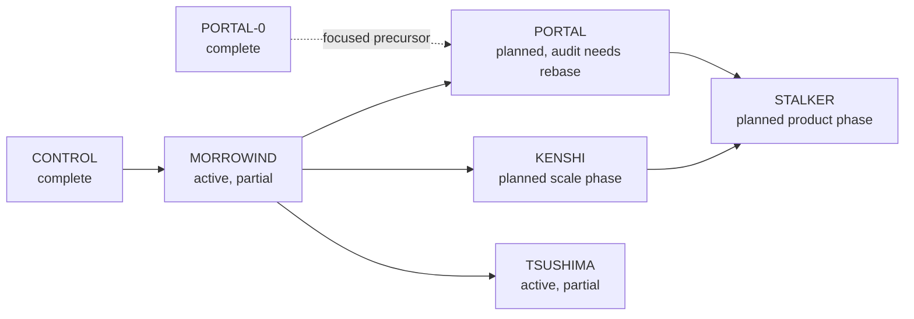

# Development records

This directory holds phase plans, completion records, generated audits, timing
captures, and visual evidence. It is the detailed project memory. For the
current architecture and roadmap, start with [`../context.md`](../context.md).

## Read this first

Use the documents in this order:

1. [`../context.md`](../context.md) for current vocabulary, architecture,
   subsystem status, known failures, and roadmap order.
2. The relevant top-level phase file for intent, acceptance criteria, and the
   original design argument.
3. The matching phase directory for what actually ran and what evidence was
   captured.
4. Source and generated reports when a record conflicts with the current tree.

A phase plan is not proof that a feature exists. Older plans intentionally
preserve the tree and assumptions they were written against. Their opening
audits can therefore be historically useful and presently false.

## Status vocabulary

| Status | Meaning |
|---|---|
| In tree | Source exists, but every visual, performance, or close-out gate may not have passed |
| Complete | The phase or named sub-phase closed its acceptance gates |
| Partial | Some named work shipped and some remains open |
| Planned | Design only; implementation has not started |
| Deferred | Deliberately postponed with a recorded reason or prerequisite |
| Refused | Tried or investigated and rejected on evidence |

## Current roadmap

**Next implementation priority, 2026-09-06:** [PERSONA (Atlus)](phase_PERSONA.md)
comes before further work on other phases. Its editor survey and design/QoL plan
are written; A/B visual foundations and C/D workspace/QoL implementation are in tree
([C/D record and captures](<phase PERSONA/PERSONA-C_D.md>)). The [first E/F slice](<phase PERSONA/PERSONA-E_F.md>) adds contextual authoring, fixes Foliage/F8, and repairs floating placement and narrow-window clipping. The [designer QoL follow-up](<phase PERSONA/PERSONA-QoL.md>) adds material/lighting tools, browser fixes, Scripts access and saved brush settings. User visual review, designer journeys, E/F acceptance and G remain open. The dependency graph below describes
the subsequent roadmap, not permission to skip PERSONA.

MORROWIND is the active phase. TSUSHIMA runs beside it and touches only the
renderer, so the two do not contend. PORTAL-0 is complete but is not the full
PORTAL plan. KENSHI and PORTAL can proceed independently after MORROWIND where their
work does not overlap. STALKER waits for the relevant outputs of both.

## Phase index

The status column is current as of 2026-09-03. The linked file still contains
its own historical snapshot and revision notes.

| Phase | Focus | Current status | Plan or record |
|---|---|---|---|
| PERSONA / Atlus | Nocturne redesign, editor composition, designer QoL | A–D and first E/F slice in tree; journey/E/F acceptance and G open, current priority | [`phase_PERSONA.md`](phase_PERSONA.md) |
| 16 | Language-neutral scripting and sandboxed Luau | Complete | [`phase_16.md`](phase_16.md) |
| 25M2 | Renderer milestone close-out | Complete record | [`phase_25m2_completion_report.md`](phase_25m2_completion_report.md) |
| IV | Great Lakes landscape, finite water, FFT ocean | Complete | [`phase_IV.md`](phase_IV.md) |
| XV | Terrain identity, layers, splat and biome authoring | A through J complete | [`phase_XV.md`](phase_XV.md) |
| VV / Halcyon | Ray-traced water reflection and refraction | A through H plus VV+1 in tree; live evidence remains | [`phase_VV.md`](phase_VV.md) |
| CR / Crysis | CPU and GPU frustum culling | In engine | [`phase_CR.md`](phase_CR.md) |
| DF / Daggerfall | Terrain material clipmaps | In engine, default off; audit remains | [`phase_DF.md`](phase_DF.md) |
| 26 / Metaphor | Editor information architecture | Most work in tree; selected follow-ups open | [`phase_26.md`](phase_26.md) |
| 26-Zeta / Nocturne Atelier | Editor visual system, tokens, type, icons | In tree; final human sign-off remains | [`phase_26_Zeta.md`](phase_26_Zeta.md) |
| 27 / Hades | Editor paint, motion, elevation, first impression | Partial; H through J not started | [`phase_27.md`](phase_27.md) |
| DOOM / id Tech | Profiler, timing format, pixel census, measured optimization | A–G in tree; C/E/G are default-off measured experiments; D complete; H–M open | [`phase_DOOM.md`](phase_DOOM.md) |
| CONTROL / Northlight | Schema-driven editor reach and world authoring | A through O complete | [`phase_CONTROL.md`](phase_CONTROL.md) |
| PORTAL-0 / Source | Focused performance and engineering audit | A through G complete | [`phase_PORTAL-0.md`](phase_PORTAL-0.md) |
| MORROWIND / NetImmerse | Runtime UI, cook, streaming, animation, game framework, rendering gaps | Active and partial | [`phase_MORROWIND.md`](phase_MORROWIND.md) |
| TSUSHIMA / Ghost of Tsushima | Terrain photorealism: heightfield bakes, atmosphere, BRDF energy terms | A through F in tree; H partial; G and I open | [`phase_TSUSHIMA.md`](phase_TSUSHIMA.md) |
| DREAMS / Media Molecule | Experimental sampling, light transport, geometry and appearance under THERMOMETER | A and B complete; B sampling defaults on with Details controls; C active | [`phase_DREAMS.md`](phase_DREAMS.md) |
| PORTAL / Source | Engineering health and durable gates | Planned; rebase the 2026-08-18 audit before starting | [`phase_PORTAL.md`](phase_PORTAL.md) |
| KENSHI / OGRE | Combined-load measurement and published engine limits | Planned | [`phase_KENSHI.md`](phase_KENSHI.md) |
| STALKER / X-Ray | Player, packages, mods, product UI, living world, release | Planned | [`phase_STALKER.md`](phase_STALKER.md) |

## MORROWIND at a glance

| Track | In tree | Still open |
|---|---|---|
| BALMORA | Census, GHOSTFENCE, wgpu 30, jobs, shader composition and reload | None |
| VIVEC | Runtime canvas, paint extensions, focus, navigation, rich text, IME, motion, accessibility | Full shaping, bidi, and fallback |
| CONSTRUCTION SET | Graph surface and timeline | Docking, virtualisation, GUI editor, play-in-editor |
| HLAALU | None | Prefabs, splines, blockout, scattering |
| SILT STRIDER | Cook, residency, world partition, HLOD, impostors, floating origin | None |
| DWEMER | GPU skinning, clips, blends, state machines | Root motion, IK, events, compression, pose task graph |
| SIXTH HOUSE | None | Navmesh, pathfinding, behavior trees, perception |
| RED MOUNTAIN | VSM, DDGI, terrain VT, OIT, SMAA, unified AA | GPU particles and VFX graph |
| ALMSIVI | Input actions, audio, localisation | Save games, video, playable slice |

The detailed records live in [`phase MORROWIND/`](phase%20MORROWIND/). The
current list of completed record files is maintained in `context.md`; do not
infer completion only from a filename.

## Evidence directories

| Directory | Contains |
|---|---|
| [`phase 16/`](phase%2016/) | Scripting acceptance evidence |
| [`phase IV/`](phase%20IV/) | Finite water, spectral ocean, shoreline, vessel, and fidelity records |
| [`phase XV/`](phase%20XV/) | Terrain research, implementation records, and captured evidence |
| [`phase VV/`](phase%20VV/) | Halcyon captures and timing work |
| [`phase CR/`](phase%20CR/) | Culling occupancy evidence |
| [`phase DF/`](phase%20DF/) | Clipmap timings and audit material |
| [`phase 26/`](phase%2026/) | Editor information-architecture captures |
| [`phase DOOM/`](phase%20DOOM/) | `.somtime` baselines, reports, and optimization records |
| [`phase CONTROL/`](phase%20CONTROL/) | Editor-reach sub-phase records and evidence |
| [`phase PORTAL-0/`](phase%20PORTAL-0/) | Focused audit records and matched measurements |
| [`phase MORROWIND/`](phase%20MORROWIND/) | Active MORROWIND sub-phase records and audits |
| [`phase DREAMS/`](phase%20DREAMS/) | DREAMS language decisions, matched timings, captures, and sub-phase records |
| [`phase TSUSHIMA/`](phase%20TSUSHIMA/) | Terrain A/B captures, HDR attribution work, and sub-phase records |
| [`evidence/`](evidence/) | Cross-phase or uncategorized committed evidence |

Planned phases do not receive evidence folders in advance. The first sub-phase
creates the folder when it has an actual record to store.

## Evidence rules

### Images

- Capture the running build. Do not use mockups as implementation evidence.
- Capture after tone mapping. A direct PNG of the HDR target is clipped and
  cannot establish the displayed result.
- Record the scene, camera, resolution, feature state, and command.
- Keep comparison conditions matched. If control runs move as much as the
  feature runs, report the result as inconclusive.

### Timings

- `.somtime` runs need the same scene, pinned view, warm-up, resolution, and
  sample policy.
- Report mean, spread, minimum, maximum, and sample count.
- `Frame wall` includes vsync and waiting. It is not CPU work.
- Do not overwrite the original `DOOM-A_*` baselines.
- Keep negative results. DOOM's tile binning and aerial terrain path, and
  PORTAL-0's reverted WGSL optimization, are part of the engineering record.

### Gates

`python tools/ghostfence/run.py` is the repository gate. A row that cannot run
is skipped with a reason; it is not silently green. As of 2026-08-29 the fast
gate still fails the `sculpt-panel` golden image, so the repository must not be
described as fully green.

## Record-writing rules

1. Put current architecture and roadmap facts in `context.md`.
2. Put detailed implementation history, measurements, and rejected approaches
   in the relevant phase record.
3. Write the command and revision beside generated evidence.
4. Separate what was planned, what shipped, what was deferred, and what was
   refused.
5. Correct stale status at the top of a plan, but preserve its dated audit as
   history.
6. Link to large reports and evidence. Do not paste the same audit into several
   maintained documents.
7. Do not claim a visual or performance result that the captured evidence did
   not establish.

## Historical handoffs

These are useful snapshots, not current entry points:

- [`post_TSUSHIMA_session_handoff.md`](post_TSUSHIMA_session_handoff.md)
- [`post_halcyon_audit_handoff.md`](post_halcyon_audit_handoff.md)
- [`halcyon_context_handoff.md`](halcyon_context_handoff.md)
- [`post_IV_context_handoff.md`](post_IV_context_handoff.md)
- [`post_25M2_context_handoff.md`](post_25M2_context_handoff.md)

Read them when reconstructing the reasoning of their period. Use
[`../context.md`](../context.md) for the present state.
