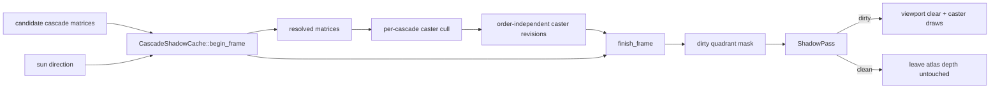

# DOOM-D — per-cascade shadow cache

**Status:** complete on 2026-08-30. Source and evidence were produced from the
same uncommitted working tree; replace this sentence with the commit id when the
change is committed.

## Shipped contract

The conventional four-cascade atlas is persistent. A pure, GPU-independent
policy owns one entry per quadrant and decides whether that quadrant needs new
depth. The renderer and the shadow pass consume its resolved matrices and dirty
mask; neither is allowed to infer cache state independently.

Invalidation is deliberately explicit:

- first use and `SOMNIUM_SHADOW_CACHE=0` redraw all four cascades;
- sun motion beyond a cascade-specific angular epsilon invalidates that tier;
- camera motion invalidates only after the fitted centre crosses a shadow texel;
- changes to the filtered caster set or transforms invalidate only cascades
  whose volumes contain the changed commands; in-place geometry and material
  edits have no changed command identity, so they conservatively invalidate all
  four;
- simultaneous view changes in already-valid distant cascades 2 and 3 are
  interleaved across frames;
- a clean mask records no shadow render pass. The atlas is loaded, and a dirty
  quadrant is cleared by a viewport/scissor-constrained depth draw because a
  render-pass clear would destroy all four cached quadrants.

`shadow_cascades_rendered` is published beside `shadow_casters` in the profiler
and `.somtime`, so zero work is observable rather than inferred from a timing.

## Defects found while proving the cache

The first GPU run still redrew a distant cascade. The caster fingerprint folded
draws in queue order, while foliage and terrain collection may traverse maps in
a different order without changing scene content. Each command is now hashed
independently and the fingerprints are combined commutatively. A unit test locks
both properties: reorderings are equal, transform changes are not.

The canonical Coastal and Island recipes both spawn a dynamic buoyant boat. Its
motion correctly invalidates the cascade containing it, so those scenes are not
valid tests of the plan's static-scene exit criterion. The example timing
harness now accepts `SOMNIUM_TIME_STATIC=1`, which suppresses only that demo
vessel. Normal runtime and editor behavior are unchanged.

## Acceptance evidence

Both runs used Coastal ground, a fixed camera, a fixed 45° elevation / 120°
azimuth sun, `SOMNIUM_TIME_STATIC=1`, 1920×1032, 180 warm-up frames, 300 measured
frames, NVIDIA GeForce RTX 5080 Laptop GPU / Vulkan driver 610.74. The only
changed variable was `SOMNIUM_SHADOW_CACHE`.

| Mode | Cascades redrawn | Shadows mean ± σ | min–max | GPU frame mean |
|---|---:|---:|---:|---:|
| cache on | 0 / 4 | 0.0028 ± 0.0031 ms | 0.0017–0.0212 ms | 21.1154 ms |
| cache off | 4 / 4 | 0.9633 ± 0.1750 ms | 0.6425–1.7989 ms | 22.0597 ms |

Each file contains 226 landed GPU-profiler samples and reports the same 218
shadow casters. The shadow zone saves 0.9605 ms in this static view. End-to-end
GPU frame means differ by 0.9443 ms; this single pair is evidence of the removed
shadow work, not a general performance distribution.

- [`DOOM-D_coastal-ground_cache-on.somtime`](DOOM-D_coastal-ground_cache-on.somtime)
- [`DOOM-D_coastal-ground_cache-off.somtime`](DOOM-D_coastal-ground_cache-off.somtime)
- [`DOOM-D_coastal-ground_cache-on.png`](DOOM-D_coastal-ground_cache-on.png)
- [`DOOM-D_coastal-ground_cache-off.png`](DOOM-D_coastal-ground_cache-off.png)

The PNGs are tone-mapped display captures at frame 120 under the same fixed
conditions. Visual inspection found no missing quadrant, stale edge, or
cache-on/off shadow difference.

## Gates

- `cargo check -p hello_engine -j1`
- `cargo check -p somnium_renderer -j1`
- `cargo test -p somnium_renderer shadow:: --lib -j1` — 22 passed
- `cargo test -p somnium_renderer shadow_content_revision --lib -j1` — passed
- `git diff --check`

The full renderer library suite had passed immediately before the final
order-independent fingerprint test was added (411 passed). Run the full suite
again before hand-off; the focused new test already passes.
