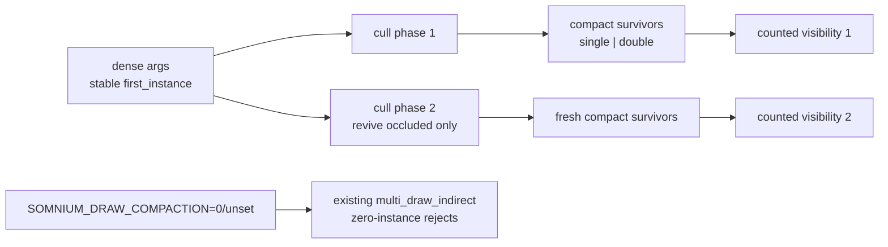

# DOOM-G — counted draw submission experiment

**Status:** measured experiment in tree, default off, completed 2026-08-30.
Source and evidence came from the same uncommitted working tree; replace this
sentence with the commit id when committed.

## Question

Would compacting visible indirect arguments on the GPU and issuing
`multi_draw_indirect_count` reduce the current visibility cost enough to replace
the dense Phase-15 stream?

The answer on the current 66-object Coastal-ground scene is **no demonstrated
win**. The experiment remains available as `SOMNIUM_DRAW_COMPACTION=1`; dense
submission is the default.

## Architecture tried

The dense stream was not replaced. It remains parallel to cull bounds and is
the source of `first_instance`, phase-two occlusion revival, picking IDs, and
diagnostic readback. Each cull phase optionally copies survivors into a second
buffer split at the existing single-/double-sided boundary and increments two
GPU counters. The visibility pass consumes those partitions with two
`multi_draw_indirect_count` calls.

`MULTI_DRAW_INDIRECT_COUNT` is detected and requested only when the adapter
reports it. Devices without it retain the dense path. The cross-language cull
uniform grew from 208 to 224 bytes; a layout test locks every offset. The first
live run caught the initial 216/224 mismatch before a frame rendered.

The atomic append does not guarantee the dense stream's original order. That is
acceptable only for this opt-in opaque experiment; a shipping default would
need a stable prefix-sum compaction or proof that equal-depth ordering and
deterministic captures cannot change. With no measured performance case, that
extra algorithm is not justified.

## Measurement

Both runs used Coastal ground, fixed camera and sun, `SOMNIUM_TIME_STATIC=1`,
the DOOM-D shadow cache on, 1920×1032, 180 warm-up / 300 measured frames, and an
RTX 5080 Laptop GPU on Vulkan driver 610.74. Each contains 225 landed GPU
samples. Only draw compaction changed.

| Zone | Counted mean ± σ | Dense mean ± σ | Counted − dense |
|---|---:|---:|---:|
| Cull phase 1 | 0.0853 ± 0.1098 ms | 0.0592 ± 0.0996 ms | +0.0261 ms |
| Cull phase 2 | 0.0214 ± 0.0263 ms | 0.0187 ± 0.0388 ms | +0.0027 ms |
| Visibility phase 1 | 0.1989 ± 0.1403 ms | 0.2244 ± 0.1407 ms | −0.0255 ms |
| Visibility phase 2 | 0.0142 ± 0.0179 ms | 0.0247 ± 0.0191 ms | −0.0105 ms |
| **Cull + visibility** | **0.3198 ms** | **0.3270 ms** | **−0.0072 ms** |
| GPU frame | 21.1349 ± 1.9751 ms | 21.3528 ± 2.1289 ms | −0.2179 ms |

Compaction moved work from visibility into culling. The combined 0.0072 ms
difference is far inside the observed spread and does not justify a default
change. The frame difference is also inside noise and is not claimed as a win.

- [`DOOM-G_coastal-ground_counted.somtime`](DOOM-G_coastal-ground_counted.somtime)
- [`DOOM-G_coastal-ground_dense.somtime`](DOOM-G_coastal-ground_dense.somtime)
- [`DOOM-G_coastal-ground_counted.png`](DOOM-G_coastal-ground_counted.png)
- [`DOOM-G_coastal-ground_dense.png`](DOOM-G_coastal-ground_dense.png)

The tone-mapped frame-120 captures are visually equivalent: no missing terrain
partition, wrong double-sided pipeline, or phase-two hole was observed.

## Decision

- Keep dense indirect submission as the default.
- Keep the counted path behind `SOMNIUM_DRAW_COMPACTION=1` for a future KENSHI
  scale sweep, where thousands of rejected arguments may change the trade.
- Do not add stable scan compaction, count readback, or more counters until a
  scale axis demonstrates that this path is worth deepening.
