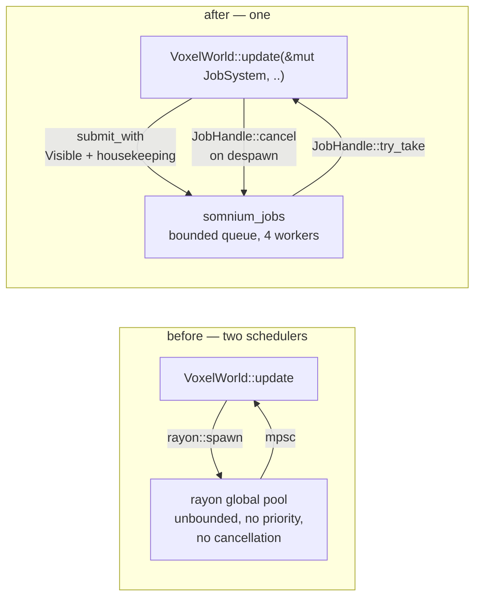

# DOOM-H — one scheduler, and the last thing that was bypassing it

**Status:** complete, 2026-08-30.

## What the stage turned out to be

The 2026-08-16 plan for H reads *"replace `jobs.rs`'s single helper with a
scoped worker pool over the existing rayon dependency"*. That instruction is
dead. MORROWIND-B shipped `somnium_jobs` — a bounded priority queue, a fixed
worker pool, deadlines, cooperative cancellation, a budgeted main-thread
completion drain, per-job profiler zones, and a deterministic inline mode.
Building the planned pool would have created the second background scheduler
that §11 row 12 and GHOSTFENCE's `one-job-system` row exist to forbid.

§16's rebase therefore redefined H as **migration and proof**: find frame work
still bypassing the scheduler, move it, and show the main thread stays bounded.

## The audit

One offender, and it was already named. `crates/somnium_voxel/src/world.rs`
detached chunk generation with `rayon::spawn` onto rayon's *global* pool and
collected results over an `mpsc` channel — a second background scheduler by any
reading of the rule. PORTAL-0-C found it, could not fix it inside a performance
commit, and wrote the debt into GHOSTFENCE as a stated exemption:

> *"Exempted rather than fixed here because routing it through `somnium_jobs`
> means threading a `&mut JobSystem` through `VoxelWorld::update`, and that is
> a public API change that belongs at a MORROWIND seam, not inside a
> performance commit. Owed work, not an accepted design."*

The seam arrived. The exemption is gone from `tools/ghostfence/run.py`, and the
row passes on its own terms: three exemptions remain, all of them either the job
system itself or a single-shot test that must prove something happens off the
main thread.

Everything else in the workspace was checked and is legitimate:

| Site | Verdict |
|---|---|
| `somnium_renderer::jobs::for_each_mut` (`par_iter_mut`) | **Keep.** Fork-join inside one frame over a slice, above a 512-element threshold, with a unit-tested serial path. A different problem from background work with a deadline, and `somnium_jobs/Cargo.toml` already says so. |
| `somnium_core::a11y_bridge`, `somnium_ui::theme` (`thread::spawn`) | **Keep.** Single-shot tests whose whole assertion is *"this works from another thread"*. |
| Everything else | No pool, no detached spawn. |

## What changed in the voxel streamer



`VoxelWorld::update` now takes `&mut JobSystem`, so `EngineContext` carries the
scheduler (`ctx.jobs`) and game-side streaming systems reach it the same way the
editor does. Three behaviours are new because a bounded queue behaves
differently from an unbounded pool, and each is pinned by a test that uses a
**real** worker pool rather than the inline mode:

- **A refused submission is not a lost chunk.** `submit_with` returns
  `Err(QueueFull)` during a burst; the chunk simply keeps no `pending` marker
  and the nearest-first candidate pass picks it up again next frame.
  `a_full_queue_delays_chunks_rather_than_losing_them` streams 26 chunks
  through a 4-slot queue and asserts every one arrives.
- **Despawning cancels.** A chunk that leaves the keep radius while meshing has
  its handle cancelled, and the worker drops the result rather than paying for
  a mesh nobody will draw.
  `despawning_cancels_in_flight_chunks_and_frees_their_slots` teleports the
  camera and asserts every slot comes back.
- **Failure is retryable.** Cancellation, deadline expiry and worker panic all
  arrive as `Err` on the same handle, and all three mark the chunk dirty. Under
  `mpsc` a panicked worker was simply a chunk that never appeared.

The in-flight *count* was a separate `usize` that had to be kept in step with
the task list by hand. It is now `self.tasks.len()`, so the two cannot drift.

## One thing the migration broke, and the fix

`somnium_jobs` had no way to say *"this is engine work, not something a person
started"*. The status bar approximated it with `priority != Background`, which
held only while every continuous system happened to sit at that class. Chunk
meshing does not: a missing chunk is a hole in the view the camera is pointed
at, so `Visible` is the honest scheduling class. The result was that the status
line read `voxel.chunk_mesh — 0%` with a Cancel button for as long as the camera
kept moving, and cancelling one chunk of sixteen means nothing to anybody.

Downgrading the priority to fix the label would have been lying to the
scheduler. The two questions are now asked separately: `JobDesc::housekeeping()`
sets an explicit bit, `JobPriority::Background` implies it so no existing call
site changed, `JobSnapshot::housekeeping` reports it, and the status chip filters
on that instead of on priority. `housekeeping_is_independent_of_priority` pins
all three cases.

## Measurement

The voxel world is normally created by hand from **Create > Voxel Terrain**, so
no timing run could ever see the work that just moved. `SOMNIUM_VOXEL=1` spawns
exactly what that menu item spawns, at map load, opt-in, changing nothing else.

Coastal ground, fixed camera and sun, `SOMNIUM_TIME_STATIC=1`, shadow cache on,
1920×1032, RTX 5080 Laptop / Vulkan. **Warm-up 0 and 600 measured frames on
purpose** — the whole point is the startup burst where ~118 chunks are generated
and uploaded, and the usual 180-frame warm-up would have hidden it behind a
scene that had already finished streaming.

| | voxel on (rep 1) | voxel on (rep 2) | control, no voxel |
|---|---:|---:|---:|
| `Jobs & assets` mean | 0.0659 ms | 0.0543 ms | 0.0625 ms |
| **`Jobs & assets` max** | **1.8304 ms** | **1.5237 ms** | **1.6545 ms** |
| Frame CPU mean | 19.8876 ms | 19.7134 ms | 19.5956 ms |
| Frame wall max | 93.7362 ms | 31.7518 ms | 30.6378 ms |
| draw calls | 184 | — | 66 |
| shadow casters | 336 | — | 218 |

**The bounded-completion claim is the `Jobs & assets` row.** That zone is
`drain_completions`, the main-thread install budgeted at 2 ms per frame. It
never reached that budget in any run, including the one that installed 118 chunk
meshes; the difference against the control is `~ noise (band ±0.364)`. Frame
wall and Frame CPU means are likewise `~ noise` against the control, with 118
extra draws and 118 extra shadow casters in the scene.

Rep 1's 93.7 ms wall-clock maximum is **not** claimed as a finding: rep 2 of the
same build reported 31.75 ms, against the control's 30.64 ms. One unreproduced
spike in a 600-frame run is exactly the kind of number this directory's README
was written about.

- [`DOOM-H_coastal-ground_voxel-on.somtime`](DOOM-H_coastal-ground_voxel-on.somtime)
- [`DOOM-H_coastal-ground_voxel-off.somtime`](DOOM-H_coastal-ground_voxel-off.somtime)

## What H does not claim

Chunk *meshing* moved off the main thread's scheduler. The chunk **upload** did
not, and was never going to: `upload_mesh_pooled` needs the device queue, and
the plan is explicit that GPU uploads stay main-thread even when their
preparation is a job. Whether a burst of uploads needs its own per-frame budget
is DOOM-I's question, because DOOM-I owns the hitch metric.

No speed win is claimed. H's deliverable is that there is one scheduler, that
the last bypass is gone, that the gate enforcing it no longer carries an
exemption, and that the main thread stayed inside its budget while absorbing the
work.

## Commands

```bash
SOMNIUM_VOXEL=1 SOMNIUM_TIME_STATIC=1 SOMNIUM_TIME_VIEW=coastal-ground SOMNIUM_TIME_WARMUP=0 SOMNIUM_TIME_FRAMES=600 SOMNIUM_MAXIMIZE=1 SOMNIUM_SUN_ELEVATION=45 SOMNIUM_SUN_AZIMUTH=120 SOMNIUM_TIME="dev records/phase DOOM/DOOM-H_coastal-ground_voxel-on.somtime" cargo run --release -p hello_engine
```

```bash
python tools/ghostfence/run.py --row one-job-system
```
