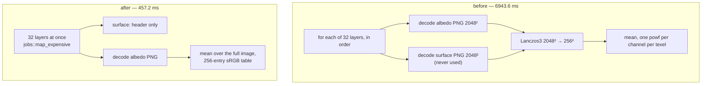

# DOOM-I — off the critical path

**Status:** complete, 2026-08-30.

## The gate, and why it came first

§16's rebase would not let I start with code:

> *"Streaming, previews, cook, shader work, and HLOD landed across later phases,
> so the 2026-08-16 task list is no longer an inventory. Re-profile startup and
> steady-state, then name exact remaining decode/compile/upload stalls before
> changing code."*

The original stage also promised a metric that did not exist — *"a hitch metric
in the timing harness — no frame above 2× the median"*. Neither half of that is
recoverable from what `.somtime` recorded: a median needs the samples, not a
mean and a standard deviation, and a count of frames over a threshold has to be
taken once the threshold is known, which is only at the end of a run.

So the metric was built first, and it immediately found something.

## The metric

`hitch` rows, a kind of their own rather than more `count` rows — the same
argument DOOM-B's census used, that a comparison should be able to show the
frame rate breaking step separately from the scene changing size.

| Row | Meaning |
|---|---|
| `startup_ms` | Renderer construction to the first presented frame |
| `median_ms` | Median presented-frame interval |
| `p99_ms` | 99th percentile interval |
| `worst_ms` | Longest interval after the first |
| `over_2x_median` | Frames whose interval exceeded `2 × median` |
| `worst_frame`, `last_over_2x_frame` | *Where* in the run they were |

The threshold is relative to the run's own median on purpose. An absolute one
would call every frame of a 30 fps scene a hitch and none of a 240 fps one, and
the question is *"did the frame rate visibly break step"*, not *"was a frame
longer than a number chosen in advance"*. `where_the_hitches_are_separates_startup_from_steady_state`
pins why the two index rows exist: three hitches ending at frame 9 is pipeline
compilation, and three ending at frame 280 is a fault.

### What the metric found about itself

The first run reported a `Frame CPU` maximum of 120 ms beside a `Frame wall`
maximum of 31.9 ms. Both cannot be true of one frame. They were not: `Frame
wall` is a tick-to-tick interval, the first tick has no previous tick, and its
interval was being dropped — so **the single largest stall in a session was
invisible to the metric designed to find stalls.**

Seeding the previous-tick time at construction fixed the blindness and created a
second problem: an eight-second outlier took `Frame wall` from 20.0 ± 2.1 ms to
33.7 ± 336.5 ms, and every comparison against an earlier run would silently have
been reading a different statistic. Startup is a different question from the
frame rate, so it is now its own row and stays out of both the mean and the
sample set. Runs with a warm-up window are unaffected either way.

## The profile

Coastal ground, fixed camera and sun, `SOMNIUM_TIME_STATIC=1`, 1920×1032, RTX
5080 Laptop / Vulkan, **warm-up 0 and 600 measured frames** so the window
contains startup rather than beginning after it.

**Steady state was already clean.** Zero frames over 2× the median in 599, worst
30.5 ms against a 19.7 ms median — 1.55×, not 2×. The 2026-08-16 stage list
assumed hitches to remove; there were none to remove.

**All of it was startup: 8210.8 ms**, and nothing logged a single line inside
it. Instrumenting the map build — permanently, at `info!`, because the next
person should read a breakdown rather than bisect one — narrowed it in two runs:

```text
Map spawned                        7621.9 ms
└─ Coastal landscape built         7621.7 ms
   ├─ terrain alloc (create_terrain) 7156.9 ms   ← 94%
   ├─ relief + auto-splat             377.1 ms
   └─ water                            87.7 ms
```

and inside `create_terrain`, one line:

```text
terrain: mean albedo from sources  6943.6 ms   ← 95% of create_terrain
```

**Thirty-two average colours cost 6.9 seconds** — about 85% of the entire
startup.

## What was actually happening

`load_bc7_layers` is the virtual-texturing path, and it is careful. It validates
every source pack by metadata only, and says so:

> *"Page payloads are read directly from these packs when feedback admits them;
> creation never transiently reads the full resident arrays."*

Then its last field initialiser is `mean_albedo: mean_albedo_from_sources()`,
which called `layer_packed_rgba(i, 256)` for all thirty-two layers. That helper
exists to produce texel data for upload, and for an average it did three things
an average does not need:

1. decoded the **surface** map as well as the albedo, when only albedo is used;
2. **Lanczos3-resized** each 2048² source down to 256² before averaging;
3. did both **serially**, on the main thread, thirty-two times.

The VT path's entire memory-and-IO argument was undone by one field.



Three changes, each removing one of the three wastes:

- **The surface map is checked by header**, not decoded. The pairing rule is
  preserved — a layer counts as photographed only when both its maps are
  readable — so a half-present pack still averages the procedural recipe and the
  shading fallback does not change.
- **No resize.** `mean_linear_albedo` now indexes a 256-entry sRGB table instead
  of calling `powf` per channel per texel, which is bit-identical (a `u8` has
  256 possible values) and makes averaging the full-resolution image cheaper
  than resizing it first ever was.
- **In parallel.** `jobs::map_expensive` is fork-join like `for_each_mut`, but
  without the count-based `PARALLEL_THRESHOLD`: thirty-two is far below that
  threshold, and the threshold was never meant to say anything about elements
  costing 200 ms each.

## Result

| | before | after | delta |
|---|---:|---:|---:|
| `hitch startup_ms`, Coastal | 8210.760 ms | **1574.288 ms** | **−6636.472 ms (−80.8%)** |
| mean albedo from sources | 6943.6 ms | 457.2 ms | −93.4% |
| `create_terrain` | 7156.9 ms | 883.2 ms | −87.7% |
| map build total | 7771.9 ms | 1362.8 ms | −82.5% |
| `hitch median_ms` | 19.710 ms | 19.897 ms | +0.187 ms |
| `hitch over_2x_median` | 0 | 0 | — |

Island, same build and the same settings: `startup_ms` **1145.4 ms**, median
16.860 ms, worst 19.949 ms — 1.18x the median — and **0 hitches**. Both shipped
maps now start in about a second and neither breaks step once running.

> **Corrected 2026-08-30.** The Island figures first recorded here (2070.8 ms
> startup, 16.904 ms median) came from a run that had lost `SOMNIUM_MAXIMIZE`,
> `SOMNIUM_TIME_STATIC` and the fixed sun, because environment variables do not
> persist between shell invocations. It rendered at 1280x720 with the demo boat
> present. The run above is at 1920x1032 with the same controls as Coastal.
> DOOM-K records how the class of mistake is caught: read the `.somtime`
> header — `# render`, `draw_calls`, `Shading.frag` — before reading any
> number below it.

- [`DOOM-I_coastal-ground_before.somtime`](DOOM-I_coastal-ground_before.somtime)
- [`DOOM-I_coastal-ground_after.somtime`](DOOM-I_coastal-ground_after.somtime)
- [`DOOM-I_island-ground_after.somtime`](DOOM-I_island-ground_after.somtime)

## Correctness

The new average is taken over the full-resolution image; the old one was taken
over a Lanczos3 thumbnail. Lanczos has negative lobes, so those are not the same
number, and the difference had to be measured rather than assumed.

A one-off audit ran both paths over all thirty-two shipped packs: **the worst
disagreement is 0.0184 in linear albedo, on layer 29.** The full-resolution
figure is the more correct of the two — it is the actual mean of the actual
texels — and 0.018 of the [0, 1] linear range only ever reaches the screen
through the virtual-texture fallback colour used before pages are resident.
`the_full_image_mean_matches_the_resized_one` keeps that bound at 0.03, and
`the_srgb_table_is_the_transfer_function` checks the table against the inline
expression for all 256 inputs.

**A tone-mapped capture cannot settle this, and it is worth writing down why.**
Frame 120 of Coastal ground differs from the DOOM-G reference by 3.03% of pixels
with a peak channel delta of 59 — but **two runs of one unchanged build differ
by 2.80% and a peak of 53**. The capture's own run-to-run variance is the same
size as the effect, so it was not used as evidence in either direction. Whatever
makes frame 120 non-deterministic at that resolution — virtual-texture page
admission is the obvious candidate — is not investigated here and is recorded so
the next person does not read one of these captures as a fixed reference.

## What I does not claim

Nothing moved off the main thread that was not already there. The map build is
still synchronous; it is now 1.4 s instead of 7.8 s. Making map load itself
asynchronous, or budgeting the terrain upload, would be a different change with
a different risk, and the measurement no longer says it is the thing to do.

The remaining 1.57 s of Coastal startup was not broken down further. The largest
piece named by the instrumentation is relief plus auto-splat at 377 ms; nothing
in what is left is a stall of the kind this stage was written to find.

## Commands

```bash
SOMNIUM_TIME_STATIC=1 SOMNIUM_TIME_VIEW=coastal-ground SOMNIUM_TIME_WARMUP=0 SOMNIUM_TIME_FRAMES=600 SOMNIUM_MAXIMIZE=1 SOMNIUM_SUN_ELEVATION=45 SOMNIUM_SUN_AZIMUTH=120 SOMNIUM_TIME="dev records/phase DOOM/DOOM-I_coastal-ground_after.somtime" SOMNIUM_TIME_COMPARE="dev records/phase DOOM/DOOM-I_coastal-ground_before.somtime" cargo run --release -p hello_engine
```
