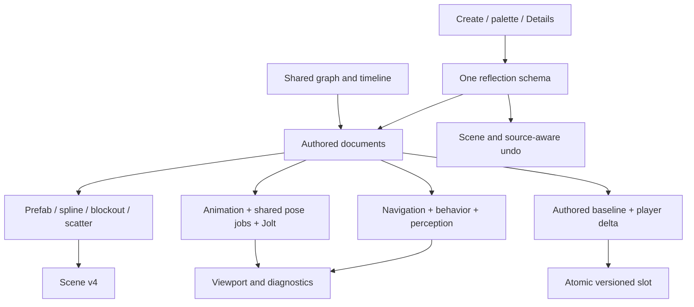
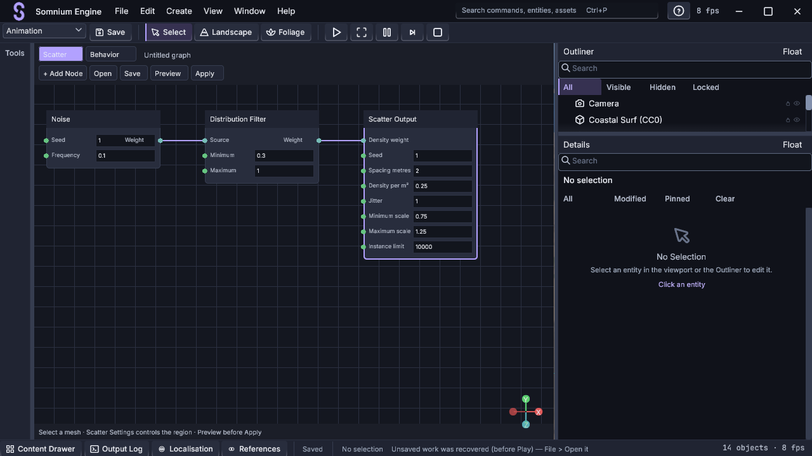
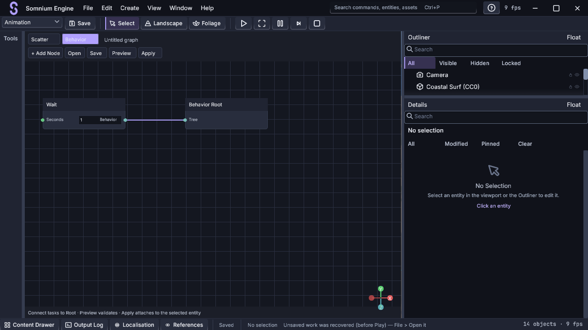
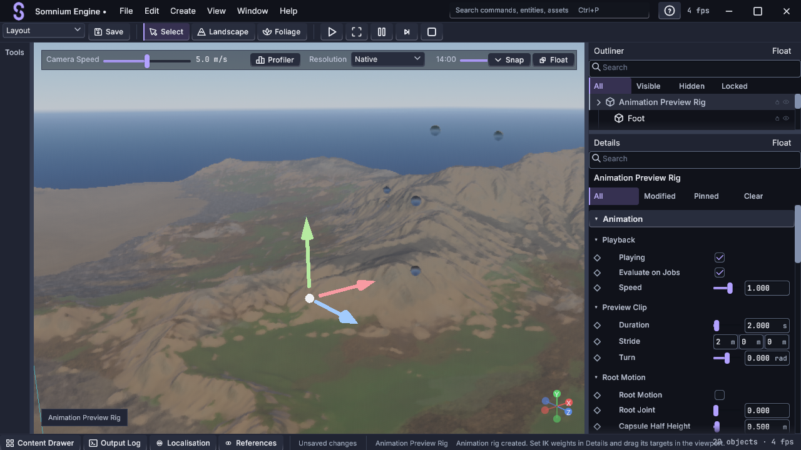
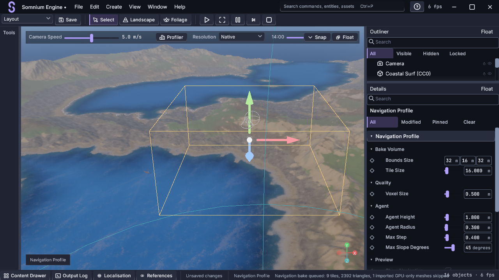

# MORROWIND — eight-sub-phase acceptance, 2026-09-09

Scope: **O, P, P2, W, W2, X, Y and AF**, requested in one session with native
editor access, designer QoL and concise architecture documentation. Initial
working tree was clean at `34a6b4c`.

## Delivered

| Sub-phase | Runtime | Designer workflow |
|---|---|---|
| [O](MORROWIND-O.md) | Nested prefabs, typed overrides, v4 scenes, source-aware undo | Create/instantiate/nest/edit/propagate/revert/break-link; Details provenance and override list |
| [P](MORROWIND-P.md) | Tangents and world-distance spline sampling; parametric meshes and GLB export | Named shape picker, dimensions/segments, transform gizmos, export |
| [P2](MORROWIND-P2.md) | Deterministic gradient/filter/tag/exclusion scatter | Shared graph, retained drafts, bounds profile, placement Preview and one-step Apply |
| [W](MORROWIND-W.md) | Root motion, limb/foot/look IK, events, real Jolt ragdolls | Visible preview rig, draggable targets, grouped controls and timeline events |
| [W2](MORROWIND-W2.md) | Error-budget compression and pose jobs | Compression controls/report, shared-job toggle and preview feedback |
| [X](MORROWIND-X.md) | Cell bake/cook, path queries, agents, obstacles and links | Scene geometry bake, profile/agent/obstacle/link Details and colored overlays |
| [Y](MORROWIND-Y.md) | Behavior trees, blackboards, perception, attached Luau tasks | Shared graph, Scripts attachment matching, sensor target picker and live diagnostics |
| [AF](MORROWIND-AF.md) | Player/cell deltas, versioned atomic slots, migration and state stack | Slot profile, PNG picker, Save/Load during Play; Stop restores authoring |

All commands are discoverable through Create/the palette. **F1 → Designer
Tools** explains the workflows. New schemas use the existing Details, scene and
undo paths. Graph tools share one retained surface; events use the existing
timeline. The second example consumes all eight through public APIs and uses
the engine's navigation owner and job system.

## Validation

Executed checks are listed below. Intermediate failures were corrected before
acceptance; they are not counted as passing checks.

- `cargo test --workspace --offline --no-fail-fast -j1`: **2,352 passed,
  zero failed, two ignored documentation tests** across 62 test groups.
- Included acceptance suites: AI/attached Luau **8**, animation authoring **4**,
  prefab authoring **3**, composition/save **11**, native Jolt **1**. The second
  example's **18** tests include the public exercise spanning all eight areas.
- The shared graph suite passes **47** tests, including retained documents,
  source paths/history and invalid-apply recovery.
- `cargo clippy --workspace --all-targets --offline -j1`: completed with zero
  errors. Lint warnings remain (827 headers, including summary/duplicate headers);
  this is not a warning-free lint claim. New must-use and simple iterator/type
  warnings found during review were corrected.
- Final `cargo clippy -p somnium_core --all-targets --offline -j1`: zero errors;
  lint warnings remain. Both `hello_engine` and `vvardenfell` binaries built.
- `cargo fmt --all -- --check` and `git diff --check`: passed.
- Final focused regressions: **347 passed** (335 core, 8 AI, 4 animation),
  followed by the successful full workspace rerun.
- Census matches the source tree. GHOSTFENCE `--fast`: **five passed, one
  failed, one skipped**. The inherited PERSONA shell mismatch affects menu bar,
  sculpt panel and toolbar references. References were preserved. The skipped
  test row is covered by the separate full workspace run above.
- Native captures: Scatter, Behavior, animation preview and navigation; see below.
  A fresh shell capture supplied the GHOSTFENCE candidate.

Reproduce captures with `python tools/ghostfence/capture_morrowind.py`. It builds
once, uses native commands at 1280×720, captures frame 120 after tonemapping and
verifies a fresh output. Shell comparison goes to `target/ghostfence`; reference
images are never changed.

## Review corrections

- Preserve explicit null separately from deleted fields in saved patches.
- Reject identity-changing/corrupt save patches and validate loads before live mutation.
- Preserve nested prefab references and live instance handles; source edits undo with world edits.
- Remap copied internal references and script identities; external references resolve durable IDs.
- Preserve graph documents across Scatter, Behavior and Animation switches.
- Run animation before draw submission, respect pause/step, handle parent transforms and recover from invalid edits.
- Persist preview materials, transform caches and hierarchy membership; rebuild defaults so reconstructed primitives remain drawable.
- Place preview rigs beside the camera view and frame their joints/targets; frame navigation volume bounds using authored transforms before propagation.
- Release derived animation/AI state on Stop/load; exclude moving agents from static bake geometry.
- Share navigation ownership between the host and second example.
- Expose off-mesh handoff to game code and Details; reject premature or stale acknowledgements without teleporting.
- Resolve behavior Script nodes from existing attachments through the normal VM and command gate.

## Practical limits

The native navigation mesh is a bounded grid/span implementation with local
steering, not Detour/Polyanya or ORCA equivalence. Special link traversal still
belongs to game logic. Scatter rejects meshes that have only transient GPU
identity. Blockout is parametric authoring, not arbitrary brush editing.
Prefab fields wider than Field scope require Break Link before rebuilding.
Existing source assets are restored by source-aware undo; creating a new source
asset leaves that reusable file on disk if its scene operation is undone.

These sub-phases do not close MORROWIND as a whole. GPU particles/VFX, video,
remaining playable/visual acceptance and the inherited PERSONA golden mismatch
remain separate work. No frame-time improvement or broad interactive usability
study is claimed by the automated tests and captures.

## Native editor evidence

Captured at 1280×720 through the real command paths. Scatter and Behavior show
editable graph values, file controls, Preview/Apply and retained document state.
Animation shows the selected rig and grouped Details; navigation shows its bake
volume and Details. The viewport captures close the Content Drawer for space.
These are workflow captures, not new golden references.

## Storage cleanup

After tests, builds and captures finished, removed `target/debug/deps`,
`target/debug/incremental`, redundant root debug symbols/libraries/dependency
files and the census scratch log. Paths were resolved inside this workspace and
checked for junctions before removal.

- Target logical size: **51.45 → 4.35 GiB**.
- Observed free disk space increased by **44.76 GiB**; hardlinks explain the difference from logical file totals.
- Kept runnable `hello_engine.exe`/`vvardenfell.exe`, native build cache, release
  artifacts and validation/capture evidence. Future Cargo builds recreate removed
  dependencies. The checked-in census report and generator remain required gates.

## Context and provenance

Read `context.md`, git history, the development records and Graphify's module
hubs before implementation. Applied installed rust-pro, codebase-design and
engineering code-review skills. Read O3DE, Flax, Esoterica, Fyrox,
bevy_trenchbroom and vendored Jolt source at the requested local reference root.
Design decisions and licence boundaries are in ATTRIBUTION §13H.28. No reference
engine source was copied. `context.md` is condensed from 3,247 lines to a current
architecture guide; historical detail remains in git and phase records.
