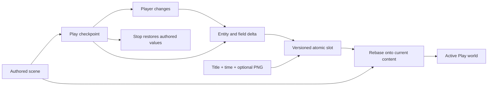

# MORROWIND-AF — Save games and state

Implemented 2026-09-09. Executed checks and limitations are in the
[session acceptance](MORROWIND-2026-09-09.md).

A save records player changes against authored content. Unchanged player fields
inherit later author defaults. Spawned and removed entities have durable IDs;
missing content produces retained diagnostics. Independent cell deltas preserve
unloaded-cell state when another cell is saved.

Format v2 has explicit v1 migration, a content revision, bounded metadata/PNG,
game-owned state and transactional content migration. `SaveSlots` validates slot
names, limits reads and atomically publishes the body and metadata together.
`GameStateStack` reports ordered enter/suspend/resume/exit events for Menu,
Loading, Playing and Paused.

Create **Save Game Slot** and edit Slot, Title, Content Version and optional PNG
in Details. **Choose Save Slot Thumbnail** provides a file picker. Press Play,
then **Save Play Slot** or **Load Play Slot** from Create/the palette. Status
reports the result; loading rejects a mismatched content version until the game
has run its migration. Stop uses the existing authored checkpoint. Game code
uses the public API for custom state and partial cell ownership.

Tests cover author patches, player-only changes, per-cell retention, explicit
null versus deletion, corrupted identities, atomic overwrite, path validation,
format/content migration, lifecycle ordering and the designer load workflow.
Save files are separate from authored scenes and must not be handed to the
ordinary scene-open command.

References: O3DE SaveData and GameState request buses. Original implementation;
see ATTRIBUTION §13H.28.

Session validation: full workspace **2,352 passed, zero failed** (two ignored
doc tests). [Captures, lint and gate results](MORROWIND-2026-09-09.md).
