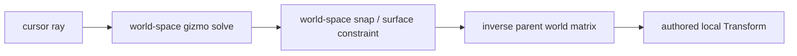

# MORROWIND Construction Set — hierarchy and picking corrections

**Status:** complete, 2026-08-30.

This slice closes two failures that cut across several editor surfaces. Neither
belongs in a widget: the gizmo needed a correct coordinate-space boundary, and
selection needed one component-neutral hit-test boundary.

## Child transforms

The viewport gesture is solved in world space while an ECS `Transform` is
stored relative to its parent. The old implementation added the solved world
delta directly to that local translation, which happened to work under an
unrotated unit-scale parent and failed everywhere else.

`GizmoDragState` now captures the parent's world matrix and inverse at gesture
start. `editor_gizmo` atomically captures every selected follower and its own
parent inverse, because a multi-selection can span hierarchies. If any member
cannot be inverted the entire gesture is refused. Local gizmo axes use the
selected entity's world rotation for rendering, hit testing, and solving; those
three paths therefore cannot disagree about which axis was pressed. A singular
parent has no honest local result and never produces a partial or non-finite
undo record.

## Non-mesh authoring objects

Ordinary click selection, the piercing menu, and asset placement previously
duplicated a mesh-only ray/AABB test. They now call one
`entity_ray_hit_distance` function:

| Entity shape | Pick volume |
|---|---|
| Render mesh | Geometry-pool AABB |
| Decal | Unit local box, transformed by the decal projection transform |
| Light, audio emitter, particle emitter | Small local authoring proxy |
| Entity with no visible or authored volume | None |

The small proxy is intentional. Using a light or audio range would make an
invisible volume intercept clicks metres away and bury the geometry behind it.
Plain click, piercing selection, and drag placement use this same path. The
visible decal/light/audio authoring shapes were also moved onto propagated
world transforms so a parented shape is picked where it is drawn.

## Verification

`cargo test -p somnium_core viewport_control_tests --lib -j 1` passes 16 tests,
and `cargo test -p somnium_core editor_gizmo --lib -j 1` passes the atomic
capture test. The additions prove that a world delta round-trips through a
rotated, non-uniformly-scaled parent; one singular follower refuses the whole
capture; and all four non-mesh authoring component families expose pick bounds
while a plain transform does not.
