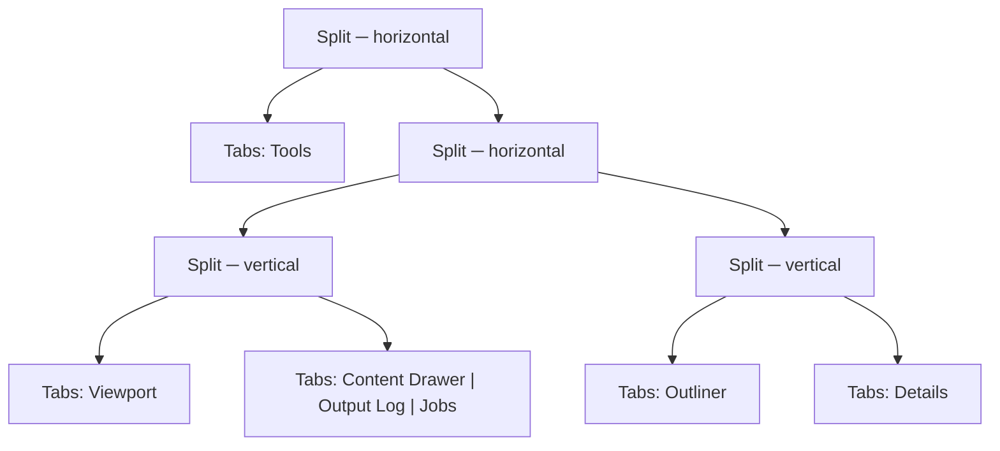

# MORROWIND-J — docking, floating windows, multiple viewports

**Status:** steps 1, 2 and 3 of 4 complete, 2026-08-31. The dock tree exists
and is load-bearing; the Output Log can be pulled out into a real OS window; the
renderer draws several views per frame, each with its own camera, and the
default is still one full-size viewport.

## The four steps, and where this one stops

| Step | State |
|---|---|
| 1. A dock tree (tiles, splitters, tabs) with the current arrangement as the default | **Done** — this record |
| 2. Floating windows as real OS windows via winit | **Done** for the Output Log — see below |
| 3. Multiple viewports, each with its own camera, view mode and overlays | **Done** — see below |
| 4. Layout persistence, named workspaces, reset | Persistence **done**; workspaces and reset already shipped in Phase 26-Zeta-F |

Both expensive halves are done. Step 3 — *"the renderer learns to render more
than one view per frame"* — is measured; step 2 is real OS windows, for one panel
so far and by a mechanism that generalises.

## The constraint that shaped step 1

Phase 26 chose a fixed five-region shell with named workspace presets and ruled
arbitrary docking out on purpose: *"excellent defaults beat unlimited docking"*.
That decision produced `workspace.rs`, eight presets stated in pixels, and a
`shell.rs` that is now 1 850 lines.

MORROWIND-J does not overturn it. It raises the ceiling while keeping the floor:

> *"…with the current arrangement as the **default layout** so nothing looks
> different on first run."*

So the test that matters is not *"can it dock"*. It is *"does anything move"*.

## What was built

`crates/somnium_ui/src/dock.rs` — a binary split tree whose leaves are tab sets,
with one question to answer and four mutations.



The interface is five things: `default_layout`, `resolve`, and `dock` / `close`
/ `activate` / `set_ratio`. Everything a docking UI actually has to get right is
implementation and never reaches a caller:

- **A tile that loses its last tab is removed**, and its surviving sibling is
  promoted into the splitter's place. Dragging Details out of the right column
  leaves the Outliner owning that column, not an empty strip beside it.
- **Closing a tab keeps the same panel in front.** Closing the tab to the left
  of the active one must not change what is shown, which an index does not give
  you for free.
- **A panel cannot appear twice**, and the last panel cannot be closed — an
  empty tree has no rectangle to drop anything back into.
- **Ratios are clamped at resolve time, not at drag time.** A layout carried to
  a small monitor and back comes back unchanged, because the stored ratio was
  never overwritten by the clamp that made it fit.
- **A tile too small for two minimums is halved** rather than given an
  arbitrary winner: at that size there is no honest answer, and an even split is
  at least a stable one under a window being dragged.

`repair` is public for one reason: loading a file is the case where none of the
above can be assumed. A layout on disk may have been written by an older build,
hand-edited, or truncated mid-write.

## Making it load-bearing rather than a model nobody calls

A dock tree with no consumer is dead code, and MORROWIND-A's census names dead
code as a category worth seeing. So every shipped workspace now *is* a dock
tree: `Workspace::preset` states its intent in pixels exactly as before — a
220 px rail for Terrain, a 400 px Details for Lighting, a 35%-of-height log for
Debug — and then goes through `DockTree::from_chrome` and back out through
`DockTree::chrome`.

**The five existing workspace tests pass unchanged.** That is the "nothing looks
different" requirement, verified rather than asserted, and
`every_preset_survives_a_trip_through_the_dock_tree` states it directly: eight
workspaces at four window sizes, every dimension within a pixel of the intent.

Two things the tree can say that the old model could not, both now tested:

- `BottomPanel::None` was a flag carried beside the numbers. In a tree it is the
  **absence of a tile**, which is the difference between describing an
  arrangement and encoding one.
- `chrome` returns `Option`. Once a user docks something, the five-region
  projection has no honest answer, and it says so rather than returning
  plausible numbers for a layout it does not describe. That is what stops the
  projection outliving the thing it projects.

## Persistence

`editor_dock.json`, beside `editor_layout.json` and deliberately **not** inside
it. The two fail differently: a corrupt splitter width costs a column, a corrupt
dock tree costs the whole shell. Separate files mean a tree that will not load
falls back to the shipped arrangement without also discarding a splitter drag,
and a build that predates docking still reads its own file untouched.

`load_dock` cannot fail. Missing, unparsable, or describing an impossible tree
— an empty tile, a panel in two places, a ratio of 40 — all end at the shipped
layout, because an editor that will not open because its layout file is bad is
worse than one that opens looking like it did on install.

## Why `dock.rs` and not more of `shell.rs`

`context.md` names `UiManager` and `Widget` among the largest hubs in the tree,
and `shell.rs` is 1 850 lines of widget construction. Putting the layout algebra
there would have deepened the two things least able to take it, and made every
test of it require a GPU.

Here it is GPU-free and `winit`-free: 19 tests, run by calling one function, and
the shell did not change at all — it still asks for four numbers and a
bottom-panel choice, and those are now *derived from a tree* rather than being
the only representation there is. Step 2 replaces that projection with the
resolved rectangles; nothing in it needs the projection to have been wrong.

## Step 2 — a panel in its own OS window

**Done for the Output Log, 2026-08-31.** A real `winit` child window with its
own `wgpu` surface, its own widget tree and its own pass, opened from the Window
menu and returned to the dock when it is closed.

### A floating panel is not a widget

That is the whole shape of the problem. A second OS window is a second
**surface**, and a surface is what a `UiPass` renders into — so a floating panel
owns a parallel stack, and the interesting question is where to cut it:

```text
   main window            floating window
   ───────────            ───────────────
   winit::Window          winit::Window        ┐ somnium_core: the platform
   wgpu::Surface          wgpu::Surface        │ — windows, surfaces, configs
   wgpu::SurfaceConfig    wgpu::SurfaceConfig  ┘
   ─────────────────────────────────────────────
   UserInterface          UserInterface        ┐ somnium_ui: a widget tree
   UiPass                 UiPass               ┘ — and how to paint one
```

`somnium_ui::floating::FloatingPanel` is everything below the line and nothing
above it, which is what lets the rebuild logic — the part with the bugs — be
tested with no GPU and no event loop at all. `somnium_core` holds the window and
the surface, because it always has.

### Why the panel is rebuilt rather than moved

A widget tree belongs to one `UserInterface`: handles are indices into its pool,
and a node cannot be re-parented across two of them. So detaching a panel means
**building it again** in the new tree from the same data — and that is only
possible when the panel's content is a *store* rather than a pile of widgets.

`log::OutputLog` is exactly that, and it is why the Output Log is the panel that
floats first. A panel whose state lives in its widgets could not be detached
without first being given somewhere else to keep it.

### Three decisions the tests hold down

- **The cache key is the newest entry's id, not the row count.** A log at
  capacity loses a line for every line it gains, so a length-keyed cache would
  freeze the window the moment the buffer first filled. A busy editor logs every
  frame, and a second window that rebuilt a thousand rows to add one would cost
  more than the editor beside it.
- **Closing returns the panel to the dock.** A floated panel hides its docked
  copy — two live Output Logs is not a feature, and the bottom row showing an
  empty one beside a full window is the kind of wrong that makes people distrust
  both. Closing the window puts it back.
- **A zero-sized surface is a validation error, not a small one**, and
  minimising a window is how it happens.

### Two bugs, and the second one was invisible

**A queued message nobody pumps is a message thrown away.**
`UserInterface::process_os_event` does not dispatch: it *queues* a `UiMessage`,
and `update` is what delivers it. The panel's `draw` laid out and painted
without pumping, so every wheel event was accepted, queued, and dropped on the
next frame. The window looked entirely correct and would not scroll.

Worse, it defeated the obvious check. A screenshot before and after scrolling
shows different text either way, because the log keeps growing underneath, so
"the content moved" proves nothing. What settles it is a test that fails without
the fix:

```rust
panel.draw();
let top = panel.rows_origin();
panel.ui.send(/* MouseWheel, delta -600 */);
panel.draw();
assert!(panel.rows_origin() < top);
```

Removing the two `update` calls turns that into `the rows did not move: 0 then
0`, which is the only evidence worth having.

### The bug a second window was always going to find

`window_event` took its `WindowId` as `_window_id` and ignored it — correct for
one window, and precisely the assumption a second one breaks. The first run
crashed:

```
In a CommandEncoder, label = 'Main Render Encoder'
  In a set_scissor_rect command
    Scissor Rect { x: 0, y: 0, w: 1920, h: 1032 } is not contained
    in the render target (900, 420, 1)
```

The floating window's `Resized` had reached the main render context, which
resized the editor's swapchain to the log window's size. Not a wrong picture — a
validation failure, which is the good outcome: the same event reaching the wrong
handler could as easily have been a `CloseRequested` quitting the editor because
somebody shut the log.

Events are routed by id first now, and the handler says so.

### Verification

`SOMNIUM_FLOAT=log` opens the window at startup, so an automated run exercises
the second surface rather than leaving it to a menu nobody clicks in a headless
test. A screenshot of the running editor shows the second window titled
*Output Log — Somnium*, with the OS's own chrome, live log lines in the editor's
own faces, and the main window still at 59 fps.

Five tests cover the detached panel with no GPU: it builds without a window,
rows follow the log, an unchanged log does not rebuild, a log that drops from
the front still does, and a resize is a layout rather than a rebuild.

### What step 2 does not claim

- **Only the Output Log floats.** The mechanism is general and the enum has one
  variant; the next panel is the work of teaching it to rebuild itself from a
  store, which for the Content Drawer and Details means giving them one.
- **The floating window's own controls are not built.** It scrolls, but the
  log's filter chips, search and clear button live in the docked copy.
- **A panel cannot be dragged out**, only opened from the menu. The drag is a
  shell gesture; this is the window underneath it.
- Layout persistence does not remember an open floating window across a restart.

## Step 3 — several views in one frame

**Done, 2026-08-31.** The default is unchanged: one full-size viewport, and the
first-run editor is pixel-for-pixel what it was.

### What "render more than one view per frame" turned out to mean

The frame was one long pipeline over renderer *state* — a view matrix, a
projection and a camera position that whatever ran last had set — writing
full-window into the swapchain. Four views need those to be **arguments**,
because state read off `self` inside a loop is read from the previous iteration.

The middle two thirds of `render_with_game_ui` became `record_scene_view`, a
sibling method rather than a loop body in place. That is a deliberate choice
about *diff shape*: a method body sits at the same indentation as the code it
came from, so eighteen hundred lines moved without a single one being reindented,
and the change is reviewable as a move plus a header.

```
  acquire swapchain, open the Frame scope        once
  ┌─ for each view ──────────────────────────────────────┐
  │  apply camera, mode, overlays                        │
  │  cluster assign, cascades, cull, sort, instances     │
  │  shadows, visibility, GTAO, shading, water, post     │
  │  blit into this view's rectangle                     │
  └──────────────────────────────────────────────────────┘
  gizmos, outlines, editor chrome, game UI       once, primary camera
```

`SceneView::rect` is `Option`, and that is not tidiness: `None` means the whole
surface and keeps a one-viewport frame on the path it was always on — a clear
and a direct write, with no blit to pay for a feature it is not using.

### The bug that made all four tiles identical

`Queue::write_buffer` does not write where you call it. It stages, and the
staged writes are applied **at the start of the submit** — and this renderer
submits once per frame. So four per-view uploads to one buffer all landed before
any pass, and the last write won for the whole frame.

Worse, the last write of the frame is not even a view's: the editor overlays
upload the *unjittered* matrix after the scene, so every view rendered with the
primary camera and the four tiles came out identical. (The same mechanism means
the scene had been rendering unjittered all along — a pre-existing bug this
uncovered, now fixed by the same change.)

The fix is to put the update **into the command stream**: one staging slot per
view, `queue.write_buffer` into the slot, `encoder.copy_buffer_to_buffer` into
the view buffer at the point the passes read it. The alternative — dynamic
offsets on the global bind group — is the textbook answer and would have touched
every pass that binds group 0.

### The second bug: elevations pointed at nothing

The orthographic views orbit "what the primary camera is looking at", and the
first version said that was ten metres ahead of the eye. With the editor camera
a hundred and fifty metres above a coastline, ten metres ahead is empty air: the
top view framed a twenty-metre cube of sky and rendered black. Correct
arithmetic, useless answer, and invisible in a unit test that only checks the
three axes are orthogonal.

The focus is now **where the camera's ray meets the ground plane**, and the
extent is recovered from the primary's own projection — `perspective_rh` puts
`1 / tan(fov_y / 2)` in `y_axis.y` — so the elevations frame exactly what the
perspective view frames. A camera pointed at the sky, where the ray never lands,
falls back rather than diverging to a focus point kilometres away.

### What each view gets, and what it shares

- **Its own camera, projection, rectangle and debug visualisation.** Two
  viewports showing the same picture is not a feature; the interesting
  arrangement is the lit image beside the overdraw.
- **The primary keeps the temporal passes; the secondaries do not.** TAA, FSR
  and ReSTIR carry a history keyed to one camera. A second view reusing it does
  not merely look wrong — it reprojects the other viewport into this one and
  smears. Giving every view its own history is four times the memory for three
  views nobody is looking at closely.
- **Overlays are drawn once, from the primary camera.** A gizmo claimed by the
  top view would appear in the top view's tile at the perspective view's
  position.
- **Everything a secondary borrows is put back.** Without that, a frame that
  once drew four viewports leaves TAA off for every frame after it — the shape
  of a bug that only appears after you have used a feature and stopped.

### The measurement

`.somtime`, on an RTX 5080 Laptop at 1920×1032, back to back:

| | GPU frame | unattributed |
|---|---|---|
| 1 viewport (default) | **21.64 ms** | 0.7% |
| 4 viewports | **28.06 ms** | 1.7% |

**Four views cost 1.30× one view, not 4×.** The expensive perspective view is
paid once and the three elevations are orthographic, history-free and cheap. Per
scope the rows read *faster* in the four-up run, which is not a saving: a scope's
mean is per **occurrence**, and three of the four occurrences are the cheap ones.

Two things in the harness had to be fixed to get an honest number at all, and
both were measuring the harness rather than the engine:

- **`MAX_SCOPES` was 64** and one view opens about 25. A four-up frame silently
  dropped half its queries, which does not report as "the profiler ran out" — it
  reports as 50% unattributed frame time, indistinguishable from an engine full
  of unbracketed passes and the more alarming of the two readings. Now 192.
- **`unattributed_pct` summed means.** A pass occurring four times a frame was
  counted once, reporting 75% unattributed. The occurrence count was already in
  the file — a row's samples over the frame's — so the weighting is a division,
  not new data.

### In the editor

Window menu, beside the workspace presets, because that is where a user looks
for *how is the editor arranged*: **Viewports: 1** (the default), **2 Side by
Side**, **2 Stacked**, **4**. Four named entries rather than one cycling button:
a cycle is the right control for a mode with two states and the wrong one for
four arrangements you pick between, where it hides three behind pressing the
fourth again. `SOMNIUM_VIEWPORTS=1|2|2h|4` selects one for a `.somtime` run,
which is non-interactive.

### What step 3 does not claim

- **Every view renders at the full internal resolution** and is scaled into its
  tile. Correct, and four times the pixels a quarter-tile needs; per-view render
  targets are the fix and they are also four times the memory.
- **Only the primary view can be flown.** The elevations follow it. Clicking
  into a tile to give it the camera is a shell change, not a renderer one.
- **Gizmos, the selection outline and picking are the primary view's.** A click
  in a secondary tile picks through the primary camera.
- Step 2, floating OS windows, is still not started.

## What step 1 does not claim

No panel can be dragged to a new dock in the running editor yet. The tree can
express the arrangement, mutate it correctly and persist it; the shell does not
yet render a drop target or resolve tiles directly. That is the first half of
step 2, and it is a shell change rather than a model one — which was the point
of doing the model first.
