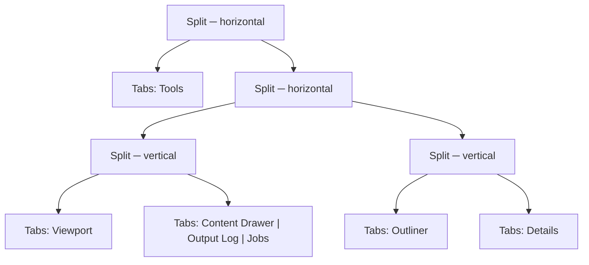

# MORROWIND-J — docking, floating windows, multiple viewports

**Status:** step 1 of 4 complete, 2026-08-30. The dock tree exists, is
load-bearing, and expresses every arrangement the editor ships.

## The four steps, and where this one stops

| Step | State |
|---|---|
| 1. A dock tree (tiles, splitters, tabs) with the current arrangement as the default | **Done** — this record |
| 2. Floating windows as real OS windows via winit | Not started |
| 3. Multiple viewports, each with its own camera, view mode and overlays | Not started |
| 4. Layout persistence, named workspaces, reset | Persistence **done**; workspaces and reset already shipped in Phase 26-Zeta-F |

Steps 2 and 3 are the expensive halves — step 3 in particular is where *"the
renderer learns to render more than one view per frame"*, and the plan already
attaches a `.somtime` row for the four-viewport case to it. Neither is started,
and neither is blocked by anything here.

## The constraint that shaped step 1

Phase 26 chose a fixed five-region shell with named workspace presets and ruled
arbitrary docking out on purpose: *"excellent defaults beat unlimited docking"*.
That decision produced `workspace.rs`, eight presets stated in pixels, and a
`shell.rs` that is now 1 850 lines.

MORROWIND-J does not overturn it. It raises the ceiling while keeping the floor:

> *"…with the current arrangement as the **default layout** so nothing looks
> different on first run."*

So the test that matters is not *"can it dock"*. It is *"does anything move"*.

## What was built

`crates/somnium_ui/src/dock.rs` — a binary split tree whose leaves are tab sets,
with one question to answer and four mutations.

The interface is five things: `default_layout`, `resolve`, and `dock` / `close`
/ `activate` / `set_ratio`. Everything a docking UI actually has to get right is
implementation and never reaches a caller:

- **A tile that loses its last tab is removed**, and its surviving sibling is
  promoted into the splitter's place. Dragging Details out of the right column
  leaves the Outliner owning that column, not an empty strip beside it.
- **Closing a tab keeps the same panel in front.** Closing the tab to the left
  of the active one must not change what is shown, which an index does not give
  you for free.
- **A panel cannot appear twice**, and the last panel cannot be closed — an
  empty tree has no rectangle to drop anything back into.
- **Ratios are clamped at resolve time, not at drag time.** A layout carried to
  a small monitor and back comes back unchanged, because the stored ratio was
  never overwritten by the clamp that made it fit.
- **A tile too small for two minimums is halved** rather than given an
  arbitrary winner: at that size there is no honest answer, and an even split is
  at least a stable one under a window being dragged.

`repair` is public for one reason: loading a file is the case where none of the
above can be assumed. A layout on disk may have been written by an older build,
hand-edited, or truncated mid-write.

## Making it load-bearing rather than a model nobody calls

A dock tree with no consumer is dead code, and MORROWIND-A's census names dead
code as a category worth seeing. So every shipped workspace now *is* a dock
tree: `Workspace::preset` states its intent in pixels exactly as before — a
220 px rail for Terrain, a 400 px Details for Lighting, a 35%-of-height log for
Debug — and then goes through `DockTree::from_chrome` and back out through
`DockTree::chrome`.

**The five existing workspace tests pass unchanged.** That is the "nothing looks
different" requirement, verified rather than asserted, and
`every_preset_survives_a_trip_through_the_dock_tree` states it directly: eight
workspaces at four window sizes, every dimension within a pixel of the intent.

Two things the tree can say that the old model could not, both now tested:

- `BottomPanel::None` was a flag carried beside the numbers. In a tree it is the
  **absence of a tile**, which is the difference between describing an
  arrangement and encoding one.
- `chrome` returns `Option`. Once a user docks something, the five-region
  projection has no honest answer, and it says so rather than returning
  plausible numbers for a layout it does not describe. That is what stops the
  projection outliving the thing it projects.

## Persistence

`editor_dock.json`, beside `editor_layout.json` and deliberately **not** inside
it. The two fail differently: a corrupt splitter width costs a column, a corrupt
dock tree costs the whole shell. Separate files mean a tree that will not load
falls back to the shipped arrangement without also discarding a splitter drag,
and a build that predates docking still reads its own file untouched.

`load_dock` cannot fail. Missing, unparsable, or describing an impossible tree
— an empty tile, a panel in two places, a ratio of 40 — all end at the shipped
layout, because an editor that will not open because its layout file is bad is
worse than one that opens looking like it did on install.

## Why `dock.rs` and not more of `shell.rs`

`context.md` names `UiManager` and `Widget` among the largest hubs in the tree,
and `shell.rs` is 1 850 lines of widget construction. Putting the layout algebra
there would have deepened the two things least able to take it, and made every
test of it require a GPU.

Here it is GPU-free and `winit`-free: 19 tests, run by calling one function, and
the shell did not change at all — it still asks for four numbers and a
bottom-panel choice, and those are now *derived from a tree* rather than being
the only representation there is. Step 2 replaces that projection with the
resolved rectangles; nothing in it needs the projection to have been wrong.

## What step 1 does not claim

No panel can be dragged to a new dock in the running editor yet. The tree can
express the arrangement, mutate it correctly and persist it; the shell does not
yet render a drop target or resolve tiles directly. That is the first half of
step 2, and it is a shell change rather than a model one — which was the point
of doing the model first.
