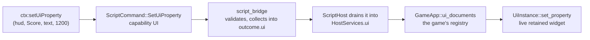

# MORROWIND-M2 — the GUI layout editor

**Status:** items 1–4 complete, 2026-08-30. Item 5 waits on MORROWIND-O.

## The claim being tested

Track 1 gave a game a UI framework and left authoring to code. M2's argument is
that Somnium can close that gap cheaply because **the editor is the framework** —
same retained tree, same paint layer, same measure and arrange — so authoring
game UI is mostly plumbing rather than a second system.

| Item | State |
|---|---|
| 1. A `.somui` document asset: widget tree, anchors, versioned serialisation | **Done** |
| 2. A canvas-mode viewport that edits one | **Done** as a headless model; shell projection in `hello_engine` |
| 3. The widget palette generated from registered widget types | **Done** |
| 4. Load and instantiate from Rust **and from Luau** | **Done** |
| 5. Prefabs for reuse | **Blocked** — MORROWIND-O has not shipped |

## The registry had to come first

> *"The widget palette generated from the registered widget types — not a second
> hand-written list, per CONTROL-A2's command registry precedent."*

There was no such registry. Thirty-one builders each knew how to construct
themselves and nothing knew they existed, so a palette would have been a
hand-written list that rots the first time a widget is added or renamed.

`somui::KINDS` is that list once, and it carries **two** function pointers per
kind: how to build the widget, and how to write a live property to it. Both in
one entry, so a widget added to the authoring surface says how it is built and
how it is driven in the same place. The palette enumerates it, the loader looks
up in it, and validation rejects anything absent from it — naming the element
and the kind, rather than dropping the element and rendering a hole.

## The document

Anchors, offsets and a pivot per element, properties as values, children in
order. Nothing about entities, transforms or the world: a `.somui` is loaded
*into* a canvas, and the canvas (MORROWIND-E) is what knows about screens and
world space. `UiElement::anchoring()` returns a runtime `Anchoring` directly —
the document cannot describe a placement the runtime does not already
understand, which is what stops it becoming a second layout system.

Validation reports **every** problem rather than the first, because a document
with four unknown kinds should say so once rather than across four loads.
A document from a newer build is refused rather than guessed at; an older one is
migrated, and there is nothing to migrate yet, which is exactly when the
mechanism has to exist.

## Item 4, which is the proof clause

> *"If a `.somui` authored in the editor cannot be loaded by
> `examples/vvardenfell` and driven by script, Track 1 built a framework nobody
> can reach."*

Rust loading was the easy half. The chain for script:

Five decisions in that, each of which had an easier wrong answer:

- **`UI` is its own capability**, not `WRITE_FIELDS`. A HUD is what the player
  reads, and a script permitted to set an entity's health should not thereby be
  able to rewrite the number shown for it.
- **`somnium_script` never learns `somnium_ui`'s types.** A script crate that
  depended on the widget crate is how a headless build stops building, so the
  command carries a three-variant `UiValue` and the widening to `somui::Value`
  happens at the single point that knows both vocabularies.
- **The bridge collects rather than applies**, exactly as it does for audio. The
  documents belong to the game — how many there are and what they are called is
  not something an engine can decide — so `GameApp::ui_documents` asks, and the
  engine ships `somui_host::UiDocuments` so the ordinary game does not write the
  same thirty lines.
- **Names all the way through.** Document, element and property are all
  author-given names. Nothing in the path is an index, so reordering a document
  in the editor, or a widget pool handing out different handles on the next
  load, leaves every script that drove it still correct.
- **Every wrong address says which part was wrong.** A misspelled property is a
  named error, not silence — silence during play is the hardest thing there is
  to trace back to a typo — and a game that never answered `ui_documents` gets
  one line saying exactly that rather than a HUD that quietly never updates.

**One bug this found on the way in.** `Capabilities::PROJECT` was the literal
`0x1FF`, nine bits, and the test that guards it read `for bit in 0..9`. Adding a
tenth capability would have left every project script silently unable to use it
while the test kept passing. `PROJECT` is now `0x3FF` and the bound is
`Capabilities::BIT_COUNT`, so the two cannot drift apart unnoticed.

## Verification

- 27 tests in `somui`, including the registry being the palette's only source,
  a document round-tripping, validation naming every problem, and a property
  write reaching a live widget and surviving the relayout that follows it.
- `somui_host` covers the registry: a write reaching the widget it names, three
  wrong addresses producing three different messages, a reload replacing rather
  than stacking, and a broken document registering nothing.
- `a_luau_script_drives_an_authored_somui_document` is the whole chain in one
  test: Luau calls `setUiProperty`, and a live retained widget changes. No
  window, no mock.
- `a_ui_write_with_no_documents_is_reported_rather_than_dropped` pins the noisy
  failure.

Read-back goes through `a11y_probe` rather than a new inspection API: a `Text`
control already reports its string as its accessibility name, and that is the
same string a screen reader speaks.

## What remains

Item 5 needs MORROWIND-O's prefabs, which have not shipped. The plan is explicit
that a UI panel should *be* a prefab rather than get a UI-specific nesting model,
so inventing one here would be building the thing O is for.
