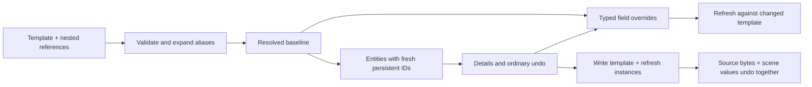

# MORROWIND-O — Prefabs

Implemented 2026-09-09. See [session acceptance](MORROWIND-2026-09-09.md) for
executed tests, captures and gate results.

`.somprefab` stores a versioned schema scene fragment, durable local IDs and
nested template references. Expansion validates aliases, cycles and size/depth
budgets before touching the world. Instances keep a resolved baseline; edits
become schema field overrides. Refresh preserves live handles and internal
references, while removed content retains orphaned overrides for recovery.

Scene v4 stores instance links and accepts v3 scenes. Missing/unknown schema
data retains the existing scene compatibility contract. Rebuilding overrides
above `ChangeScope::Field` are explicitly rejected; break the link before using
those owning workflows.

Designer commands live in Create and the command palette: **Create Prefab from
Selection**, **Instantiate Prefab**, **Edit/Exit Prefab Editing**, **Add Nested
Prefab**, **Propagate Prefab Edits**, **Revert Prefab Overrides**, and **Break
Prefab Link**. Select one hierarchy root when creating a template. Group
unrelated entities first. Sources stay inside the project; the editor resolves
nested templates beside the source. Runtime callers can supply any explicit
`PrefabLibrary`.

The Outliner marks instances and the selected override count. **Prefab
Instance** in Details lists source, alias path, changed fields and orphan
status. Enter/Exit marks the current editing instance; the ordinary scene
selection and Details remain the authoring surface.

Acceptance tests cover independent instance edits, v3/v4 round-trip, nested
expansion/cycles, entity-reference remapping, template propagation, removed
content, scope rejection, source-aware undo and normal clone identity.

References: O3DE Prefab `Instance.h` (alias ownership), Flax `Prefab.h`
(template/instance separation). Original Rust implementation; provenance is in
ATTRIBUTION §13H.28.

Session validation: full workspace **2,352 passed, zero failed** (two ignored
doc tests). [Captures, lint and gate results](MORROWIND-2026-09-09.md).
