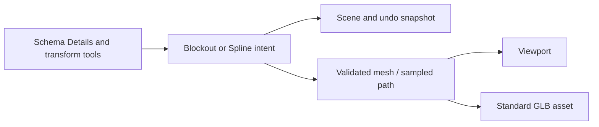

# MORROWIND-P — Splines and blockout

Date: 2026-09-09. Implementation and native authoring routes are in tree;
session verification is recorded below. This builds on the existing shoreline
spline rather than introducing a second path representation.

## Delivered

- `SplineComponent` retains automatic Catmull-Rom tangents and closed loops.
  Its version-2 schema adds optional explicit per-point local derivatives;
  old scenes receive an empty array and retain their existing curve shape.
  `arc_length(model)` produces a reusable world-metre lookup table whose
  distance samples clamp on open paths and wrap on closed paths.
- Existing spline viewport polylines/control markers and schema-driven point
  editing consume that same component. Tangent edits immediately change the
  sampled curve, audio closest-point queries and river path consumers.
- `BlockoutComponent` describes boxes, ramps, stairs and cylinders. Shape,
  full dimensions and subdivision count are ordinary component-schema fields.
  The existing transform gizmo moves, rotates and scales the geometry in the
  viewport; Details changes its parametric construction. This is the same
  reflection mechanism that saves scenes and drives field undo.
- `blockout::sync` rebuilds changed authored geometry before rendering and
  reconstructs unsaved GPU state after scene load. Mesh generation validates
  finite positive dimensions, supported shape and bounded subdivisions before
  allocating. Unchanged descriptions do not rebuild.
  Identical blockouts share their existing GPU allocation, including scatter
  batches. The winding regression also corrected inverted caps in the existing
  cylinder primitive generator.
- `Create Blockout` and `Export Blockout Mesh` are registered native editor
  commands. Export writes a standard `.glb` consumed by the existing glTF
  importer and cooker. The source blockout remains editable.
- Entity creation/deletion snapshots, duplication and subtree clipboard retain
  blockout/spline intent. Deletion undo restores durable identity; copy and
  duplication use fresh identity and break generic prefab linkage.

## Verification

The dedicated tests exercise outward mesh winding and finite normals for all
four shapes; GLB export followed by the real glTF importer; invalid dimensions
and subdivisions; scene roundtrip plus delete/restore; authored tangents with
unchanged endpoints; distance-based world-space sampling, clamping and loops.
The prior spline nearest-point and transform tests remain in place.

Core test execution is consolidated in this session's final verification
record. No GPU screenshot or interactive pointer acceptance is asserted by
these headless tests.

## How to use

Open the command palette and run **Create Blockout**. Select the entity and
edit its **Blockout** fields in Details: choose **Box**, **Ramp**, **Stairs** or
**Cylinder** from the Shape dropdown. **Size** is full local width/height/depth; **Segments** controls
stairs or cylinder sides. Use the normal viewport transform tools. Run
**Export Blockout Mesh** to save a reusable GLB.

For a spline, use **Create Spline**. Edit **Points**, **Closed** and optional
**Tangents** in Details. Each tangent entry is a local derivative corresponding
to the point at the same index; omitted entries stay automatic.

## Design and references

Read `context.md`, the MORROWIND plan, the current spline/core/asset/UI code,
the Graphify report and recent git history. The stale plan's claim that
general spline authoring was entirely absent did not match current code.
Applied the installed `rust-pro` and `codebase-design` skills.

Reference study used the local engine collection at
`C:/Users/adhir/Downloads/GE/example_repo`:

- `bevy-plugins/bevy_trenchbroom-main/src/fgd.rs` and `brush.rs`
  (MIT OR Apache-2.0): reflected entity definitions shared with level-authoring
  classes, and geometry conversion.
- `o3de-development/o3de-development/Gems/WhiteBox/Code/Source/WhiteBoxComponent.h`
  (Apache-2.0 OR MIT): authored geometry separated from render allocations.

These were architecture references; no source code was copied. Somnium uses
its existing schemas, procedural primitives, mesh importer and graph-independent
spline component.

## Deliberate limits

This is parametric blockout, not arbitrary convex brush face/edge editing or a
Quake-map importer. Spline point/tangent values are edited through Details;
the existing viewport curve/control markers remain the visualization. Geometry
replacement uses the renderer's current shared allocation pool. Repeated shape
edits consume new ranges until that pool is rebuilt; no allocator reclamation
feature is claimed here.

The `vvardenfell` example consumes the public blockout, spline, prefab and
scatter interfaces alongside animation, navigation, behavior and save/rebase.
It queues navigation through `EngineContext.navigation` and uses the engine's
existing scheduler and update owner. The patrol actor attaches the shipped
`assets/scripts/morrowind_ai_patrol.luau` through the public ScriptHost.

Session validation: full workspace **2,352 passed, zero failed** (two ignored
doc tests). [Captures, lint and gate results](MORROWIND-2026-09-09.md).
