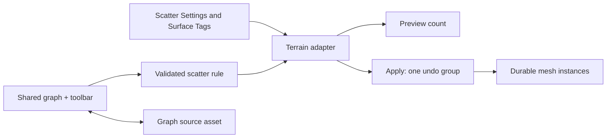

# MORROWIND-P2 — Rule-driven scattering

Date: 2026-09-09. The shared graph adapter, deterministic evaluation and native
scene-bake route are implemented. Asset and UI verification is complete; core
integration verification is consolidated in the session record.

## Delivered

`somnium_asset::scatter` evaluates authored rules without editor or renderer
dependencies. Its sources are constant, seeded smooth noise, bilinear image,
world altitude, surface slope, radial distance and axis-aligned shape. Multiply,
invert, inclusive distribution filters, weighted surface-tag tests and exclusion
volumes compose through the same scalar weight path.

World-grid coordinates and independent hash salts determine candidate position,
acceptance, yaw and scale. Adjacent regions have identical shared candidate
positions; changing density preserves accepted candidates' positions. Grid and
jittered distribution use the same spacing convention. Validation rejects
invalid numeric values and oversized candidate/instance budgets before work.

The `somnium.scatter` catalogue uses MORROWIND-K's existing GraphSurface and
GraphEditor: typed gradient pins, palette, literals, pan/zoom, connections,
undo/redo and versioned document save/load. A noise → distribution filter →
output starter graph produces usable placements immediately. Compilation rejects
missing inputs, invalid literals, duplicate outputs, unsupported parameter wires
and excessive graph expansion. There is no second canvas or history model.

The native **Scatter Graph**, **Save Authoring Graph**, **Open Authoring Graph**
and **Apply Authoring Graph** routes open/save the graph and bake a selected
procedural mesh or blockout. **Create Scatter Settings** adds an Outliner profile
whose Details expose width, depth and X/Z offset; a source-local settings component
takes priority over the scene profile. The default region is a 20-metre square.
Terrain ray hits
provide height and slope; absent terrain uses a plane at the source's height.
`SurfaceTagsComponent` exposes names and weights through the ordinary component
schema, and the highest terrain hit supplies its classifications. Every surface
also has the `ground` tag. Image nodes load their referenced source path once and
map the image over the bake rectangle; missing images report a command error.

The bake returns ordinary entity snapshots, grouped into one undo step. Each
instance retains durable procedural/blockout mesh intent, material, scale and
surface-aligned orientation with a fresh PersistentId. Applying a graph is an
explicit bake and the source entity remains available.

The full graph surface has visible Scatter/Behavior tabs, a searchable **Add
Node** palette, **Open**, **Save**, **Preview** and **Apply**. It retains each
catalogue's document and undo history when switching, shows its source filename
and dirty marker, and reports errors in a footer without replacing the graph.
Save updates the opened asset and permits incomplete source drafts; Preview and
Apply require a valid runtime graph. Preview computes the actual accepted count
without creating scene entities. Scatter/behavior use the whole graph pane;
animation restores the paired timeline.

## Verification

- `cargo test -p somnium_asset scatter:: --lib --offline -j 1`: **3 passed**.
  Deterministic repeat and adjacent-region equivalence; density stability;
  sources/tags/exclusions; bilinear image sample; invalid values and budgets.
- `cargo test -p somnium_ui graph::scatter --lib --offline -j 1`: **2 passed**.
  Literal editing/undo, actual shared graph JSON save/reload, compilation and
  nonempty runtime placement; invalid input and duplicate output errors.
- `cargo test -p somnium_ui graph:: --lib --offline -j 1`: **47 passed** after
  toolbar integration. Includes retained document/history/source switching,
  filtered Add Node palette and invalid-Apply preservation.
- `scatter_scene` has a core integration test for retained mesh intent and
  distinct persistent identities. The clipboard regression checks fresh copy
  identity, stable redo identity and breaking source prefab linkage.

No GPU screenshot, visual distribution judgement or imported-foliage acceptance
is claimed by these headless tests.

## How to use

1. Create and select a **Cube**, **Sphere**, **Cylinder**, **Plane** or **Blockout**.
2. Run **Scatter Graph** in the command palette. Edit the starter graph or add
   gradient/filter nodes from its palette.
3. Run **Create Scatter Settings** and edit its width/depth/offset in Details,
   then reselect the source mesh. In **Scatter Output**, set spacing, density,
   seed, jitter, scale bounds and
   the instance limit. Density is instances per square metre before masking;
   spacing sets the maximum candidate population.
4. Click **Preview** for the actual instance count, then **Apply**. Inspect the terrain-aligned scene placements;
   one Undo removes the whole bake. Save the graph for reuse and save the scene
   to retain baked placements.

To classify terrain, add **Surface Tags** through the schema component menu,
edit names/weights, then wire a matching **Surface Tag** node into the graph.
Shape/exclusion node bounds and distance centers are world-space coordinates.

Native capture fixtures: `SOMNIUM_AUDIT_UI_STATE=morrowind-scatter` and
`morrowind-behavior`, using the existing editor capture harness.

## Design and references

Read the current phase plan, `context.md`, Graphify report, core foliage/terrain
and scene paths, graph catalogue/surface/serialization, asset mesh interfaces and
recent git history. Applied the installed `rust-pro` and `codebase-design` skills.

O3DE study used these files under the user's local
`C:/Users/adhir/Downloads/GE/example_repo/o3de-development/o3de-development`:

- `Gems/Vegetation/Code/Source/Components/DistributionFilterComponent.cpp`:
  inclusive gradient thresholds applied to instance positions.
- `Gems/GradientSignal/Code/Source/Components/SurfaceAltitudeGradientComponent.cpp`:
  surface-height remapping into a scalar source.
- `Gems/SurfaceData/Code/Include/SurfaceData/SurfacePointList.h`:
  sampled positions, normals and classification weights.
- `Gems/LandscapeCanvas/Code/Source/Editor/Nodes/Gradients/SlopeGradientNode.cpp`:
  a feature-specific node attached through a shared graph framework.

All are Apache-2.0 OR MIT. They informed the design; no source was copied.

## Deliberate limits

The current native bake supports procedural meshes and blockouts. Imported
meshes without durable source identity are rejected with a clear error instead
of saving invalid GPU offsets. This is an explicit bounded bake, not automatic
continuous regeneration, streaming vegetation sectors, prefab scattering or
Poisson-disc placement. The pre-existing paint brush remains usable. Arbitrary
tagging is per ground entity; painted per-pixel material classifications are not
automatically converted into tags.

Session validation: full workspace **2,352 passed, zero failed** (two ignored
doc tests). [Captures, lint and gate results](MORROWIND-2026-09-09.md).
