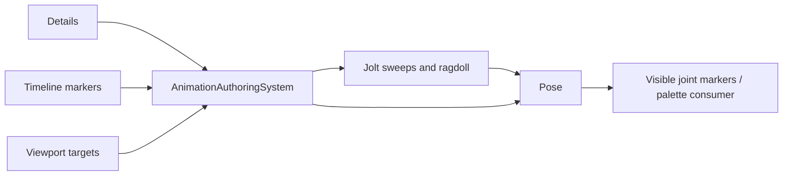

# MORROWIND-W — root motion, IK, events and ragdolls

**Implementation complete, 2026-09-09. Workspace tests passed; see the session acceptance record.**

The animation crate still produces poses; only palette matrices cross U's
renderer seam. No renderer layouts, shaders or rendering defaults changed.

## Designer workflow

Create an **Animation Preview Rig** from the editor command surface. Its visible
Hip/Knee/Foot markers and draggable Reach/Look targets are ordinary scene
entities; targets are parented to the rig, so copy/delete includes them.
**Details → Animation** groups Playback, Root Motion, Limb IK, Ground Adaptation,
Look At, Ragdoll and Events. Weights, targets, joint indices and capsule/constraint
settings affect the live preview. Preview status reports invalid configurations.
Reset rewinds the rig and releases its physical preview.
Translated/rotated parent hierarchies and same-frame target edits are resolved
in world space; accepted root travel is stored back in local space. Physical
preview reports unsupported world scale/shear. Invalid edits resume at the last
accepted time, preventing movement or event debt. Scene/play transitions release
jobs and ragdolls without overwriting newly loaded authored transforms.

The Events command opens the existing visual Animation timeline. Named markers
become deterministic hooks. Saving writes a `.somtimeline` asset, binds its path
to the rig and reloads it; no JSON editing is required. Details also shows the
last emitted event and count. `AnimationAuthoringSystem::bind_clip` uses the same
controls with an imported/game clip; built-in stride/turn controls describe only
the supplied preview clip.

## Runtime and physics integration

- `AnimationClip::sample_root_motion` returns an in-place pose and rigid root
  displacement. Root translation/rotation are reset to skeleton rest while
  authored scale remains. Unwrapped time supports long frames, arbitrary loop
  counts, reverse/scaled playback and non-looping endpoint clamping. Rotating
  cycles compose rigid transforms rather than multiplying a translation vector.
- `collide_and_slide` is a bounded five-contact solver. Core's
  `move_character_root_motion` uses actual Jolt capsule sweeps, rejects the
  character's own body, applies accepted translation and updates an optional
  kinematic body. Tangential floor contacts do not hide blocking walls. Blocked
  root displacement is consumed during that frame, never stored as future debt.
  The controller is an upright capsule, with caller-owned gravity/jump input.
- `TwoBoneIk::solve` rotates a validated limb chain without changing bone
  lengths. Pole targets determine bend direction; unreachable targets clamp.
  `adapt_foot` consumes an optional ground contact, applies sole clearance and
  aligns foot-up to the ground normal. `look_at` applies a weighted angle cone.
  Targets are model-space; non-unit scale is explicitly rejected because the
  solver does not pretend a sheared matrix is a rigid limb. Invalid operations
  leave the input pose untouched. Orientation warping remains optional/unadded.
- `EventTrack::sample` emits named hooks and payloads in deterministic authored
  order. Forward intervals are `(previous, current]`; reverse intervals are
  `[current, previous)`. All crossed cycles are sampled, and equal-time events
  retain their authored order. Events at duration are authored at zero instead.
  An explicit output budget rejects an oversized result rather than dropping
  footsteps/gameplay hooks silently. Consumers route those hooks to sound/game
  systems; this module does not own an audio engine or script VM.
- `PhysicsWorld::{create_ragdoll,ragdoll_pose,set_ragdoll_pose,destroy_ragdoll}`
  expose actual Jolt `RagdollSettings` and `SwingTwistConstraintSettings`, already
  included in the vendored build. Capsules have authored world anchors and
  angular limits; parent/child collisions are disabled. The world owns native
  references and removes constraints/bodies before destroying Jolt. Opaque ids
  reject stale and cross-world ragdoll handles. Pose seeding validates all joints
  before mutation and resets velocities/constraint warm starts.
- `blend_ragdoll` combines physical model transforms with animation, including
  unmapped animated joints. Core's `blend_jolt_ragdoll` reads a live constrained
  ragdoll, applies world-to-character and body-to-joint conversions, then crosses
  the same pose seam. Weights zero and one support animation recovery and fully
  simulated poses; intermediate weights blend continuously.

## Verification

`somnium_anim/src/morrowind_tests.rs` covers multi-loop/reverse/turning root
motion, event interval partition invariance and budgets, wall slide/no-debt,
IK reach/length/clamping/invalid input, foot normals, look-at limits and ragdoll
pose conversion/recovery. `somnium_physics/tests/animation_bridge.rs` exercises
a real Jolt wall sweep, a constrained two-body ragdoll falling under gravity,
joint anchor correction after an explicit disturbance, pose reseeding and native
destruction/stale ids. Core tests cover parented rigs, stale transform caches,
scene-boundary cleanup and recovery after invalid live edits.

The existing native bridge initializes Jolt process-global state. The native
acceptance test therefore uses one world; simultaneous independent world
construction was a pre-existing unsupported lifecycle and is not claimed here.
No rendered character capture or crowd GPU measurement is invented. U's open
crowd measurement and V's visual sync-on/off capture retain their prior status.

## References and design

Read `context.md` animation/simulation sections, U/V records, git history
`54f59a8`/`5aad46d`, and Graphify's animation/example dependency entries. Applied
the installed `rust-pro` and `codebase-design` skills.

Read permissive Esoterica `AnimationRootMotion.h`,
`TaskSystem/Animation_PoseTask.h` and `Tasks/Animation_Task_FootIK.cpp` for rigid
motion, pose-stage and target-space contracts. Esoterica's documented root
delta assumes a single loop; Somnium explicitly implements multiple loops and
reverse travel. Analytic IK, event enumeration and collision slide are original
implementations. Vendored Jolt `Ragdoll.h`, `SwingTwistConstraint.h`,
`NarrowPhaseQuery.h`, `ShapeCast.h` and `BodyFilter.h` were read to call their
existing public interfaces. No engine source was copied. Attribution is in
`ATTRIBUTION.md` §13H (session W/W2 entry).

Session validation: full workspace **2,352 passed, zero failed** (two ignored
doc tests). [Captures, lint and gate results](MORROWIND-2026-09-09.md).
