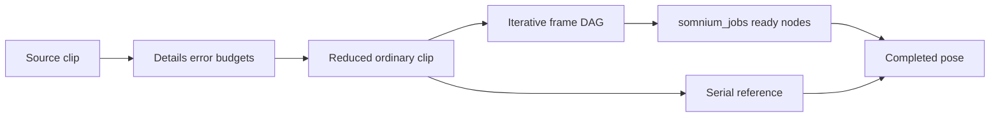

# MORROWIND-W2 — curve compression and pose task graphs

**Implementation complete, 2026-09-09. Workspace tests passed; see the session acceptance record.**

Designers use **Details → Animation → Compression** to enable fitting and adjust
translation, rotation and scale error budgets. The live read-only report shows
retained/source keys and bytes. **Playback → Evaluate on Jobs** switches the
actual preview between dependency jobs and serial evaluation. These edits retain
the preview clock; target/weight edits do not recook clips or reset ragdolls.

## Compression

`AnimationClip::compress` fits channels against separately declared translation
(metres), rotation (radians) and scale-vector error budgets. It returns an
ordinary validated `AnimationClip` plus source/retained key and payload-byte
counts. Existing clip sampling, graph nodes and sync tracks consume the reduced
tracks directly; there is no second decoder or renderer format. Clip identity,
sync tracks, empty channels and endpoints remain stable. Zero error retains a
channel verbatim, and invalid budgets fail before building an asset.

Vector error is bounded continuously because the difference between original
and fitted linear curves is affine on every original key span. Quaternion
segments use adaptive angular-distance/Lipschitz bounds. If a bound cannot be
certified within twelve subdivision levels the reducer retains keys; sparse
measurements are never substituted for an error guarantee. Reduction uses an
explicit interval stack and deterministic authored order. No new codec or
external compression dependency was introduced.

## Pose jobs

`Arc<AnimGraphAsset>::pose_tasks` and `pose_tasks_for_node` compile the selected
frame into a dependency DAG with an iterative worklist. Clip sampling,
one/two-dimensional blends, bone masks, layers, caches and forced sync phases
remain supported. Shared work is keyed by node **and phase**, so a node reached
from differently synchronized branches cannot alias. Sync-leader lookup is
iterative too. `StateMachinePlayer::pose_tasks` schedules both transition lanes
and a final blend with the same adjusted target clock as serial sampling.

`PoseTaskGraph::start` creates a `PoseEvaluation`, which is polled without
blocking. Ready tasks alone enter `somnium_jobs`; a worker never waits for a
dependency job. The caller bounds in-flight work. A full shared queue is retried
on later polls, and failures/cancellation never publish a partial pose. Explicit
cancellation and dropping an evaluation cancel outstanding handles. Finished
poses cross the usual palette seam on the caller. Jobs carry the
`animation.pose` profiler name, Visible priority and housekeeping flag. No
additional pool or thread spawning was added.

The serial interface remains available as a deterministic reference and for
small callers. The task interface executes actual node dependencies on the
shared workers; it does not wrap recursive graph evaluation in a single job.
Frame plans own immutable graph/skeleton references and frame-local pose caches;
they do not retain stale state across graph revisions or parameter changes.

## Verification

Compression tests require fewer keys and bytes, deterministic output and dense
cross-checks against the original clip. Job tests compare full poses against
serial evaluation with sync tracks, layers, masks and caches; exercise a real
two-worker pool with a queue capacity of one; check cancellation and one-shot
result consumption; and compare synchronized transition lanes.
Core authoring tests exercise the designer-facing rig, job toggle parity,
draggable-target IK, clock preservation, reset and schema scene round-trip of
target references and compression settings.

Motion matching is deliberately outside this phase. A future cook extension
would store per-frame sample time, root velocity/facing trajectory and selected
joint positions/velocities as feature vectors, together with the skeleton and
clip identity used to build the database. Reduced channels remain ordinary
clip data; feature vectors are not fabricated or shipped as empty placeholders.

Read Esoterica `TaskSystem/Animation_PoseTask.h` for dependency and physics-stage
contracts. Somnium's iterative frame compiler and polling scheduler are original
Rust code, using the existing `somnium_jobs` seam rather than Esoterica's pool.
The context, U/V history and skills consulted are recorded in MORROWIND-W.

Session validation: full workspace **2,352 passed, zero failed** (two ignored
doc tests). [Captures, lint and gate results](MORROWIND-2026-09-09.md).
