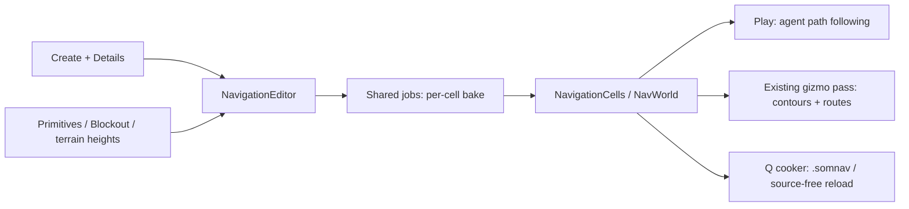

# MORROWIND-X — navigation and pathfinding

Implemented 2026-09-09. `somnium_ai::navigation` owns the bake, queries and
agents; `somnium_core::ai` connects them to cells, shared jobs, cooking and the
editor. Final validation is recorded in the dated session report.

## Designer workflow

1. Choose **Create Navigation Volume**, position its amber volume and set bounds,
   tile/voxel size, slope and agent clearance in Details. **Bake Navigation**
   snapshots intersecting MeshKind primitives, exact Blockout meshes and cropped
   live terrain heights. Green contours and Details expose completion/errors.
2. Create/attach a **Navigation Agent**, set its destination, speed and radius,
   then Play. Blue routes and live status show movement, arrival or no route.
3. **Navigation Obstacles** carve transformed boxes; moving or resizing them
   rebakes only cells overlapping their old/new bounds. **Navigation Links**
   expose endpoints, direction and traversal cost with magenta previews.
4. The selected profile automatically previews its volume; **Clear Navigation** discards its
   runtime bake. Profile/static geometry edits require an explicit rebake.

## Runtime contract

The native bake builds layered voxel spans, filters slope/headroom, blocks
steep geometry, erodes edges by agent radius, grows regions, emits contours and
triangulates retained convex grid cells. Tiles require matching voxel sizes and
aligned XZ boundaries; supplied padding geometry preserves cross-cell routes.
Immutable tile installation, job cancellation and previous-good-tile retention
live in `NavigationCells`, independently of the renderer and physics backend.

`NavWorld` supplies bounded nearest projection, A*, funnel smoothing, raycast
and stitched tile portals. `NavAgent` clamps motion to navigation, replans on
revision changes and uses arrival/predictive separation steering. Off-mesh
links request game-owned ladder/jump traversal. Editor agents expose Pending Link
and Link Exit in Details. Move the actor to that world-space exit using gameplay
or Details, then enable **Acknowledge Link**; the request resets after each attempt.
It only succeeds within 0.1 m of the expected exit and rejects changed, removed,
disabled or mismatched links. The public `pending_navigation_link` and
`acknowledge_navigation_link` functions operate on the same editor-owned state.
Scripts can read `pending_link`/`link_exit` and write `acknowledge_link` through
the existing generic component API. Motion remains game-owned; acknowledgement
never teleports. Low-level game-owned `NavAgent` still exposes `complete_link`.
`CookKind::Navigation` uses the normal Q hashing/cache/native envelope and
validated `.somnav` tile codec. Editable rebakes retain source geometry.

This is conservative grid tessellation, not simplified Recast polygons or a
claim of Polyanya global optimality. Thin/steep geometry is conservatively
blocked. Tile columns are bounded to 262,144; graph adjacency rebuilds on tile
replacement. No large-world throughput or collision-free ORCA guarantee is
claimed. GPU-only imported meshes without CPU geometry are explicitly counted
as skipped. Physical contacts and off-mesh animation remain game-owned.

## Verification and examples

- `somnium_ai/tests/navigation.rs`: obstacle detours with walkable smoothed
  segments, jobs/codec determinism, cross-cell unload, layered floors, partial
  rebake, one-way links, headroom/radius validation and agent revision replan.
- `somnium_core/tests/ai_acceptance.rs`: Q cook/build reload after deleting the
  source, unchanged neighboring tile, actual editor geometry/jobs/carving,
  agent arrival and sensor diagnostics without a GPU. A parented actor also
  traverses a stacked-floor link: premature/stale acknowledgements fail and the
  reflected Details acknowledgement resumes the route after reaching its exit.
- `examples/vvardenfell/src/morrowind.rs` consumes the public APIs as a second
  game. `assets/scripts/morrowind_ai_patrol.luau` controls NavigationAgent through
  existing `ctx:get`/`ctx:set`; a real-Luau integration test exercises that file.

## References

Read supplied O3DE `Gems/RecastNavigation/Code/Source/Misc/
RecastNavigationMeshComponentController.cpp` (Apache-2.0 OR MIT) for provider,
job and tile ownership; no source was copied. The
[oxidized_navigation documentation](https://docs.rs/crate/oxidized_navigation/0.12.0)
and [Polyanya project](https://github.com/vleue/polyanya) informed the adapter
choice: native triangle input avoids adding a second ECS/collider stack or FFI.
The query implementation can later change behind the existing cell interface.

Session validation: full workspace **2,352 passed, zero failed** (two ignored
doc tests). [Captures, lint and gate results](MORROWIND-2026-09-09.md).

