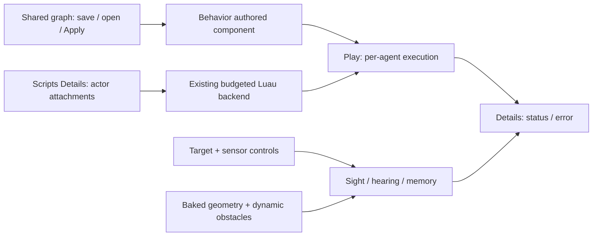

# MORROWIND-Y — behavior trees and perception

Implemented 2026-09-09. Runtime decision logic, shared graph authoring, editor
Play integration and budgeted Luau task execution are in tree. Final validation
is recorded in the dated session report.

## Designer workflow

Create a **Behavior Tree** component or open the Behavior graph surface. Build
and connect nodes, save/open the normal graph document, then **Apply** to the
selected actor. **Edit Selected Behavior** reopens its actual document. Details
exposes Tree Name, Enabled, live Status and Last Error; raw JSON is advanced and
read-only. A new component has a valid Wait tree. Unknown task bindings report
failure visibly instead of silently succeeding.

Create/attach a **Perception Sensor**, pick a target entity and tune eye height,
sight range/cone, hearing and memory in Details. **Target Sound Preview** emits
a continuous test stimulus when nonzero. Status distinguishes visible, heard,
remembered and absent observations. Confidence decays through the same runtime
memory used by games. LOS uses baked triangles plus live obstacle boxes; an
unbaked scene explicitly reports that occlusion has not been tested.

## Runtime contract

`somnium_ai::behavior` validates immutable trees and keeps cursors/blackboards
per actor. Sequence/selector resume running children; parallel supports success
thresholds and sibling cancellation. Invert, repeat and timeout share the task
lifecycle. Wait, typed Set/Check and named native/script tasks are available.
Validation rejects cycles, shared children, unreachable nodes, excessive depth,
empty composites and invalid literals. Terminal trees require reset or Repeat.

The K graph catalogue compiles input-pin order into child order; composites
have four slots and can nest. Persisted intent includes graph JSON, label and
enabled state. Cursors, active tasks, sensor memory and diagnostics are transient.
Engine Play ticks built-ins and native `succeed`/`fail` names through ScriptHost.
A Luau Task names a script already attached to that actor in Scripts Details:
use its filename, stem or full path (for example `morrowind_ai_patrol`).
Ambiguous names require a full path or removal of a duplicate attachment.
Attaching or enabling a missing binding retries the tree and clears the old
error after successful execution. GameApps can still provide custom native hosts.

Sight tests range/cone before occlusion; hearing uses squared falloff.
`StimulusMemory` bounds capacity, rejects stale updates, decays confidence and
expires observations. Games choose stimulus emitters and decision coupling.
The editor sensor provides authored target inspection; it does not implicitly
write another actor's behavior blackboard.

`ScriptTaskHost` uses the existing backend, world snapshot, command buffer and
VM budgets. `loadState` receives blackboard/delta; `onEvent` receives `ai.tick`
or `ai.cancel`; `saveState` returns running/success/failure and the updated
blackboard. Invalid outputs fail transactionally. Entity IDs use tagged strings.
The stock ScriptHost resolves only that actor's attached modules, emits a private
event through the normal lifecycle/snapshot/quarantine path, and commits all
commands through the same ordered capability/schema validation as other script
callbacks. Other attachments and queued ordinary events are not consumed by
an AI tick. Invalid protocol output discards the emitting attachment's commands.

## Verification and examples

- `somnium_ai/tests/behavior.rs`: composite resume/reset/cancellation, decorators,
  malformed trees, sight occlusion, hearing, memory expiry and real Luau state.
- UI behavior graph tests: authoring serialization/compile/execution and invalid
  literal rejection. Core acceptance: Apply, Play, scene reload, transient state
  exclusion and failed Apply preserving the prior graph.
- `assets/scripts/morrowind_ai_patrol.luau` is a normal script attachment using
  generic NavigationAgent/Perception field access, and also implements the
  explicit task-host protocol. The core acceptance test executes the shipped
  script in real Luau and verifies both routes. Normal ScriptHost tests also
  verify missing-binding repair, alias ambiguity, actor isolation, capability
  enforcement and invalid task output discarding partial commands.
- `examples/vvardenfell/src/morrowind.rs` constructs the public runtime slice.
  Clipboard tests cover copied sensor/script targets and attachment identities;
  designer save tests cover durable references and the authored Stop checkpoint.

## References

Read supplied Fyrox `fyrox-impl/src/utils/behavior/composite.rs` (MIT) for
sequence/selector semantics and task ownership, plus Somnium's existing graph,
cell, cook and script interfaces. No Fyrox code or serialization was copied;
Flax's proprietary editor was not ported.

Session validation: full workspace **2,352 passed, zero failed** (two ignored
doc tests). [Captures, lint and gate results](MORROWIND-2026-09-09.md).
