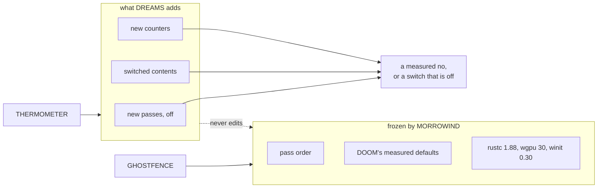
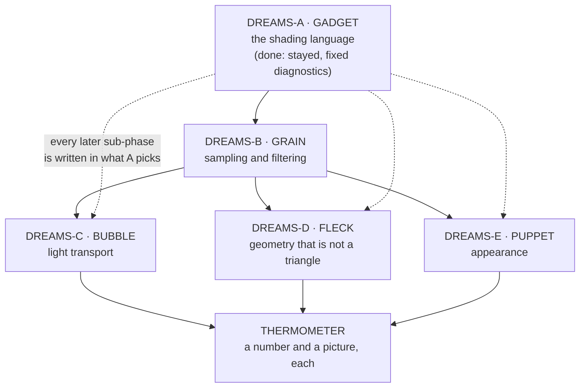

# Phase DREAMS — Media Molecule

> *Nothing in a frame of Dreams is a triangle and nothing is a texture map, and
> it ran on a PlayStation 4.*

> **Codename:** DREAMS (Media Molecule, bespoke engine, 2020). Load-bearing for
> two reasons, and the second one is the one that makes it a phase rather than a
> wish list.
>
> Dreams is the strongest shipped counter-example to "the pipeline is the
> pipeline". Its geometry is signed distance fields evaluated at runtime, its
> surfaces have no UVs, and what reaches the screen is a splatted point cloud
> that is then denoised into an image. Every part of that is the wrong answer by
> the standards of the pipeline Somnium has spent twenty-odd phases building,
> and it shipped, on fixed hardware, with a level editor in the box.
>
> And Dreams stayed shippable because of the **thermometer**: a resource meter
> visible in the editor at all times, that every creation had to fit under.
> Experimental rendering without a budget meter is a research demo. This phase
> takes both halves.
>
> **Status:** **ACTIVE. DREAMS-A complete, 2026-08-31.** Drafted against
> `3ecbda6`; A landed against `3cc321a`. B through E are plan only.
>
> **A correction this document already owes.** §4.2 originally listed "any
> shader module system" as an absence. It is not one: MORROWIND-C built one,
> with named includes, conditional compilation, variant keys and hot reload.
> The row was written from `context.md`, which describes the renderer and not
> the shader system. **An absence claimed from a summary is not a measurement**,
> and §4.2 and §7's DREAMS-A entry are corrected below. The rest of §4 was
> checked against the tree and stands.
>
> **Relationship to MORROWIND: alongside, not after.** This is the unusual thing
> about this phase and §1.2 is entirely about it. MORROWIND **freezes the
> visibility-buffer pass order and DOOM's measured defaults**, and GHOSTFENCE
> enforces the freeze. DREAMS is a phase whose entire subject is that pipeline.
> The two coexist under one rule, stated in §1.2 and enforced by §5: **DREAMS
> changes no default and reorders no pass.** Everything it lands is opt-in and
> off, and it carries its own gate on top of GHOSTFENCE.
>
> **Predecessor:** none. DREAMS has no dependency on MORROWIND, KENSHI, PORTAL
> or STALKER, and none of them depends on it. It is deliberately schedulable in
> the gaps: every sub-phase is self-contained, off by default, and deletable.
>
> **Record:** this file. Evidence folder `dev records/phase DREAMS/` is created
> by **DREAMS-A**, not before. **Do not invent PNGs and do not invent `.somtime`
> rows.** A phase about experimental rendering is the phase where a fabricated
> number does the most damage, because the entire question every sub-phase asks
> is "did this actually help".
>
> **Do not copy source.** Patterns only, cited in `ATTRIBUTION.md` **§13K**.
> §13E and §13F belong to Phase 27, §13G to CONTROL, §13H to MORROWIND, §13I to
> KENSHI, §13J to STALKER. Several references in §6 are **research code under
> non-commercial or unstated terms**, and §6.5 states the rule for those
> specifically: they are read for the idea and never linked.

---

## 0. How to use this document

Read §1, §4 and §5 first. §1 says what the phase is and why it can run beside a
phase that freezes the thing it changes. §4 says what the renderer already has,
measured. §5 is **THERMOMETER**, the gate, and it is the reason this phase is
allowed to exist at all.

§6 is the research survey and is the longest section. It is organised by *what
Somnium lacks*, not by conference, and every row carries a licence note and a
confidence mark. §7 is the five sub-phases. Everything after §8 is the usual
plan apparatus.

If you are picking this up cold: this phase has **no code in tree**. Nothing
below describes current functionality.

---

## 1. Executive decision

### 1.1 What this phase is

Five sub-phases, each taking one class of technique that Somnium's renderer
cannot currently express, and answering three questions about it in order:

1. **Does it run at all** on wgpu 30 native, with the feature bits this device
   actually reports?
2. **Does it look different** in a capture a person would call better?
3. **Does it fit under the thermometer** on the two shipped maps?

A technique that fails (1) is written up and dropped. A technique that passes
(1) and fails (2) is written up and dropped. A technique that passes (1) and (2)
and fails (3) **lands off by default with its cost published**, which is the
same treatment DOOM gave dynamic resolution and tile binning.

The phase's output is therefore not "five features". It is **five honest
answers**, some of which are no, and the ones that are yes are switches.

### 1.2 Why it can run beside MORROWIND

MORROWIND's freeze list (`phase_MORROWIND.md` §0) contains this line:

> The visibility-buffer pipeline's existing pass order and its GPU timings.
> **Every rendering sub-phase in Track 7 must show a `.somtime` row proving the
> frame did not regress on the two shipped maps.**

A phase about experimental rendering sounds like a direct collision. It is not,
because of what the freeze actually forbids: **unannounced change to the default
frame**. It does not forbid new passes that nobody has turned on.

The contract, stated once:

| DREAMS may | DREAMS may not |
|---|---|
| Add a pass that is skipped unless authored on | Reorder an existing pass |
| Replace the *contents* of a pass behind a switch | Change what a switch defaults to |
| Add a feature bit to `capability.rs` | Make a new bit *required* in `context.rs` |
| Add a `.somtime` counter | Rename or repurpose an existing one |
| Add a shader module | Exceed the GHOSTFENCE shader budget without editing it in the same commit |
| Publish a measured cost that argues for a default change | Make that default change; that is a DOOM-style default-change process, and it is not this phase |

**MORROWIND has right of way.** If a MORROWIND Track 7 sub-phase and a DREAMS
sub-phase touch the same file, MORROWIND lands first and DREAMS rebases. This is
not politeness: MORROWIND is on the critical path to a shippable engine and
DREAMS is not.



### 1.3 Why now rather than after MORROWIND

Three arguments, and the third is the real one.

- The renderer is at its most **legible** right now. Twenty-odd phases of
  records exist, the pass order is written down, `.somtime` works, and GHOSTFENCE
  catches drift. A technique measured against this tree produces a number
  somebody can trust. That gets harder, not easier, as MORROWIND adds systems.
- The wgpu 30 feature set (§4.3) contains bits this engine has never opened.
  `EXPERIMENTAL_MESH_SHADER` is detected and unused; `SHADER_BARYCENTRICS`,
  `TEXTURE_INT64_ATOMIC` and `EXPERIMENTAL_COOPERATIVE_MATRIX` are not even
  detected. Those four are the doors to half of §6, and nothing else in the
  roadmap opens them.
- **MORROWIND is the phase where nothing in the renderer is allowed to be
  interesting.** That is correct for MORROWIND and it is not a state to leave an
  engine in for a year. DREAMS is the counterweight, and it is deliberately
  low-stakes: every one of its outputs is a switch that is off.

---

## 2. Goals

1. Make the other four sub-phases writable at all. **Done by DREAMS-A**, and
   not the way this line expected: the module system already existed, and what
   was missing was a shader error that names the file it is in.
2. Land a **sampling and filtering substrate**: blue-noise sequences, stochastic
   texture filtering, and the deterministic fixture that lets a stochastic
   technique be compared to anything.
3. Answer, with captures and `.somtime` rows, whether **three light-transport
   techniques** the renderer cannot express are worth their cost here.
4. Answer whether **geometry that is not a triangle** can ride the existing
   visibility buffer.
5. Answer whether **appearance the current BSDF cannot express** is reachable
   without a second material system.
6. Publish, for every answer, the **cost in milliseconds on the two shipped
   maps**, and a golden image.

## 3. Non-goals

- **No default changes.** See §1.2. A DREAMS sub-phase that flips a default has
  gone wrong.
- **No offline renderer.** A path-traced reference mode is in scope only as a
  *fixture* for comparing the real-time result against, and only if §7.2 needs
  it. It is not a product.
- **No training pipeline.** Where a technique is learned, DREAMS consumes
  weights produced elsewhere or it does not do that technique. Somnium is not
  acquiring a machine-learning build step.
- **No paper-reimplementation contest.** A technique with no visible effect on
  the two shipped maps is dropped even if it works.
- **No second material system.** §7.5 either extends the existing BSDF or
  reports that it cannot.
- **No renderer rewrite.** The visibility buffer stays.
- **No new required device feature.** Everything detects, nothing demands.

---

## 4. The audit, measured 2026-08-31 against `3ecbda6`

### 4.1 What the renderer already has

Taken from `context.md` §Renderer, which is current. Condensed, because the
point of this section is the *shape of the gap*, not a second census.

| Area | In tree |
|---|---|
| Structure | Visibility buffer, shade-once fullscreen, bindless, GPU-driven meshlet cull with Hi-Z, indirect draws, programmable vertex pulling |
| Direct light | Clustered locals, CSM + sparse VSM + PCSS + contact shadows, cloud shadows folded into one `shadow_factor` |
| Indirect light | ReSTIR DI and GI on ray-query hardware, SDF-traced DDGI on a 4x4x4 SH volume, global IBL |
| Sky | Hillaire LUTs, analytic sun, five-track day cycle, volumetric clouds, procedural stars |
| Material | Cook-Torrance GGX, cel alternative, glTF PBR, `.sommat` |
| Terrain | 32 layers with strongest-four blending, triplanar, hex tiling, POM, nested clipmaps, virtual texturing into a 64 MiB BC7 atlas |
| Water | Three-cascade inverse FFT, Jacobian whitecaps, SSR + half-res ray query + cube by confidence, Beer transport, underwater |
| Post | AgX/ACES, bloom, DOF, motion blur, GTAO, volumetrics, shafts, decals, CAS |
| AA | FXAA, SMAA 1x, SMAA T2x, TAA, FSR 3 |

This is a **well-populated conventional renderer**. That matters for the survey:
the interesting gaps are not "it has no GI", they are the things that sit
sideways to a conventional renderer.

### 4.2 The gap, stated as absences

Every row below is an absence I verified in the tree or in `context.md`, not a
guess.

| Absent | Evidence |
|---|---|
| ~~Any shader module system~~ **Corrected by DREAMS-A** | MORROWIND-C's `somnium_shader` has named includes, `//!if` conditionals, variant keys, hot reload and a budget report. What it lacked was **diagnostics that name the file an error is in**, which DREAMS-A measured and fixed. Generics and interfaces remain absent |
| Any blue-noise or low-discrepancy sequence | No noise asset, no sampler table; stochastic passes use hash functions |
| Any stochastic or wave-cooperative texture filtering | Texture reads are hardware-filtered `textureSample` |
| Any many-light importance sampling | Locals are clustered and all shaded; there is no light BVH and no per-pixel light selection |
| Any non-triangle geometry | Voxels and terrain both submit *through* the visibility-buffer triangle contract |
| Any software rasteriser | Everything goes through the hardware raster |
| Subsurface scattering | No SSS term in the BSDF |
| Hair or fur | No strand primitive, no strand raster, no hair BSDF |
| Glints, thin film, iridescence, sheen | GGX only, plus a cel alternative |
| Texture-space or object-space shading | Shading is screen-space, one pass, once per pixel |
| Any learned representation | No neural texture, no neural material, no learned upscaler beyond FSR's fixed kernels |
| Local reflection/irradiance probes | Stated absent in `context.md`; STALKER's YANTAR track plans it and DREAMS must not take it |

### 4.3 The device, measured

The engine's own startup log on the development machine, verbatim:

```text
Selected GPU adapter backend=Vulkan device=NVIDIA GeForce RTX 5080 Laptop GPU
wgpu 30 capabilities: 13/13 features on NVIDIA GeForce RTX 5080 Laptop GPU (Vulkan), subgroups 32–32
GPU-driven rendering available (multi-draw indirect)
Hardware ray tracing available (acceleration structures + ray query)
GPU timestamp queries available (profiler)
Pipeline statistics available
BC texture compression available
Half-precision shader arithmetic available (f16)
Subgroup operations available
FSR 3 available
```

`capability.rs` detects thirteen features and **all thirteen are present**,
including `EXPERIMENTAL_MESH_SHADER`, which nothing in the engine uses.

Three further wgpu 30 features are **available in the API and not detected by
`capability.rs`**, and they are the ones §6 keeps needing:

| Feature | Why DREAMS cares |
|---|---|
| `SHADER_BARYCENTRICS` | A visibility buffer reconstructs barycentrics by hand today. Hardware barycentrics change what a visibility-buffer shading pass costs, and they are the standard input to per-pixel derivative reconstruction |
| `TEXTURE_INT64_ATOMIC`, `SHADER_INT64` | A 64-bit `atomicMax` packing depth into the high bits and a payload into the low bits **is** the software rasteriser. This is the single feature that makes §7.4 possible |
| `EXPERIMENTAL_COOPERATIVE_MATRIX` | Matrix-core inference inside a shader. This is the difference between a neural material being a research curiosity and being evaluable per pixel |

And one that is **already requested**: `PASSTHROUGH_SHADERS` is unioned into
`FSR_FEATURES` in `context.rs`, because `wgpu-ffx` hands wgpu raw SPIR-V. **A
non-WGSL shading language therefore already has a working precedent in tree**,
which is a much stronger starting position for §7.1 than it looks.

Not available anywhere in wgpu 30: **work graphs**. Every technique in §6 that
depends on GPU-side work creation is out of reach and §6.3 says so.

---

## 5. THERMOMETER, the gate

GHOSTFENCE asks "did you break something". THERMOMETER asks a different
question, and this phase needs both.

> **A DREAMS sub-phase does not land without a number and a picture.**

Four rows, checked per sub-phase, not per commit:

| Row | Passes when |
|---|---|
| `budget` | A `.somtime` A/B on **both** shipped maps, feature off versus on, back to back, with the standard deviation reported. Off must be within noise of the pre-phase baseline. |
| `picture` | A golden image with the feature on, and the off/on pair side by side. A technique nobody can see is a technique that is dropped, and the pair is the evidence for that decision either way. |
| `default` | Every switch this sub-phase added reads *off* in a clean profile, proven by a capture of the default editor. |
| `deletable` | The sub-phase names the files that would be removed to undo it, and the count of lines outside those files that would have to change. Over 200 and it is not opt-in, whatever the switch says. |

The `deletable` row is the one that keeps this phase from silently becoming a
renderer rewrite. It is the deletion test, applied to a phase.

Three deliberate consequences:

- A sub-phase may report **zero features landed** and still pass, if its four
  rows are filled in with a measured no. That is a successful sub-phase.
- `.somtime`'s standard deviation is **within-run** and cannot see session
  drift, so an A/B has to be back-to-back reps in one session. This is already
  written down; DREAMS is the phase most likely to be caught by it.
- MORROWIND-AC's visual comparisons were **inconclusive because control runs
  moved as much as feature runs**. That failure is the direct reason §7.2 puts
  a deterministic fixture ahead of every technique in this phase.

---

## 6. The research survey

Conducted 2026-08-31 by direct search of conference proceedings, arXiv, and
project repositories. The `deep-research` skill was not used: it requires a
`GEMINI_API_KEY` that is not set on this machine, so the survey below is a
hand-run literature search and §6.4 marks its confidence honestly.

Organised by **what Somnium lacks**, matching §4.2.

### 6.1 Light transport

| Technique | Source | Why it is interesting here | Portability |
|---|---|---|---|
| **Radiance Cascades** | Sannikov, ExileCon 2023; Freeman, Sannikov & Margel, *Holographic Radiance Cascades for 2D Global Illumination*, arXiv:2505.02041 | A radiance field decomposed by the **penumbra hypothesis**: nearby light needs spatial resolution, distant light needs angular resolution, and the two trade off inversely. Cost is **constant in scene complexity** and there is **no temporal accumulation**, so no lag and no ghosting. Somnium's GI is ReSTIR (temporal, stochastic) and DDGI (a 4x4x4 SH volume). A third answer with opposite failure modes is genuinely new information | Pure compute and texture reads. Nothing exotic. The published paper is 2D; the 3D form is the part that is unproven outside one shipped game |
| **MegaLights** | Narkowicz & Costa, SIGGRAPH 2025 Advances | Stochastic **importance sampling of lights**: trace a fixed number of rays per pixel toward the lights that matter, approximate the rest. Fixed cost for hundreds of shadowed lights. Somnium clusters locals and shades all of them, which is a cost that scales with light count | Needs ray query, which is in tree. Needs a good sampler, which is §7.2 |
| **Stochastic tile-based lighting** | Lempinen (HypeHype), SIGGRAPH 2025 Advances | The same idea aimed at the bottom of the hardware range: fully dynamic fixed-cost local lighting with shadows on mobile GPUs. Worth reading beside MegaLights because it answers the same question without ray tracing | No exotic features at all |
| **Spherical Harmonic Exponentials for Efficient Glossy Reflections** | Silvennoinen, Sloan, Iwanicki & Nowrouzezahrai, HPG 2025 | SH is the representation Somnium's DDGI already uses, and its weakness is exactly glossy reflection. This attacks that directly | Maths, not features |
| **Fast Planetary Shadows using Fourier-Compressed Horizon Maps** | Fritsch et al., HPG 2025 | Terrain self-shadowing without a shadow map. Somnium's terrain is its largest surface and its shadowing comes entirely from CSM cascades fitted to the whole view | Maths, not features |

### 6.2 Sampling, filtering and texture

This group is the phase's foundation, and the reason is architectural: three of
the other four groups produce noise that has to be filtered, and Somnium
currently has no sampling infrastructure to produce good noise with.

| Technique | Source | Why | Portability |
|---|---|---|---|
| **Spatiotemporal blue-noise masks** | Wolfe, Morrical, Akenine-Möller & Ramamoorthi, EGSR 2022; `NVIDIAGameWorks/SpatiotemporalBlueNoiseSDK` | Blue noise in **both** space and time. Error becomes a pattern the eye tolerates and a temporal filter can remove, instead of one it cannot. Every stochastic technique in this phase gets better for free | Precomputed masks are a texture asset. **Licence must be checked before use** |
| **Filtering After Shading with Stochastic Texture Filtering** | Pharr, Wronski, Salvi & Fajardo, I3D 2024 (Best Paper), arXiv:2407.06107 | Filtering *after* the BSDF is more correct than filtering before it, which is what every renderer including this one does. It also makes compressed and sparse texture formats filterable at all, which is what makes neural texture compression usable | One texture fetch plus a good random number. Cheap to try, and the cheapest interesting thing in this entire survey |
| **Collaborative Texture Filtering** | Akenine-Möller, Ebelin, Pharr & Wronski, HPG 2025 | Fixes stochastic filtering's magnification noise by **sharing decoded texels between lanes with wave intrinsics**, with no memory traffic. Somnium's device reports `SUBGROUP` and `SUBGROUP_BARRIER`, and `subgroups 32–32` means a known, uniform wave width | Needs subgroups. Available and detected |
| **Hardware Accelerated Neural Block Texture Compression with Cooperative Vectors** | Belcour & Benyoub, HPG 2025 | Neural compression that decodes through the **existing block-compression hardware**, using cooperative vectors for the network | Needs `EXPERIMENTAL_COOPERATIVE_MATRIX`. Present in wgpu 30, unused here, unproven |
| **Random-Access Neural Compression of Material Textures** | Vaidyanathan et al., TOG 2023 | The foundational NTC paper. Compresses a whole PBR material set jointly | Same feature question |
| **GATE: Geometry-Aware Trained Encoding** | Boksansky, Meister & Benthin, HPG 2025 | Learned encoding aware of the geometry it sits on | Same |

### 6.3 Geometry that is not a triangle

| Technique | Source | Why | Portability |
|---|---|---|---|
| **Software rasterisation via 64-bit atomics** | Established technique; the Nanite lineage, and the substrate of the hair paper below | A `u64` `atomicMax` packing depth above payload turns a compute shader into a rasteriser that beats the hardware for sub-pixel triangles. Somnium **has a visibility buffer already**, which is exactly the target such a rasteriser writes into | Needs `SHADER_INT64` and `TEXTURE_INT64_ATOMIC`. Both in wgpu 30, neither detected here |
| **High-Performance Real-Time Implicit Strand-Based Hair Rendering via Software Rasterization** | HPG 2026, arXiv:2607.04230 | Deferred software rasterisation of hair strands with a filtering and reconstruction step, at one sample per pixel, with an LOD scheme, on **minimal hardware support**. It is the strongest single argument for the row above | Same |
| **3D Gaussian splatting** | Large literature; Rust/wgpu implementations exist: `KeKsBoTer/web-splat`, `LioQing/wgpu-3dgs-core`, `Lichtso/splatter` | A captured object rendered as splats, composited into a rasterised frame, is a scanned-asset path no conventional pipeline has. **Several implementations are already wgpu + Rust**, which is unusually good luck | Needs a sort. Licences vary and must be checked individually |
| **Splatshop / LidarScout** | Schütz et al., HPG 2025 | Editing and out-of-core rendering of very large splat and point models. Relevant if §7.4 gets as far as authoring | Research code |
| **Real-time rendering of animated meshless representation** | Luton & Tricard, HPG 2025 | Meshless animation, which is the part splats are worst at | Research |
| **Real-Time GPU Tree Generation** | Kuth et al., HPG 2025 | Trees generated on the GPU per frame at the LOD needed. AMD reported reducing tree VRAM from 38 GB to 52 KB | **Built on work graphs and mesh nodes. Not available in wgpu at all.** Read for the idea; the mechanism is out of reach |
| **TRS: Triangle Rejection Sampling for Density-equipped Meshes on GPU** | Schertzer, Thonat & Boubekeur, HPG 2025 | Scattering on meshes. Somnium scatters foliage on terrain only, and by a CPU rejection funnel | Compute |

### 6.4 Appearance

| Technique | Source | Why | Portability |
|---|---|---|---|
| **Real-Time Subsurface Scattering via Hybrid ReSTIR-Path-Tracing and Diffusion** | Zhang (NVIDIA), SIGGRAPH 2025 Advances | Somnium **already has ReSTIR**. This is the rare case where an advanced technique is closer to reach here than in most engines | Ray query, in tree |
| **Strand-based Hair and Fur in Indiana Jones and the Great Circle** | Kulikov (MachineGames), SIGGRAPH 2025 Advances | Strands as the *only* hair solution at 60+ fps across platforms, from a shipped game. The production counterpart to the HPG 2026 paper | Shipped, so the constraints are real |
| **Real-Time Rendering of Glinty Appearances using Distributed Binomial Laws on Anisotropic Grids** | Deliot & Belcour, CGF 2023, arXiv:2306.05051; Intel published an article | Counts flakes reflecting toward the eye per pixel footprint, 1.5x to 5x faster than prior work. Glints are the single most **visible** thing in this survey per line of shader: snow, sand, car paint, metal flake | Pure shading maths. An HDRP demo exists (`tomix1024/IBLGlints-Demo`) as a reference, not a source |
| **Real-Time Image-based Lighting of Glints** | Kneiphof, CGF 2025 | The IBL half, which is what a scene lit by Somnium's atmosphere LUTs actually needs | Same |
| **Adaptive Voxel-Based Order-Independent Transparency** | Drobot (Activision), SIGGRAPH 2025 Advances | Somnium's OIT is weighted and **off unless authored**, which is an admission that it is not good enough | Needs a voxel structure per frame |
| **Towards Practical Physical-Optics Rendering** / **A Generalized Ray Formulation For Wave-Optical Light Transport** | Steinberg, Sen & Yan, TOG 2022; Steinberg et al., TOG 2024 | Wave optics: interference and diffraction, consistent with Maxwell rather than with geometric optics. Iridescence, thin films and diffraction gratings fall out rather than being faked | **The most experimental thing in this document by a distance.** Interactive wave-optical transport is demonstrated, not productionised. Read §6.5 |

### 6.5 The shading language and the toolchain

The user asked specifically about WGSL, other shading languages, and helpers.
This is the group with the clearest answer and the largest leverage, because it
is the one the other four are blocked on.

| Option | What it is | Fit |
|---|---|---|
| **Slang** (`shader-slang`) | A shading language with modules, generics, interfaces and automatic differentiation, compiling to HLSL, SPIR-V, MSL, **WGSL**, CUDA and CPU. NVIDIA-backed, actively developed, and the vehicle for its own SIGGRAPH 2025 neural shading course | **Two viable paths.** Compile Slang to WGSL and feed naga as today, or compile to SPIR-V and use `PASSTHROUGH_SHADERS`, which `wgpu-ffx` already does in tree for FSR. The second path is more capable and gives up the WebGPU browser target, which Somnium does not use |
| **WESL** (`wgsl-tooling-wg`, `wesl-rs`) | A modest superset of WGSL: imports, conditional compilation with `@if`/`@elif`, and Cargo shader packages. Version 0.2 shipped May 2026. Generics are behind an experimental flag | **Much smaller step.** Stays WGSL, stays in Rust, adds exactly the two things 55 hand-written modules are missing. Lower ceiling, far lower risk |
| Stay on hand-written WGSL | The current state | The reason this row is here is that it is a legitimate answer if the other two cost more than they return, and §7.1 must be allowed to reach it |

### 6.6 Confidence, and what this survey is not

- **High confidence:** the paper titles, authors, venues and years in §6.1
  through §6.5. These were read from conference programmes and publisher pages.
- **High confidence:** the wgpu 30 feature list in §4.3. Read from
  `wgpu-types-30.0.1` in the local registry, not from documentation.
- **Medium confidence:** the performance claims. Every number in §6 is
  **the authors' number on the authors' hardware and scene**. None of it
  transfers. DREAMS-A exists to replace these with local measurements.
- **Low confidence, deliberately:** whether any given technique is worth it
  *here*. That is the whole question the phase asks and it would be dishonest to
  answer it in a survey.
- **Not covered:** anything requiring work graphs (§6.3), anything requiring a
  training pipeline (§3), and offline rendering.

**Licence rule for this phase.** Several sources above ship research code under
non-commercial, academic-only, or entirely unstated terms. The rule is stricter
than MORROWIND's: **research code is read for the idea and never linked, never
vendored, and never adapted line by line.** A permissive implementation that
DREAMS actually depends on goes through the same audit as any dependency and is
recorded in `ATTRIBUTION.md` §13K with its licence text. The wgpu/Rust splatting
crates in §6.3 are the likely candidates and their licences are individually
unverified as of this draft.

---

## 7. The five sub-phases

Track names are Dreams' vocabulary where it fits and chosen for meaning where it
does not.



A and B are ordered. C, D and E are independent of each other and may be taken
in any order or dropped individually.

### DREAMS-A · GADGET — the shading language

**Complete, 2026-08-31.** Record:
[DREAMS-A.md](<phase DREAMS/DREAMS-A.md>).

**Question, as asked:** can Somnium's shaders be written in something with
modules and conditional compilation?

**Question, as it turned out:** they already are. MORROWIND-C's
`somnium_shader` has named includes, `//!if` conditionals, define registration,
variant keys, hot reload that never silently reverts, and a budget report. So
the real question was whether that system has a ceiling DREAMS-B through E would
hit, and whether Slang or WESL raises it.

**Decision: stay.** The measured ceiling was diagnostics, not the language.

| Measured | Result |
|---|---|
| Composition cost | 2.87 ms for `shading.wgsl` cold, 0.8 µs cached, 8.03 ms for all 55 roots at startup. Not a problem |
| Diagnostics | An error on line 48 of `brdf.wgsl` was reported as `wgsl:195` and labelled `shading.wgsl`, a file it is not in. **The one real cost** |
| WESL 0.4.4 | Real source maps, generics, wildcard imports, MIT OR Apache-2.0, and `rust-version = 1.97.1` against a tree frozen at rustc 1.88. Not adoptable without a toolchain bump |
| Slang | **Not measured.** Needs a `slangc` binary that is not on this machine. Its strongest argument survives: `PASSTHROUGH_SHADERS` is already requested in tree for FSR's SPIR-V |
| Generics | Wanted by exactly one of B through E (PUPPET's layered BSDF). One of four is not a migration |

**What landed instead:** a line-origin map built during the composition that was
already happening. 10 spans for 4,801 composed lines, 0.5% of a startup-only
path, and the diagnostic now reads `brdf.wgsl:48:37`.

**Re-opened when, not if:** if PUPPET needs generics, this comes back with a
concrete case rather than a guess. §3 of the record says what measuring Slang
would take.

### DREAMS-B · GRAIN — sampling and filtering

**Question:** what does the frame look like with a real sampler under it?

**Why it is second:** C, D and E all produce noise. Comparing any of them
against anything requires a deterministic fixture, and MORROWIND-AC already
failed for exactly the lack of one.

**Scope:**

- A **deterministic capture fixture**: fixed seed, fixed frame index, camera on
  rails, so an A/B differs only by the feature. This is the single most
  load-bearing deliverable in the phase and it belongs to no technique.
- **Spatiotemporal blue-noise masks** as an engine resource, with a `.somtime`
  counter, wired into the passes that already dither: GTAO, volumetrics, ReSTIR
  sample selection, TAA jitter.
- **Stochastic texture filtering**, behind a switch, on the terrain's
  strongest-four layer reads. Terrain is the largest surface and does four layer
  samples per pixel, so it is where the measurement will be visible.
- **Collaborative texture filtering** on top, using subgroups, if STF's
  magnification noise is as visible here as the paper says.

**Expected shape of the answer:** blue noise is nearly free and lands on. STF is
a cost/quality trade that lands off with a published number. Collaborative
filtering is the interesting unknown, because it depends on the wave width the
device reports and Somnium's is a uniform 32.

### DREAMS-C · BUBBLE — light transport

**Question:** is there a third GI answer with better failure modes than the two
in tree?

**Scope, in order of expected value:**

- **Radiance cascades**, 2D first as a validation against the paper's published
  timings on a known image size, then the 3D form if the 2D form behaves. The
  claim to test is not "it is faster": it is **constant cost and zero temporal
  lag**, which is a different shape of answer from ReSTIR and DDGI, and the
  scenes where that matters are the ones with fast-moving lights.
- **Stochastic many-light sampling** in the MegaLights shape, measured against
  the existing clustered path as the light count rises. Somnium's clustered
  locals are correct and their cost scales; this is the technique that decouples
  the two.
- **SH exponentials** for glossy reflection out of the existing DDGI volume,
  which is the cheapest of the three to try because the volume already exists.

**Risk:** this sub-phase is the one most likely to want to touch the shading
pass rather than add to it, and §1.2 forbids that. The mitigation is that all
three write into `shadow_factor` or the indirect term through the existing
seams, and any of them that cannot must be reported as a no.

### DREAMS-D · FLECK — geometry that is not a triangle

**Question:** can the visibility buffer accept something other than a rasterised
triangle?

**Scope:**

- **Detect `SHADER_INT64` and `TEXTURE_INT64_ATOMIC`** in `capability.rs`, which
  is a small change with a large consequence: it is the gate for everything
  below.
- A **software rasteriser** writing the existing visibility-buffer layout, taken
  as far as one primitive type. Sub-pixel triangles are the honest first target
  because the meshlet path already produces them.
- **Hair strands** as the second, following the HPG 2026 deferred software
  rasterisation shape, because strands are the case that justifies a software
  rasteriser at all and because they connect to DREAMS-E.
- **Gaussian splats** as a separate, self-contained path: load, sort, splat,
  composite against the depth the visibility buffer already wrote. Kept separate
  because it shares nothing with the rasteriser above except the depth test.

**Risk:** this is the sub-phase with the largest `deletable` count, and
THERMOMETER's fourth row is aimed squarely at it. If a software rasteriser
cannot be added without editing the visibility-buffer contract, it does not land
in this phase.

### DREAMS-E · PUPPET — appearance

**Question:** how much of the appearance gap closes without a second material
system?

**Scope, in ascending order of cost:**

- **Glints.** Cheapest and most visible in the whole phase: a shading term, a
  noise function, and a per-material switch. Snow, sand and metal flake are all
  in the shipped maps' vocabulary.
- **Thin film and iridescence**, which is the same kind of change and shares the
  glint sub-phase's material-switch plumbing.
- **Subsurface scattering** in the hybrid ReSTIR shape, which is reachable
  precisely because ReSTIR is already there.
- **Hair shading** if and only if DREAMS-D landed strands, since a hair BSDF
  with nothing to shade is not a deliverable.

**Risk:** four appearance terms is four sets of authored material parameters,
four Details rows and four `.sommat` fields. The material system is CONTROL's
and MORROWIND extends it. This sub-phase must add fields, never renegotiate the
schema, and if a technique needs a schema change it is reported as a no.

---

## 8. Sequencing

```text
DREAMS-A  (GADGET)      language decision, one module ported
    -> DREAMS-B (GRAIN) fixture, blue noise, stochastic filtering
        -> DREAMS-C (BUBBLE)   independent
        -> DREAMS-D (FLECK)    independent
        -> DREAMS-E (PUPPET)   independent, but hair needs D
```

Scheduling against MORROWIND: DREAMS sub-phases are **individually
interruptible**. Each one closes with its own THERMOMETER rows and leaves the
tree with a switch that is off. There is no DREAMS state that a MORROWIND
sub-phase has to be aware of, which is the property that lets the two run
alongside each other.

---

## 9. Must-not-break

Everything MORROWIND freezes, unchanged, plus:

- GHOSTFENCE passes, including the shader-budget row. A sub-phase that adds
  shader modules edits the budget in the same commit and says why.
- The default editor's frame is byte-identical to the pre-phase baseline with
  every DREAMS switch off. This is stronger than "within noise" and it is
  checkable by capture.
- No new *required* device feature. Every feature added to `capability.rs` is
  detected, reported, and has a path that runs without it.
- `.somtime`'s existing counters keep their names and meanings.

---

## 10. Acceptance

The phase is complete when all five sub-phases have four filled THERMOMETER
rows, and `context.md` gains a section that states, for each technique tried,
whether it is in tree, what it costs, and whether it is on. **A phase that lands
two features and five honest measurements has succeeded.** A phase that lands
five features and cannot say what they cost has not.

---

## 11. Risks and controls

| Risk | Control |
|---|---|
| Scope creep into a renderer rewrite | THERMOMETER's `deletable` row, 200 lines |
| Collision with MORROWIND Track 7 | MORROWIND has right of way; DREAMS rebases |
| A technique lands on by accident | THERMOMETER's `default` row, proven by capture |
| Measurements that cannot be trusted | DREAMS-B's fixture is the first deliverable and blocks C, D and E |
| Research code contaminating the tree | §6.5: read, never linked, never vendored |
| A vendored crate with an unclear licence | Individual audit into `ATTRIBUTION.md` §13K before any dependency lands |
| The shading-language decision fragments the shader pipeline | DREAMS-A ports **one** module and publishes the fork cost before anything else is written in it |
| Chasing the wave-optics paper | Explicitly listed in §13 as out of scope for this phase, with the reason |

---

## 12. Evidence plan

Per sub-phase, in `dev records/phase DREAMS/`:

- `DREAMS-x.md`, the record.
- `DREAMS-x_<map>_off.somtime` and `_on.somtime`, back to back, both maps.
- `DREAMS-x_<map>_off.png` and `_on.png`, from DREAMS-B's fixture.
- A `deletable` line: files removed, lines changed elsewhere.

No sub-phase closes without all four.

---

## 13. Left open, deliberately

- **Work graphs.** Not in wgpu. The GPU tree-generation result is the strongest
  argument in the survey for GPU-side work creation and there is no way to try
  it here. Revisit if wgpu gains the extension.
- **Wave-optics light transport.** The most interesting thing in §6.4 and the
  furthest from a frame budget. Named so that a later phase can find it, not
  taken.
- **Neural texture compression.** Blocked on a training pipeline, which §3 rules
  out. The *decode* side is reachable through cooperative matrix and could be
  tried against weights produced elsewhere; that is a decision for DREAMS-B if
  stochastic filtering lands, since filtering is what makes a compressed format
  usable at all.
- **Local reflection and irradiance probes.** STALKER's YANTAR track owns this.
  DREAMS must not take it even though §6.1 keeps brushing against it.
- **Texture-space and object-space shading.** Real, well-published (FastAtlas,
  Eurographics 2025; seamless object-space shading, Eurographics 2024), and a
  poor fit for a phase that is forbidden to reorder passes, because decoupled
  shading *is* a pass-order change. Named here as the strongest candidate for a
  future phase that is allowed to make one.
- **Mesh shaders.** Detected on this device, unused, and not in DREAMS' scope:
  replacing the meshlet path is a change to the default frame, which is exactly
  what §1.2 forbids. It belongs to a phase that owns the pipeline.

---

## 14. Start checklist

**DREAMS-A, done:** `dev records/phase DREAMS/` exists, `ATTRIBUTION.md` §13K is
open, §4.3's feature bits were re-read from `wgpu-types-30.0.1` in the local
registry, and the language table and decision are published in the record.

THERMOMETER's four rows were filled by hand in the DREAMS-A record rather than
by a script. **Writing that script is DREAMS-B's first task**, because B is the
first sub-phase whose work reaches the GPU and therefore the first whose rows a
person cannot fill from memory.

**DREAMS-B, to start:**

1. Write the THERMOMETER script beside `tools/ghostfence/run.py`. Do not weaken
   GHOSTFENCE to make room for it.
2. Build the deterministic capture fixture **before** any technique. It is the
   thing MORROWIND-AC turned out to need and the thing C, D and E are blocked
   on.
3. Only then: blue noise, then stochastic texture filtering, then collaborative
   filtering.

---

## 15. Sources

Read 2026-08-31. Titles and venues verified against conference programmes and
publisher pages; performance claims are the authors' own.

**Courses and programmes**
- [Advances in Real-Time Rendering in Games, SIGGRAPH 2025](https://advances.realtimerendering.com/s2025/index.html)
- [High Performance Graphics 2025 papers](https://www.realtimerendering.com/kesen/hpg2025Papers.htm)
- [EGSR 2026 call for papers](https://egsr2026.inria.fr/call-for-papers/)

**Light transport**
- [Holographic Radiance Cascades for 2D Global Illumination (arXiv:2505.02041)](https://arxiv.org/abs/2505.02041)
- [radiance.wiki](https://radiance.wiki/)
- [Radiance Cascades: a new approach to calculating global illumination (80.lv)](https://80.lv/articles/radiance-cascades-new-approach-to-calculating-global-illumination)
- [MegaLights: Stochastic Direct Lighting in Unreal Engine 5](https://advances.realtimerendering.com/s2025/content/MegaLights_Stochastic_Direct_Lighting_2025.pdf)
- [MegaLights in Unreal Engine (documentation)](https://dev.epicgames.com/documentation/unreal-engine/megalights-in-unreal-engine)

**Sampling, filtering and texture**
- [Spatiotemporal Blue Noise Masks (NVIDIA Research)](https://research.nvidia.com/publication/2022-07_spatiotemporal-blue-noise-masks)
- [Filtering After Shading With Stochastic Texture Filtering (arXiv:2407.06107)](https://arxiv.org/abs/2407.06107)
- [Collaborative Texture Filtering (Eurographics Digital Library)](https://diglib.eg.org/items/08d933aa-02b8-4b9c-be5d-fc01ffedadfc)
- [Random-Access Neural Compression of Material Textures (TOG)](https://dl.acm.org/doi/abs/10.1145/3592407)
- [Improved Stochastic Texture Filtering Through Sample Reuse (arXiv:2504.05562)](https://arxiv.org/pdf/2504.05562)

**Geometry**
- [High-Performance Real-Time Implicit Strand-Based Hair Rendering via Software Rasterization (arXiv:2607.04230)](https://arxiv.org/pdf/2607.04230)
- [GPU Work Graphs mesh nodes in Vulkan (AMD GPUOpen)](https://gpuopen.com/learn/gpu-workgraphs-mesh-nodes-vulkan/)
- [web-splat, WebGPU + Rust Gaussian splatting](https://github.com/KeKsBoTer/web-splat)
- [wgpu-3dgs-core](https://github.com/LioQing/wgpu-3dgs-core)
- [splatter, WebGPU Gaussian splatting in Rust](https://github.com/Lichtso/splatter)

**Appearance**
- [Real-Time Rendering of Glinty Appearances using Distributed Binomial Laws (arXiv:2306.05051)](https://arxiv.org/abs/2306.05051)
- [Real-Time Image-based Lighting of Glints (CGF 2025)](https://onlinelibrary.wiley.com/doi/10.1111/cgf.70175)
- [IBLGlints-Demo (reference implementation, HDRP)](https://github.com/tomix1024/IBLGlints-Demo)
- [Towards Practical Physical-Optics Rendering (Steinberg, Sen & Yan)](https://sites.cs.ucsb.edu/~lingqi/publications/202203_practical_plt_paper_lowres.pdf)
- [A Generalized Ray Formulation For Wave-Optical Light Transport (TOG 2024)](https://dl.acm.org/doi/10.1145/3687902)

**Shading languages and tooling**
- [Slang WGSL target documentation](http://shader-slang.org/slang/user-guide/wgsl-target-specific)
- [Neural Shading course materials, SIGGRAPH 2025](https://github.com/shader-slang/neural-shading-s25)
- [WESL specification](https://wesl-lang.dev/spec/README)
- [wesl-rs, the Rust WESL compiler](https://github.com/wgsl-tooling-wg/wesl-rs)
- [wgpu ray tracing API specification](https://github.com/gfx-rs/wgpu/blob/trunk/docs/api-specs/ray_tracing.md)

**Texture-space shading, named in §13**
- [FastAtlas: Real-Time Compact Atlases for Texture Space Shading (arXiv:2502.17712)](https://arxiv.org/abs/2502.17712)
- [Real-time Seamless Object Space Shading (Eurographics 2024)](https://github.com/WeakKnight/real-time-seamless-object-space-shading)
