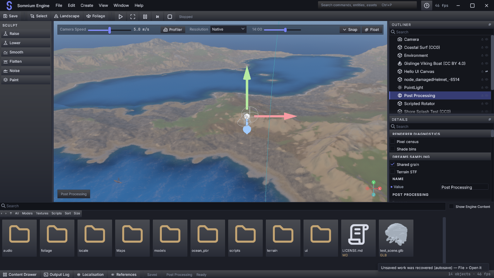

# Phase PERSONA — Atlus

> **Status:** PERSONA-A baseline/redlines and PERSONA-B foundation implemented; C–H remain open. [A/B record and native captures](<phase PERSONA/PERSONA-A_B.md>).
> **Date:** 2026-09-05. **Source:** `3c4e33a`, branch `dev`.
> **Priority:** The next implementation phase, before further MORROWIND, TSUSHIMA, DREAMS, TALOS, PORTAL, KENSHI, or STALKER work. Existing completion records remain unchanged.
> **Purpose:** Make Somnium substantially more beautiful, coherent, and approachable for level, environment, material, lighting, and technical designers.
> **Method:** One agent; local context, development history, Graphify, editor source, screenshots, and focused primary-source research. No reference-engine code or Atlus artwork copied.

## 1. Decision

**Rebuild the editor's visual composition and everyday authoring experience around an evolved Nocturne design system.** Changing the indigo hex value alone would leave the main problems intact. The upgrade must be obvious in an ordinary working scene with Details populated and assets open.

Somnium already owns the expensive foundations: retained widgets, SDF paint, typography roles, shaping, accessibility, command dispatch, reflected properties, undo, asset previews, and floating panels. PERSONA makes those foundations produce a coherent product. It does not replace the UI framework or restart phases 26, 26-Zeta, 27, or CONTROL.

The visual direction is **a nocturnal creative studio**: deep blue-charcoal structure, legible silver text, luminous iris for intentional actions, warm mineral accents for content, precise spacing, and distinct typography. Depth comes primarily from surface separation and composition. Gradients, shadows, and motion have specific jobs.

The Atlus reference means strong identity, legible hierarchy, memorable navigation, and decisive feedback. It does not mean importing Persona's red-and-black palette, tilted property labels, comic borders, logos, fonts, audio, or animated menu transitions into a precision editor. A small asymmetric notch can distinguish the Somnium workspace header; fields and data remain square to the reading grid.

Three directions were considered:

| Direction | Decision |
|---|---|
| Stronger gradients, gloss, and glow across existing widgets | Reject as the organizing principle. Current paint already applies these broadly, while the hierarchy remains weak. |
| Neutral grey DCC skin | Useful comparison baseline, but insufficient identity and insufficient improvement in workflow. |
| Nocturne studio: calmer structure, stronger type, selective luminous states, contextual authoring | Adopt for the first native implementation slice. Assess against the current editor in matched captures. |

## 2. What was actually inspected

This is a focused editor audit, not an assertion that every line of the approximately 189k-line engine was reviewed. The root context supplied engine ownership and renderer constraints; source inspection followed the editor's paint, construction, input, property, asset, layout, and capture paths.

| Evidence | Use and limits |
|---|---|
| [`context.md`](../context.md), especially architecture, UI, open issues, editor rationale, and roadmap | Primary project entry point. Some UI summaries conflict with later source and the same file's detailed ledger. |
| [`implementation/context.md`](../implementation/context.md) | Historical early engine account; its egui-based UI description is not current. |
| [26](phase_26.md), [26-Zeta](phase_26_Zeta.md), [27](phase_27.md), [CONTROL](phase_CONTROL.md), [MORROWIND-J](<phase MORROWIND/MORROWIND-J.md>), development-record index | Establish shipped work, original design intent, remaining docking integration, and evidence conventions. Older audit scores are not reused as current scores. |
| [`GRAPH_REPORT.md`](../graphify-out/GRAPH_REPORT.md) | Navigation snapshot dated 2026-08-27: `UiManager` 224 edges, `Widget` 201, `SomniumRenderer` 169. These are historical graph counts, not current performance measurements. No expensive Graphify regeneration. |
| [`theme.rs`](../crates/somnium_ui/src/theme.rs), [`style.rs`](../crates/somnium_ui/src/style.rs), typography, button, property-row, font/shaping code | Follow tokens through recipes and actual widget paint; distinguish implemented capability from comments. |
| Editor [shell](../crates/somnium_ui/src/editor/shell.rs), [Details builder](../crates/somnium_ui/src/editor/inspector.rs), [Details model](../crates/somnium_ui/src/editor/inspector_gen.rs), [Content Drawer](../crates/somnium_ui/src/editor/content.rs), `lib.rs` routing | Inspect actual surfaces, state ownership, generated field metadata, asset actions, audit controls, and fixed dimensions. |
| [`workspace.rs`](../crates/somnium_ui/src/workspace.rs), [`layout_persist.rs`](../crates/somnium_ui/src/layout_persist.rs), dock/floating integration references | Presets and persistence already exist. Full arbitrary panel placement is a remaining integration task. |
| [`media/editor.png`](../media/editor.png), [committed editor golden](<phase MORROWIND/golden/editor_shell_1280x720.png>) | Viewed directly. Historical visual evidence, not proof of present build behavior. |
| [Fresh PERSONA baseline](evidence/PERSONA_baseline_1600x900.png) | Current source compiled in release mode and captured on 2026-09-05. Directly inspected; details and limits below. |

### Fresh native capture



The current capture confirms that the heavy repeated button/header washes, permanent Sculpt column, compact Content toolbar, and large folder tiles remain visible. It also reveals a more important ordering problem: **Renderer diagnostics and Dreams sampling precede the selected object's ordinary properties**. With the drawer open, the Post Processing heading sits near the lower edge of Details and its actual controls are below the visible area. Designers should encounter the properties they selected the object to edit before development switches.

Capture provenance:

| Setting | Recorded value |
|---|---|
| Build | `cargo run -p hello_engine -j 1 --release`, source revision `3c4e33a`; compiled successfully in 2m 29s, with existing documentation/dead-code warnings |
| Capture hook | `SOMNIUM_CAPTURE_UI_PNG=target/persona-audit/shell.png`, `SOMNIUM_CAPTURE_FRAME=120`, `SOMNIUM_CAPTURE_QUIT=1` |
| Audit inputs | `SOMNIUM_AUDIT_WINDOW_SIZE=1600x900`, `SOMNIUM_AUDIT_UI_STATE=shell`, `SOMNIUM_AUDIT_SELECT_ENTITY=Post Processing` |
| User layout isolation | Process-local `APPDATA` redirected to `target/persona-audit/profile`; existing personal layout not overwritten |
| Output | 1600×900 PNG, 814,920 bytes; copied unchanged to the evidence link above |
| Scene/view | `hello_engine` startup coastal scene and startup camera; Content Drawer open; Nocturne default; Post Processing selected |
| Limits | Scene/project state was not isolated: the capture includes an autosave recovery notice. Monitor DPI was not independently recorded. No controlled camera/time/scene A/B comparison and no fresh performance or interaction measurement. |

The runtime also logged `on_render_ui drew no canvas`. That is recorded context for this run, not diagnosed or attributed to the editor redesign. This single capture supports visual inspection; it does not establish the five user journeys or replace the PERSONA-A baseline matrix.

### Git changes that affect this plan

- `82fedd7`: CONTROL-A/A1/A2 integration — command/input reachability is an existing foundation.
- `6a91415`: CONTROL-E drag/drop — do not propose implementing semantic asset dragging from scratch.
- `602c355`: CONTROL-F Outliner/selection/clipboard — improve presentation and discoverability of these workflows.
- `7b67ff6`, `232eece`: text shaping/bidi and enabling shaping by default.
- `59fb056`, `6a498c3`, `30e20e9`, `35b5fad`, `3ecbda6`: floating-panel ownership, text rendering, DPI, window behavior, and abandoned header-drag fixes.
- `1f5dc36` and the surrounding recent fixes: read current code before treating old screenshots or failures as current defects.

### Do not schedule already-shipped work again

| Existing capability | What PERSONA should do |
|---|---|
| Semantic tokens, recipes, Nocturne and Dawn snapshots, token JSON parity tests | Improve coverage, semantics, composition, and non-color token parity. Preserve existing color tests. |
| Rounded SDF primitives, gradients, shadows, focus glow, animation driver | Use them selectively; no new paint pipeline required for the first slice. |
| `text/shape.rs`: rustybuzz + unicode-bidi; `ShaperPolicy::Shaped` default | Verify glyphs, fallback, editing, and DPI. Do not adopt cosmic-text based on stale comments. |
| Schema-generated Details, mixed values, reset-to-default, unit/range metadata, array editing | Add organization and clearer affordances through the existing model. |
| Eight workspace presets; dock-tree model; major panels can float | Expose and polish these. Arbitrary redocking must be judged separately from floating. |
| Content navigation, filters, size/sort, virtualized tiles, previews, asset picker actions | Improve the surface and verify complete designer journeys. |
| AccessKit, reduced motion, high contrast, shortcuts, palette, help | Extend state coverage and verify live use, rather than adding parallel systems. |

## 3. Audit findings and priorities

**Evidence labels:** V = directly visible in inspected captures (the fresh baseline confirms P01, P02, P09, and P10); S = supported by current source; R = recorded issue requiring current reproduction; P = design proposal. Visual judgments are judgments, not measured user-study results.

| ID / priority | Evidence and problem | Designer impact | Required response |
|---|---|---|---|
| P01 / high | V/S: ordinary raised buttons get a wash and shadow in `style::button`; `button.rs` derives a wash even for explicit caller backgrounds at rest. | Repeated glossy strips compete with the scene and make actions look equally important. | Explicit primary, secondary, quiet, toggle, and destructive recipes. Quiet command groups; depth reserved for genuine layers. |
| P02 / high | V/S: persistent left Sculpt column; `shell.rs` builds six tools, while `ChromeLayout` defaults to 168 logical units for tools. | Much of a valuable column carries little context; non-terrain work inherits terrain-oriented furniture. | Collapsible mode rail and a contextual Tool panel. Show options for the active tool and explain unavailable actions. |
| P03 / high | S: generated component and subgroup headings are text nodes in `inspector.rs`; rows follow as one sequence. | Large components become a scrolling inventory rather than a manageable task surface. | Collapsible sections, sticky selection identity, pinned fields, and explicit All / Modified / Pinned filters. Preserve search and mixed-value semantics. |
| P04 / high | V/S: Content toolbar uses 10-unit text and 22-unit buttons; panel float control is 20×18; property revert uses a 14-unit gutter with a 5-unit painted dot. | Frequent actions require precision and are easy to overlook. | Give controls adequate hit regions independently of icon size. Make Reset to default an explicit keyboard/context action as well as the dot. |
| P05 / high | S: numeric/property layouts and shell builders still read `NOCTURNE` or compatibility dimensions directly; builders also contain literal sizes. | A density change cannot reliably propagate through layout, typography, hit testing, and floating windows. | Semantic metrics and component sizing must resolve together. Audit active-theme paint and legacy authored colors rather than assuming all aliases break Dawn. |
| P06 / high | S: current default input edge `#313543` against `#12141A` is 1.51:1; hover edge `#4A4F5E` is 2.25:1. | Subtle boundaries are difficult to locate, especially for empty controls. | Separate decorative separators from required control boundaries. Use stronger edges where needed; validate full rendered states, not just token text pairs. |
| P07 / high | R: context records three reports of asset-to-Details dragging doing nothing despite semantic-route tests. | Designers cannot trust assignment or tell an incompatible target from a missed gesture. | Reproduce with current build; retain existing Use Selected and Assign to Selection; show target, acceptance, result, and failure reason. Do not call this a freshly reproduced bug yet. |
| P08 / high | S/R: terrain layers, foliage kinds, and alpha masks are not authored asset-backed tool options; brush fields remain editor-private enums. | A beautiful palette would still expose fixed choices and incomplete authoring. | Define a schema-backed tool-settings model and typed asset eligibility before claiming a complete terrain/foliage workspace. See dependency rule below. |
| P09 / medium | V/S: application controls, editing mode, transport, and viewport settings use adjacent bands with similar visual weight. | The hierarchy of project, task, tool, and view is hard to scan. | Make each scope visually distinct; group transport; move infrequent performance choices behind a named View menu. Keep active mode and camera speed visible. |
| P10 / medium | V/S: large folder art and repeated tile surfaces dominate the older drawer; current navigation/filter controls remain compact text buttons. | Browsing feels like a debug file grid and obscures location/type/selection. | Strong breadcrumb, filter chips with clear state, uniform thumbnail well, secondary metadata, explicit sorting and grid/list controls. |
| P11 / medium | S: selected row, active tab, and armed tool share `Interaction::Selected`; modified dots, busy state, and selection also reuse the accent family. | Several different meanings compete for one visual signal. | Add semantic usage roles and orthogonal state flags; keep selection, keyboard focus, modified, and armed state distinguishable without color. |
| P12 / medium | S: `Paint::finish` sets invalid border and then replaces it with focus border. | A focused invalid field cannot communicate the error through its border alone. | Compose an outer focus ring with persistent error icon/message or inner edge. Test focused + invalid + modified combinations. |
| P13 / medium | V/S: fixed dimensions, very short headers, and property-row width thresholds need coordinated behavior at small sizes. | Labels, asset actions, and scene space compete when the window or panel narrows. | Specify responsive rules and minimum useful viewport area; use stacked property rows already available, overflow menus, and drawer resizing. |
| P14 / medium | S: runtime token sheets live under `crates/somnium_ui/assets/tokens`; historical Zeta design JSON has older values and contract wording. | Future sessions can implement against the wrong design artifact. | Version PERSONA tokens and name one editable source; mark old package as historical. Extend parity beyond the existing semantic-color checks. |
| P15 / high | V: fresh capture places Renderer diagnostics and Dreams sampling above Name and Post Processing; the open drawer leaves almost no visible selected-component controls. | A lighting designer must scroll past development switches to reach the intended edit. | Put selected-object properties first; move renderer diagnostics to their own panel or an explicit Advanced section. Retain registry reachability. |

The 1.51:1 and 2.25:1 figures are opaque sRGB calculations, not a declaration that the entire native application fails WCAG. Borders are not always the identifying part of a control; decorative separators need not meet the same target. Inspect icons, fills, empty states, and composited edges together.

### What should remain recognizable

The scene remains the visual center. Preserve the familiar Outliner/Details relationship, stable commands, panel resizing, searchable assets, numeric scrubbing, and Somnium's original S identity. Improve them without making experienced users relearn routine interactions.

## 4. Nocturne v2 design specification

The specification below records the original starting values. PERSONA-B implements the shared foundation; its [delivery record](<phase PERSONA/PERSONA-A_B.md>) and versioned runtime token sheets identify final values and remaining composition work. Sizes are logical UI units before monitor scaling.

### Palette and material

| Proposed semantic role | Starting value | Use |
|---|---|---|
| `surface.window` | `#11131A` | Outer application frame |
| `surface.canvas` | `#151821` | Panel content canvas |
| `surface.panel` | `#1B1E28` | Main authoring surfaces |
| `surface.header` | `#252A38` | Section identity, not every row |
| `surface.raised` | `#303749` | Popovers and intentional raised controls |
| `surface.input` | `#12151D` | Editable value wells |
| `surface.hover` | `#333D52` | Hover indication, confined to target |
| `text.primary` | `#E6E9F2` | Values and important names |
| `text.secondary` | `#B1B9CB` | Labels and secondary actions |
| `text.muted` | `#929DB3` | Helpful metadata, never substitute for disabled |
| `text.disabled` | `#626D85` | Inactive content only; nearby reason remains readable |
| `border.separator` | `#303646` | Decorative subdivision |
| `border.control` | `#626D85` | Required empty-field/check/control edge |
| `accent.action` | `#A59AFF` | Primary action and narrow selection cue |
| `focus.ring` | `#B8B0FF` | Solid focus outline, not glow alone |
| `selection.fill` | `#303451` | Opaque initial value; avoid unverified alpha/background combinations |
| `selection.inactive` | `#2B303D` | Selection remains identifiable when another panel owns focus |
| `signal.modified` | `#DEBE87` | Small diamond plus Reset affordance |
| `signal.success` / `warning` / `error` | `#7CD5B0` / `#EAC17A` / `#F08D9D` | Icon and message accompany each status |

Computed starting-pair contrast: primary/panel **13.70:1**, secondary/panel **8.45:1**, muted/panel **6.09:1**, control edge/input **3.52:1**, focus/panel **8.47:1**, dark `#11131A` text/action fill **7.66:1**. Other pairings, gradients, alpha, Dawn, disabled rendering, and high contrast still require checks.

Use opaque panels over the viewport so a bright sky cannot wash out controls. Keep any chrome wash subtle and limited to the application or active workspace header. Do not add blur as a prerequisite. Panel bodies remain flat; shadows distinguish popovers, drawers, and modals. Keep a quiet inner edge on value wells if it improves actual screenshots.

### Type, spacing, shape, and density

| System | Specification |
|---|---|
| Fonts | Retain bundled Inter and JetBrains Mono initially. Use existing medium/semibold roles; test before adding a new family. |
| Hierarchy | Workspace title 16 semibold; panel title 13 semibold; property/body 13 regular; supporting labels 12; captions 11 only for optional metadata. Numeric values 12 mono, with units secondary. |
| Capitalization | Sentence case for panel/task labels. Small uppercase only for sparse overlines; never use it to compensate for weak section structure. |
| Spacing | 4-unit base, named 4/8/12/16/24 steps. Align headings, field labels, previews, and footer actions to common insets. |
| Density | Compact: 24-unit rows and 28-unit command controls. Comfortable: 28-unit rows and 32-unit controls. Font and row choices are coordinated; density is independent of OS DPI. |
| Hit areas | Aim for at least 24×24 for discrete pointer actions; 28–32 for frequent toolbar actions. Keep icons 16/20. Revert, float, close, expand, and reset must not inherit their glyph's tiny bounds. |
| Radii | Inputs 4; buttons 5; thumbnail wells 6; popovers 8; dialogs 10. Square panel joins where surfaces meet. |
| Strokes | Snap 1 physical-pixel separators appropriately; 2 logical-unit focus outline. Verify at fractional DPI. |
| Motion | Immediate press feedback; hover 80–120 ms; popover 120–160 ms; drawer 160–200 ms. No scene shift caused by animation and no delay before keyboard input works. Reduced motion resolves directly to the final state. |

Dawn remains a required counterpart. Build its own luminance and state relationships; do not mechanically invert Nocturne. The high-contrast mode must still derive from actual semantic pairs.

### State grammar

| State | Required visible language |
|---|---|
| Hover | Local wash; no layout movement |
| Selected | Fill + rail/check; distinct inactive selection when focus leaves |
| Keyboard focus | Outer solid outline that survives selected and invalid states |
| Armed tool | Selected button + visible tool name and cursor/viewport indication |
| Modified | Warm diamond and named Reset to default action; unrelated to scene-unsaved state |
| Mixed values | Em dash or Mixed label; untouched fields never overwrite the selection |
| Invalid | Error icon/message persists while focused; explain recovery |
| Busy | Named operation and progress; cancel where supported; no endless anonymous spinner |
| Disabled | Stable layout with readable explanation in tooltip/help; no inert unexplained click |
| Drop accepted/refused | Target outline and explicit Assign/Replace/refusal text before release |

## 5. Editor composition and designer workflows

### Shell and workspace

Proposed composition, not an implementation screenshot:

```text
S  Project / Scene *       File Edit Create View Window Help     Search
Workspace: Layout v       Select  Move  Rotate  Scale       Play Pause Stop
┌──────┬───────────────────────────────────────────────┬───────────────┐
│ Mode │ Perspective v   Lit v   Snap   Camera speed   │ Outliner      │
│ rail │                                               │ Search/filter │
│      │                 SCENE                         │ Entity tree   │
│ Tool │                                               ├───────────────┤
│ pane │                                               │ Selection     │
│ when │                                               │ Details       │
│ used │                                               │ All Mod. Pins │
│      │                                               │ Sections      │
└──────┴───────────────────────────────────────────────┴───────────────┘
Content / Output / Jobs      Saved or Unsaved      Tool hint / Diagnostics
```

Expose the existing workspace presets in one compact selector. Do not create eight permanent top tabs. At 1280×720, collapse the tool options when unused, put lower-frequency viewport actions in overflow, and keep transport reachable. At 1920×1080, an approximately 48-unit rail and 340-unit Details column leave room for the scene; an opened 240–280-unit Tool panel is a deliberate authoring choice. These widths are redline proposals, not replacements for the user's saved splits.

The content drawer stays transient by default, with clear pin/resize behavior and remembered browsing context. Opening it must not leave the selected object's identity inaccessible. Panel headers share one title/action treatment, with a visible menu for Float, Dock, and Reset layout. Preserve live panel state across floating; do not rebuild a second inspector.

Put project/scene identity and dirty state where users look before saving. Keep the original mark. Development-phase labels, detailed GPU counters, and renderer switches belong in About/Diagnostics or the relevant advanced panel, unless they explain an active user decision.

### Details: turn lists into readable decisions

1. Sticky entity/component identity, editable name, type, and multi-selection count.
2. Search with visible filter state and one clear reset. Empty search results say which filter hid the rows.
3. Selected-object properties before renderer diagnostics. Collapsible schema groups with stable IDs and remembered expansion. For Post Processing, use meaningful groups such as Exposure, Color, Lens, and Advanced, based on actual schema fields.
4. Pinned fields and Modified filter as projections of the same generated rows. Preferences already have a modified-only concept; do not confuse that with a shipped Details filter.
5. Numeric lane consistency: label alignment, unit suffix, sensible precision, soft/hard bounds, mixed-state display, scrub cursor, Esc cancel, and one gesture/one undo.
6. Reset actions reachable by keyboard/context menu and discoverable on hover. Preserve existing default-relative semantics; label scene-unsaved separately.
7. Asset field shows name, type, and thumbnail when useful. Surface existing Locate, Edit, Use Selected, and Make Unique actions coherently; retain search and type constraints.
8. Array element identity and reorder/duplicate/remove affordances stay visible at narrow widths. Reordering is only offered where its schema semantics are meaningful.

Pinned field persistence keys use component/field stable IDs, never translated labels or widget handles. Panel organization stays in the UI; domain visibility, editable ranges, eligibility, and authored values remain schema-owned.

### Tools: show what can be done here

Select mode needs no permanent Sculpt list. Landscape opens brush operation, size/strength/falloff, target surface, layer, and preview. Foliage opens brush operation, density/scale, eligible kinds, and placement constraints. Each tool shows its target and a short reason if it cannot act.

**Dependency rule:** PERSONA can deliver tokens, shell hierarchy, Details, and a contextual panel for existing options immediately. Rich layer/kind/mask authoring is not complete until its underlying tool settings and asset contracts exist. Bring only that minimum modeling slice into PERSONA; do not wait for all of MORROWIND and do not fabricate a UI-only second model. Whether these settings belong in a scene component or an editor-owned reflected document must be decided by their save/lifetime requirements before changing the scene format. Unknown scene fields must still round-trip.

### Content: make discovery and assignment trustworthy

Give navigation its own row: back/forward/up, readable breadcrumb, and search scope. Replace cycling Sort/Size buttons with named choices whose current value is visible. Separate type filters from display controls. Provide a compact list view when names/paths matter more than thumbnails.

Use consistent thumbnail wells, two-line names where needed, subdued type metadata, visible selection count, and uniform pending/missing/failed placeholders. Add local Favorites and Recent locations before attempting a large collection/query system. Preserve current path navigation, virtualization, visible-first preview jobs, cancellation, and asset identity.

For assignment, show the payload thumbnail/name and target field while dragging. A rejected drop explains type incompatibility, locked target, or unavailable asset. A successful drop updates the field and undo state visibly. Verify the equivalent Use Selected route too. Do not make drag/drop the only way to complete a task.

### Outliner, output, and first-use polish

- Outliner: clearer primary/multi-selection, visible hidden/locked states, scoped filter chips, rename feedback, parent-path tooltip, and a breadcrumb back to the selected entity. Use existing selection/filter/hide/lock behavior.
- Output/Jobs: readable severity grouping, selectable message text, source/asset links, operation progress, and explicit cancellation/result. Quiet healthy state; persistent actionable failures. Improve existing log/job surfaces.
- First use: explain an empty Details panel, empty folder, filtered-out list, missing reference, and unavailable tool with a next action. A lightweight recent-project entry is a late PERSONA task only if the existing project/scene opening route supports it without a second project model.
- Graph/timeline/GUI authoring: inherit fonts, selection, focus, toolbar, and empty-state recipes after the main shell. Their domain features are not a prerequisite for this redesign.

## 6. Engineering shape

Use the existing interfaces and deepen the modules that hide repeated policy. Graphify's hub counts are a warning against adding another large family of `UiManager` fields and routing branches.

| Responsibility | Existing home / change |
|---|---|
| Theme and metrics | `theme.rs`, `typography.rs`, `assets/tokens/*`: versioned palette, density, geometry, and type roles; one documented editing source with checked exports. |
| Paint policy | `style.rs`: named variants and composable states, consumed by shared widgets. Caller background must not implicitly mean gradient. |
| Common panel construction | `editor/parts.rs` and shell helpers: header/action/empty-state patterns, with size and accessibility handled once. |
| Details presentation | Add a small UI-owned presentation model beside `inspector_gen.rs` for expansion, pinning, and filtering. Feed existing generated rows and commands. |
| Tool presentation | Tool context supplies identity, capabilities, target, settings rows, and disabled reason. Editor adapters consume it; domain commands remain the mutation seam. |
| Browsing state | Extend existing content/navigation model with view settings and local Favorites/Recent. Keep stable asset identity and async preview ownership. |
| Workspace | Extend existing layout persistence and dock adapters. Save by stable panel IDs; repair corrupt/off-screen layouts. |

Avoid introducing a general-purpose plugin framework to style a handful of panels. Resolve immutable theme/metrics snapshots consistently for each layout/paint pass. Cache derived filtered lists on input/model changes, not every frame. Preview tasks use `somnium_jobs`; late results must validate identity/generation before installation. UI code must not retain ECS borrows across input gestures.

Compatibility checklist: one command registry; one schema editing route; one undo gesture; one UI renderer; existing sRGB/straight-alpha contract; game-owned canvas styling remains deliberate; primary floating viewport stays a redirect rather than a duplicate scene render.

## 7. Sequential implementation plan

Do these in order, with one bounded slice at a time. A pass does not count as complete merely because its primitives compile.

| Slice | Deliverable | Exit condition |
|---|---|---|
| PERSONA-A — Baseline and redlines | Capture current shell/Details/drawer/palette and important states; reconcile source/status discrepancies; record Nocturne v2 component state sheet. | Matched inputs recorded; current failures listed separately; no old golden silently approved. |
| PERSONA-B — Nocturne v2 foundation | Token/metrics evolution; type hierarchy; button/input/tree/property recipes; active/inactive selection; composed focus/error. | Native component gallery demonstrates every required state in Nocturne, Dawn, high contrast, and two densities. Existing semantic parity extended to metrics. |
| PERSONA-C — One beautiful working workspace | Shell bands, headers, workspace selector, responsive rail, Details grouping, numeric rows, drawer navigation and tiles. | A real scene at 1280×720 and 1920×1080 shows a substantial improvement; selection, edit, save, and assignment remain usable. This is the first visual milestone. |
| PERSONA-D — Everyday QoL | Pins/filters/reset, content Favorites/Recent, explicit Sort/Size, asset assignment feedback, Outliner and jobs polish. | The five journeys below pass without hidden dead ends; shortcuts and context alternatives agree. |
| PERSONA-E — Contextual authoring | Minimal tool-settings/asset contract plus Landscape/Foliage panels and target/eligibility feedback. | Designer can choose an authored supported resource, use the tool, cancel/undo, save/reload, and understand refusal. Unsupported resources are explicitly deferred, not dummy controls. |
| PERSONA-F — Workspace resilience | Float/redock UX, state retention, monitor/DPI changes, small-window overflow, saved layout migration. | Moving/resizing/reopening panels preserves selection, edits, scroll, and focus. Arbitrary cross-slot docking only closes if existing dock-tree integration actually supports it. |
| PERSONA-G — Finish and accept | Apply the same recipes to remaining authoring surfaces; accessibility and performance pass; matched captures and human sign-off; update context and old phase status references. | All mandatory gates below met. Record remaining optional items by name; no blanket “complete” for unverified states. |

**Current delivery:** A/B foundation is recorded in [PERSONA-A_B.md](<phase PERSONA/PERSONA-A_B.md>); C/D workspace and QoL implementation, tests and native evidence are in [PERSONA-C_D.md](<phase PERSONA/PERSONA-C_D.md>). C/D designer-journey acceptance remains open; implementation is not full acceptance. The [first E/F slice](<phase PERSONA/PERSONA-E_F.md>) adds contextual authoring, corrects Foliage Mode/F8, and repairs floating geometry and narrow-window clipping. Continue the designer journeys, remaining E resource/settings contract, F OS/DPI matrix and G finish/acceptance. All floating-window and phase-wide bug-closure gates remain binding.

## 8. Acceptance, not just screenshots

### Mandatory bug-closure gate

**PERSONA must not be marked complete while any known reproducible bug remains in the editor surfaces and workflows it covers.** This includes pre-existing bugs encountered during the survey or implementation, newly introduced regressions, and the newly shipped floating-window paths. Visual polish does not excuse broken behavior. A passing build, unit suite, or screenshot is insufficient on its own.

Keep a compact bug ledger with reproduction steps, affected revision, fix, and verification result. Every discovered editor defect must be fixed and its original reproduction rechecked before close-out, regardless of severity. An unreproduced user report remains an open investigation until there is evidence explaining the outcome; absence from a unit test is not closure. Optional feature deferrals elsewhere in this plan must not be used to defer defects in shipped or redesigned behavior. If a required fix cannot be completed, PERSONA remains incomplete and records the blocker.

For the newly implemented floating windows, explicitly exercise Outliner, Details, Output Log, and viewport through header drag, header/menu Float, return to dock, close/reopen, restart, focus loss during a drag, and monitor removal or DPI change. Verify text rendering, pointer coordinates, popup/tooltip placement, keyboard routing, retained selection/scroll/edit state, window ownership/z-order, off-screen recovery, and the primary-viewport redirect without duplicate scene rendering. Test docked and floating versions of the same operation. Preserve the fixes in the Git history above.

The final claim is **zero known outstanding editor bugs in the audited scope after these checks**, not proof that every possible engine defect has been eliminated. A documented open defect means this gate has not passed.

### Five designer journeys

| Journey | Required proof |
|---|---|
| Find and edit | Search for a light, select it, find intensity, scrub, cancel, edit again, undo, save, reopen. Target: first-time designer completes within 90 seconds without coaching. |
| Assign an asset | Find a compatible material, assign by drag and by Use Selected in separate trials, locate source, undo. Incompatible drop explains why before/at refusal. Target: within 60 seconds per route. |
| Author terrain/foliage | Enter mode, see target and settings, choose supported resource, apply stroke, undo, leave mode. No unexplained inert action and no Sculpt column remaining in unrelated work. |
| Edit multiple objects | Ctrl/Shift selection, mixed transform, change one axis, verify untouched axes, reset one field, undo. No accidental overwrite of mixed data. |
| Recover workspace | Float Details, move to another DPI monitor, resize narrowly, dock, restart, reset layout. Same selection and pending state retained; off-screen windows recover. |

Time limits are proposed usability targets, not measurements of current users. At close-out, recruit at least one designer unfamiliar with Somnium and one experienced DCC user, record task completion/errors and a brief clarity/visual-quality rating. Favor observed confusion over a subjective beauty score.

### Visual and accessibility gate

- Matched captures of empty/populated/long-name/mixed/invalid/loading/disabled states, not only a large hero viewport.
- 1280×720 and 1920×1080 logical extents; 100%, 125%, 150%, 200% monitor scale; include one floating-window transition. High DPI is a native monitor test, not image enlargement.
- No clipped labels/actions, hidden focused control, drifting numeric baselines, unreadable muted text, or focus indication lost to selection/error paint.
- Ordinary essential text at least 4.5:1; necessary graphical control/state cues at least 3:1 against relevant surroundings. Test composited output. WCAG is a useful benchmark here, not a claim of web conformance for the native app.
- Hit areas, keyboard alternatives, accessible name/role/value, modal focus restoration, Esc behavior, and announcements checked through the actual retained tree. Color-vision simulations supplement, not replace, this.
- Reduced motion works across drawers/popovers/focus; text and hit regions scale together. Test representative mixed-script names with the shipped fonts/fallback; a shaping library alone does not guarantee script coverage or caret correctness.

### Technical gate

- Focused UI/model tests appropriate to the changed interfaces, then the relevant repository gate. Planned commands: `cargo test -p somnium_ui -j 1` and `python tools/ghostfence/run.py`; run broader tests only for schema/core changes that justify them.
- Preserve the existing golden reference. The recorded sculpt-panel failure is **5.3333% changed versus a 0.2% budget**; that is historical debt, not a newly measured result. Investigate and document it before intentionally approving replacement goldens.
- Compare matched UI CPU/GPU zones and input/asset hitches at the same scene, scale, frame count, and warm-up. Proposed regression budget: no more than 10% increase in UI p95, with any larger change explained and accepted; do not infer UI cost from total scene FPS.
- No main-thread thumbnail decode, scene-wide rebuild, new per-frame allocation storm, or extra scene render solely for decorative chrome. Preserve virtualization.
- End-to-end assignment, undo/redo, scene unknown-field round-trip, and floating DPI checks must pass when touched. Static route tests alone do not close the recorded drag issue.
- Run `git diff --check` and validate document links when updating records. Capture evidence includes revision, command, scene, window size, DPI, selected entity, workspace, and theme/density.

## 9. References and what to learn from them

Online sources checked 2026-09-05. These inform the proposals; they do not prove Somnium usability or performance.

| Primary source | Relevant lesson and Somnium application |
|---|---|
| [Fluent 2 design tokens](https://fluent2.microsoft.design/design-tokens) | Distinguish raw values from semantic usage aliases. Extend the existing Nocturne system rather than letting panels choose arbitrary values. |
| [Unreal Content Browser interface](https://dev.epicgames.com/documentation/unreal-engine/content-browser-interface-in-unreal-engine), [filters and collections](https://dev.epicgames.com/documentation/unreal-engine/filters-and-collections-in-unreal-engine) | Separate source location, asset results, and filtering. Adopt clear scope and visible filter state; do not import an entire asset-management system. |
| [Unreal Details panel](https://dev.epicgames.com/documentation/en-us/unreal-engine/level-editor-details-panel-in-unreal-engine) | Search, favorites, and default indicators make dense properties manageable. The page labels favorites experimental; use the interaction idea, not an assurance of implementation maturity. |
| [Blender tool system](https://docs.blender.org/manual/en/4.5/interface/tool_system.html), [interface preferences](https://docs.blender.org/manual/en/latest/editors/preferences/interface.html) | Active tools have workspace/mode context; toolbar labels and tooltips aid discovery. Keep the active target/options visible and preserve compact/expanded presentations. Search-result excerpts were available; the full tool-system page fetch failed. |
| [W3C non-text contrast](https://www.w3.org/WAI/WCAG22/Understanding/non-text-contrast), [minimum target size](https://www.w3.org/WAI/WCAG22/Understanding/target-size-minimum) | Differentiate decorative edges from identifying control cues; account for pointer-target size and spacing. Apply to native controls as a design benchmark. |

The supplied `C:/Users/adhir/Downloads/GE/example/_repo` does not exist here. The reference collection is at `C:/Users/adhir/Downloads/GE/example_repo`. Focused local checks used:

- Godot `godot-4.7.1-stable/editor/themes/editor_theme_manager.cpp`: independently configurable spacing, base/accent color, contrast, icon saturation, radius, and scaled borders. This supports treating density and color as separate dimensions.
- Flax `FlaxEngine-master/Source/Editor/Windows/ContentWindow.Navigation.cs`: navigation preserves location and focus explicitly. The lesson is continuity while browsing, not its implementation.

Local repository folder names are not verified upstream revisions. No code was copied. Follow [`ATTRIBUTION.md`](../ATTRIBUTION.md) if implementation later adds a specific architectural reference.

Skills applied from the installed Codex cache: `design-critique`, `design-system`, `rust-pro`, `codebase-design`, and `engineering:code-review`. Rust advice was applied to state ownership, stable identities, jobs, and module interfaces; this survey did not add dependencies or change engine code.

## 10. Scope boundaries and handoff

PERSONA owns the next editor experience work. It does not include renderer optimization, a new UI framework, a visual scripting language, full project packaging, prefab implementation, or a theme marketplace. Blur, a new font family, advanced collections, and unrestricted docking are optional follow-ups unless evidence makes them necessary for the specified journeys.

The new visual specification supersedes older paint prescriptions where explicitly different: ordinary controls no longer receive elevation/gradients automatically; radii, density, focus thickness, state colors, and typographic hierarchy are candidates for replacement through matched visual review. Older behavior and architectural invariants remain binding. No external design engagement is required before the first native slice.

Leave the pre-existing untracked `phase_TALOS.md` intact. PERSONA changes scheduling priority; it does not invalidate TALOS research or silently mark other phases complete.

Completion means a demonstrably better working editor, reliable everyday actions, and evidence for its important states. The first milestone must make that improvement visible before expansion into optional features.
