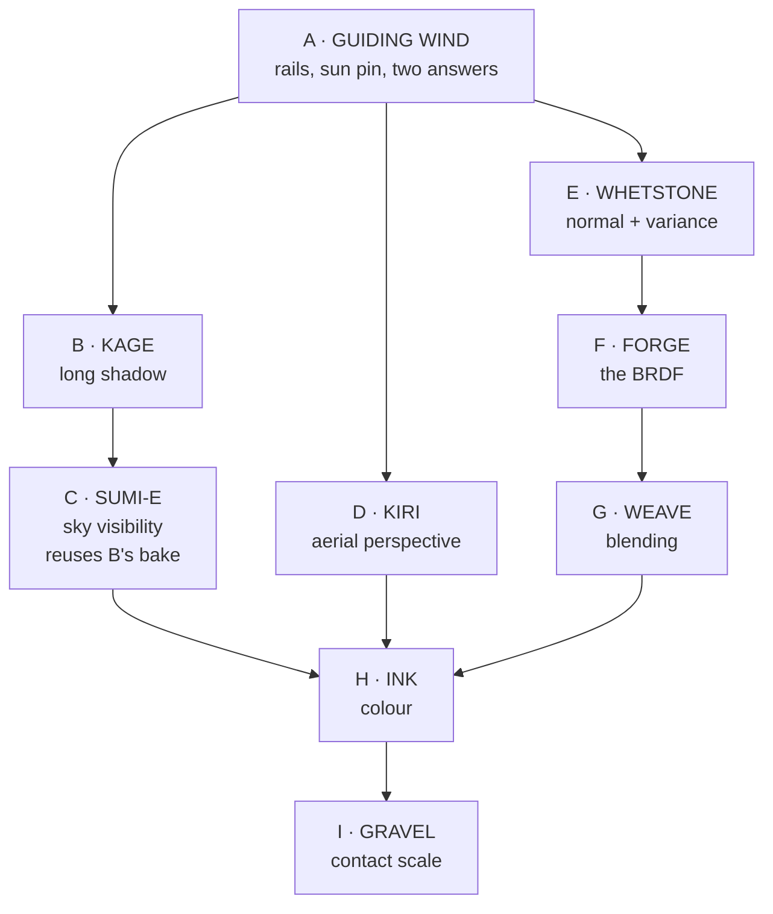

# Phase TSUSHIMA — Sucker Punch

> *The island is the character. Everything the player believes about that place,
> they believe because of ground, wind and light.*

> **Codename:** TSUSHIMA (Sucker Punch, 2020). Named for the one shipped open
> world whose reception was largely about how its *ground* looked, and whose two
> SIGGRAPH talks are the closest published match to the problem in front of us.
>
> **The problem it names:** terrain that reads as modelled clay rather than as
> land.
>
> **The rule for this phase, and it overrides the usual one:** *whatever looks
> better than the current implementation gets implemented.* Frame cost is not a
> veto here. Nothing below is gated on a `.somtime` row, nothing lands "off by
> default with its cost published", and no technique is dropped for being
> expensive. If it makes the ground look like ground, it ships on.
>
> **Status:** **A through F LANDED 2026-09-02.** G, H and I are plan only.
> Records: `TSUSHIMA-A-B-C.md` and `TSUSHIMA-D-E-F.md`.
>
> **§2.3 is settled, and the plan had it backwards.** The ground *does* get
> aerial perspective — the fog pass is on by default and reaches it (102.12
> mean abs, 53% of pixels). The defect was that the fog medium was lit by the
> **sun alone** while the air terms beside it carried a skylight term, and fog
> outweighs Rayleigh on these maps by roughly fifty to one. So the distance cue
> was a grey wash and distant ground got darker instead of bluer. One term.
>
> **F had to be split into three switches**, because through one switch it
> darkened terrain 39% — the opposite of what energy compensation does — and a
> single number could not attribute that. Apart: multiscatter +1.6%, Hammon
> −9.9%, micro-shadowing −30.6%. The term the prompt was really about is the
> smallest of the three.
> Written against `b38ac74` (`dev`). Every file-and-line claim in §2 was read
> from this tree; every formula in §4 and Appendix A carries a confidence line,
> because implementing a misremembered formula costs a day and looks like a
> subtle art problem.
>
> **What landed, and what it measured:** see
> `dev records/phase TSUSHIMA/TSUSHIMA-A-B-C.md`. Headline — the horizon map
> changed **13.5% of terrain pixels** on the coastal vista at an 8° sun, mean
> absolute difference 126.79 against a terrain radiance of 1566.80. Sky and mesh
> pixels byte-identical. Bake 101–124 ms at load, once.
>
> **Three corrections this document owes, all from measurement:**
>
> 1. **§3 C said combine sky visibility by `min`, not by a product. That was
>    wrong.** `min` measured 38× weaker (0.17 vs 6.59 mean abs) and weaker in
>    the wrong places, because the two terms are near-independent — GTAO cannot
>    see a ridge line and the bake cannot see a boulder. Shipped as a product.
> 2. **A.1's `tools/lookmetric` should not be built.** `capture.rs` already has
>    a per-pixel terrain/mesh/sky mask and a `CAPTURE-DIFF` reporting mean
>    absolute difference and changed-pixel count per class. Every number above
>    came out of it.
> 3. **§2.1's caveat is settled: the traced path was not covering the gap.**
>    If it had been, turning the horizon map on would have changed nothing.
>
> **One item of A did not get done and is not closed:** §2.3, whether the ground
> receives aerial perspective with the volumetric pass off. D takes that capture.
>
> **The one constraint that survives:** **no pass reordering.** MORROWIND froze
> the visibility-buffer pass order and GHOSTFENCE enforces it. TSUSHIMA adds
> passes and adds work inside existing ones; it does not move any. That is a
> correctness constraint, not a performance one.
>
> **Do not copy source.** Patterns only, cited in `ATTRIBUTION.md` **§13L**.
> §13E/§13F belong to Phase 27, §13G to CONTROL, §13H to MORROWIND, §13I to
> KENSHI, §13J to STALKER, §13K to DREAMS. §5 has the licence table.

---

## 1. What is actually wrong

The question that started this was *"the terrain looks cartoonish, especially
next to the water — can the BRDF be improved?"*

The BRDF can be improved and §3's TSUSHIMA-F does it. But the BRDF is not the
main reason the ground looks like clay, and the water comparison is the proof.
Both run through the same renderer against the same sky:

| | water | terrain |
|---|---|---|
| sub-pixel slope energy migrated into roughness | **yes**, `water.wgsl:812`, `:851` | **no** |
| a normal that survives distance | **yes**, resolved per pixel | **no** — point-sampled vertex normal at the LOD stride |
| specular visible at all | **yes**, its own GGX with an energy factor | effectively **none** at r ≈ 0.85 |
| transport through the medium | **yes** — Beer, single scatter, SSS | n/a |
| depth cue at range | **yes** | **gated off** with the fog pass (§2.3) |
| sun shadow past 100 m | n/a | **none** (§2.1) |
| large-scale ambient occlusion | n/a | **none** (§2.2) |

The water shader is 1,214 lines that spend most of their length on *how the
surface behaves at distance and under a sun*. The terrain material is 1,246
lines that spend almost all of their length on *which four textures to fetch and
how to blend them*. It is an excellent texturing system attached to a shading
model that stops caring past the pixel.

**The ranked defect list.** Read from three captures already in
`dev records/phase DREAMS/` — `DF-SLOT_clipmap_off.png` (a vista),
`DF-QUALITY_clipmap_off.png` (a hillside), `DREAMS-B_island-ground_default.png`
(a plain to a sea horizon):

1. **No sun shadow past 100 m.** `SHADOW_DISTANCE` is a compile-time `100.0`.
   Landscape structure at range is almost entirely long shadow. Without it,
   hills are shapes with paint on them, which is exactly what the vista capture
   shows: not one cast shadow in frame.
2. **No large-scale occlusion.** GTAO is screen-space and radius-bounded. A
   valley floor is exactly as bright as the ridge above it.
3. **No aerial perspective on the ground.** In the island capture the sea and
   sky haze and the terrain does not — ground colour at the far edge of the
   plain equals ground colour at five metres, and the terrain/sea horizon is a
   razor line.
4. **Meso-scale relief dies with distance.** The 10 cm–5 m band — the band that
   makes ground look like ground — is aliased away by the LOD stride and there
   is no heightfield normal texture to carry it.
5. **The BRDF loses energy and has no specular presence.** Single-scatter GGX at
   r ≈ 0.85 returns almost nothing, Burley is the wrong diffuse for mineral
   surfaces, and there is no micro-shadowing. **This is what the prompt asked
   about. It is real, it is cheap, and it is fifth.**
6. **Splat transitions read as airbrush.** Weights are blended smoothly but
   never perturbed, so a grass/dirt boundary is a soft oval.
7. **Colour is uniform at every scale above the tile.** One macro map is the
   only variation above the detail tiling frequency.
8. **Nothing at the contact scale.** No pebbles, no cliff parallax, no debris.
9. **The photographed packs may carry baked lighting.** Unaudited. If they do,
   every lighting fix above is fighting paint.

Items 1–4 are geometry and light transport. Item 5 is the BRDF. Items 6–9 are
authoring and content. All nine get done, roughly in that order, because doing 5
first would be a real improvement nobody could see.

### Out of scope

- **Water.** It is the reference the ground is being measured against by eye.
- **The atmosphere's own sky rendering.** D changes what reaches *opaque*
  geometry only; the sky already integrates the full march and applying aerial
  perspective to it would count the air twice (`shading.wgsl:2018`).
- **Foliage placement and wind.** A separate phase, and it should come after
  this one.
- **A new terrain LOD scheme.** Chunk LOD, stitching, clipmap and VT stay as
  they are. E adds a texture the shader reads; it does not change the mesh.
- **The clipmap verdict.** `DF-QUALITY_clipmap_verdict.md` settled it.
- **GI.** ReSTIR GI and the SH probe volume stay. C adds *sky visibility*, which
  is a different and much cheaper quantity.

Everything lands in **hello_engine** with an editor control under Details >
Terrain, not only in the vvardenfell proof slice.

---

## 2. The audit — read from the tree at `b38ac74`

### 2.1 Shadow distance

```
crates/somnium_renderer/src/shadow/cascade.rs:23
    pub const SHADOW_DISTANCE: f32 = 100.0;
```

Four cascades, practical-split, over `[0.1, 100.0]` m, into a 2048² viewport
each (`shadow/mod.rs:22`). `compute_cascades` takes no scene extent and no
setting; the constant is read nowhere else and is not exposed. **On a map
hundreds of metres across, sun shadowing covers the nearest 100 m and nothing
else.**

One thing to check before writing B, because it changes what B *is*: when
`cluster_params.shading_mode & 16u` is set, `shading.wgsl` prefers `restir_vis`,
whose sun-visibility ray is cast with `tmax = 10000.0` (`restir_di.wgsl:135`)
and has no 100 m limit. If the terrain BLAS is in that TLAS, the traced path
already produces correct long-range shadows and B's job is to make the raster
path match it rather than to invent long shadows from nothing. One capture
answers this.

### 2.2 Occlusion

- **GTAO:** screen-space, world-space search radius (`gtao.wgsl:33`, `:161`).
  Cannot see an occluder off screen or beyond its radius. Contact scale, and it
  does that job correctly.
- **Baked per-layer AO:** `TerrainLayerSample.occlusion`, folded into
  `surface.occlusion` at `shading.wgsl:1503`. Texture scale, correct, small.
- **SH probes:** a **4×4×4** camera-relative volume (`shading.wgsl:500`). Four
  probes per axis is a smooth gradient, not occlusion.

**Nothing in the renderer knows a valley floor sees less sky than the ridge
above it.** That is the gap, and it is exactly the gap Sucker Punch filled with
baked sky visibility.

### 2.3 Aerial perspective

```
crates/somnium_renderer/src/shaders/shading.wgsl:2021
    if volumetric_range.x > 0.0 {
```

Aerial perspective and fog for **all opaque geometry** are one fetch from the
volumetric froxel volume: 32×32×32 over `DEFAULT_MAX_DISTANCE = 1200.0` m
(`pass/volumetric.rs:26`, `:37`), default fog density `0.0008` /m (`:104`).

- Past 1,200 m the last slice is held: a 5 km ridge gets 1,200 m of air.
- 32 slices over 1,200 m is 37.5 m per slice, each texel the integral over its
  whole depth — coarse for a landscape depth cue.
- **If the volumetric pass is not running, opaque geometry gets no aerial
  perspective at all.** `atmosphere.wgsl` has a transmittance LUT (`:166`) but
  no aerial-perspective LUT, and nothing else in `shading.wgsl` applies distance
  attenuation.

The island capture shows exactly the third bullet's signature. Confirm it with
one capture (the PNG does not record its switch state), then fix it — this is
the cheapest large win in the phase.

### 2.4 The normal, and where it dies

```
crates/somnium_renderer/src/terrain/mesh.rs:69
    let normal = glam::Vec3::new(-dx, 1.0, -dz).normalize();
```

Vertex normals are central differences over the **full-resolution** heightmap,
which is right, and identical across chunk borders, which is why seams shade
correctly. `build_lod_indices` then renders a coarser LOD by *skipping* vertices
with stride `1 << lod` (`mesh.rs:87`).

At LOD 3 the surface is shaded by point samples of a normal field taken every
eighth cell. That is not a filtered normal; it is an aliased one. The correct
LOD-n normal is the *average* of the normals it stands for, plus the variance it
threw away moved into roughness — exactly what `water.wgsl:812`/`:851` does to
its own slope field, and exactly what terrain does nowhere.

There is no heightfield-derived normal texture in tree. `terrain/` has
`heightmap.rs`, `mips.rs`, `macro_map.rs`, `splat.rs`, and no normal map.

### 2.5 The BRDF, exactly

`shaders/brdf.wgsl`, 120 lines:

| term | what is there | what is missing |
|---|---|---|
| D | Trowbridge-Reitz GGX | — |
| V | Smith joint GGX, height-correlated | — |
| F | Schlick | — |
| diffuse | Burley / Disney | a rough-surface model; Burley has no retroreflection and mineral ground does |
| energy | **single scatter only** | multiple-scattering compensation; at r ≈ 0.85 the loss is large and roughness-dependent, so it flattens roughness *contrast* as well as darkening |
| area light | `evaluate_brdf_area` widens α by the source's angular radius and rescales — good, already used for the sun | — |

`shading.wgsl:330`, `env_brdf_approx`, is the Karis/Lazarov split-sum fit. It
returns `f0 * ab.x + ab.y` and **discards `ab`** — so nothing downstream can
compute a multiple-scattering term even though the two numbers it needs are
computed one line earlier and thrown away.

`specular_occlusion` (`:384`, Lagarde's) is correct. `evaluate_ibl_diffuse`
already gathers along a bent normal at a 0.75 mix (`:556`), which is genuinely
good and is part of why the near ground holds up better than the far ground.

Terrain sets `metallic = 0.0` and `f0 = 0.04` for **every layer**
(`shading.wgsl:1498`, `:1528`) plus the wetness term. Dry sand, wet clay, lichen
and shale do not share an F0 and `TerrainMaterial` cannot say so.

No micro-shadowing term. No specular antialiasing of any kind in the opaque path.

### 2.6 Blending and colour

`evaluate_terrain_material` (`terrain_material.wgsl:999`) does strongest-four
selection, optional height-append, per-layer blend width, hex tiling, POM with a
POM shadow, one macro map in four blend modes, and wetness. Two things it has no
mechanism for:

- **The weights are never perturbed.** `sel_w` comes straight from the splat
  texture. A painted 4 m brush produces a 4 m-smooth transition; height blending
  only re-ranks *within* the blend width the smooth weight already defines.
- **One macro map is the only frequency above the tile.** Real ground has
  luminance and hue variance at 1 m, 10 m, 100 m and 1 km. This has it at the
  tile size and the terrain size and nowhere between.

Albedo is blended in an approximately perceptual space (`sqrt` … squared back,
`:1140`–`:1157`). That is correct and stays.

### 2.7 Content

`assets/` carries photographed material packs (`tools/fetch_terrain_textures.sh`).
Whether their albedo maps are de-lit is **not recorded anywhere**. If they are
not, every lighting change in this phase is being applied on top of a second,
fixed, wrong lighting solution — which reads as exactly the flat "printed on"
look the captures show. Check it before H, not after.

---

## 3. The work

Nine sub-phases. Each ships **on**. Order matters only where one feeds another.

---

### TSUSHIMA-A · GUIDING WIND — set up the comparison, answer two questions

Small, and first, because two of the nine defects have a cheap answer that
changes what B and D are.

1. **Two vista rails** in `dreams_fixture.rs`: `coastal-vista`, `island-vista`.
   The existing `-ground` rails look at ground inside the 100 m cascade range,
   which is the one band where none of this phase's defects are visible. Vista
   rails are `Hold`-kind, on high ground, horizon in shot. Existing names and
   behaviour unchanged.
2. **A sun-elevation pin**, `SOMNIUM_SUN_ELEVATION`, so a low-sun shot is
   repeatable. Long shadow and grazing specular are where B, E and F show most,
   and today the sun follows `self.time`.
3. **Before shots** at those cameras, so "does this look better" has something
   to be better *than*. Five frames is enough: near ground and vista on coastal,
   ground and vista on island, one of them at ~8° sun.
4. **Answer §2.1.** One capture with the traced-visibility path on and one with
   it off, at the vista rail. Does terrain shadow past 100 m in either?
5. **Answer §2.3.** One capture at `island-ground` with the volumetric pass off
   and one with it on. Does the ground get *any* aerial perspective in the off
   case?
6. **Audit the packs (§2.7).** Luminance histogram per albedo map against
   published reflectance ranges (dry sand ~0.25–0.40, dry grass ~0.10–0.20, dark
   soil ~0.05–0.15, weathered granite ~0.15–0.25), plus correlation between
   albedo luminance and the pack's own AO channel. Correlation means the shadow
   is painted in.

Capture commands are in A.1.

---

### TSUSHIMA-B · KAGE — the shadow past a hundred metres

The largest single win in the phase.

**Raster path:** turn `SHADOW_DISTANCE` from a constant into a scene setting and
raise it. More cascades or larger ones cost frame time and that is explicitly
acceptable here.

**Beyond the cascades:** bake a **horizon map** from the heightfield — 8
azimuths, two RGBA8 textures, elevation angle per azimuth — and sample it in
`evaluate_terrain_material` as a multiplier on `parallax_shadow`, which is
already the terrain's own direct-light occlusion channel and already reaches
`shadow_factor` at `shading.wgsl:1555`. **The plumbing already exists**, which
is why this is two fetches and a compare at any distance.

Interpolate the two bracketing azimuths or the shadow edge snaps between compass
bearings as the sun turns. Soften by `light.sun_angular_radius`, which the
material already has. Cross-fade against the cascades over the last cascade so
the near ground is not shadowed twice.

If A finds the traced path already covers this, the horizon map is still worth
having as the non-RT path, so that turning ray tracing off degrades rather than
loses every shadow in the frame.

Code: A.2. New file `crates/somnium_renderer/src/terrain/horizon.rs`.

---

### TSUSHIMA-C · SUMI-E — the sky the ground can actually see

Sucker Punch's technique, adapted to a terrain-space texture rather than a probe
grid. **B's bake already contains it**: sky visibility is the integral of the
horizon over azimuth. That is why C follows B.

1. Extend B's bake to also emit, per texel: scalar sky visibility and a bent
   direction. Optionally a mono degree-2 SH of visibility (4 coefficients).
2. At runtime, fold sky visibility into `surface.occlusion` and replace the
   contact-scale bent normal with the landscape-scale one for terrain pixels.
   `evaluate_ibl_diffuse` already gathers along `surface.bent_normal` at a 0.75
   mix and needs **no change at all**.
3. The SH form is the upgrade: project the live sky to SH, multiply by the
   visibility SH, convolve with the Lambert lobe, dering per Sloan, then lerp
   toward a delta in the direction of the linear SH maximum with a ~25% boost —
   degree-2 is flat and that boost is the published fix for it. Land the scalar
   first because it is three lines; go to SH if the scalar reads flat, which it
   probably will.

**This is not GI.** No bounce, no colour bleeding, no ReSTIR interaction. It is
"how much sky can this point see" — a fixed geometric property of the
heightfield, and the reason valleys are darker than ridges in every photograph
of a landscape ever taken.

Combine with GTAO by `min`, not by product: the two describe occlusion at
different scales and multiplying darkens a shaded valley twice for reasons that
are not independent.

Code: A.3.

---

### TSUSHIMA-D · KIRI — the air between here and there

Give opaque geometry an atmosphere-derived aerial perspective that does not
depend on the fog pass: an aerial-perspective LUT alongside the existing
transmittance LUT (`atmosphere.wgsl:166`), sampled by distance and view
direction, composed with the volumetric term rather than added to it.

Extend the range past 1,200 m, or make the far slice fall back to the LUT
instead of being held.

The sky path stays untouched.

Note this reaches meshes and foliage too, by construction, because it lives at
the end of the shared shading path. That is a feature — and a reason to look at
a frame with buildings in it, not only ground.

---

### TSUSHIMA-E · WHETSTONE — the normal that survives distance

The one that makes hills stop being clay.

1. **Bake a heightfield normal + variance texture**, mip-chained, in terrain
   space. Each level stores the *filtered* normal and the length of the
   unnormalised sum — Toksvig's measure of how much the normals it averaged
   disagreed. LEAN's second moments or SGGX if Toksvig reads insufficient.
2. Sample it at the pixel's world footprint in `evaluate_terrain_material` — the
   derivatives are already computed at `shading.wgsl:1476` — and use it in place
   of the interpolated vertex normal past a threshold, cross-faded so near
   ground is unchanged.
3. Feed the discarded variance into roughness, the way `water.wgsl:851` does.
4. Add **screen-space geometric specular AA** (Tokuyoshi & Kaplanyan) on top.
   It catches the residual and also the layer normal maps that no heightfield
   bake can see.

This pays for itself twice: the same variance that fixes the far-field normal is
the input specular AA needs, and both come from one bake.

**Watch:** `terrain_material.wgsl:207` resolves surface gradients against
`geo_normal` and that contract must hold. And `dpdx` on a value written inside
non-uniform control flow is undefined — hoist the normal out of the terrain
branch before taking derivatives.

Code: A.4.

---

### TSUSHIMA-F · FORGE — the BRDF

What the phase was asked for, and the shortest sub-phase in it. Five changes,
maybe fifty lines together.

| # | Change | Effect |
|---|---|---|
| **F0** | Split `env_brdf_approx` into `env_brdf_ab` + a wrapper. | Prerequisite for F2. Five minutes, two callers. |
| **F1** | **Micro-shadowing** — attenuate *direct* light by an AO-derived term. | Crevices stop reading flat under the sun. Probably the most visible of the five on this content. |
| **F2** | **Multiple-scattering compensation** — Fdez-Agüera for IBL, Filament's `1 + F0*(1/dfg.y − 1)` for the direct lobe. | Rough surfaces stop being systematically dark. Roughness *contrast* returns. |
| **F3** | **A rough diffuse** — Hammon first (twelve lines), then EON measured against it. | Retroreflection; correct grazing falloff. Dirt reads as dirt. |
| **F4** | **Per-layer F0 and specular tint** in `TerrainMaterial`. | Every layer is 0.04 today. Wet clay, dry sand and shale are not the same material. |
| **F5** | Hammon's cheaper height-correlated Smith visibility, as a drop-in for `V_SmithGGX`. | Optional. Helps rough dielectrics at glancing angles, which is every terrain pixel. |

F2 brightens everything and auto-exposure will partly absorb it — look at a
pinned-exposure shot as well as a free one, or the change will read as smaller
than it is.

Code: A.5. **Every formula there is transcribed from its primary source** — EON
from the JCGT 14(1) PDF, Hammon from the GDC 2017 deck, micro-shadowing from
Unity HDRP's implementation with its own attribution comment. Nothing in F is
written from memory.

---

### TSUSHIMA-G · WEAVE — blending that is not an airbrush

Perturb the splat weights with two or three octaves of noise at scales the brush
cannot paint, **before** strongest-four selection so the noise can change which
four layers win. That is what turns an oval into an interlocked edge rather than
a wobbly oval.

Scale the perturbation by `w·(1−w)` so a fully-painted area and a bare area both
stay put and only the transition band moves — otherwise noise punches gravel
into the middle of a painted road.

Index by **world position**, never by UV and never by anything derived from the
camera. A noise field that moves with the view crawls; `terrain_material.wgsl`'s
stochastic-filtering comment is a long write-up of the mirror-image mistake.

Then re-examine `terrain_blend_width`: the existing height-blend machinery does
much more work once the weight it re-ranks has structure.

Code: A.6.

---

### TSUSHIMA-H · INK — colour, calibrated and varied

1. **Two or three macro octaves** instead of one — roughly 10 m / 100 m / 1 km —
   multiplied so they compose rather than erase each other, applied in the same
   perceptual space the existing macro map already uses (between the `sqrt` and
   the squaring).
2. **Drive one of them from something meaningful**: slope, altitude, curvature,
   and C's sky visibility. Ground is browner where water sat and greener where it
   drains, and after C the renderer knows where that is. This is the difference
   between "noise" and "a landscape".
3. **Re-inject contrast with distance** rather than fading detail out. Every
   blend in the chain — four layers, hex taps, the mip chain, the macro lerp —
   averages, and averaging halves variance (Heitz & Neyret). `terrain_detail_fade`
   is currently solving aliasing by removing the signal; with E's filtered normal
   and F2's restored roughness contrast, much of that fade should be recoverable.
4. **De-light the packs** if A's audit says they are lit.

Code: A.7.

---

### TSUSHIMA-I · GRAVEL — the contact scale

1. Scatter pebbles, rocks and debris through the existing foliage rejection
   funnel, which already does slope, layer-weight, radius and distance culling.
   Mostly authoring plus a few instance-type changes.
2. **World-space parallax on cliffs.** `evaluate_terrain_material` disables POM
   where `cliff_blend >= 0.05` for a correct reason — the march is UV-space and
   the cliff projection is world-space. A world-space march against the triplanar
   frame is the fix.

A pebble field with no grass in it looks odd on its own, so if a foliage phase is
close, do I alongside it rather than before it.

---

## 4. Order of work



Only four orderings are real:

- **A before B and D**, because A's two captures decide what B and D are.
- **B before C**, because C reuses B's bake. Doing C first means writing it twice.
- **E before F**, because specular AA's input is E's normal and F's roughness
  changes are unreadable against an aliased one.
- **D before H**, because correct aerial perspective solves part of H's distance
  saturation and H should only fix what is left.

Everything else can move.

---

## 5. Sources, and which formulas to trust

Every paper title, author, venue and year below was read from publisher pages,
author sites or conference programmes: **high confidence**. What varies is
whether the *formula* in this document was transcribed from a listing or written
from the general result — Appendix A marks each one, and the two that matter
most are:

- **Fdez-Agüera's IBL listing (A.5 F2) was read from a source and is safe to
  type in.** The one at <https://bruop.github.io/ibl/>.
- **EON's Listing 1 and its albedo inversion are in A.5 F3b, read from the JCGT
  14(1) PDF itself.** An earlier draft of this document refused to write them
  down because the fetch would not extract text; the paper was subsequently read
  page by page and the listing transcribed. Safe to type in.
- **Hammon's constants are verified against slide 113 of the GDC 2017 deck**,
  with the `1.05` normalisation derivation on slide 108. One line of that slide
  is ambiguous under text extraction and A.5 F3a states which reading to use and
  why.
- **Micro-shadowing was mis-attributed in an earlier draft.** It is
  **Uncharted 4 (Brinck & Maximov, GDC 2016)**, not The Order: 1886. The
  constant was right, the source was not, and there is an `opacity` control the
  guess did not have. A.5 F1 has the verbatim form.

**Conference and journal**

- Patry, J. "Samurai Shading in Ghost of Tsushima." SIGGRAPH 2020, *Physically
  Based Shading in Theory and Practice*. — SGGX-based normal/roughness filtering.
- Patry, J. "Real-Time Samurai Cinema." SIGGRAPH 2021, *Advances in Real-Time
  Rendering*. — **The closest published match to this phase.** Sky visibility
  baked as degree-2 mono SH, multiplied by the live sky's SH at runtime so time
  of day and weather relight for free; the lerp-toward-delta directional boost;
  deringing at 60 µs on a base PS4.
- Fdez-Agüera, C. "A Multiple-Scattering Microfacet Model for Real-Time
  Image-Based Lighting." *JCGT* 8(1), 2019. — F2's IBL half. No new LUT, no new
  parameter.
- Portsmouth, J., Kutz, P., Hill, S. "EON: A Practical Energy-Preserving Rough
  Diffuse BRDF." *JCGT* 14(1), 2025 (arXiv:2410.18026). — F3b. **Listing 1 (p.
  128) and Appendix A (Eq. 28–34, p. 139) transcribed into A.5 F3b.** Eq. 16–20
  are the model; Eq. 32/34 are the artist-albedo → ρ inversions. §4's CLTC
  importance sampling is not needed here.
- Hammon, E. "PBR Diffuse Lighting for GGX+Smith Microsurfaces." GDC 2017,
  Respawn Entertainment. 193 slides;
  `media.gdcvault.com/gdc2017/Presentations/Hammon_Earl_PBR_Diffuse_Lighting.pdf`.
  — F3a from **slide 113**, with the `1.05 = 21/(20π)` normalisation derived on
  **slide 108**; F5's cheap height-correlated Smith `G2` from **slides 82–85**.
- Kulla & Conty, SIGGRAPH 2017; Turquin, "Practical Multiple Scattering
  Compensation for Microfacet Models," 2019. — the general treatment behind F2,
  and the energy-compensation approach EON explicitly follows (paper §3).
- Brinck, W., Maximov, A. "The Technical Art of Uncharted 4." GDC 2016, Naughty
  Dog. — **F1's micro-shadowing.** Transcribed from Unity HDRP's
  `ComputeMicroShadowing` in
  `com.unity.render-pipelines.core/ShaderLibrary/CommonLighting.hlsl`, which
  carries this attribution in its own comment. Unity's docs additionally cite
  Chan, "Material Advances in Call of Duty: WWII" (Sledgehammer) for the same
  feature. An earlier draft of this document attributed it to The Order: 1886;
  that was wrong.
- Lagarde, S., de Rousiers, C. "Moving Frostbite to PBR." SIGGRAPH 2014. —
  specular occlusion (already in tree) and horizon occlusion.
- Tokuyoshi, Y., Kaplanyan, A. "Improved Geometric Specular Antialiasing." I3D
  2019; and "Stable Geometric Specular Antialiasing with Projected-Space NDF
  Filtering," *JCGT* 10(2), 2021. — E's specular AA. Constants `σ² = 1/(2π)`,
  `κ = 0.18`.
- Kaplanyan, A. et al. "Filtering Distributions of Normals for Shading
  Antialiasing." HPG 2016. — the general formulation: filter the NDF, not the
  normal.
- Olano, M., Baker, D. "LEAN Mapping." I3D 2010; Toksvig, M. "Mipmapping Normal
  Maps." *JGT* 2005. — E's variance bake, cheap version and better version.
- Heitz, E. et al. "The SGGX Microflake Distribution." SIGGRAPH 2015. — E's best
  version.
- Heitz, E., Neyret, F. "High-Performance By-Example Noise using a
  Histogram-Preserving Blending Operator." HPG 2018; Deliot & Heitz, *GPU Zen 2*,
  2019. — why blending halves variance, and how to stop it. Behind G and H.
- Timonen, V., Westerholm, J. "Scalable Height Field Self-Shadowing." EG 2010;
  Snyder, J., Nowrouzezahrai, D. "Fast Soft Self-Shadowing on Dynamic Height
  Fields." EGSR 2008. — B's sweep-line bake and soft shadows.
- Max, N. (1988); Sloan & Cohen (2000). — horizon mapping, the original.
- Werle, G., Martinez, B. "Ghost Recon Wildlands: Terrain Tools and Technology."
  GDC 2017; "Terrain Rendering in Far Cry 5," GDC 2018. — VT on flat ground,
  triplanar on steep, three-way blend by normal in the transition; four material
  samples blended by height-modified bilinear coefficients.
- van Muijden, J. "GPU-Based Run-Time Procedural Placement in Horizon Zero Dawn."
  GDC 2017. — behind I.
- Sloan, P.-P. "Deringing Spherical Harmonics." SIGGRAPH Asia 2017. — C's SH form.

**Web, read directly 2026-09-02**

- <https://blog.selfshadow.com/publications/s2020-shading-course/patry/slides/index.html>
- <https://advances.realtimerendering.com/s2021/jpatry_advances2021/index.html>
- <https://bruop.github.io/ibl/> — F2's listing came from here.
- <https://dasilvagf.github.io/posts/2020/08/fun-with-horizon-maps/> — B's 8-azimuth / 2×RGBA8 layout.
- <https://666uille.wordpress.com/2017/03/08/ghost-recon-wildlands-terrain-tools-and-technology/>
- <https://google.github.io/filament/Filament.md.html>
- <https://blog.selfshadow.com/publications/turquin/ms_comp_final.pdf>
- <https://jcgt.org/published/0014/01/06/paper-lowres.pdf> — EON. Read page by
  page; Listing 1 is on p. 128 (PDF page 13), Appendix A on p. 139 (PDF page 24).
- <https://media.gdcvault.com/gdc2017/Presentations/Hammon_Earl_PBR_Diffuse_Lighting.pdf>
  — the Hammon deck. Slide 113 is the diffuse model, 108 the normalisation, 82–85
  the `G2` approximation.
- <https://raw.githubusercontent.com/Unity-Technologies/Graphics/master/Packages/com.unity.render-pipelines.core/ShaderLibrary/CommonLighting.hlsl>
  — `ComputeMicroShadowing`, with its Uncharted 4 attribution comment.

**Extracting these PDFs.** `pdftoppm`/poppler is not installed on this machine
and the fetch tool returns raw FlateDecode streams, which is why an earlier draft
gave up on EON. `pypdf` works and is pure Python:

```bash
python -m pip install --target ./pdflib pypdf
```

then a six-line script that inserts `./pdflib` on `sys.path`, wraps stdout in a
UTF-8 `TextIOWrapper` (the default cp1252 console encoding dies on the `fi`
ligature in "Lucasfilm" on page 1), and calls `page.extract_text()`. Maths comes
out as garbled Unicode but **code listings extract cleanly**, because they are
set in a monospace font with a standard encoding. Superscripts do not survive —
which is the whole of F3a's ambiguity.

**Local reference trees — read for pattern only**

| Source | Licence | Use |
|---|---|---|
| `bevy/bevy-main/crates/bevy_pbr/src/render/pbr_lighting.wgsl` | MIT / Apache-2.0 | Filament's compensation term in WGSL (`specular_multiscatter:330`). Pattern only. |
| Filament | Apache-2.0 | Formula cited; no code taken. |
| `godot-4.7.1-stable/.../forward_clustered/integrate_dfg.glsl` | MIT | The split-sum LUT form. |
| Flax, Wicked, O3DE (local copies) | per repo | Pattern only, as MORROWIND established. O3DE is already cited in tree for `terrain_append_height`. |
| JCGT papers | per paper — **verify each** | Equations reimplemented in WGSL from the paper. |
| GDC / SIGGRAPH decks | not licences | Ideas and named methods only. |

Research code under non-commercial or unstated terms is **read for the idea,
never linked, never vendored, never adapted line by line.** `ATTRIBUTION.md`
§13L records what was actually used.

---

## Appendix A. Starting code

> Everything below is a **sketch**. None of it has been compiled or run. It
> exists so the next session starts from a diff rather than a blank file. Each
> block ends with a confidence line saying which parts came from a source and
> which are this document's own construction.
>
> Three house rules the sketches already obey, and a rewrite must keep:
>
> - **Never pass a bindless texture across a function boundary.** Pass the `i32`
>   index. Otherwise naga's SPIR-V backend segfaults during pipeline creation
>   with no diagnostic (`context.md`, "Terrain material").
> - **Flags that gate a march stay uniform across the draw.** Zero the uniform on
>   the CPU; never AND a uniform with a per-pixel test, or DXC flattens the
>   branch and the checkbox appears to work while the samples still run.
> - **A branch behind a pipeline `override` costs nothing; behind a uniform it
>   costs everything.** New switches should be `override`, like `enable_hex`.

### A.1 — A: rails, sun pin, before shots

`examples/hello_engine/src/dreams_fixture.rs`, additive. The existing four names
and behaviours do not change, which the existing name test already asserts.

```rust
// in DreamRail::named's match, alongside the existing four arms:

// The rails DREAMS did not need and TSUSHIMA cannot work without. Both
// `-ground` rails look at ground inside the 100 m cascade range — the one
// band where none of this phase's defects are visible. A vista rail is still
// a Hold, because a stationary frame is what makes two captures comparable,
// but anchored on high ground with the horizon in shot.
"coastal-vista" => RailKind::Hold { lateral_metres: 0.5 },
"island-vista"  => RailKind::Hold { lateral_metres: 0.5 },
```

Anchor poses are chosen once per map and then never adjusted — a moved anchor
invalidates every earlier shot. Put them beside the existing anchors with a
comment saying so.

```rust
/// Pin the sun's elevation so a low-sun shot is repeatable.
///
/// Without this the sun follows `self.time` and two shots taken minutes apart
/// are lit differently, which makes them useless as a before/after pair.
fn pinned_sun_elevation() -> Option<f32> {
    std::env::var("SOMNIUM_SUN_ELEVATION")
        .ok()
        .and_then(|v| v.parse::<f32>().ok())
        .map(f32::to_radians)
}
```

Capture commands — the frame index is past the 180-frame warm-up, so the rail is
stationary and the image is reproducible:

```bash
SOMNIUM_TIME_VIEW=coastal-vista SOMNIUM_TIME_STATIC=1 SOMNIUM_SUN_ELEVATION=8 SOMNIUM_CAPTURE_FRAME=240 SOMNIUM_VIEWPORT_RES=2 SOMNIUM_MAXIMIZE=1 cargo run --release -p hello_engine
```

```bash
SOMNIUM_TIME_VIEW=island-ground SOMNIUM_TIME_STATIC=1 SOMNIUM_CAPTURE_FRAME=240 SOMNIUM_VIEWPORT_RES=2 SOMNIUM_MAXIMIZE=1 cargo run --release -p hello_engine
```

The rest differ only in `SOMNIUM_TIME_VIEW` and `SOMNIUM_SUN_ELEVATION`.
`SOMNIUM_AUDIT_TOGGLE_FRAME` / `SOMNIUM_AUDIT_TOGGLE_SWITCH` flip a render switch
mid-run if a before/after needs it in one process.

*Confidence: this document's own construction, but the env-var names and the
warm-up frame count are read from `DF-QUALITY_clipmap_verdict.md` and
`dreams_fixture.rs`.*

---

### A.2 — B: the horizon bake and its lookup

`crates/somnium_renderer/src/terrain/horizon.rs`:

```rust
//! Horizon angles over the heightfield, in eight azimuths.
//!
//! For each texel and each azimuth, the maximum elevation angle at which the
//! terrain itself blocks the sky. Two consumers:
//!
//! * B, direct: is the sun below this angle in its azimuth? Then this texel is
//!   in shadow, at any distance, with no cascade involved.
//! * C, indirect: the integral of these eight angles over azimuth is how much
//!   sky the texel can see.
//!
//! One bake, two answers, which is why C follows B.

pub const AZIMUTHS: usize = 8;

/// `heights` is the raw heightmap in metres, row-major, `w * h`.
/// `cell_size` is metres per cell. `max_steps` bounds the march.
///
/// Returns `AZIMUTHS` angles per texel, in radians, in [0, pi/2).
pub fn bake_horizon(
    heights: &[f32],
    w: usize,
    h: usize,
    cell_size: f32,
    max_steps: usize,
) -> Vec<[f32; AZIMUTHS]> {
    // Eight compass bearings. Eight is the published choice and it is also the
    // artifact source: without interpolating the two bracketing bearings at
    // runtime, a rotating sun makes the shadow edge snap between them.
    let dirs: [(i32, i32); AZIMUTHS] = [
        (1, 0), (1, 1), (0, 1), (-1, 1),
        (-1, 0), (-1, -1), (0, -1), (1, -1),
    ];

    let at = |x: i64, z: i64| -> f32 {
        let x = x.clamp(0, w as i64 - 1) as usize;
        let z = z.clamp(0, h as i64 - 1) as usize;
        heights[z * w + x]
    };

    let mut out = vec![[0.0f32; AZIMUTHS]; w * h];
    for z in 0..h {
        for x in 0..w {
            let h0 = heights[z * w + x];
            for (a, &(dx, dz)) in dirs.iter().enumerate() {
                // Diagonals cover more ground per step. Not correcting for it
                // makes diagonal shadows reach 41% further than cardinal ones,
                // which reads as an eight-pointed star on any isolated peak.
                let step_len = cell_size * ((dx * dx + dz * dz) as f32).sqrt();
                let mut best = 0.0f32;
                for s in 1..=max_steps {
                    let sx = x as i64 + (dx as i64) * s as i64;
                    let sz = z as i64 + (dz as i64) * s as i64;
                    if sx < 0 || sz < 0 || sx >= w as i64 || sz >= h as i64 {
                        break;
                    }
                    let dh = at(sx, sz) - h0;
                    if dh <= 0.0 {
                        continue;
                    }
                    best = best.max(dh / (step_len * s as f32)); // tan(elevation)
                }
                out[z * w + x][a] = best.atan();
            }
        }
    }
    out
}

/// `angle / (PI/2) * 255`. Finer than the sun's own 0.53-degree disc, so
/// quantisation is not the limiting error.
pub fn pack_angle(angle: f32) -> u8 {
    ((angle / std::f32::consts::FRAC_PI_2).clamp(0.0, 1.0) * 255.0).round() as u8
}
```

**This naive bake is O(w · h · 8 · max_steps)** — 17 billion samples on a 2048²
heightmap at 512 steps, and it will not finish. It exists to validate the real
one. The real one is the sweep: walk each of the eight directions once across
the whole grid maintaining a running maximum in a stack, which is O(w · h · 8).
Write the naive version, use it as the test oracle on a small grid, then delete
it. Timonen & Westerholm is the reference.

Pack as two RGBA8 textures, four azimuths each.

The lookup, in `terrain_material.wgsl`:

```wgsl
//!if TSUSHIMA_HORIZON
/// Terrain self-shadowing from the baked horizon map.
///
/// Two texture fetches and a compare, at any distance. The cascades stop at
/// 100 m; this does not stop at all, which is the entire point.
///
/// `light_dir` points *toward* the sun, matching `light.direction`.
fn terrain_horizon_shadow(
    tm: TerrainMaterial,
    splat_uv: vec2<f32>,
    light_dir: vec3<f32>,
    sun_angular_radius: f32,
) -> f32 {
    let hxz = light_dir.xz;
    let len = length(hxz);
    if len < 1e-4 {
        return 1.0;  // sun at the zenith: nothing can occlude it
    }
    let sun_elev = atan2(light_dir.y, len);
    if sun_elev <= 0.0 {
        return 0.0;  // below the horizon; the moon path handles the rest
    }

    // Bearing in [0, 8). Both bracketing azimuths are sampled and interpolated
    // — sampling only the nearest is what makes the shadow edge snap between
    // compass bearings as the sun turns, and it is the single most reported
    // artifact of this technique.
    let bearing = atan2(hxz.y, hxz.x) * (4.0 / PI);
    let b0 = i32(floor(bearing)) & 7;
    let b1 = (b0 + 1) & 7;
    let f = fract(bearing);

    // Indices come from the material, never the texture itself: a bindless
    // texture must not cross a function boundary.
    let lo = textureSampleLevel(textures[tm.horizon_map_a], default_sampler, splat_uv, 0.0);
    let hi = textureSampleLevel(textures[tm.horizon_map_b], default_sampler, splat_uv, 0.0);
    let packed = array<f32, 8>(lo.r, lo.g, lo.b, lo.a, hi.r, hi.g, hi.b, hi.a);
    let angle = mix(packed[b0], packed[b1], f) * (PI * 0.5);

    // Softened by the sun's angular radius rather than by a magic constant.
    // A 0.53-degree disc has a real penumbra, `light.sun_angular_radius`
    // already carries it, and it is the same value `evaluate_brdf_area`
    // widens the specular lobe by — so the two agree by construction.
    let softness = max(sun_angular_radius, 0.002);
    return smoothstep(angle - softness, angle + softness, sun_elev);
}
//!endif
```

At the call site in `evaluate_terrain_material`, cross-faded against the
cascades so the near ground is not shadowed twice:

```wgsl
//!if TSUSHIMA_HORIZON
if enable_horizon_shadow && tm.horizon_map_a >= 0 {
    let hs = terrain_horizon_shadow(
        tm, splat_uv, normalize(light.direction), light.sun_angular_radius);
    // Fade the horizon term in exactly where the last cascade fades out.
    // Inside that range the cascades are strictly better: they see meshes,
    // and the horizon map only ever sees terrain.
    let takeover = smoothstep(70.0, 100.0, view_distance);
    parallax_shadow = parallax_shadow * mix(1.0, hs, takeover);
}
//!endif
```

*Confidence: the algorithm and the 8-azimuth / 2×RGBA8 layout are from the
sources (**high**). The diagonal step-length correction, the bracketing
interpolation, the `sun_angular_radius` softening and the cross-fade are this
document's own (**medium** — obvious constructions, not cited ones). The
performance warning about the naive bake is arithmetic (**high**).*

---

### A.3 — C: sky visibility from the same bake

Three more functions in `horizon.rs`:

```rust
/// Cosine-weighted fraction of the hemisphere this texel can see.
///
/// For one azimuth with horizon angle `a`, the cosine-weighted visible
/// fraction of that azimuthal slice is `cos(a)^2` — the integral of
/// sin(t)cos(t) from a to pi/2, normalised. Averaging the eight slices is the
/// cheap quadrature; if banding shows, the fix is more azimuths in the bake,
/// not a different formula.
pub fn sky_visibility(horizon: &[f32; AZIMUTHS]) -> f32 {
    let mut acc = 0.0;
    for &a in horizon {
        let c = a.cos();
        acc += c * c;
    }
    acc / AZIMUTHS as f32
}

/// The average unoccluded direction — the landscape-scale bent normal.
/// Each azimuth contributes a direction at the midpoint of its visible arc,
/// weighted by how much sky that arc holds.
pub fn bent_direction(horizon: &[f32; AZIMUTHS]) -> [f32; 3] {
    const DIRS: [(f32, f32); AZIMUTHS] = [
        (1.0, 0.0), (0.7071, 0.7071), (0.0, 1.0), (-0.7071, 0.7071),
        (-1.0, 0.0), (-0.7071, -0.7071), (0.0, -1.0), (0.7071, -0.7071),
    ];
    let (mut x, mut y, mut z) = (0.0f32, 0.0f32, 0.0f32);
    for (i, &a) in horizon.iter().enumerate() {
        let mid = (a + std::f32::consts::FRAC_PI_2) * 0.5;
        let w = a.cos() * a.cos();
        let (dx, dz) = DIRS[i];
        x += dx * mid.cos() * w;
        y += mid.sin() * w;
        z += dz * mid.cos() * w;
    }
    let len = (x * x + y * y + z * z).sqrt().max(1e-5);
    [x / len, y / len, z / len]
}
```

Runtime, in `evaluate_terrain_material`, writing into channels that already
exist rather than adding new ones:

```wgsl
//!if TSUSHIMA_SKYVIS
if enable_sky_visibility && tm.skyvis_map >= 0 {
    let sv = textureSampleLevel(textures[tm.skyvis_map], default_sampler, splat_uv, 0.0);
    let visibility = sv.a;
    let bent_ws = normalize(sv.rgb * 2.0 - 1.0);

    // `min`, not a product, against the material's own AO. The two describe
    // occlusion at different scales — this one is the valley, that one is the
    // grain of the rock — and multiplying darkens a shaded valley floor twice
    // for two reasons that are not independent.
    out.occlusion = min(out.occlusion, visibility);
    terrain_sky_bent = bent_ws;
}
//!endif
```

and in `shading.wgsl`, in the terrain branch:

```wgsl
//!if TSUSHIMA_SKYVIS
if enable_sky_visibility {
    // Replace the contact-scale bent normal with the landscape-scale one for
    // terrain. `evaluate_ibl_diffuse` already gathers along
    // `surface.bent_normal` at a 0.75 mix and needs no change at all — which
    // is why this term costs so little to add.
    surface.bent_normal = normalize(mix(terrain_sky_bent, geo_normal, 0.25));
}
//!endif
```

*Confidence: `cos²(a)` as the cosine-weighted visible fraction of an azimuthal
slice is the closed form of the integral (**high**). The eight-slice quadrature
and the bent-direction construction are this document's own (**medium**). That
`evaluate_ibl_diffuse` needs no change is read from `shading.wgsl:556`
(**high**).*

---

### A.4 — E: the filtered normal, and specular AA

```rust
/// One level of the terrain's normal/variance chain.
///
/// RG: the filtered normal's XZ (Y reconstructed, as the layer maps already do).
/// B : the filtered normal's length before renormalising — Toksvig's measure of
///     how much the normals it averaged disagreed.
/// A : reserved. LEAN's second moments need two more channels and a second
///     texture; do not spend them until Toksvig reads insufficient.
pub fn downsample_normals(src: &[[f32; 3]], w: usize, h: usize) -> (Vec<[f32; 4]>, usize, usize) {
    let (dw, dh) = ((w / 2).max(1), (h / 2).max(1));
    let mut dst = vec![[0.0f32; 4]; dw * dh];
    for z in 0..dh {
        for x in 0..dw {
            // Sum, do not normalise. The *length* of the sum is the signal:
            // four agreeing normals sum to length 4, four disagreeing ones sum
            // to much less, and that shortfall is the roughness the coarse
            // level owes the surface. Normalising each tap first throws the
            // whole quantity away — which is what the vertex-normal path in
            // `mesh.rs` effectively does today, except it does not even sum.
            let mut acc = [0.0f32; 3];
            for (ox, oz) in [(0, 0), (1, 0), (0, 1), (1, 1)] {
                let sx = (x * 2 + ox).min(w - 1);
                let sz = (z * 2 + oz).min(h - 1);
                let n = src[sz * w + sx];
                acc[0] += n[0];
                acc[1] += n[1];
                acc[2] += n[2];
            }
            let len = (acc[0] * acc[0] + acc[1] * acc[1] + acc[2] * acc[2]).sqrt() / 4.0;
            let inv = 1.0 / (len * 4.0).max(1e-6);
            dst[z * dw + x] = [acc[0] * inv, acc[1] * inv, acc[2] * inv, len];
        }
    }
    (dst, dw, dh)
}
```

```wgsl
/// Widen roughness by the normal variance a mip level threw away.
///
/// From the filtered normal's length `len`, the vMF concentration is
/// `k = len*(3 - len^2)/(1 - len^2)` and the equivalent added roughness
/// variance is `1/(2k)`. Alpha adds in variance space, not roughness space,
/// which is why this squares in and square-roots out.
///
/// The same move `water.wgsl:851` makes on the wave spectrum, and the reason
/// distant water does not turn into a white moire pattern while distant
/// terrain turns into clay.
fn widen_roughness_toksvig(roughness: f32, len: f32) -> f32 {
    let l = clamp(len, 0.0, 0.9999);
    let l2 = l * l;
    let kappa = l * (3.0 - l2) / max(1.0 - l2, 1e-4);
    let variance = 1.0 / max(2.0 * kappa, 1e-4);
    let alpha = roughness * roughness;
    return sqrt(sqrt(clamp(alpha * alpha + 2.0 * variance, 0.0, 1.0)));
}
```

**Check the double square root against `brdf.wgsl` before trusting it.** `D_GGX`
there takes *perceptual* roughness `r` and computes `a = r*r`, `a2 = a*a`, so its
`a2` is `r⁴` — the standard `alpha` is `r²` and `alpha²` is `r⁴`. Filtering
happens in `alpha²`, so recovering `r` is `pow(alpha2, 0.25)`. Getting this wrong
is invisible in a still and obvious in motion, and it is the most likely bug in
this sub-phase.

```wgsl
//!if TSUSHIMA_SPEC_AA
/// Isotropic NDF filtering, Tokuyoshi & Kaplanyan (I3D 2019).
///
/// The kernel comes from screen-space derivatives of the shading normal, which
/// is already in registers. KAPPA clamps how far it may go: without the clamp,
/// a silhouette edge — where the normal derivative is enormous and meaningless
/// — turns the surface fully rough in a one-pixel band.
const SPEC_AA_SIGMA2: f32 = 0.15915494;  // 1/(2*pi)
const SPEC_AA_KAPPA: f32 = 0.18;

fn filter_roughness_screen(n: vec3<f32>, roughness: f32) -> f32 {
    let dndx = dpdx(n);
    let dndy = dpdy(n);
    let variance = SPEC_AA_SIGMA2 * (dot(dndx, dndx) + dot(dndy, dndy));
    let kernel = min(2.0 * variance, SPEC_AA_KAPPA);
    let alpha = roughness * roughness;
    return sqrt(sqrt(saturate(alpha * alpha + kernel)));
}
//!endif
```

Call it after the terrain branch has written `surface.normal` and
`surface.roughness`, before `surface.f0` is derived. It applies to meshes too,
which is correct. **`dpdx` on a value written inside non-uniform control flow is
undefined** — `surface.normal` at that point is written under
`if material.terrain_index >= 0`, which is a storage read the compiler cannot
prove uniform. Hoist the normal out of the branch before taking derivatives.

*Confidence: Tokuyoshi's constants and structure are from the published listing
(**high**) — still worth verifying against the paper, because a wrong `KAPPA` is
a permanent quality ceiling nobody will trace back. The vMF conversion in
`widen_roughness_toksvig` is written from the general result, not transcribed
(**medium**). The `alpha²` bookkeeping note is read from `brdf.wgsl:45`
(**high**).*

---

### A.5 — F: the BRDF, in full

**F0 — the prerequisite.** `env_brdf_approx` computes the two numbers everything
below needs and then throws them away. Split it:

```wgsl
/// The split-sum scale/bias pair, Karis' mobile approximation via Lazarov.
///
/// Split out because `ab` itself is what the multiple-scattering terms need,
/// and the old signature computed it one line before discarding it. The old
/// function stays and now has one line in it, so no caller must change until
/// it wants to.
fn env_brdf_ab(roughness: f32, n_dot_v: f32) -> vec2<f32> {
    let c0 = vec4<f32>(-1.0, -0.0275, -0.572, 0.022);
    let c1 = vec4<f32>(1.0, 0.0425, 1.04, -0.04);
    let r = roughness * c0 + c1;
    let a004 = min(r.x * r.x, exp2(-9.28 * n_dot_v)) * r.x + r.y;
    return vec2<f32>(-1.04, 1.04) * a004 + r.zw;
}

fn env_brdf_approx(f0: vec3<f32>, roughness: f32, n_dot_v: f32) -> vec3<f32> {
    let ab = env_brdf_ab(roughness, n_dot_v);
    return f0 * ab.x + ab.y;
}
```

**F1 — micro-shadowing.** Two ALU, and probably the most visible of the five on
this content:

**Verified.** The source is **"The Technical Art of Uncharted 4", Brinck &
Maximov, GDC 2016** — *not* The Order: 1886, which an earlier draft of this
document said. The attribution was corrected by reading Unity HDRP's
`CommonLighting.hlsl`, which implements it and cites it in a comment. Verbatim,
from `Packages/com.unity.render-pipelines.core/ShaderLibrary/CommonLighting.hlsl`:

```hlsl
// Ref: The Technical Art of Uncharted 4 - Brinck and Maximov 2016
real ComputeMicroShadowing(real AO, real NdotL, real opacity)
{
    real aperture = 2.0 * AO * AO;
    real microshadow = saturate(NdotL + aperture - 1.0);
    return lerp(1.0, microshadow, opacity);
}
```

The `2.0 * AO * AO` constant this document guessed was right. The `opacity`
lerp was not in the guess and is worth keeping — it is the artist control, and
without it the term is all-or-nothing.

```wgsl
/// Occlusion applied to *direct* light.
///
/// Ref: "The Technical Art of Uncharted 4", Brinck & Maximov, GDC 2016.
/// Transcribed from Unity HDRP's `ComputeMicroShadowing`, which cites it.
///
/// `evaluate_ibl`'s comment is right that AO belongs to indirect light — the
/// sun has shadow maps and multiplying it by AO as well double-darkens. But
/// the consequence of leaving direct light entirely un-occluded is that a
/// crevice lit by the sun reads perfectly flat, because nothing below the
/// pixel's own footprint can shadow it. This is the compensation: `aperture`
/// is how wide a cone the surface can still see the light through, and
/// subtracting one turns it into a hard cutoff that vanishes on a surface
/// facing the light and bites hardest at grazing incidence — which is where
/// sub-pixel relief actually shadows itself.
///
/// `opacity` is the artist control. 1.0 is the full effect; the terrain
/// material should carry it per-layer, because gravel occludes itself far
/// more than packed sand does.
fn micro_shadow(n_dot_l: f32, ao: f32, opacity: f32) -> f32 {
    let aperture = 2.0 * ao * ao;
    let microshadow = saturate(n_dot_l + aperture - 1.0);
    return mix(1.0, microshadow, opacity);
}
```

Folded into `shadow_factor` in `shading.wgsl`, where
`terrain_parallax_shadow_factor` already folds in, so there is one definition of
"how much direct light reaches here":

```wgsl
//!if TSUSHIMA_MICROSHADOW
if enable_micro_shadow {
    let ms_ndl = saturate(dot(surface.normal, normalize(light.direction)));
    shadow_factor = shadow_factor
        * micro_shadow(ms_ndl, surface.occlusion, micro_shadow_opacity);
}
//!endif
```

Feed it `surface.occlusion` **before** TSUSHIMA-C's sky visibility is folded in,
or a valley floor gets micro-shadowed for a reason that has nothing to do with
micro-relief. This is the one ordering constraint between C and F.

**F2 — multiple-scattering compensation.** The direct lobe, in `brdf.wgsl`:

```wgsl
/// Filament's energy-compensation term, restoring the energy single-scatter
/// GGX loses to inter-reflection between microfacets.
///
/// At r = 0.2 this is a couple of percent. At r = 0.85 — all of this phase's
/// subject — it is large, and because it is roughness-dependent it does not
/// merely darken the ground, it flattens the *difference* between a rough
/// patch and a smooth one. That flatness is a real part of "reads as clay".
fn energy_compensation(f0: vec3<f32>, ab: vec2<f32>) -> vec3<f32> {
    return vec3<f32>(1.0) + f0 * (1.0 / max(ab.x + ab.y, 1e-4) - 1.0);
}
```

applied inside `evaluate_brdf_area`, where `Fr` is already assembled:

```wgsl
    let Fr = D * V * F * energy;
    //!if TSUSHIMA_MULTISCATTER
    let ab = env_brdf_ab(spec_roughness, angular.n_dot_v);
    let Fr_ms = Fr * energy_compensation(surface.f0, ab);
    //!else
    let Fr_ms = Fr;
    //!endif
```

The IBL half replaces the body of `evaluate_ibl` rather than adding to it,
because the diffuse and specular terms are coupled — `kD` is what is *left*
after both specular terms have taken their share, and computing them separately
is what makes the current split lose energy twice:

```wgsl
//!if TSUSHIMA_MULTISCATTER
/// Multiple-scattering IBL, Fdez-Agüera (JCGT 8(1), 2019).
///
/// No new LUT and no new parameter: built entirely from the `ab` pair
/// `env_brdf_ab` already returns. `Ems` is the energy the single-scatter term
/// failed to account for, `FmsEms` is the geometric series that puts it back,
/// `kD` is what remains for diffuse once both have been paid.
fn evaluate_ibl_ms(surface: Surface, traced_diffuse: vec4<f32>) -> vec3<f32> {
    let n = surface.normal;
    let v = surface.view_dir;
    let n_dot_v = max(dot(n, v), 1e-4);
    let ab = env_brdf_ab(surface.roughness, n_dot_v);

    // Roughness-dependent Fresnel: a rough surface's grazing response never
    // reaches the mirror value, and plain Schlick here is what gives rough
    // dielectrics a bright rim they should not have.
    let fr = max(vec3<f32>(1.0 - surface.roughness), surface.f0) - surface.f0;
    let k_s = surface.f0 + fr * pow(1.0 - n_dot_v, 5.0);

    let r = reflect(-v, n);
    let radiance = textureSampleLevel(
        env_cube, env_sampler, r, surface.roughness * ENV_MAX_MIP).rgb;

    let gather_n = normalize(mix(n, surface.bent_normal, 0.75));
    var irradiance = textureSampleLevel(env_cube, env_sampler, gather_n, ENV_MAX_MIP).rgb;
    if traced_diffuse.a > 0.5 {
        irradiance = traced_diffuse.rgb;
    }

    let fss_ess = k_s * ab.x + ab.y;
    let ems = 1.0 - (ab.x + ab.y);
    let f_avg = surface.f0 + (vec3<f32>(1.0) - surface.f0) / 21.0;
    let fms_ems = ems * fss_ess * f_avg / (vec3<f32>(1.0) - f_avg * ems);
    let k_d = surface.albedo * (vec3<f32>(1.0) - fss_ess - fms_ems)
        * (1.0 - surface.metallic);

    // Occlusion still applies as before: the specular lobe narrows by view
    // angle and roughness, the diffuse lobe takes the hemispherical term.
    let spec_ao = specular_occlusion(n_dot_v, surface.occlusion, surface.roughness);
    return fss_ess * radiance * spec_ao
        + (fms_ems + k_d) * irradiance * surface.occlusion;
}
//!endif
```

**F3 — a rough diffuse.** Both candidates are written out in full below, from
the primary sources, so the next session can A/B them without opening a paper.
**Hammon is the cheap one and EON is the correct one**; land Hammon first
because it is twelve lines, then measure EON against it.

#### F3a — Hammon, verified

From slide 113 of the deck, verbatim (the deck is 193 slides;
`media.gdcvault.com/gdc2017/Presentations/Hammon_Earl_PBR_Diffuse_Lighting.pdf`):

```
facing  = 0.5 + 0.5 L·V
rough   = facing (0.9 − 0.4 facing) ((0.5 + N·H) / N·H)
smooth  = 1.05 (1 − (1 − N·L)^5)(1 − (1 − N·V)^5)
single  = (1/π) lerp(smooth, rough, α)
multi   = 0.1159 α
diffuse = albedo · single + albedo · multi
```

The `1.05` is not a fudge: slide 108 derives it as the exact normalisation
`k = 21/(20π) = 1.05/π` for a Fresnel-symmetric diffuse lobe, and notes it is
"just 5% larger than the pure Lambertian BRDF". `0.1159 α` is the fitted
multiple-scattering term.

**One ambiguity, and how to resolve it.** The last line above extracts from the
PDF as `albedo · single + albedo · multi`, but superscripts do not survive text
extraction and the second factor is almost certainly `albedo²`. Two independent
reasons to write it as `albedo * (single + albedo * multi)`:

- Physics: a multiple-scattering lobe carries one extra albedo factor per bounce.
  EON's own derivation (Eq. 18–19 of JCGT 14(1), quoted in F3b) has exactly the
  same `ρ²` in its numerator, with the paper stating "a factor of ρ² occurs in
  the numerator, since the multiple-scattering lobe corresponds only to double
  scattering and higher order".
- Every published implementation writes the parenthesised form.

Written that way below. If a render ever looks too bright at high roughness with
a saturated albedo, this is the line to re-check against the slide image.

```wgsl
//!if TSUSHIMA_ROUGH_DIFFUSE
/// Hammon's GGX-consistent diffuse.
///
/// Ref: Earl Hammon, Jr., "PBR Diffuse Lighting for GGX+Smith Microsurfaces",
/// GDC 2017, slide 113. Constants read from the deck: 1.05 is the exact
/// normalisation 21/(20*pi) derived on slide 108; 0.1159 is the fitted
/// multiple-scattering coefficient.
///
/// What it buys over Burley on this content: retroreflection — a rough
/// mineral surface bounces light back toward the source, which is why a dirt
/// track brightens when you stand with the sun behind you and why Burley's
/// ground never does.
fn diffuse_hammon(
    albedo: vec3<f32>,
    roughness: f32,
    n_dot_l: f32,
    n_dot_v: f32,
    n_dot_h: f32,
    l_dot_v: f32,
) -> vec3<f32> {
    let alpha = roughness * roughness;
    let facing = 0.5 + 0.5 * l_dot_v;
    let rough = facing * (0.9 - 0.4 * facing) * ((0.5 + n_dot_h) / max(n_dot_h, 1e-4));
    let smooth_t = 1.05
        * (1.0 - pow(1.0 - n_dot_l, 5.0))
        * (1.0 - pow(1.0 - n_dot_v, 5.0));
    let single = mix(smooth_t, rough, alpha) * INV_PI;
    let multi = 0.1159 * alpha;
    // See the ambiguity note above: `albedo * multi` inside the parenthesis,
    // making the multi-scatter term quadratic in albedo.
    return albedo * (vec3<f32>(single) + albedo * multi);
}
//!endif
```

`get_angular_info` already returns everything this needs except `l_dot_v`, which
is one dot product on vectors it already holds. Add it to `AngularInfo`.

**A free extra from the same deck.** Slides 82–85 give a cheaper height-correlated
Smith visibility than the one in `brdf.wgsl:54`, and Godot cites it in
`scene_forward_lights_inc.glsl:55`. `G2`'s numerator cancels against the BRDF's
`4·N·L·N·V` denominator, leaving:

```wgsl
/// Hammon's approximate height-correlated Smith visibility (GDC 2017,
/// slides 84-85). Replaces `V_SmithGGX`'s two `sqrt`s with a `mix`.
/// The deck measures it at ~6 cycles for the denominator, against ~4 for the
/// separable form, and notes it "helps rough dielectrics at glancing angles"
/// — which is every terrain pixel in this phase.
fn V_SmithGGX_hammon(n_dot_v: f32, n_dot_l: f32, alpha: f32) -> f32 {
    return 0.5 / mix(2.0 * n_dot_l * n_dot_v, n_dot_l + n_dot_v, alpha);
}
```

Note `alpha` here is `roughness * roughness`, matching `D_GGX`'s internal `a`.
This is a drop-in for `V_SmithGGX` and worth its own switch.

#### F3b — EON, verified

The energy-preserving Oren–Nayar model. The earlier draft of this document
refused to write it down; the paper has since been read and Listing 1 is
reproduced below in full.

**The model.** `f_EON = f_FON + f_FON^ms` (Eq. 16), where `f_FON` is a
reciprocity-fixed Oren–Nayar single-scatter lobe and the multiple-scattering
lobe (Eq. 19) is

```
f_ms(wi, wo) = (ρ²/π) · ⟨Ê⟩ / (1 − ρ(1 − ⟨Ê⟩))
             · (1 − Ê(wi))(1 − Ê(wo)) / (1 − ⟨Ê⟩)
```

with `Ê` the FON directional albedo and `⟨Ê⟩` its average. As `ρ → 1` the total
directional albedo `→ 1`, so **EON passes the white-furnace test** — which is the
whole point, and is what neither Burley nor QON does.

Listing 1 of the paper, translated to WGSL. Directions are in a **local frame
where +Z is the surface normal**, which is what `ts_to_surfgrad`'s tangent frame
in `terrain_material.wgsl:202` already provides:

```wgsl
//!if TSUSHIMA_EON
/// EON: energy-preserving Oren-Nayar.
///
/// Ref: Portsmouth, Kutz & Hill, "EON: A Practical Energy-Preserving Rough
/// Diffuse BRDF", JCGT 14(1), 2025, Listing 1. Translated from the paper's
/// GLSL; constants and structure are the paper's, unchanged.
///
/// `rho` is the SINGLE-SCATTERING albedo, not the artist albedo. See
/// `eon_rho_from_albedo` below — passing a texture albedo straight in gives a
/// surface brighter and more saturated than the one that was authored.
///
/// `r` is roughness in [0, 1] and is the Oren-Nayar sigma, NOT the GGX
/// roughness the specular lobe uses. They are different parameterisations of
/// different microsurfaces and tying them together is a choice, not a
/// requirement — though for terrain it is probably the right choice.
const EON_C1: f32 = 0.5 - 2.0 / (3.0 * PI);          // 0.5 - 2/(3pi)
const EON_C2: f32 = 2.0 / 3.0 - 28.0 / (15.0 * PI);  // 2/3 - 28/(15pi)

/// FON directional albedo, exact. One `acos` and one `sqrt`.
fn eon_E_FON_exact(mu: f32, r: f32) -> f32 {
    let AF = 1.0 / (1.0 + EON_C1 * r);
    let BF = r * AF;
    let Si = sqrt(max(1.0 - mu * mu, 0.0));
    let G = Si * (acos(clamp(mu, -1.0, 1.0)) - Si * mu)
        + (2.0 / 3.0) * ((Si / max(mu, 1e-6)) * (1.0 - Si * Si * Si) - Si);
    return AF + (BF * INV_PI) * G;
}

/// FON directional albedo, polynomial fit. No transcendentals. Use this one.
fn eon_E_FON_approx(mu: f32, r: f32) -> f32 {
    let mucomp = 1.0 - mu;
    let g1 = 0.0571085289;
    let g2 = 0.491881867;
    let g3 = -0.332181442;
    let g4 = 0.0714429953;
    let g_over_pi = mucomp * (g1 + mucomp * (g2 + mucomp * (g3 + mucomp * g4)));
    return (1.0 + r * g_over_pi) / (1.0 + EON_C1 * r);
}

/// EON BRDF value. `wi_local` / `wo_local` are in the +Z-is-normal frame.
/// Does NOT include the N.L cosine — the caller applies it, as
/// `evaluate_brdf` already does.
fn f_EON(rho: vec3<f32>, r: f32, wi_local: vec3<f32>, wo_local: vec3<f32>) -> vec3<f32> {
    let mu_i = wi_local.z;
    let mu_o = wo_local.z;
    let s = dot(wi_local, wo_local) - mu_i * mu_o;          // QON s term
    let sovertF = select(s, s / max(mu_i, mu_o), s > 0.0);  // FON s/t
    let AF = 1.0 / (1.0 + EON_C1 * r);
    let f_ss = (rho * INV_PI) * AF * (1.0 + r * sovertF);   // single-scatter lobe

    let EFo = eon_E_FON_approx(mu_o, r);
    let EFi = eon_E_FON_approx(mu_i, r);
    let avgEF = AF * (1.0 + EON_C2 * r);                    // average albedo
    let rho_ms = (rho * rho) * avgEF / (vec3<f32>(1.0) - rho * (1.0 - avgEF));

    let eps = 1.0e-7;
    let f_ms = (rho_ms * INV_PI)
        * max(eps, 1.0 - EFo)
        * max(eps, 1.0 - EFi)
        / max(eps, 1.0 - avgEF);                            // multi-scatter lobe
    return f_ss + f_ms;
}

/// EON directional albedo (paper Eq. 28) — what to feed an IBL irradiance
/// term instead of a bare Lambert albedo.
fn E_EON(rho: vec3<f32>, r: f32, wi_local: vec3<f32>) -> vec3<f32> {
    let mu_i = wi_local.z;
    let AF = 1.0 / (1.0 + EON_C1 * r);
    let EF = eon_E_FON_approx(mu_i, r);
    let avgEF = AF * (1.0 + EON_C2 * r);
    let rho_ms = (rho * rho) * avgEF / (vec3<f32>(1.0) - rho * (1.0 - avgEF));
    return rho * EF + rho_ms * (1.0 - EF);
}
//!endif
```

**The albedo mapping, and why it is not optional here.** EON's `ρ` is a
single-scattering albedo. Its multiple-scattering lobe adds both brightness and
*saturation*, so feeding a photographed terrain albedo straight in gives ground
noticeably brighter and more saturated than the texture it came from — which
would be read as an art bug, not a shading one. The paper's Appendix A inverts
it. Eq. 34, constraining the **average** albedo, with a stated error under 0.3%:

```wgsl
//!if TSUSHIMA_EON
/// Map an artist/texture albedo `C` to the EON single-scattering albedo `rho`
/// that reproduces it.
///
/// Ref: JCGT 14(1) Appendix A, Eq. 34 (average-albedo constraint, <0.3%
/// error). The normal-incidence variant is Eq. 32:
///     rho ~= C + 0.258831 * (0.98995 - C) * C * r
/// Use Eq. 34 for terrain: the ground is lit by a sky, not by a headlight, so
/// the average-albedo constraint is the one that matches how it is viewed.
fn eon_rho_from_albedo(c: vec3<f32>, r: f32) -> vec3<f32> {
    return c + 0.189468 * (vec3<f32>(1.0) - c) * c * r;
}
//!endif
```

The exact inversion is Eq. 30–31 (a quadratic in `ρ`) and diverges as `r → 0`;
the paper's own advice is to fall back to the Taylor form or simply `ρ = C` at
low roughness. Terrain never runs at low roughness, and the fit above avoids the
whole problem — use it.

**Where EON plugs in.** `evaluate_brdf` and `evaluate_brdf_area` currently call
`Diffuse_Burley`. Both already have `surface.normal`, `l` and `surface.view_dir`
in world space; building the local frame is `terrain_stable_tangent`, which
`evaluate_terrain_material` already computes. The Oren–Nayar `r` should come
from the same per-layer roughness the specular lobe uses until there is evidence
it should not.

**F4 — per-layer F0.** Not a formula, a struct field. `TerrainMaterial` grows a
`layer_f0: array<vec4<f32>, 8>` packed the way `layer_albedo` already is, blended
with the same weights in the same loop:

```wgsl
    // Blended alongside albedo and roughness, with the same weights, in the
    // same loop. Every layer is 0.04 today: dry sand, wet clay and shale do
    // not share an F0, and the material struct has never been able to say so.
    f0 += terrain_layer_f0(tm, selected[s]) * b;
```

```wgsl
    surface.f0 = mix(vec3<f32>(0.04), surface.albedo, surface.metallic);
    if material.terrain_index >= 0 {
        //!if TSUSHIMA_LAYER_F0
        surface.f0 = vec3<f32>(terrain_layer_f0_blended);
        //!endif
        surface.f0 = surface.f0 + vec3<f32>(terrain_wet_f0);
    }
```

Default every authored layer F0 to 0.04 so nothing changes until an artist moves
one.

*Confidence: **every formula in F is now high**, and each is transcribed rather
than recalled. F0's split and F2's Fdez-Agüera listing were read from
<https://bruop.github.io/ibl/>. F2's direct-lobe term was read from Filament via
the local Bevy copy. F1 was read from Unity HDRP's `CommonLighting.hlsl`, which
carries the Uncharted 4 attribution in its own comment. F3a was read from slide
113 of the GDC 2017 deck (with the derivation of `1.05` on slide 108) — one line
of that slide is ambiguous under text extraction and the note above says which
reading to take and why. F3b was read from Listing 1 and Appendix A of the JCGT
14(1) PDF. F5 was read from slides 82–85 of the same deck and cross-checked
against Godot's `scene_forward_lights_inc.glsl:55`, which cites it. F4 is
bookkeeping.*

*The two remaining unknowns are not formulas: whether the Oren–Nayar `r` should
be the GGX roughness (F3b's comment says why that is a choice), and the
albedo-squared reading in F3a. Both are decided by looking at a render, not by
finding another paper.*

---

### A.6 — G: weight perturbation

Goes **before** strongest-four selection, so the noise can change which four
layers win — that is what turns an oval into an interlocked edge rather than a
wobbly oval:

```wgsl
//!if TSUSHIMA_WEIGHT_NOISE
/// Two octaves of value noise on the splat weights.
///
/// Indexed by **world position**, never by UV and never by anything derived
/// from the camera. A noise field that moves with the view crawls, and the
/// mirror of that mistake — indexing a dither by UV rather than by screen
/// position — is written up at length in `terrain_material.wgsl`'s stochastic
/// filtering comment. Here the world is the stable frame, because the
/// boundary is a property of the ground.
fn terrain_weight_noise(world_xz: vec2<f32>, layer: u32) -> f32 {
    // Per-layer offset so two layers meeting at a boundary disagree about
    // where the noise is. Without it every layer is perturbed identically,
    // the weights move together, and the boundary shifts instead of breaking
    // up.
    let o = vec2<f32>(f32(layer) * 13.37, f32(layer) * 7.77);
    let n0 = value_noise_2d((world_xz + o) * 0.35);
    let n1 = value_noise_2d((world_xz + o) * 1.90);
    return (n0 - 0.5) + (n1 - 0.5) * 0.5;
}
//!endif
```

```wgsl
//!if TSUSHIMA_WEIGHT_NOISE
if enable_weight_noise {
    for (var i = 0u; i < TERRAIN_LAYERS; i = i + 1u) {
        let amount = terrain_noise_strength(tm, i);
        if amount <= 0.0 { continue; }
        // Scale by w*(1-w): a layer at full coverage and a layer at zero
        // coverage both stay put, and only the transition band moves. Without
        // it, noise punches holes in the middle of a solid painted area and
        // an author who painted a road gets gravel in it.
        let w = weight[i];
        weight[i] = saturate(w + terrain_weight_noise(local_xz, i) * amount * w * (1.0 - w) * 4.0);
    }
}
//!endif
```

The parallax march reads the same weights one step later, so a strength that
moves the dominant layer makes POM's chosen height map flicker at boundaries.
Look at a near-ground shot with parallax on.

*Confidence: this document's own construction (**low-to-medium**). The
world-space indexing rule and the `w·(1−w)` envelope are the parts most likely
to survive contact; the octave frequencies are placeholders.*

---

### A.7 — H: macro octaves

```wgsl
//!if TSUSHIMA_MACRO_OCTAVES
/// Low-frequency tint variance at scales no tiling texture reaches and the
/// single macro map does not resolve.
///
/// Multiplied, not lerped, so the octaves compose: a 1 km band and a 10 m
/// mottle should both be visible in the same square metre, and lerping makes
/// the finer one erase the coarser one.
///
/// Centred on 1.0 so strength 0 is the exact identity.
fn terrain_macro_octaves(world_xz: vec2<f32>, strength: vec3<f32>) -> f32 {
    let a = value_noise_2d(world_xz * 0.001);   // ~1 km
    let b = value_noise_2d(world_xz * 0.010);   // ~100 m
    let c = value_noise_2d(world_xz * 0.100);   // ~10 m
    return (1.0 + (a - 0.5) * strength.x)
         * (1.0 + (b - 0.5) * strength.y)
         * (1.0 + (c - 0.5) * strength.z);
}
//!endif
```

Applied **in the same perceptual space the macro map already uses** — between
the `sqrt` and the squaring, not after — so it composes with the existing blend
rather than fighting it:

```wgsl
    let macro_c = terrain_macro_sample(tm, splat_uv, splat_ddx, splat_ddy);
    albedo = terrain_macro_blend(albedo, macro_c.rgb, tm.macro_mode, macro_c.a);
    //!if TSUSHIMA_MACRO_OCTAVES
    if enable_macro_octaves {
        albedo = albedo * terrain_macro_octaves(local_xz, tm.macro_octave_strength.xyz);
    }
    //!endif
    albedo = albedo * albedo;
```

The interesting version is §3 H item 2 — driving one octave from C's sky
visibility, so the ground is genuinely browner where water would have sat. That
is a one-line change to this function's inputs and it is the difference between
noise and a landscape.

*Confidence: this document's own (**low-to-medium**). The perceptual-space
placement and the centred-on-1.0 identity are load-bearing and both are read
from the existing macro code.*

---

### A.8 — Deliberately not written here

- **The GPU compute version of B's bake.** Write the CPU one, validate against
  it on a small grid, then port. A compute shader validated against nothing is a
  compute shader that is wrong in a way nobody can see.
- **EON's CLTC importance sampling** (paper §4). It matters for a path tracer,
  not for a raster diffuse lobe. The BRDF evaluation and the albedo inversion —
  the parts this phase needs — are both in A.5 F3b.
- **C's SH form.** Land the scalar, look at it, then decide.
- **D.** Its shape depends on what A's capture finds; writing it now risks
  writing it for a bug that does not exist.
- **Every `TerrainMaterial` field and Rust-side uniform this appendix implies.**
  A dozen or so, mechanical, following the existing packing conventions exactly.
- **Editor controls.** Every switch needs one under Details > Terrain, following
  the existing DREAMS Sampling group.

### A.9 — First session

1. **F0**, the `env_brdf_ab` split. Five minutes, two callers, unblocks F2.
2. **The two vista rails and the sun pin**, then the before shots.
3. **The two captures that answer §2.1 and §2.3.** Then re-read §3 B and D —
   their scope changes on those answers, and building B's horizon bake before
   knowing whether the traced path already covers it is the easiest way to lose
   a week of this phase.
4. **F1, F2, F3a, F4.** All four are copy-paste from A.5 — nothing to derive,
   nothing to look up. Together they are under a hundred lines, they are
   independent of everything else in the phase, and they will already have moved
   the picture by the time B is written. F3b (EON) and F5 come after, measured
   against F3a rather than against the current Burley.

**Do not re-derive anything in A.5.** Every formula there was transcribed from a
primary source in this session, and the two places a guess was made instead —
micro-shadowing's attribution, and Hammon's albedo-squared line — are both
flagged in place with the reasoning. Re-deriving from memory is how the wrong
attribution got in the first draft.

---

## Appendix J — an unplanned sub-phase, and why the plan did not see it

Added 2026-09-04, after A–I shipped. Full record in
[`phase TSUSHIMA/TSUSHIMA-J.md`](<phase TSUSHIMA/TSUSHIMA-J.md>).

Three defects reported together. Two of them were created by this phase's own
editor pass; the third had been in tree since Phase 17E and this phase made it
visible by adding twenty-one plants to look at it with.

- **J.1** `MATERIAL_FLAG_FOLIAGE` meant "vegetation" and "a flat cut-out card"
  at once, and the curved-card normal keyed on `uv.x` only makes sense for the
  second. The palette's plants are atlased modelled geometry, so `uv.x` is a
  texture address; the rotation scattered their normals by up to 120° between
  neighbouring blades. Split into `MATERIAL_FLAG_FOLIAGE_CARD`, authored, off
  by default.
- **J.2** Vegetation lighting was keyed on `alphaMode == BLEND`, so ferns,
  shrubs, dandelions and nettles — which export as `MASK` — got none of it.
  Keyed on `!= OPAQUE` now.
- **J.3** Thirteen palette entries carry I's layer requirement and refused in
  total silence. `paint` reports its rejections; the log names the layer and
  quotes both weights; **Min layer** is a brush control.
- **J.4** The viewport bar's overflow rule under-measured itself by 193 px and
  sliced controls in half rather than dropping them whole.

### What the plan should have said

Two of these are the same omission in different places. A.9 tells the next
session what to build and in what order, and says nothing about what to build
*beside* it. Both J.3 and J.4 are features that were finished except for the
part that tells a person what happened:

- I's funnel gained a rejection and no way to see it fire.
- The bar gained controls and no rule for what to do when they stop fitting.

A filter and the message explaining it are one feature. So are a control and the
rule for hiding it. Shipping the half that says no, without the half that says
why, produces something indistinguishable from a bug — and in both cases it was
reported as one.

J.1 is a different lesson and a sharper one. The flag was set by *inference*,
from a filename convention that identifies a cut-out rather than a card, and the
inference was wrong for every asset in the engine. Nothing in the geometry can
tell the two apart either: a crossed-quad billboard is a real card with the same
normal spread as a modelled tuft that is not one. **A claim that cannot be
checked has to be asked for**, and a default of `false` is the only safe answer
when the wrong value silently degrades every frame.

Four earlier phases had attacked the symptoms of J.1 as lighting faults — the
25M-2 roughness floor, the specular firefly filter, the micro-shadow exclusion,
the normal-variance widen. All four are defensible on their own terms and none
of them could have worked, because the input was a texture coordinate and did
not vary with light, distance or sky. That invariance was the diagnostic, and it
was visible in the user's own words — *"no matter the lighting conditions"* —
before any code was read.
