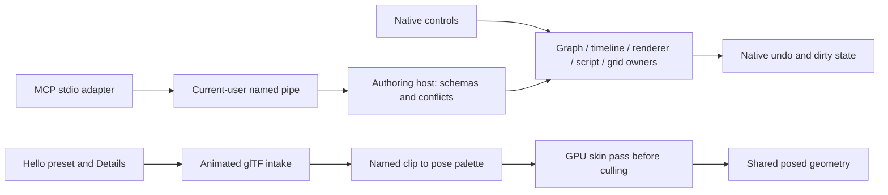

# Projects, automation and animated previews

Run `cargo run -p hello_engine` for the public editor. The repository's `game.project.json` declares content and generated directories; Hello's local authoring descriptor is `target/hello-editor/runtime/authoring-connection.json`.

Use **File → Open Project** and choose a directory containing `game.project.json`. A game's optional `editor.launch.json` selects its built executable. That executable registers its own components before opening the project. The current editor and unsaved work remain open.

```json
{"version":1,"executable":"../../target/debug/my_game.exe","arguments":[]}
```

Launch directly with `hello_engine --project <directory>`. Hello forwards projects with a launcher to their game editor. Generic projects without a launcher use Hello. Executables must be inside the containing repository/workspace; arguments are literal, with no shell expansion.

## Designer examples

Open **Game / Authoring** in the left tools panel. **Interaction Demo** creates door, collect, inspect, operate and light examples near the editor camera. Enter Play, look at an object and press **E**, or request its interaction through **Details → Interaction → Preview Requested**. Press E again to return a held inspection. Stop restores the authored example state. These are public examples of `somnium_core::interaction`, with game-specific outcomes implemented in Hello.

**Animated Mesh Preview** creates an actor with an original CC0 two-joint sample. Select it in the Outliner, then use Details:

| Control | Use |
|---|---|
| Source | Choose a skinned glTF/GLB from the content asset picker. |
| Clip / Status | Enter a named clip; Status lists names and import errors. Empty chooses the first clip. |
| Playing / Speed / Looping | Preview motion in Edit or Play; Pause freezes it. |
| Time | Seek; turn Playing off for a fixed pose. |
| Hidden Joints | Comma-separated joint names to exclude from drawing, such as a first-person head. |
| Reload | Toggle after editing the source externally. |

Source intake supports one skeleton with named joints and clips, LINEAR keys and constant STEP tracks. Bake changing STEP or CUBICSPLINE tracks before import. Morph targets are not supported by this intake. Source changes and removing actors release both rest and posed geometry allocations. Preview time and diagnostics do not rewrite authored fields every frame.

The source fixture is `assets/models/animation_demo.gltf`, regenerated by `tools/somnium_mcp/make_animation_fixture.py`. It contains no private game art.

## Semantic editor access

The [local MCP adapter](../../tools/somnium_mcp/README.md) uses the editor's actual document owners and native handlers. Discover component schemas and operation names before editing. Scene edits use plan/commit and stable entity IDs. Graph and timeline edits require the queried view token; terrain edits require scene and terrain revisions. Active native pointer/text edits reject competing semantic gestures.

| Owner | Automation access | History |
|---|---|---|
| Scene / Details | Reflected component create/set/remove, hierarchy, presets | Native scene transaction |
| Graph / state machine | Nodes, typed pins, links, literals, selection, layout, transitions | Native graph/overlay history |
| Timeline | Tracks, groups, clips, markers, keys, curves via validated document replacement | Native timeline history |
| Terrain / foliage | Bounded strokes, layer shading/LOD controls, foliage slope/scale/density | Native stroke undo; preview knobs restore previous values |
| Navigation / animation rig | Existing designer tools; status in reflected diagnostics | Native tool semantics |
| Script / UI source | Validated documents, publish, revert; native script attach/properties/reorder/reload | Separate source publication and scene histories |
| Material | Open the native draft, edit reflected fields, save | Native draft/scene history |
| Camera / collision | Bookmarks, native mesh/proxy picking, Jolt capsule sweeps | Camera state; read-only probes |
| Settings | Query and set with expected previous value | Persistent preferences, no scene undo |
| Content Drawer | Create folder/script/material, rename, assign material, make unique | Assignment uses scene undo; source files remain |
| Localisation | Edit cells/ranges, replace CSV, sort/filter, save catalogue, export CSV | Native grid undo/redo; save publishes current table |
| Workspace | Float, dock and position Outliner, Details, Viewport or Output Log | Native persistent panel placement |

Picking uses the same transformed bounds as the viewport, not exact mesh triangles. Clearance considers registered physics colliders. A listed command is dispatch capability; runtime completion comes from its receipt or reflected status. Navigation baking publishes `pending_cells`, `polygon_count` and `status` on its profile.

Keyboard input accepts letters, digits, function keys, modifiers, arrows, navigation, punctuation and numpad keys; `authoring.discover.input_keys` lists exact names. Input is delivered to the game callback. Editor actions use native commands or semantic operations.

`workspace` localisation edits share the visible grid and reject stale table views. Ctrl-Z/Ctrl-Y use the same grid history. Content paths stay inside the active project's content directory, and existing filenames are never overwritten by creation or rename. Terrain shading and foliage brush controls expose their actual native ranges and require the queried previous value; they retain native session-preview persistence.

Games can inspect actual Kira playback through `SoundHandle::position_seconds()` and `is_paused()`. This supports cue/subtitle synchronisation and pause diagnostics without advancing a separate estimated clock.



Run the live [main probe](../../tools/somnium_mcp/editor_acceptance.py) and [workspace probe](../../tools/somnium_mcp/editor_gap_acceptance.py) against Hello. They exercise semantic changes and restore tested sources/scene edits. The [generated inventory](../../tools/somnium_mcp/CAPABILITIES.md) records tested families separately from declared operations.
