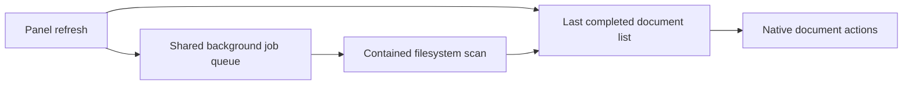
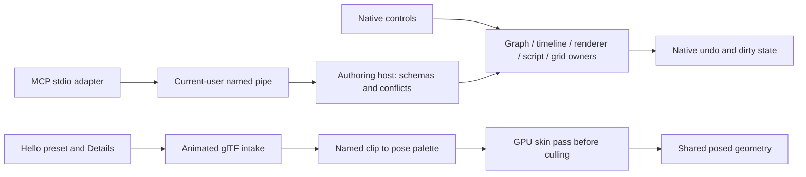
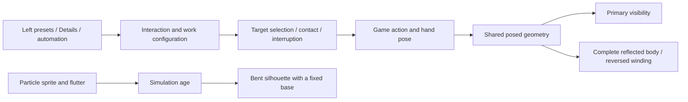
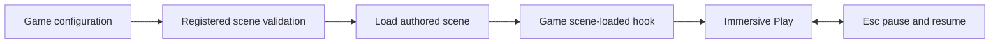

# Projects, automation and animated previews

Run `cargo run -p hello_engine` for the public editor. The repository's `game.project.json` declares content and generated directories; Hello's local authoring descriptor is `target/hello-editor/runtime/authoring-connection.json`.

Use **File → Open Project** and choose a directory containing `game.project.json`. A game's optional `editor.launch.json` selects its built executable. That executable registers its own components before opening the project. The current editor and unsaved work remain open.

```json
{"version":1,"executable":"../../target/debug/my_game.exe","arguments":[]}
```

Launch directly with `hello_engine --project <directory>`. Hello forwards projects with a launcher to their game editor. Generic projects without a launcher use Hello. Executables must be inside the containing repository/workspace; arguments are literal, with no shell expansion.

## Designer examples

**Textured Particle Demo** creates a smoke emitter with a CC0 texture. [Particle controls](particles.md) expose texture loading, colour, rectangular sprites, flipbooks, blending, attachment and bursts through Details and the same semantic component schema.

Open **Game / Authoring** in the left tools panel. **Interaction Demo** creates door, collect, inspect, operate and light examples near the editor camera. Enter Play, look at an object and press **E**, or request its interaction through **Details → Interaction → Preview Requested**. Press E again to return a held inspection. Stop restores the authored example state. These are public examples of `somnium_core::interaction`, with game-specific outcomes implemented in Hello.

**Animated Mesh Preview** creates an actor with an original CC0 two-joint sample. Select it in the Outliner, then use Details:

| Control | Use |
|---|---|
| Source | Choose a skinned glTF/GLB from the content asset picker. |
| Clip / Status | Enter a named clip; Status lists names and import errors. Empty chooses the first clip. |
| Playing / Speed / Looping | Preview motion in Edit or Play; Pause freezes it. |
| Time | Seek; turn Playing off for a fixed pose. |
| Hidden Joints | Comma-separated joint names to exclude from drawing, such as a first-person head. |
| Reload | Toggle after editing the source externally. |

Source intake supports one skeleton with named joints and clips, LINEAR keys and constant STEP tracks. Bake changing STEP or CUBICSPLINE tracks before import. Morph targets are not supported by this intake. Source changes and removing actors release both rest and posed geometry allocations. Preview time and diagnostics do not rewrite authored fields every frame.

The source fixture is `assets/models/animation_demo.gltf`, regenerated by `tools/somnium_mcp/make_animation_fixture.py`. It contains no private game art.

GPU-skinned meshes mark their visible pixels for temporal history rejection until deformation motion vectors are available. Games submit moving opaque/cutout tools through `renderer.submit_dynamic(draw)`; this marks only that draw for the current frame. TAA rejects current and previous coverage. FSR receives reactive and composition masks from current mesh/sprite coverage, camera-reprojected previous coverage and the vacated silhouette. Coverage lasts one frame, resets on resize/enable, and leaves static scene history intact. Hello previews use the same path. Forward blended meshes need their own coverage/motion support.

GTAO skips off-screen and sky horizon samples. Close hands/faces no longer treat missing depth as near-plane occluders; physical radius and intensity remain authored controls.

`authoring.query(kind="diagnostics")` exposes `play_cursor` (`requested`, `captured`, `mode`, `immersive`). The Windows probe `tools/somnium_mcp/tests/play_cursor_smoke.py DESCRIPTOR PID RECEIPT` exercises native Play/Esc, click, focus and scene-restoration behavior. Run it on the editor's desktop. `--isolated-desktop` tests routing without claiming OS cursor visibility verification.

ReSTIR GI currently estimates bounced directional sunlight. Shading adds that bounce to environment diffuse; it does not replace sky irradiance or local lighting. An unlit or missed bounce therefore cannot erase the existing ambient contribution.

Device checks: `cargo test -p somnium_renderer --test taa_reactive -- --ignored --nocapture`, `cargo test -p somnium_renderer --lib pass::fsr::tests -- --ignored --nocapture --test-threads=1`, and `cargo test -p somnium_renderer --test gtao_near_surface -- --ignored --nocapture`.

## Viewport responsiveness

The Game / Authoring document list refreshes through the shared background job system. One scan runs at a time; the panel keeps its last completed list during slow or failed scans. External file changes appear after the next scan, scheduled two seconds after completion. Explicit document queries still read current files and enforce the same project boundaries.



The September 14 Hello Engine flight probe traced a 54.2 ms authoring pause to synchronous asset-tree scans. With background scanning, the sampled authoring maximum was 3.4 ms and total frame maximum fell from 75.5 to 20.1 ms. No sampled frames exceeded 33 ms after the change. These are local CPU samples with the normal terrain scene, not a hardware-independent frame-rate guarantee.

## Semantic editor access

The [local MCP adapter](../../tools/somnium_mcp/README.md) uses the editor's actual document owners and native handlers. Discover component schemas and operation names before editing. Scene edits use plan/commit and stable entity IDs. Graph and timeline edits require the queried view token; terrain edits require scene and terrain revisions. Active native pointer/text edits reject competing semantic gestures.

| Owner | Automation access | History |
|---|---|---|
| Scene / Details | Reflected component create/set/remove, hierarchy, presets | Native scene transaction |
| Graph / state machine | Nodes, typed pins, links, literals, selection, layout, transitions | Native graph/overlay history |
| Timeline | Tracks, groups, clips, markers, keys, curves via validated document replacement | Native timeline history |
| Terrain / foliage | Bounded strokes, layer shading/LOD controls, foliage slope/scale/density | Native stroke undo; preview knobs restore previous values |
| Navigation / animation rig | Existing designer tools; status in reflected diagnostics | Native tool semantics |
| Script / UI source | Validated documents, publish, revert; native script attach/properties/reorder/reload | Separate source publication and scene histories |
| Material | Open the native draft, edit reflected fields, save | Native draft/scene history |
| Camera / collision | Bookmarks, native mesh/proxy picking, Jolt capsule sweeps | Camera state; read-only probes |
| Settings | Query and set with expected previous value | Persistent preferences, no scene undo |
| Content Drawer | Create folder/script/material, rename, assign material, make unique | Assignment uses scene undo; source files remain |
| Localisation | Edit cells/ranges, replace CSV, sort/filter, save catalogue, export CSV | Native grid undo/redo; save publishes current table |
| Workspace | Float, dock and position Outliner, Details, Viewport or Output Log | Native persistent panel placement |

Picking uses the same transformed bounds as the viewport, not exact mesh triangles. Clearance considers registered physics colliders. A listed command is dispatch capability; runtime completion comes from its receipt or reflected status. Navigation baking publishes `pending_cells`, `polygon_count` and `status` on its profile.

Keyboard input accepts letters, digits, function keys, modifiers, arrows, navigation, punctuation and numpad keys; `authoring.discover.input_keys` lists exact names. Input is delivered to the game callback. Editor actions use native commands or semantic operations.

`workspace` localisation edits share the visible grid and reject stale table views. Ctrl-Z/Ctrl-Y use the same grid history. Content paths stay inside the active project's content directory, and existing filenames are never overwritten by creation or rename. Terrain shading and foliage brush controls expose their actual native ranges and require the queried previous value; they retain native session-preview persistence.

Games can inspect actual Kira playback through `SoundHandle::position_seconds()` and `is_paused()`. This supports cue/subtitle synchronisation and pause diagnostics without advancing a separate estimated clock.

Render fixed-step actors using `ctx.simulation.interpolation_alpha`: blend the previous and current completed simulation poses, positions and orientations together. Derive the visible body, camera and held-tool sockets from that same blended frame; physics continues to use the current fixed-step state. The fraction follows the fixed-step accumulator during Play and is `1` while paused or stepping. Collapse previous/current endpoints after teleporting or freezing input so interpolation cannot replay an old movement.



Run the live [main probe](../../tools/somnium_mcp/editor_acceptance.py) and [workspace probe](../../tools/somnium_mcp/editor_gap_acceptance.py) against Hello. They exercise semantic changes and restore tested sources/scene edits. The [generated inventory](../../tools/somnium_mcp/CAPABILITIES.md) records tested families separately from declared operations.

## Contact, repair and staged mirrors

Hello's left **Game / Authoring** panel includes **Burn / Repair Demo**, **Staged Mirror Demo** and **Textured Particle Demo**. Select their entities in the Outliner to edit the same reflected properties through Details or automation.

| Component | Designer controls | Runtime behavior |
|---|---|---|
| Interaction | Local contact point/normal, finger closure, reach and duration | The game consumes one contact event; cancellation returns the hand smoothly. Zero normal uses the approach direction. |
| Burn / Repair | Kind, duration, reach, progress retention, preview hold/reset | Held work starts after contact; interruption retracts the hand. Progress, contact and completion are read-only, session-owned values. |
| Staged Mirror | Opening, staging depth, active distance, repair requirement | One visible front-facing opening draws complete reflected geometry. Runtime triangle count clears when disabled or outside the view. |
| Particle Emitter | Sprite atlas, flutter strength/frequency, colour and size curves | Flutter bends the sprite above its fixed base; simulation and distortion pause together. Default strength is zero. |

The mirror is a geometry-staged alternative: it requires an occluding alcove and correctly authored reflected content. It is not a general render-to-texture reflection of arbitrary surroundings. Animated previews reuse their posed vertices and submit complete reverse-wound indices, including geometry hidden in the primary view. Use pooled geometry uploads when retaining explicit index ranges; static clustering can reorder those ranges.



Native checks: [work and mirror probe](../../tools/somnium_mcp/tests/fracture_acceptance.py), [particle probe](../../tools/somnium_mcp/particle_acceptance.py). Their receipts are `docs/evidence/shared-fractures.json` and `docs/evidence/particle-flutter.json`; captures identify the tested scene revision and frame.

## Standalone game startup

Generated Luau declarations belong to the active project content directory; opening a game from Hello must not overwrite Hello declarations. Standalone players do not generate these authoring files.

Games may set `EngineConfig.startup_scene` and `player_mode`. Startup validates the scene against the registered components before creating the window, then loads it and enters immersive Play. In player mode Esc pauses/resumes, editor shortcuts stay disabled, and authoring transport remains a separate explicit configuration choice.

`GameApp::on_scene_loaded(ctx, path)` runs after a successful native or automated scene load. Capture persistent IDs and authored baselines here; Play begins afterward. A game can then reject checkpoints whose source scene or content revision changed before mutating the running world.




### Standalone players and larger scenes

`EngineConfig.startup_scene` loads through the normal scene owner before Play. `player_mode` starts immersive Play, routes paused input to the game UI, and makes Esc toggle pause without dropping into editor controls on key repeat. `GameApp::on_scene_loaded` gives game-owned checkpoint code the loaded source path. `UiManager::request_scene_load` queues that same loader for validated game transitions; stop the old session before requesting it. Standalone players skip editor recovery/autosave writes.

The material storage buffer grows before a new record would overflow it. Material IDs remain stable; the next rendered frame refreshes the shared binding. This fixes dense scenes and repeated scene transitions exceeding the original 64 KiB allocation. Applications should still reuse their per-scene material slots when unloading content.
