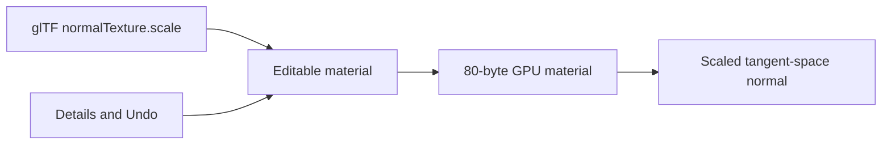

# Content Drawer

## Right-click

Right-clicking anywhere in the drawer opens a menu. On empty space you get
**New Folder…**, **New Script…** and **Refresh**; on a file or folder you
also get **Rename…** and **Show in Folder**.

New Folder and New Script create inside the folder the drawer is currently
showing, and ask for a name — Enter confirms, Escape or clicking away
abandons it. Nothing overwrites: a name that already exists is refused,
and so is one containing a path separator.

There is no Delete. Removing a file from a right-click, with no undo and
no confirmation, is not a mistake anyone recovers from — Show in Folder
puts you one step from a file browser that has a recycle bin.

The drawer is the project file browser. It stays docked above the status bar, like a Content Browser.

## Opening it

- Click **Content Drawer** on the bottom-left tray (icon + name).
- Or press **Ctrl+Space**.
- Click **Content Drawer** again to hide it. **Output Log** swaps in the same slot.

## What you see

- Default root is project **assets/**, shown as **Game**.
- Folders and files are large tiles in a row that wraps (80 px glyphs). Click a folder to enter it. Click the breadcrumb to walk back.
- **Maps** live under **Game / Maps**. Double-click a `.somnium` map to load it (Unreal Content Browser style). **Coastal** is the launch landscape (1 km, 32-layer Appalachia, 256 chunks). **Island** is a compact FBM island in a 512 m ocean tile (16-layer hero bank, hex/parallax off; GPU splat format stays 32 slots with 16–31 empty). Same water look as Coastal. Island shade is cheaper; Coastal on the ground is not the same cost with Hex / Parallax / Soft Shadows unchecked (Help → **Terrain**).
- **Show Engine Content** reveals virtual primitives (Cube, Sphere, lights) under Engine. Single-click a primitive to spawn it.
- Derived packs under **assets/terrain/bc7/** stay hidden.

## Import

**File → Import Model** still opens a native picker for glTF/GLB. Imported nodes appear in the Outliner and can be selected immediately.

New asset kinds (cooked packs, animation clips, prefabs, …) will show up here as those systems land. The drawer is not a finished catalog. Lighting extras (world cache, path tracer, area lights) are Details / Create-menu controls, not drawer assets.

## Material detail strength

Open a `.sommat` material and use **Details → Textures → Normal Scale**. Zero removes the normal-map perturbation, 1 preserves its authored strength, and smaller values soften exaggerated surface detail. The edit supports native Undo and Save. glTF/GLB import preserves `normalTexture.scale`; older materials default to 1. Hello Engine uses the same material editor and shader path.

Scene loads reuse unchanged glTF/GLB GPU uploads within the current renderer. Source, external buffer/image and optional alpha-mask timestamps and lengths invalidate that reuse, including a newly added mask. Reopening a shared-model scene no longer consumes another copy of its geometry and textures. The bounded cache does not reclaim allocations for genuinely different or repeatedly edited assets; it is not a general streaming system.
