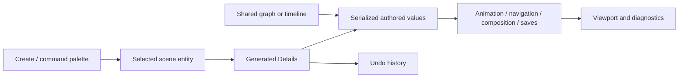

# MORROWIND designer tools

Use **Create** or the command palette to find each action. Select the created
entity in the Outliner to edit its Details. Property edits and scene authoring
operations use the normal undo history.

- **Prefabs** — Create Prefab from Selection / Instantiate Prefab. One hierarchy root; Prefab Instance Details show source/path/overrides. Revert, Propagate, Nest and Break Link are commands.
- **Blockout** — Create Blockout. Shape, size and segments in Details; normal transform gizmo; Export Blockout Mesh writes GLB.
- **Splines** — Create Spline. Points, tangents and closed-loop setting in Details; viewport points and curve update together.
- **Scatter** — Scatter Graph; Create Scatter Settings. Searchable node palette; bounds in Details; Preview counts placements; Apply creates one undo group from the selected prototype.
- **Animation** — Create Animation Preview Rig. Expand its Outliner hierarchy; drag IK/look targets. Set weights, root capsule, ragdoll and compression in rig Details.
- **Events** — Edit Animation Events. Edit timeline markers, then Save Animation Events. Reload and Reset are explicit commands.
- **Navigation** — Create Navigation Volume; Bake Navigation. Edit volume/agent dimensions first. Amber volume, green mesh, blue paths and magenta links are viewport overlays. Status reports jobs/errors.
- **Moving agents** — Create Navigation Agent. Destination, speed and radius in Details; movement runs during Play.
- **Navigation obstacles/links** — Create Navigation Obstacle / Link. Move the obstacle to carve/rebake; set link destination and traversal direction. Gameplay acknowledges special ladder/jump traversal.
- **Behaviors** — Behavior Graph; Apply to selection. Nodes compile before Apply. Edit Selected Behavior reopens the entity document. Attach a Luau module in Scripts Details; a Script task uses its filename, stem or full path. Runtime status/errors are in Details.
- **Perception** — Create Perception Sensor. Pick target; set sight/hearing/memory. Details show confidence and current stimulus.
- **Save games** — Create Save Game Slot. Configure slot/title; Play, Save Play Slot, Load Play Slot. Stop restores the authored scene.

Graph tabs preserve separate documents and undo histories. Open/Save displays
the active source and dirty state. Invalid graphs remain editable drafts;
Preview/Apply reports compiler errors without replacing the document.

For first use, keep preview/bake bounds small. Unsupported source geometry and
invalid solver settings produce a status message. Use the relevant Details
panel to correct the input before retrying.

Press **F** to frame a selected animation rig with its targets, or a navigation
volume with its full bounds. New preview rigs appear beside the camera view.

For a navigation link, move the waiting actor to **Link Exit**, then enable
**Acknowledge Link** in its Navigation Agent Details. Status explains rejected
requests. Game code can use the same validated handoff API.
