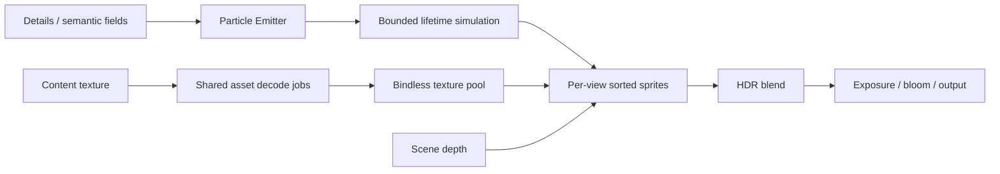

# Textured particles

Use **Game / Authoring → Textured Particle Demo** in Hello Engine, or add **Particle Emitter** in Details. The demo uses an unchanged 512px CC0 [Kenney smoke texture](https://kenney.nl/assets/particle-pack).

The Texture picker accepts RGBA sprites and sprite sheets. Texture Status reports loading or missing content. A missing requested texture stays invisible until loaded. An empty Texture keeps the original soft round particle.

| Controls | Purpose |
|---|---|
| Enabled / Burst | Stop continuous emission while particles finish; emit a bounded one-shot burst. |
| Size / Aspect | Full width in metres and height divided by width. |
| Additive / Tip Tint | Emitted light and an extra RGB multiplier toward the sprite top. |
| World Up / Local Space | Keep fire upright; attach live particles to a moving emitter. Clear particles before switching coordinate space. |
| Columns / Rows / Frames / FPS | Select flipbook frames. Zero FPS plays once over particle lifetime. |
| Rotation Spread / Spin | Initial variation and angular speed. |
| Colour over Life | Fade in, hold, change colour and fade out using the native gradient editor. |

Sprite particles use scene depth, transparent sorting and premultiplied blending. They render after TAA and before bloom. A separate attachment records visible sprite alpha after depth testing; FSR combines it with current and previous dynamic coverage. Standalone smoke and additive flames therefore reject stale history without masking transparent corners or the static room. Each viewport owns separate upload buffers. Limits are 10,000 particles per emitter and 10,000 drawn particles per view.

