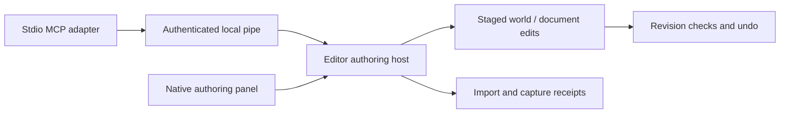

# Somnium local MCP adapter

This Python 3.10+ stdio adapter forwards seven authoring methods to an **actual running editor** through its current-user Windows named pipe. It has no network listener, arbitrary shell tool, copied editing implementation, or emulated success path. No third-party Python packages are required.

The engine writes `<project>/runtime/authoring-connection.json` with a random session, local pipe address, project identity, limits and credential. The descriptor is protected to the current Windows user and must not be committed, logged, embedded in tool results or shared. The pipe rejects remote clients. The editor owns shared operation scopes and scene semantics; connection authentication does not replace those checks.

Run with absolute paths:

```powershell
python -B C:/path/to/SomniumEngine/tools/somnium_mcp/server.py --connection C:/path/to/project/runtime/authoring-connection.json --project-id your-project-id
```

Configure the MCP host to launch that command over stdio. Keep the credential in the descriptor; do not put it in host configuration. The adapter negotiates MCP `2025-11-25` using `initialize`/`notifications/initialized`, implements `ping`, `tools/list` and `tools/call`, and does not advertise optional Tasks, sampling or resources. A host requiring only a newer protocol must support this negotiated version or use a future adapter update.

The seven stable tool families are `authoring.discover`, `query`, `plan`, `commit`, `execute`, `history`, and `jobs` (each with the `authoring.` prefix). Their object arguments are supplied by the live engine's discovery schemas. A family being listed does not imply every operation inside it is implemented: inspect capabilities and disabled reasons. Long operations return engine jobs; poll them to terminal state. Queueing, worker completion, publication and capture readback are distinct states.

The engine dispatch convention is a JSON object, normally `{ok:true,...}` or `{ok:false,error:{code,message,...}}`. The local envelope is `{id,project_id,session_id,token,method,params}`; replies contain `{id,result}` or transport `{id,error:{code,message}}`. Newline-delimited UTF-8 JSON is bounded to 1 MiB per request and 4 MiB per response. The engine polls at most eight requests / 128 KiB input / approximately 2 ms per frame; individual dispatch implementations must also remain bounded. Connection idle timeout is 30 seconds. The client caps each call at 30 seconds and opens a new connection per call.

No mutation is automatically retried after a timeout/disconnect: its outcome may be unknown. Query current revision/history and reuse the engine's idempotency identity only according to its receipt contract. Restarted editors have new sessions. Feedback receipts survive adapter reconnects but are a bounded in-memory journal, not durable MCP Tasks across editor restarts.

Successful execute/job results may carry `capture:{path,width,height,revision,frame}` (directly, or under `result`, `receipt`, or `job`). The adapter embeds a PNG only from the selected project, only with a PNG signature, and with a 4 MiB limit. The engine must report success only after the requested revision/frame has actually been rendered and read back; this adapter does not infer freshness from a filename.

## Verification

Protocol and error tests launch the real stdio adapter subprocess and verify unavailable-editor failures without pretending to exercise an engine:

```powershell
python -B -m unittest discover -s tools/somnium_mcp -p test_adapter.py -v
```

The separate read-only live probe requires a running editor and **fails** when none is reachable:

```powershell
python -B tools/somnium_mcp/probe.py --connection C:/path/to/project/runtime/authoring-connection.json --output C:/path/to/project/evidence/mcp-transport.json
```

It verifies fragmented request framing, fresh connections, wrong credential/project/session rejection, native method allowlisting, malformed-frame recovery and MCP subprocess → real editor discovery. Scene mutation/undo/import/capture acceptance must additionally exercise the engine's implemented operation schemas. Rust transport/feedback tests run with the repository's normal core test gate; avoid spawning a second Cargo target or build during coordinated implementation.

## Implementation references

Protocol compatibility follows [MCP 2025-11-25 tools](https://modelcontextprotocol.io/specification/2025-11-25/server/tools). Named-pipe polling follows Microsoft's [type/read/wait modes](https://learn.microsoft.com/en-us/windows/win32/ipc/named-pipe-type-read-and-wait-modes) and [ConnectNamedPipe semantics](https://learn.microsoft.com/en-us/windows/win32/api/namedpipeapi/nf-namedpipeapi-connectnamedpipe). `PIPE_NOWAIT` is intentionally used for bounded main-thread polling, not advertised as overlapped asynchronous I/O; no worker is created. Production migration to overlapped I/O should preserve the same bounded queue and dispatch interface.

## Editor integration

Enable authoring with an explicit project root and a `game.project.json` manifest. Game registration supplies component schemas, presets and validated JSON document types. The native Game / Authoring panel calls the same dispatcher; generated Details uses the same component registry.

Discovery defaults to a compact overview. Use `section: "components"` or `"commands"` with `id`, `search`, `offset` and `limit`; `section: "game"` returns private declarations. `section: "full"` is intended for a saved inventory, not every request.

Document queries return exact-byte view tokens. Plan/commit supports registered documents under the declared document root; an unsaved native draft blocks remote publication. Native draft fields, array ordering, validation, save/revert and draft history are available in the panel. Published document undo has a separate guarded cursor. Scene save/load uses the engine scene container, including legacy bare documents. Imported mesh nodes retain their source and ordinal for GPU reconstruction.



Coverage is explicit: reflected scene fields and routed commands do not imply complete specialized-editor gesture support. Jobs and receipts are session-local. Revoke can close the pipe before its acknowledgement is received; inspect the editor's revoked state instead of automatically retrying.
